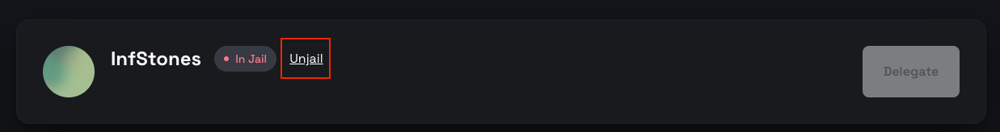

# BSC Slash Monitor

## Monitor Slash

Generally, without maliciously altering BSC node code or mistakenly running the validator, validators would not typically incur double sign slashes or malicious vote slashes.

Validators should consistently monitor for potential slashes due to node unavailability, as it can lead to slash events.

As best practice, it is advisable to  keep monitoring the event log of the slash contract on the BSC scanner at 
<https://bscscan.com/address/0x0000000000000000000000000000000000001001#events>.

You can check your validator's slash indicator in the above contract. Pay attention to values above 50. If it goes over 200, the validator will be slashed. If it goes over 600, the validator will be jailed.

Pls refer https://docs.bnbchain.org/bnb-smart-chain/slashing/slash-rules/ for more details.

## Unjail Validator

Once a Validator is slashed into a jailed state, the Validator must wait for a specific period before being able to unjail.
Once the waiting period elapses, the Validator can access the BNB Staking dApp and proceed to click on the `unjail` button to initiate the unjail transaction.

{:style="width:800px"}

**BNB Staking dApp:**

- **Testnet**: [https://testnet-staking.bnbchain.org/en/bnb-staking](https://testnet-staking.bnbchain.org/en/bnb-staking)
- **Mainnet**: [https://www.bnbchain.org/en/bnb-staking](https://www.bnbchain.org/en/bnb-staking)
