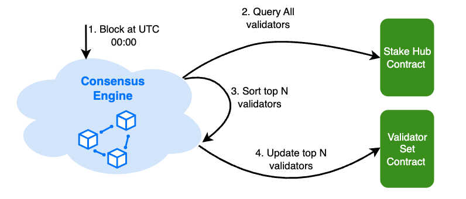

# BSC Staking Overview

BNB Smart Chain (BSC) operates on a Proof-of-Staked-Authority (PoSA) blockchain, with the staking mechanism proposed in [BEP-294](https://github.com/bnb-chain/BEPs/pull/294).
This enables BNB holders to stake their tokens with specified validators to secure the network and earn staking rewards.
Here's an overview covering the core staking concepts and operations on BSC.

## Basic Concepts

### Consensus Engine

BSC uses a consensus mechanism which combines DPoS and PoA for consensus, in this system:

* Blocks are produced by a limited set of validators.
* Validators take turns to produce blocks in a PoA manner.
* Validator set are elected in and out based on a staking based governance.

The staking mechanism is essential for determining the eligibility of validators to produce blocks.

### Validator Set

The validator set is the group of nodes that are responsible for validating transactions and producing blocks on the
BSC. The validator set is determined by the amount of staking each validator has, which reflects the amount of
BNB staked by the validator and its delegators. The top validators with the most staking are selected as the
active validator set, and they take turns to propose and vote on blocks. The rest of the validators are in the standby
validator set, and they can join the active validator set if their staking increases or if some active validators
drop out.

Any organization or individual can become part of the validator set by creating their validator on-chain and securing sufficient delegations.
Similarly, they can opt-out by simply withdrawing all their BNB delegations.

Validators can also be removed from the validator set by slashing, which is a penalty for misbehaving or being offline.

### Validator Election

There are different roles for validators:

* Cabinet: the top K (which is 21 currently) validators who get the most chance of producing blocks.
* Candidate: the top (K, K+NumOfCandidates] (which is (21,45] currently) validators who get a small chance of producing blocks.
* Inactive: the reset validators who get no chance of producing blocks.

The validator set roles are determined every 24 hours based on the latest staking information.

After UTC 00:00, the consensus engine sorts validators and updates the BSC validator set with the ranking information.

### System Contracts

There are several built-in contracts (i.e., system contracts) to facilitate the BSC staking.

* Validator Set Contract. The contract periodically elects a validator set.
  The contract also serves as a vault for temporarily storing validator rewards.

* System Reward Contract. This contract acts as a vault to collect part of transaction fees. The funds are used for
  various public purposes, like distributing fast finality rewards.

* Slash Contract. This contract is used to keep track of the number of times a validator becomes unavailable and
  triggers penalties once a certain threshold is reached. Additionally, this contract also handles other types of slash
  events, such as double signing and malicious voting in fast finality.

* Stake Hub Contract. This contract serves as the entrypoint for managing validators and delegations,
  while also implementing the logic for slashing specific validators. For delegation/undelegation/redelegation
  operations, it will call different validators' implementation contracts to manage a user's stake.

### Credit Contract

Each validator has its own validator contract that manages staking credit and facilitates the exchange
between credit and BNB. The token name of a staking credit is "stake {{validator moniker}} credit",
and the symbol is "st{{validator moniker}}". The contract will be created by the Stake Hub Contract when a validator
is created.

Whenever a user delegates BNB, an equivalent quantity of credit tokens are created. On the other hand,
when a user withdraws their delegation, a corresponding amount of credit tokens are destroyed, thereby releasing the BNB.

### Reward Distribution

The staking reward comes from transaction fee - when a block is produced, the majority of the block fee will be
collected as reward for the validator who proposed the block.

Every day, a portion of the rewards collected will be directly sent to the operator account of the validator as
commission, while the remaining portion will be sent to the corresponding validator credit contract. And when a user
undelegates and claims his/her stakes, the accumulated reward and the original stake will be sent back to him/her.

## Validator Operations

Validators are nodes running BNB Smart Chain software, participating in the consensus process.
They require a minimum BNB stake at their validator address and can receive delegations from other BNB holders.
Validators earn rewards from transaction fees and share most of these rewards with their delegators.

### Create Validator

To ensure the security of the network, becoming a validator on the BSC requires a minimum self-delegation of 2000 BNB.
BNB holders can initiate a `CreateValidator` transaction with the `StakeHub` contract to become a validator.
For more information, refer to [Create BSC Validator](../validator/create-val.md).

### Edit Validator

Validators can update their information using transactions like `EditConsensusAddress`, `EditCommissionRate`, `EditDescription`, and `EditVoteAddress`.

## Delegator Operations

Delegators are BNB holders who stake their BNB with a validator, sharing rewards.
They can select any active or standby validator, switch between them, undelegate their BNB, and claim rewards anytime.
Users can refer to the [user guide](./user-guide.md) for instructions on these actions.
