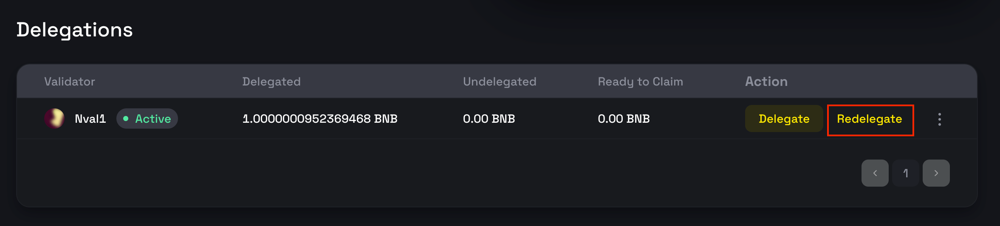

# Manage Stakes with BNB Staking dApp

Leverage the BNB staking dApp for streamlined management of your stakes. This guide provides a step-by-step walkthrough for using the dApp on both BSC testnet and mainnet.

- **Testnet**: [https://testnet-staking.bnbchain.org/en/bnb-staking](https://testnet-staking.bnbchain.org/en/bnb-staking)
- **Mainnet**: [https://www.bnbchain.org/en/bnb-staking](https://www.bnbchain.org/en/bnb-staking)

## Connect Wallet

{:style="width:400px"}

To interact with the dApp, first connect your web3 wallet. Currently, `TrustWallet` (mainnet only) and `MetaMask` are supported, along with any wallets compatible with `WalletConnect`.

## Delegate Stakes

1. Select a validator to delegate your stakes to. Detailed information about each validator is available on their respective pages.
2. Click the `Delegate` button to initiate a new delegation. 

    {:style="width:400px"}

3. Enter the amount of BNB you wish to delegate.

    {:style="width:400px"}

4. After confirming the delegation, your connected wallet will prompt you to sign the transaction. Successful transactions will be visible in the `My Staking` page, complete with transaction hash.

    {:style="width:400px"}

## Redelegate Stakes

On the `My Staking` page, you can manage your existing delegations.

>Note: A redelegation fee of 0.002% applies to discourage frequent switching between validators.

1. Click `Redelegate` to shift your stake to a different validator.

    {:style="width:400px"}

2. In the ensuing popup, select your new validator and specify the amount to redelegate. You can opt to move the entire amount or just a portion.

    {:style="width:400px"}

## Undelegate Stakes

To claim your stakes and rewards, you need to undelegate.

1. Click the `Undelegate` button next to the relevant delegation.

    {:style="width:400px"}

2. You can choose to undelegate the entire amount or a portion. Note that undelegated stakes are subject to a 7-day unbonding period before they are returned to your account.

    {:style="width:400px"}

## Claim Stakes

After the unbonding period, you can claim your stakes by clicking the `Claim` button.

{:style="width:400px"}

## FAQs

### Which wallet can be used to delegate to validators?

Currently, `MetaMask` and `TrustWallet` are supported, along with any wallets compatible
with `WalletConnect`.

### Can I delegate/undelegate/redelegate/claim stakes on explorers?

If you want to do the aforementioned delegate/undelegate/redelegate/claim operations on BscScan or BscTrace, 
you should call the staking hub contract in the following URLs:
* [BscScan Stake Hub](https://bscscan.com/address/0x0000000000000000000000000000000000002002#writeContract)
* [BscTrace Stake Hub](https://bsctrace.com/address/0x0000000000000000000000000000000000002002?tab=Contract&p=1&view=contract_write)

### What is stBNB and how to calculate my staking balance in BNB?

**What is stBNB?**

stBNB is a **staking credit token** that you receive as proof when you delegate BNB to a specific validator. Each validator issues its own staking credit with a unique name:

- **Token name format**: `Stake{{validator moniker}}Credit`
- **Token symbol format**: `st{{validator moniker}}`

For example, if the validator's moniker is "BNB48Club", you would receive "stBNB48Club" tokens.

Staking credit represents your staked BNB combined with accumulated staking rewards. It is minted when you delegate and burned when you undelegate.

**Important characteristics:**

- Staking credit is **non-transferable**
- Different validators issue different staking credits
- The value of staking credit increases over time as validators earn block rewards
- Rewards are distributed automatically when you undelegate (unlike the previous BC staking where rewards were distributed periodically)

**Calculating Your Staking Balance:**

To calculate the BNB value of your staking credit, use this formula:

```
Your BNB Value = (stCreditAmount × totalPooledBNB) ÷ totalSupply()
```

Where:

- **stCreditAmount**: The amount of staking credit you hold
- **totalPooledBNB**: Total BNB in the validator's contract (all user stakes + block rewards earned)
- **totalSupply()**: Total supply of that validator's staking credit

**Example:**

Day 1 - Initial delegation:

- You stake 100 BNB and receive 100 stBNB
- At this moment: totalPooledBNB = 10,000 BNB, totalSupply = 10,000 stBNB
- Your position value: 100 BNB

Day 30 - After earning rewards:

- The validator has earned 1,000 BNB in block rewards
- Now: totalPooledBNB = 11,000 BNB, totalSupply ≈ 10,000 stBNB
- Your 100 stBNB value: (100 × 11,000) ÷ 10,000 = **110 BNB**
- Your profit: **10 BNB** (10% return)

Your staking credit value grows automatically as the validator earns rewards, without requiring you to claim rewards manually. The rewards will be included when you undelegate your BNB.