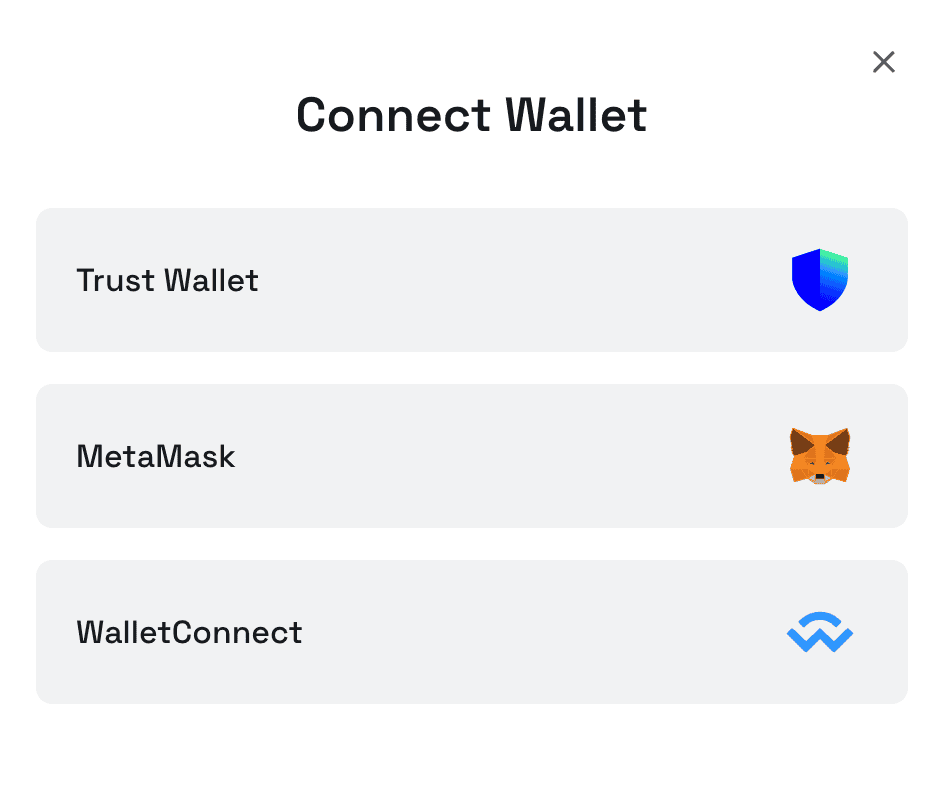
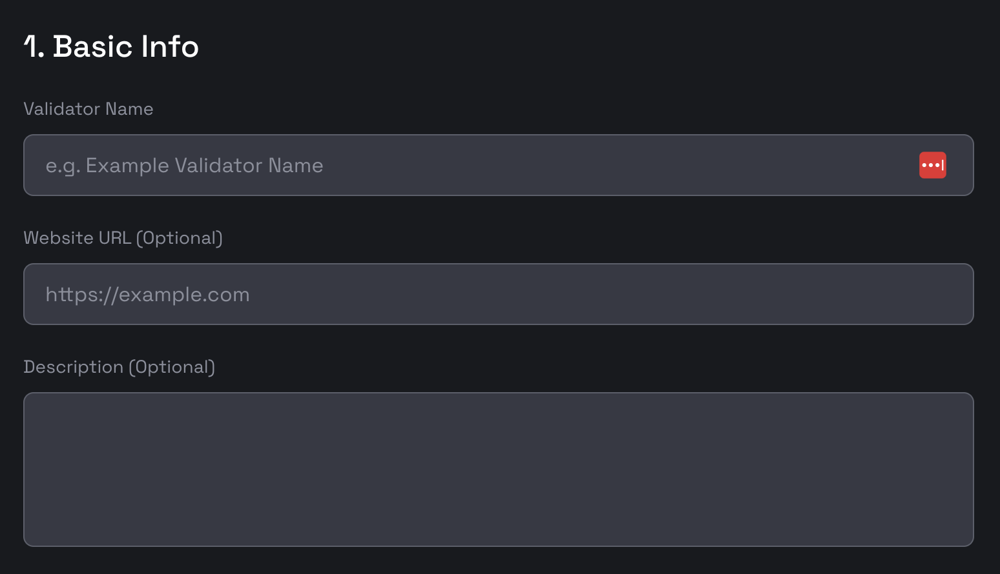
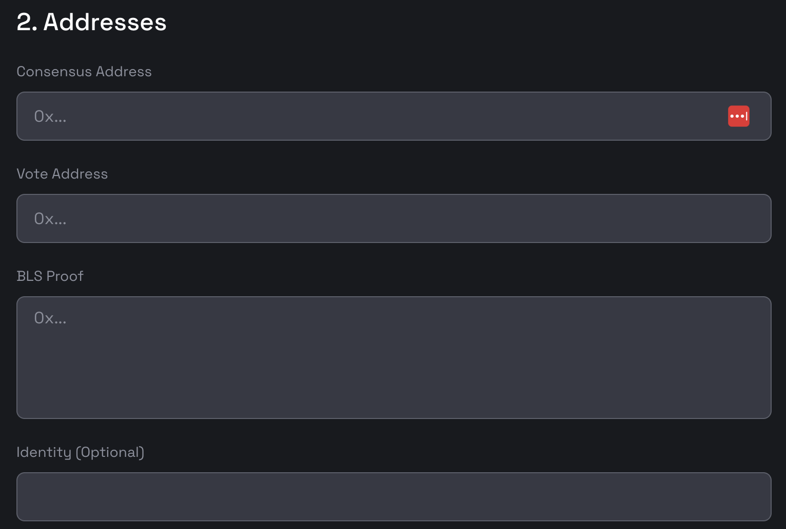
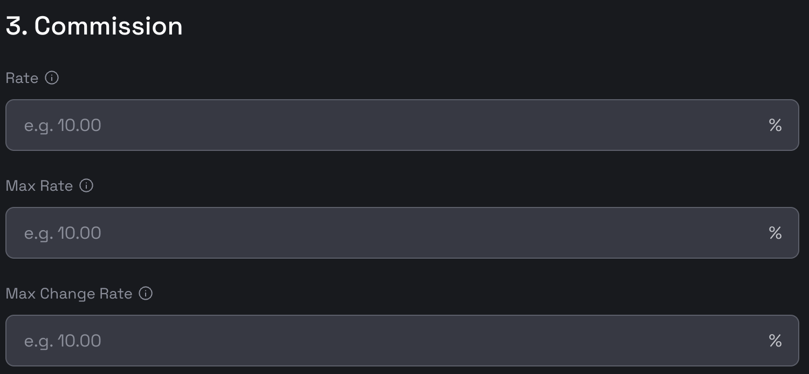
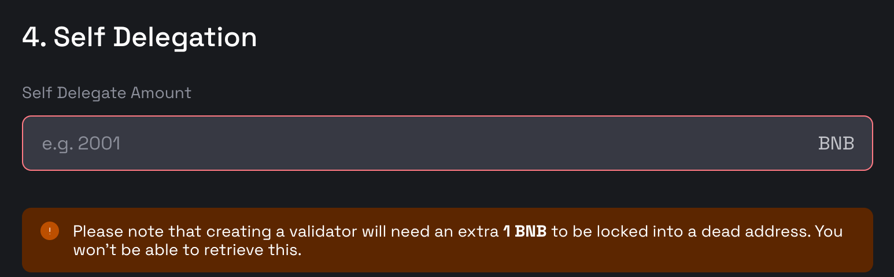

# Create BSC Validator

This guide outlines the process for creating a new validator on the BNB Smart Chain (BSC).
The BNB staking dApp is the official tool for creating and managing validators on the BSC.

- **Testnet**: [https://testnet-staking.bnbchain.org/en/bnb-staking](https://testnet-staking.bnbchain.org/en/bnb-staking)
- **Mainnet**: [https://www.bnbchain.org/en/bnb-staking](https://www.bnbchain.org/en/bnb-staking)

## Terminology

- **Operator Address**: The address for creating and modifying validator information on the BSC. You should use this
  address when connecting to the staking dApp. The corresponding account should have more than 2001 BNB for creating
  validtors and paying transaction fees.
- **Consensus Address**: A unique address for your validator's node. It is used for consensus engine when mining new
  blocks. It should be different from the operator address.
- **BLS Vote Address**: A BLS address used for fast finality voting.
- **BLS Proof**: A BLS signature verifying ownership of the vote address.
- **Identity**: For associating a new validator with an existing one. This is optional unless you're migrating an old validator.

## Steps

### 1. Connecting to the dApp

Please connect to the staking dApp using your **Operator Address**. `Trust Wallet`, `MetaMask`, and `WalletConnect`
options are available for the step. Make sure that the account has more than 2001 BNB before moving on to the next step.

{:style="width:400px"}

### 2. Filling out the form

Navigate to the dApp and select the `Become a Validator` button in the right middle of the page
to initiate the creation process.

The following information is required to create a validator.

#### 2.1 Basic Information

{:style="width:600px"}

You'll need to provide the following details on the `Create Validator` page:

- **Validator Name**: Choose a name consisting of 3-9 alphanumeric characters, excluding special characters.
- **Website**: Provide a URL to a website with additional information about your validator.
- **Description**: A brief description of your validator.

To enhance your validator's visibility, consider uploading additional information to
the [BSC validator directory](https://github.com/bnb-chain/bsc-validator-directory). Your avatar, once uploaded, will be
displayed in the staking dApp.

#### 2.2 Addresses

{:style="width:600px"}

The following addresses are required:

- **Consensus Address**: A unique address for your validator's node.
- **Vote Address**: An address used for fast finality voting.
- **BLS Proof**: A BLS signature verifying ownership of the vote address.
- **Identity**: For associating a new validator with an existing one. This is optional unless you're migrating an old validator.

##### Generate Consensus Address

Download the BSC geth binary from [the official release page](https://github.com/bnb-chain/bsc/releases/).

Note: Make sure you are downloading the correct binary based on your machine's platform, e.g., if you are using MacOS,
you should download the `geth_mac` file. In the following, we will refer the binary as `geth` for simplicity.

To create a new account for mining, please use the following command and set a password for the account.

```shell
geth account new --datadir ${DATA_DIR}
```

- `DATA_DIR`: The directory where you want to store your key store files.

This command will provide the public address (consensus address) and the path to your private key. Remember to back up the key file safely!
A sample consensus address is `0x4b3FFeDb3470D441448BF18310cAd868Cf0F44B5`.

If you already have an account for mining, you can use the seed phrase to recover the account.

```shell
geth account import --datadir ${DATA_DIR}
```

##### Generate BLS Vote Address and Proof

To create a new bls account please use the following command.

```shell
 geth bls account new --datadir ${DATA_DIR}
```

- `DATA_DIR`: The directory where you want to store your key store files.

If you already have a voting key, create a bls wallet and use the keyfile to recover it, using the following command.

```shell
 geth bls account import ${KEY_FILE} --datadir ${DATA_DIR}
```

- `DATA_DIR`: The backup file for restoring the BLS account.

Then you can get your vote address by running the following command.

```shell
geth bls account list --datadir ${DATA_DIR}
```

A sample bls address is `b5fe571aa1b39e33c2735a184885f737a59ba689177f297cba67da94bea5c23dc71fd4deefe2c0d2d21851eb11081f69`.

Then you can get your bls proof by running the following command.

```shell
geth bls account generate-proof --datadir ${DATA_DIR} --chain-id ${BSC_CHAIN_ID} ${OPEATOR_ADDRESS} ${VOTE_ADDRESS}
```

- `BSC_CHAIN_ID`: `56` for BSC mainnet, and `97` for BSC testnet.
- `OPEATOR_ADDRESS`: The address of your account, which will be recognized as the operator of the new validator.
- `VOTE_ADDRESS`: The vote address created in the last step.

A sample bls proof is `0xaf762123d031984f5a7ae5d46b98208ca31293919570f51ae2f0a03069c5e8d6d47b775faba94d88dbbe591c51c537d718a743b9069e63b698ba1ae15d9f6bf7018684b0a860a46c812716117a59c364e841596c3f0a484ae40a1178130b76a5`.

##### Create Identity

Identity is used to associate the new validator with the old validator created on the BNB Beacon Chain. It should be left empty after the Beacon Chain fusion.

#### 2.3 Commissions

{:style="width:600px"}

- **Rate**: The commission rate of the validator.
- **Max Rate**: The maximum commission rate that the validator can set.
- **Max Change Rate**: The maximum rate change the validator can set to every epoch (1 day).

#### 2.4 Self-delegation

{:style="width:600px"}

- **Self Delegate Amount**: The amnout to delegate when creating the validator. The minimal number to input is `2001` -
  for the minimal self delegation amount is 2000 BNB and extra 1 BNB for locking to a dead address.

### 3. Submitting the form

Once you have filled out all the required information, click the `Submit` button to submit the transaction.

Note: Upon completing these steps, your node is not guaranteed to become an active validator. Selection is based on a ranking that reflects the total BNB staked, with only the top N nodes being chosen as active validators. The number N is determined by the "maxElectedValidators" parameter within the StakeHubContract (0x0000000000000000000000000000000000002002). As of November 4th, 2024, this number stands at 8 for the testnet and 45 for the mainnet.
