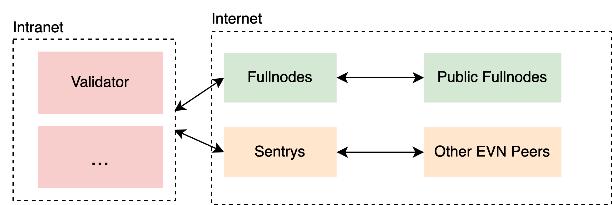
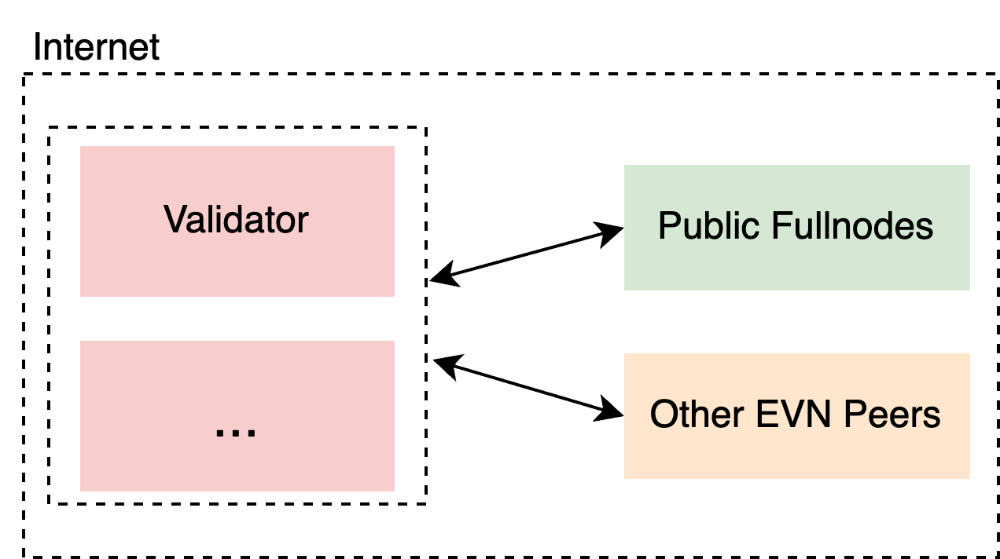

## Network Requirements
At the network layer, BSC requires minimal latency to maximize time available for critical operations like block packaging and verification. The BSC network maintains decentralization through validators distributed across diverse geographic locations worldwide.

Taking AWS's network service as an example, the measured latency of some regions are:
- AP<->EU, latency ~100ms
- AP<->US, latency ~80ms
- US<->EU, latency ~35ms

This data will be the theoretical best value of network message latency, and it is also the reference value for network environment testing between validators.

## Configuration
There are two different modes to configure your node, depends on how your validator is connected to the network.
### Mode-1: Sentry Mode

{:style="width:500px; height:auto;"}

In this mode, the operator could create multiple nodes, including multiple validator nodes, multiple sentry nodes, and fullnode nodes.

The validator always remains in a secure intranet environment. Sentry is responsible for quickly exchanging messages with EVN Peer and forwarding them to the validator. Fullnode is a redundant path for additional transactions and other messages.

Mainly introduces the configuration changes of validator and sentry, and the fullnode configuration remains unchanged.

#### Validator Configuration

The example of `Config.toml`.

```toml
[Eth]
EVNNodeIDsToAdd = ["sentryNodeID1", "sentryNodeID2"]

[Node]
EnableEVNFeatures = true
EnableQuickBlockFetching = true

[Node.P2P]
StaticNodes = [
    "<OtherValidatorEnodes>",
    "<FullnodeEnodes>",
    "<SentryEnodes>",
    "..."
]
```

`EVNNodeIDsToAdd` fills in the sentry nodeID here. Because the validator is protected in the external network, sentry will act as an EVN Peer to help forward public EVN Peer messages.

`EnableEVNFeatures` enables the EVN network.

`EnableQuickBlockFetching` enables BEP-564, which will speed up block retrieval.

#### Sentry Configuration

The example of `Config.toml`.

```toml
[Node]
EnableEVNFeatures = true
EnableQuickBlockFetching = true

[Node.P2P]
EVNNodeIdsWhitelist = ["<whitelist nodeids>"]
ProxyedValidatorAddresses = ["<ValidatorAdresses>"]
StaticNodes = [
    "enode://3dd9e7e22180cda7c2a7015d3582811327abb3bc5f330879be7bc3217be4ed7c4ec0d5117ab0fae6542d3e5d199f3d935b7bca108b565f07806ed7687af8d1b5@52.198.165.142:30311",
    "enode://70aeb4f0cc52df44f4ef0c72ca0eca8a210b9916ad02bcd147cc58bbfee9259ee46dfa23e13512f98bdb3937d62d2d0a521a90c76161ccffd24bb10829d8d542@13.112.162.162:30311",
    "enode://4af65e07b676e3634e4e2e6df01b23e32eb73fdc200b7f98a4807b16e8faefae4d3875bea4d88e203e319f6a61859b66c0b8254191a2058629a00fe6e42e7b18@54.155.24.228:30311",
    "enode://2a6cfdbfc8f401d09a766efa53411bb5457fd5903331afee5363017f65623f0c0c43873c14bfb4001cf02811b1196f710bb3911a36e683cb557b11244cffe212@54.77.55.214:30311",
    "enode://cc6d828a735db591cb2a0454a94b9602be6c0aca6c73f771efaabc7f68c46085b953c97f880efb17597578320444acc9e207042297689515c18e659d138bb393@23.23.111.240:30311",
    "enode://5035ae74e04b4290885c3cea546ca179cb80c1461141b8c3124bb6707993c1e68dafd2f5fd9b13a8d076225412bf5bbefe81c16aa812a35e7c19bb1020b8c124@34.205.243.82:30311",
    "<other trusted nodeids>"
]
```

`EVNNodeIdsWhitelist`: it is optional and is an EVN Peer whitelist that is only valid for the current node. In the transition period before enabling maxwell, the whitelist can be used to apply EVN in advance. At the same time, the operator can put the cooperating builder into the local whitelist.

`ProxyedValidatorAddresses`: it is optional and is only for sentry to identify which blocks should be broadcast to all EVN Peers, it is configured as the protected validator address.

`StaticNodes`: it includes a list of well maintained EVN nodes for validators to connect to, the list could be changed in the future.

### Mode-2: Simple Mode

{:style="width:500px; height:auto;"}

With simple mode, the operator could run a validator node by exposing it directly to the public network environment, so that they can directly connect to other nodes.

#### Validator Configuration

The example of `Config.toml`.

```toml
[Eth]
EVNNodeIDsToAdd = ["validator NodeID", "other nodeids"]

[Node]
EnableEVNFeatures = true
EnableQuickBlockFetching = true

[Node.P2P]
EVNNodeIdsWhitelist = ["<whitelist nodeids>"]
StaticNodes = [
    "enode://3dd9e7e22180cda7c2a7015d3582811327abb3bc5f330879be7bc3217be4ed7c4ec0d5117ab0fae6542d3e5d199f3d935b7bca108b565f07806ed7687af8d1b5@52.198.165.142:30311",
    "enode://70aeb4f0cc52df44f4ef0c72ca0eca8a210b9916ad02bcd147cc58bbfee9259ee46dfa23e13512f98bdb3937d62d2d0a521a90c76161ccffd24bb10829d8d542@13.112.162.162:30311",
    "enode://4af65e07b676e3634e4e2e6df01b23e32eb73fdc200b7f98a4807b16e8faefae4d3875bea4d88e203e319f6a61859b66c0b8254191a2058629a00fe6e42e7b18@54.155.24.228:30311",
    "enode://2a6cfdbfc8f401d09a766efa53411bb5457fd5903331afee5363017f65623f0c0c43873c14bfb4001cf02811b1196f710bb3911a36e683cb557b11244cffe212@54.77.55.214:30311",
    "enode://cc6d828a735db591cb2a0454a94b9602be6c0aca6c73f771efaabc7f68c46085b953c97f880efb17597578320444acc9e207042297689515c18e659d138bb393@23.23.111.240:30311",
    "enode://5035ae74e04b4290885c3cea546ca179cb80c1461141b8c3124bb6707993c1e68dafd2f5fd9b13a8d076225412bf5bbefe81c16aa812a35e7c19bb1020b8c124@34.205.243.82:30311",
    "<other trusted nodeids>"
]
```