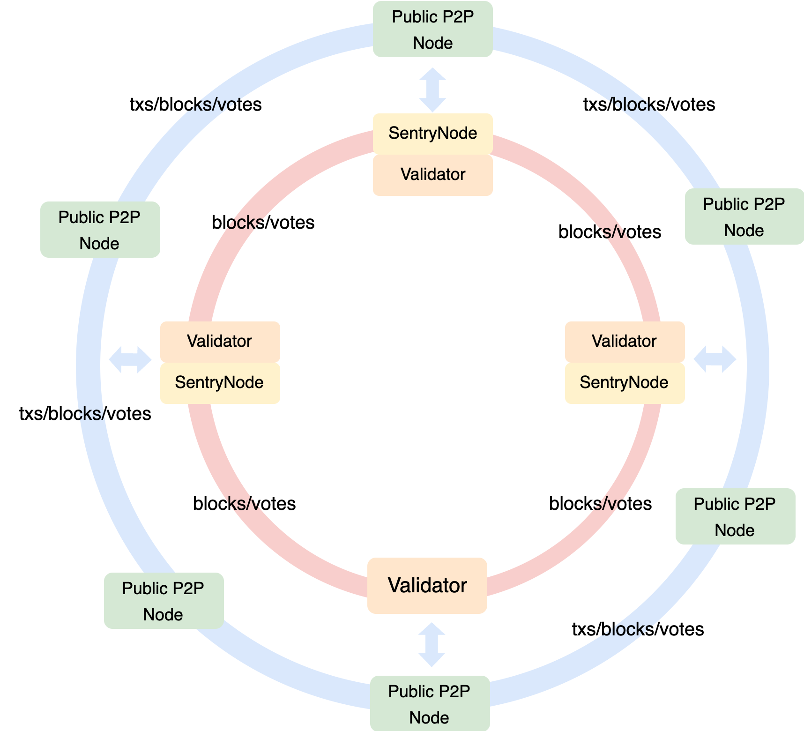

# EVN Best Practices

## Background

After [Maxwell Hardfork](https://www.bnbchain.org/en/blog/bnb-chain-announces-maxwell-hardfork-bsc-moves-to-0-75-second-block-times), the block interval will be reduced to 0.75s, which is a huge improvement in user experience for BSC, and at the same time has greater requirements for the client's network, execution and other components. 

BSC introduced a new network layer optimization, Enhanced Validator Network, aka EVN. It is not a new P2P network, but based on the current P2P network to optimize the validator network and reduce the latency of core consensus messages as much as possible.



EVN only affects the networking and configuration of the validator, and does not affect other roles. At the same time, the existing network topology is similar to EVN.

## How EVN Works

The essence of EVN is to allow validators to identify each other, optimize the broadcast algorithm, and reduce the broadcast latency of core consensus messages. 

EVN is a network layer optimized based on the current existing network topology and broadcast algorithm. It is still not perfect and will continue to be optimized and improved.

You can also check [BEP-563](https://github.com/bnb-chain/BEPs/blob/master/BEPs/BEP-563.md) and [BEP-564](https://github.com/bnb-chain/BEPs/blob/master/BEPs/BEP-564.md) for more details.

### NodeID Registration

The operator adds the validator’s NodeID of the P2P network on the chain through the configuration file, then the node will auto sign a registration tx.

It establishes the identity mapping from the consensus layer to the network layer.

### EVN Peer Identification

All validators/sentry will pull the on-chain registration information, identify whether the connected P2P Peer belongs to the NodeID of a validator, and mark it as an EVN Peer.

### Broadcast Optimization

Transaction broadcast is disabled between all EVN Peers, and mined blocks are broadcast to all connected EVN Peers. Non-mined blocks still use the old gossip broadcast mechanism.

### EVN Whitelist

This is an EVN whitelist that takes effect on this node. It will consider the whitelisted Peers to be EVN Peers as well and apply the EVN broadcast algorithm.

### EVN Peer Connection

Currently, EVN Peers are mainly connected directly through static nodes, allowing most EVN Peers to connect directly to each other.

## Network Requirements

At the network layer, BSC hopes to have a low enough latency so that most of the time can be used for core processes such as block packaging and block verification. The entire BSC network is relatively decentralized and is distributed in different geographic locations.

Taking AWS's network service as an example, the measured latency of some regions are:
- AP<->EU, latency ~100ms
- AP<->US, latency ~80ms
- US<->EU, latency ~35ms

This data will be the theoretical best value of network message latency, and it is also the reference value for network environment testing between validators.

## Configuration

### Sentry Mode


In this mode, the operator needs to create multiple nodes, including multiple validator nodes, multiple sentry nodes, and fullnode nodes.

The validator always remains in a secure intranet environment. Sentry is responsible for quickly exchanging messages with EVN Peer and forwarding them to the validator. Fullnode is a redundant path for additional transactions and other messages.

Mainly introduces the configuration changes of validator and sentry, and the fullnode configuration remains unchanged.

#### Validator Configuration

The example of `Config.toml`.

```toml
[Eth]
EVNNodeIDsToAdd = ["sentryNodeID1", "sentryNodeID2"]

[Node]
EnableEVNFeatures = true
EnableQuickBlockFetching = true

[Node.P2P]
StaticNodes = ["ValidatorEnodes", "FullnodeEnodes", "SentryEnodes"]
```

`EVNNodeIDsToAdd` fills in the sentry nodeID here. Because the validator is protected in the external network, sentry will act as an EVN Peer to help forward public EVN Peer messages.

`EnableEVNFeatures` enables the EVN network.

`EnableQuickBlockFetching` enables BEP-564, which will speed up block retrieval.

#### Sentry Configuration

The example of `Config.toml`.

```toml
[Node]
EnableEVNFeatures = true
EnableQuickBlockFetching = true

[Node.P2P]
EVNNodeIdsWhitelist = ["ValidatorNodeIDs", "PublicEVNPeerNodeIDs", "BuilderNodeIDs"]
ProxyedValidatorAddresses = ["ValidatorAdresses"]
StaticNodes = ["ValidatorEnodes", "FullnodeEnodes", "SentryEnodes", "PublicEVNPeerEnodes", "PublicFullnodeEnodes"]
```

`EVNNodeIdsWhitelist` is an EVN Peer whitelist that is only valid for the current node. In the transition period before enabling maxwell, the whitelist can be used to apply EVN in advance. At the same time, the operator can put the cooperating builder into the local whitelist.

`ProxyedValidatorAddresses` This configuration is only for sentry. In order to let sentry identify which blocks should be broadcast to all EVN Peers, it is configured as the protected validator address.

### Simple Mode


In the current mode, the operator needs to build multiple validator nodes and expose them directly to the public network environment, so that they can directly connect to other nodes.

#### Validator Configuration

The example of `Config.toml`.

```toml
[Eth]
EVNNodeIDsToAdd = ["validatorNodeID1", "validatorNodeID2"]

[Node]
EnableEVNFeatures = true
EnableQuickBlockFetching = true

[Node.P2P]
EVNNodeIdsWhitelist = ["ValidatorNodeIDs", "PublicEVNPeerNodeIDs", "BuilderNodeIDs"]
StaticNodes = ["ValidatorEnodes", "FullnodeEnodes", "PublicEVNPeerEnodes", "PublicFullnodeEnodes"]
```