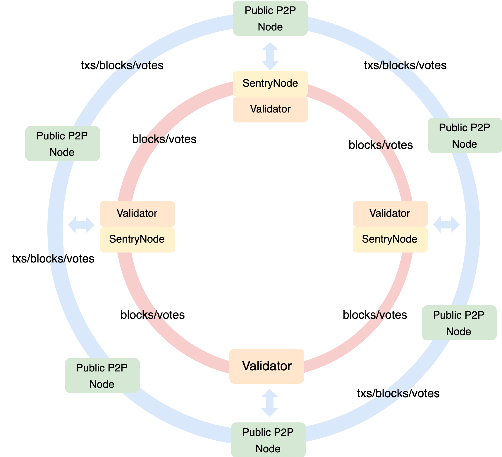

## Background

After [Maxwell Hardfork](https://www.bnbchain.org/en/blog/bnb-chain-announces-maxwell-hardfork-bsc-moves-to-0-75-second-block-times), the block interval has be reduced to 0.75s, which is a huge improvement in user experience for BSC, and at the same time has greater performance requirements for the client's network, execution and other components. 

BSC introduced a new network layer optimization, Enhanced Validator Network, aka EVN. It is not a new P2P network, but based on the current P2P network to optimize the validator network and reduce the latency of core consensus messages as much as possible. You can also check [BEP-563](https://github.com/bnb-chain/BEPs/blob/master/BEPs/BEP-563.md) and [BEP-564](https://github.com/bnb-chain/BEPs/blob/master/BEPs/BEP-564.md) for more details.

{:style="width:450px; height:auto; display: block; margin: 0 auto;"}

## How EVN Works

### NodeID Registration

Node operator could add the validator’s EVN NodeIDs through the configuration file(config.toml), then the node will automatically sign a registration tx to register the node id on chain.

It establishes the identity mapping from the consensus layer to the network layer.

### EVN Peer Identification

All validators/sentry will pull the on-chain registration information, identify whether the connected P2P Peer belongs to the NodeID of a validator, and mark it as an EVN Peer.

### Broadcast Optimization

Transaction broadcast is disabled between all EVN Peers, and mined blocks are broadcast to all connected EVN Peers. Non-mined blocks still use the old gossip broadcast mechanism.

### EVN Whitelist

This is an EVN whitelist that takes effect on this node. It will consider the whitelisted Peers to be EVN Peers as well and apply the EVN broadcast algorithm.

### EVN Peer Connection

Currently, EVN Peers are mainly connected directly through static nodes, allowing most EVN Peers to connect directly to each other.