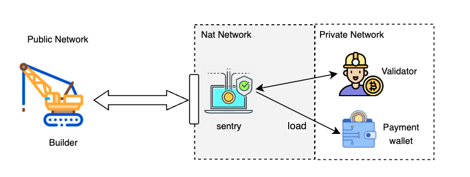

# Integration Guide for Validator

## Decison Make

When activating MEV functionality, validators encounter a mix of
opportunities and challenges. Before enabling this feature, validators
need to carefully evaluate these risk accordingly:

1. More maintenance work. Apart from the validator, additional
   maintenance of the Sentry service and its related network
   components is required.

2. Network risk. Due to Sentry service being exposed to the public
   network, it is inevitably susceptible to possible network attacks.

3. Financial risk. Validators need to pay fees to builders, securely
   managing accounts is a crucial topic.

After identifying these risks, let's begin the journey.

## Validator Topology



It is suggested that to split the internal network into two part:

1. Private network. The private network is isolated from the public
   network. All access to components within this network is strictly
   restricted. The Validator and Payment wallet are expected to be
   deployed within a private network environment.

2. Nat network. The components in this network can communicate with the
   public internet under certain constraints, and the communication
   can be established through load balancers provided by various
   cloud platforms. Sentry service should be deployed within a NAT
   network environment. It is essential to configure appropriate
   safeguards on the network gateway to prevent DoS attacks and other
   potential threats.

The validator shoule grant its RPC port access only to the mev-sentry. The mev-sentry should open its RPC port to the public and register a domain. The domain should be registered in [bsc-mev-info](https://github.com/bnb-chain/bsc-mev-info) to allow builders access. The recommended specifications for the mev-sentry machine are 2 CPUs and 4 GB of RAM.

## Preparation

The BNB Chain community has maintained an open-source version of the
Sentry service. You can clone the code repository from
[here](https://github.com/bnb-chain/bsc-mev-sentry).

Before actually deploying the Sentry service, it is crucial to carefully
consider and determine several key parameters:

1. **BidFeeCeil.** This represents the maximum fee that a validator is
   willing to pay for a block proposed by a builder. When this value
   is 0, it signifies that the validator does not accept any charges
   from the builder.

2. **BidSimulationLeftOver.** This parameter indicates how long before
   the block time the validator should cease simulating the blocks
   from the builder. It is generally advisable to set it to a few
   tens of milliseconds. Setting it too small may result in blocks
   being broadcast too late and subsequently discarded during network
   congestion.

It is suggested to purchase a domain that is related to the moniker
name of the validator. The builders will send requests through this
domain. A BSC account should be created in advance as the payment
account. No BNB is required in that account if **BidFeeCeil** is zero,
otherwise, it needs to be ensured that there is enough balance in the
account.

Go to the [bsc-mev-info](https://github.com/bnb-chain/bsc-mev-info)
repo to find more information about running builders which will be used
during setup.

## Quick Setup

**Step 1**: **Setup Sentry.**

Deploy the sentry service according to the readme of [sentry repo](https://github.com/bnb-chain/bsc-mev-sentry).

Here are a few key points to highlight.

- ❗❗❗This is an important security notice: Please do not configure any validator's private key in the config file of the sentry. Please create entirely new accounts as pay bid accounts.
  
- One sentry service can manage multiple validators.

- The **PrivateURL** of validator is used by the sentry to access the
  validator, it can be IP:Port or internal domain URL.

- The **PublicHostName** of validator is used by the builder to access
  the validator, the sentry will forward to different validators
  according to different hostname of the request.

- For each Builder, define its Address and public URL. The address
  will be used to authorize the identity of builders.

**Step 2: Change the Config of Validator.**

Upgrade the validators to version v1.4.x or later, add a few new
sections in the config.toml. Example:

```toml
  [Eth.Miner.Mev]
  Enabled = true # open bid receiving
  ValidatorCommission = 100 # validator claim 1% from block reward
  BidSimulationLeftOver = 50000000 # 50ms, the time left for bid simulation
  SentryURL = "http://bsc-mev-sentry.io" # it is used for the validator to access the sentry, it should be a private URL or IP:Port.

  # Find builders in [bsc-mev-info](https://github.com/bnb-chain/bsc-mev-info)

  [[Eth.Miner.Mev.Builders]]
  Address = "0x45EbEBe8...664D59c12" # builder address which validator is willing to receive bid from

  [[Eth.Miner.Mev.Builders]]
  Address = "0x980A75eC...fc9b863D5" # builder address which validator is willing to receive bid from
```

**Step 3: Publish information**

It is highly recommended to publish information in [bsc-mev-info](https://github.com/bnb-chain/bsc-mev-info)
so other builders can find it.

 
