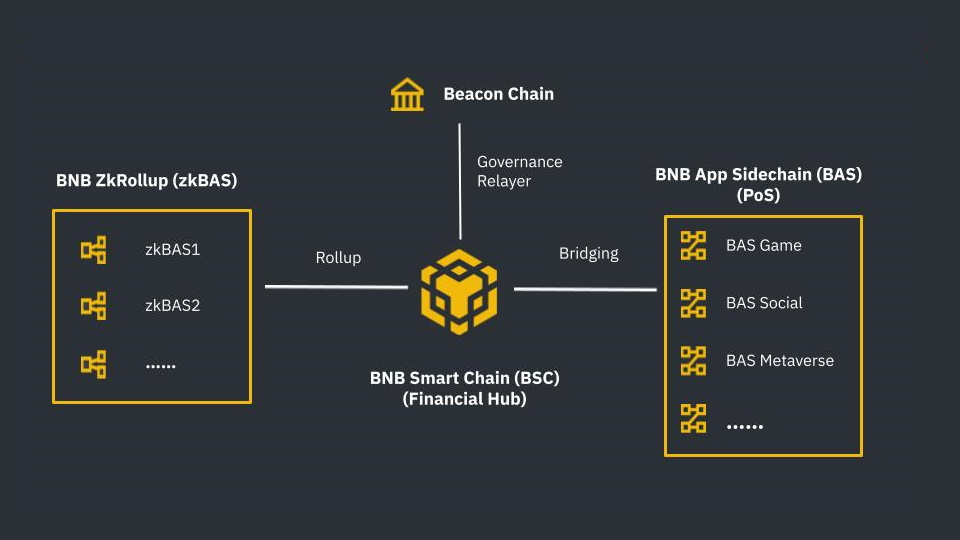

# Introduction 
BNB Chain, one of the most popular blockchains in the world, dedicates to delivering its core infrastructure necessary for future public adoption, and always remains as a community-first and open-source ecosystem built on a permissionless and decentralized environment.

Binance Chain and Binance Smart Chain have formed together as BNB Chain since February 15, 2022. BNB Chain comprises BNB Beacon Chain (previously Binance Chain) and BNB Smart Chain (previously Binance Smart Chain). While BNB (formerly called “Binance Coin”) has also been renamed as “Build and Build.” The name change is not merely for welcoming the crypto world with more than 1 billion users but also to strengthen the delivery of the core infrastructure necessary for future public adoption and, most importantly, to build a better ecosystem for embracing the MetaFi. 

[MetaFi](https://www.bnbchain.world/en/blog/metafi-when-defi-meets-meta/) is a concept that provides advanced and sophisticated DeFi Infra to all the different types of projects such as metaverse, GameFi, SocialFi, Web3, and NFTs and puts them under one umbrella – MetaFi.

This document will show the whole picture of the BNB Chain, how it works, and what it benefits.

## What is Build N Build (BNB) Chain?
BNB Chain is comprised of:
1. **[BNB Beacon Chain](learn/beaconIntro.md) _(previously Binance Chain)_** - BNB Chain Governance (Staking, Voting)
2. **[BNB Smart Chain (BSC)](learn/intro.md) (_previously Binance Smart Chain)_** - EVM compatible, consensus layers, and with hubs to multi-chains

## BNB Token
BNB stands for “**Build and Build**”. Along with _fueling_ transactions on BNB Chain (similar to gas on Ethereum), BNB also acts as a governance token. Holding BNB gives you the right to make your voice heard and is necessary for participation in BNB Chain’s decentralized on-chain governance. With this name change also comes more advancements to benefit users, projects and developers connected to the BNB Chain community. Over the past year, the BNB Chain community has made even further technical upgrades for progressive decentralization, including:
- Initiating the Bruno hard fork to increase the BNB burn rate.

## Key Features
BSC 2021 (current version) introduces a considerable block size of **__100m gas ceiling__**. We plan to introduce a more advanced logic for blockchain storage and BSC client to cover it and allow further expansion.  Currently, to fully sync the BSC blockchain, validators need extensive storage and time. Scaling down the validator and node operator requirements is necessary to enable a seamless BSC experience.

- New technologies, like Erigon, are being verified to decrease both time and storage demands for validators nodes while performing full sync. 
  
- Working with validators and infrastructure providers to deploy new solutions to address this issue, such as  
  - Parallel EVM
  - Better block process pipeline
  - Improved state caching
  - Fast sync mode
  - Distributed nodes 
  - 20 more validators to join the block production of BSC 2022

## Future Goal 
Innovation never sleeps, and it’s clear that the future of BNB Chain goes into a world of over 1 billion users. MetaFi is a key part of this too, helping to create a future where interoperability makes lives easier. BNB Chain’s mission is to build the infrastructure that powers the world’s parallel virtual ecosystem, and BNB Chain’s commitment to the community is that it will be: 
- Open
- Multi-chain
- For creators and inventors
- Permissionless
- Forever decentralized
