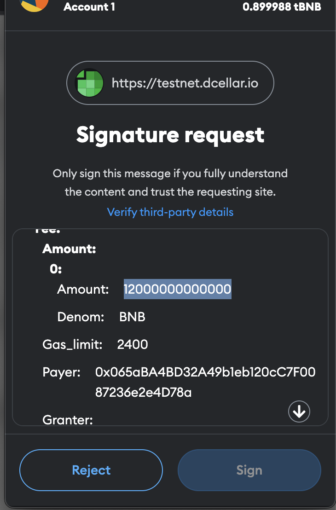

### Why can't I send BNB tokens on BNB Greenfield using my wallet?
Wallet does not support transfers on BNB Greenfield because BNB Greenfield uses a different transaction format than other EVM chains. You may encounter the following error when you transfer your token with your wallet. To send BNB tokens on BNB Greenfield, you need to use [dCellar Transfer function](../guide/getting-started/token-transfer.md#internal-transfers-within-greenfield).


### How to understand the amount field in the signature message when using BNB Greenfield?
When users perform actions on the BNB Greenfield, such as creating buckets or uploading files, they need to sign a message that contains the amount of BNB they are spending. However, this amount is not in BNB units, but in WEI units, which are much smaller. One WEI is equal to 10^-18 BNB. Therefore, the amount field in the signature message may look very large, but it is actually a very small fraction of a BNB.




### Does Greenfield have a token? How can I get it?

BNB remains the main utility token on Greenfield, no other token on Greenfield.
You can acquire BNB in multiple ways:

1. [Buy BNB](https://www.binance.com/en/how-to-buy/bnb) if you never own it.
2. Cross-chain transfer BNB from BSC network to Greenfield using [DCellar](https://dcellar.io/) if you already own any BNB. You can read the detailed steps [here](https://docs.nodereal.io/docs/dcellar-get-started). The cross-chain token transfer is really fast, you are supposed to receive your BNB within a minute.
3. Receive BNB from other Greenfield users with [internal transactions](../guide/getting-started/token-transfer.md#internal-transfers-within-greenfield)

### What is the utility of BNB on Greenfield?

BNB is used as a staking token, gas token, storage service fee token, and governance token. Refer to [token economics](../guide/core-concept/gas-fees.md)
for more details.

### Does Greenfield support smart contract?

The Greenfield blockchain does not support smart contracts, but the native cross-chain between BSC and Greenfield brings programmability to the ecosystem. More tech details are explained [here](../guide/core-concept/programmability.md),
you can start integrating smart contracts with Greenfield following the [tutorial](../tutorials/core/access-control/quick-start.md).

### What consensus algorithm does Greenfield run on?

[Tendermint is the consensus engine](https://blog.cosmos.network/tendermint-explained-bringing-bft-based-pos-to-the-public-blockchain-domain-f22e274a0fdb) that powers Greenfield BPoS.

### Is the file permanently stored in Greenfield?

No. Currently, Greenfield charges storage fees in a stream manner, so if a user's account balance is insufficient and in arrears, it is possible that their data may be lost and cannot be recovered.

Greenfield may support permanent storage in the future.

### Can I update the files after it is uploaded?

The update is not yet supported, but it can be accomplished through deletion and upload.

### Can I enjoy lower price for the data I previously stored if the storage price goes down?

Sure, but it requires any transaction that modifies the payment flow, such as uploading or deleting files, to trigger it.

### Will I also have to pay more for the data I have previously stored if the storage price goes up?

In theory, yes. However, Greenfield will strictly limit the frequency and magnitude of price adjustments by storage providers to minimize the impact on users.

### If the storage provider loses my data or refuses to provide service, what can I do?

This situation is usually unlikely to happen because Greenfield uses redundant error-correction coding to keep your data safe across multiple storage providers.

If such a scenario occurs, you can initiate a data availability challenge, and validators will verify the integrity, availability, and service quality of your data while penalizing the corresponding storage provider.

You can continue to receive rewards until the storage provider fully recovers your data or provides the service.

### How can I make my valuable data circulate?

You can mirror your data and access permissions to the BNB Smart Chain network, and trade your data through various DApps and data trading platforms.

### How long can the data uploaded to the testnet be saved?

Testnet is used for testing, so it won't keep user's data for a long time. It is expected to be dropped after 7 days.

### What to do if you are unable to upgrade Greenfield in time?

 Since this is a hardfork, your `gnfd` binary cannot continue running if it’s not upgraded in time. 
 Add the following filed in `app.toml`:
 ```
 # chain-id for op bnb destination chain 
 `dest-op-chain-id = 204`
 ```
 Stop the binary, then execute the rollback command:
 `gnfd rollback --hard`
 Finally, restart your binary.
