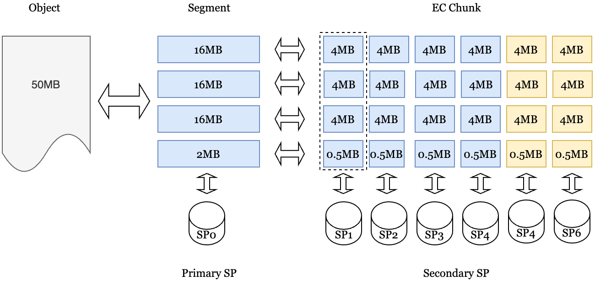

An object on the Greenfield is stored among multi-SPs like below, for example, 50MB:



We will introduce some concepts about data storage before describing in detail.

## Segment 
Segment is the basic storage unit of an object. An object payload is composed of one
or many segments in sequence. The segment size is globally configured on the Greenfield
blockchain. The default segment size is 16MB.  For larger objects, the payload data will
be broken into many segments. If the object's size is less than 16MB, it has only one
segment and the segment size is the same as the object's size.

Please note the payload data of an object will be split into the same size segment
but the last segment, which is the actual size. For example, if one object has a size
50MB, only the size of the last segment is 2 MB and the other segments' sizes are all 16MB.

## EC Chunk 
Erasure Code (EC) is introduced to get efficient data redundancy on Greenfield. A segment
is the boundary to perform erasure encoding. Some EC chunks are generated by erasure 
encoding one segment at a time. EC strategy is globally configured on the Greenfield blockchain. The default EC strategy is 4+2, 4 data chunks, and 2 parity chunks for one segment.
The data chunk size is ¼ of the segment. As one typical segment is 16M, one typical data chunk
of EC is 4M.

## Piece
Piece is the basic storage unit for backend storage on Greenfield. Each segment or EC chunk
can be regarded as one data piece. And the key for each piece is generated based on the
policy on the Greenfield chain.

## Primary SP
Each bucket on the Greenfield is bound with one SP, which is called primary SP. And the user
needs to select an SP as the primary SP when creating a bucket. For all the objects stored
under the bucket, primary SP will store one complete copy, all segments of the objects’
payload data. And only the primary SP serves users’ read or download requests.

## Secondary SP
EC chunks of an object payload data are stored on some SPs, which are called secondary SPs.
Each secondary SP stores part of payload data, which is used for better data availability.
The object payload can be recovered from EC chunks.

## Redundancy Strategy
Redundancy strategy defines how an object payload is stored among SPs, which is globally
configured on the Greenfield blockchain. Below is the current strategy:
* The data stream of the file will be split into segments according to the granularity of the segment size. 
If the size of the data is less than the segment size, it will be split according to the size of the data itself.
The default segment size is 16MB;
* Greenfield uses Reed-Solomon algorithm [Reed-Solomon](https://en.wikipedia.org/wiki/Reed%E2%80%93Solomon_error_correction)
as its EC strategy, the default data blocks are 4, and the default parity blocks are 2 .
* All the segment pieces of an object are stored on the Primary SP;
* After EC encoding with the segment, the EC encoding module will generate six EC chunk pieces. 
All the EC chunk pieces of the segment will be stored to the six chosen secondary SPs.


For example, when processing a 32MB file, the object is split into two segments. These two segments are stored in the primary storage provider, and each segment is encoded using erasure coding to generate six 4MB pieces. These six pieces are stored in six secondary storage providers in numerical order.


## Integrity Hash
The integrity hashes include a root hash of the primary SP and several root hashes for each secondary SP which
based on the EC strategy. The number of secondary hashes is equal dataBlocks plus parityBlock
(it is six for now). Each piece's hash is computed
by using hash algorithm (default is sha256) on the data piece's content. The pieces' root hash is computed based
on all the pieces' hashes.

The calculation process can be represented as follows:
```
// secondaryHashN represents the Integrity Hash calculated by the Nth secondary SP.
// segmentN_pieceN represents the Nth piece of the Nth segment of the object after EC encoding
IntegrityHashes = [primaryHash, secondaryHash1 ...secondaryHash6]
primaryHash := hash(hash(segment1)+hash(segment2)..+hash(segmentN))
secondaryHashN := hash(hash(segment1_pieceN)+hash(segment2_pieceN)..+hash(segmentN_pieceN))
```
For example, when processing a 32MB file, we got two segments called segment1 and segment2.
The integrity hash of the primary SP is equal with hash(hash(segment1) + hash(segment2)).
For each secondary SP, it stored piece1 and piece2  which is the encoding  result by the segments.
The integrity hash of the first secondary SP is equal with hash(hash(segment1_piece1) + hash(segment2_piece1)).

Integrity hash is an important metadata of objects on the chain. During the process of creating an object, the integrity hash of each object is calculated and this information is recorded on the blockchain to ensure the accuracy of the data.

