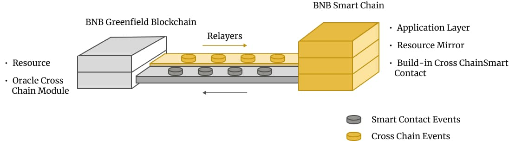

# Cross-Chain Programmability

The real power of the Greenfield ecosystem lies in its platform designed not only to store the data, but also to
support the creation of value based on the data assets and its related economy.

The asset traits of the data are firstly established on the permissions, e.g. the permission to read the data. When 
this right is disconnected from the data itself, they become tradable assets and enlarge the value of the data. This 
can be amplified when the data itself can be executable (a new type of "Smart Code"), interact with each other, and 
generate new data. This creates a lot of room to imagine building a new, data-intensive, trustless computing environment.

Moreover, the data permissions can be transferred cross-chain onto BSC and become digital assets there. This creates a 
variety of possibilities to integrate these assets with the existing DeFi protocols and models on BSC.

This gets even further enhanced by the smart contracts on BSC, which enjoy the same address format as accounts on the 
Greenfield blockchain and can be the owners of the data objects and inherit different permissions. This will unleash 
many new business opportunities based on the data and its operations.

!!! info 
    It does not mean developers have to build dapp based on BSC network. Excellent infrastructure, applications, 
    and tools can be built directly on the Greenfield network.

## Framework

<i>Figure Cross-chain Architecture</i>

The Greenfield ecosystem consists of three distinct layers. 

The first layer is the `Cross-Chain Communication Layer`, which is responsible for handling and verifying 
the communication packages between the BSC and the Greenfield blockchain networks. This layer serves as the backbone of 
the entire ecosystem, ensuring the smooth and secure transfer of information between the two platforms.

The second layer is the `Resource Mirror Layer`. 
This layer manages the resource assets defined on Greenfield, which are then mirrored onto BSC. 
The `Resource Mirror Layer` enables users to interact with these assets on BSC using smart contracts, 
which operate on the primitives defined by Greenfield. This layer plays a critical role in the 
Greenfield ecosystem, enabling seamless cross-chain asset management and more efficient resource allocation.

At the top of the Greenfield ecosystem is the `Application Layer`. This layer consists of smart contracts 
that are developed by the community on BSC, enabling them to operate the mirrored resource entities on
the `Resource Mirror Layer`. While Greenfield itself does not offer programmability, the `Application Layer`
can interact with Greenfield Core and other supporting infrastructures. The `Application Layer` represents the true power and 
potential of the Greenfield ecosystem. Developers are able to create and leverage a 
wide range of innovative and decentralized applications while benefiting from Greenfield's robust 
infrastructure and cross-chain capabilities.

More details are discussed in [Mirroring FAQ](../../faq/mirroring-faqs.md).

## Cross-Chain Bridge
The native cross-chain bridge is an essential part of the Greenfield ecosystem, 
as it enables seamless interoperability between BSC and Greenfield. 
To ensure the security and integrity of the bridge, a new relayer system have been implemented for the validators of Greenfield
based on an aggregated multisig scheme.

Under this system, multiple validators will collaborate to approve and execute cross-chain transactions, 
with each transaction requiring a certain threshold of signatures to be deemed valid. 
The use of an aggregated multisig scheme not only ensures greater security but also 
facilitates a higher bandwidth and faster bridge.

The relayer system will be continuously monitored and maintained by the validators to 
ensure that it is running at optimal efficiency.

More details are discussed in [Cross Chain Module design](../greenfield-blockchain/modules/cross-chain.md).

## Get Started with building dapp

- [Learn more about the cross-chain mechanism](../greenfield-blockchain/modules/cross-chain.md)
- [Start building dapps with Greenfield](../../tutorials/index.md)
