# Use Greenfield in Dcellar

DCellar is a powerful tool that allows users to initiate their decentralized data management journey on the Greenfield platform. 
It is developed based on Greenfield by [Nodereal](https://nodereal.io/). With DCellar, users can store and share their data, as well as manage their account assets.

## Login

Simply open the web browser and navigate to [dcellar.io](https://dcellar.io/). 
You will be greeted with a Welcome Screen that provides a simple and user-friendly interface.

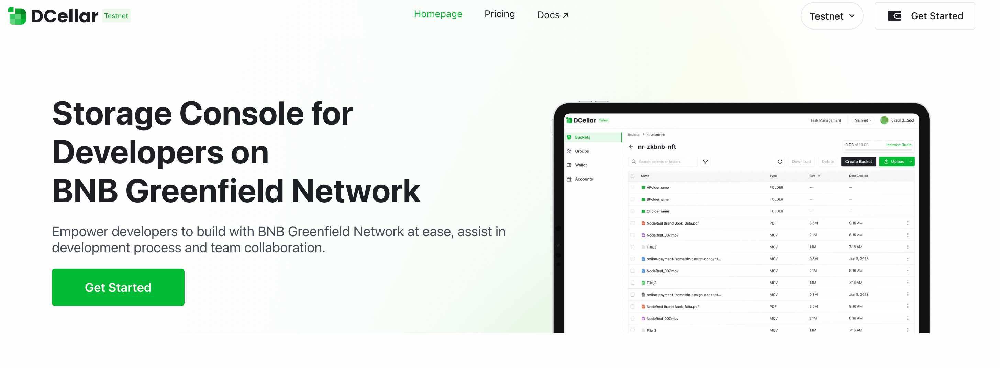

To get started, click on the **Get Started** button, and your wallet extension will automatically be activated. 
This will log you in with your current wallet account, allowing you to access all the features and functions of DCellar. 
With this easy and straightforward process, even first-time users can quickly get started with decentralized data management 
on the Greenfield platform.

For first time users, you will need to add Greenfield Network to your Wallet, and you will be asked to switch your network 
to Greenfield Network to start following operations.

You can also add Greenfield Network to your wallet manually, you can find it at  [bnbchainlist](https://www.bnbchainlist.org/)

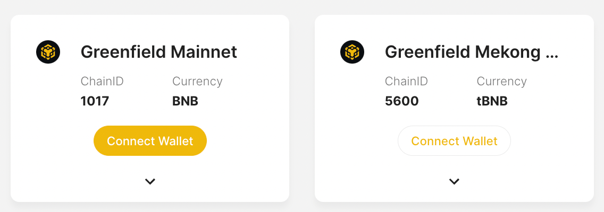

For returning users, you will stay logged in for a default time period. During the default time period, you will stay logged in when you come back. After that, you will need to login with wallet again.  
If you want to switch to your other wallet accounts, you can try **Disconnect** first, and then login again with another account.

## Transfer In

Before you can begin storing your objects with DCellar, you'll need to transfer several amounts of BNB tokens from your 
BSC account to your Greenfield account. These two accounts share the same account address, making the 
transfer process straightforward and hassle-free.  

By transferring BNB tokens to your Greenfield account, you'll be able to cover the transaction fees associated 
with storing and managing your objects on the Greenfield platform. Once you've completed this step, 
you'll be ready to start using DCellar and taking advantage of all its powerful features and benefits.

Once you've logged in to DCellar, you can access the Transfer In tab by navigating to the Wallet Page. 
Before you begin the transfer process, it's important to ensure that you're currently using the BSC .

If you're using the Greenfield Network, the Transfer In page will be displayed differently. To avoid any confusion, 
make sure that you're on the correct network before proceeding with the transfer process. 
By following these simple steps, you can quickly and easily transfer BNB tokens to your Greenfield account and 
start using DCellar to manage your decentralized data.

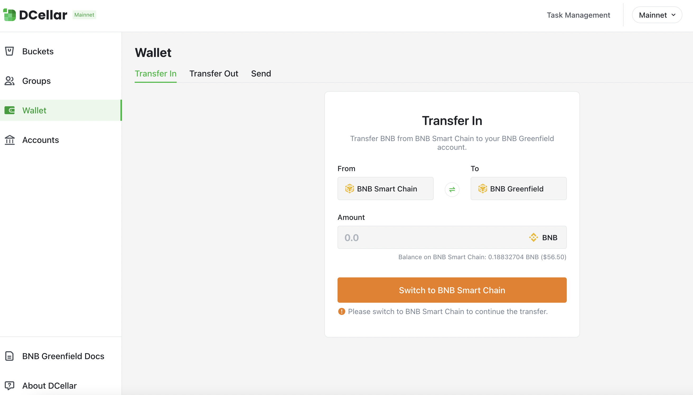

Click **Switch to BNB Smart Chain**, your wallet will be notified, informing you to switch network, by clicking **Switch Network** button on wallet pop-up, you will be able to switch to BSC . If you haven't added a BSC network yet, wallet will ask you to add a network first, then switch to this network.

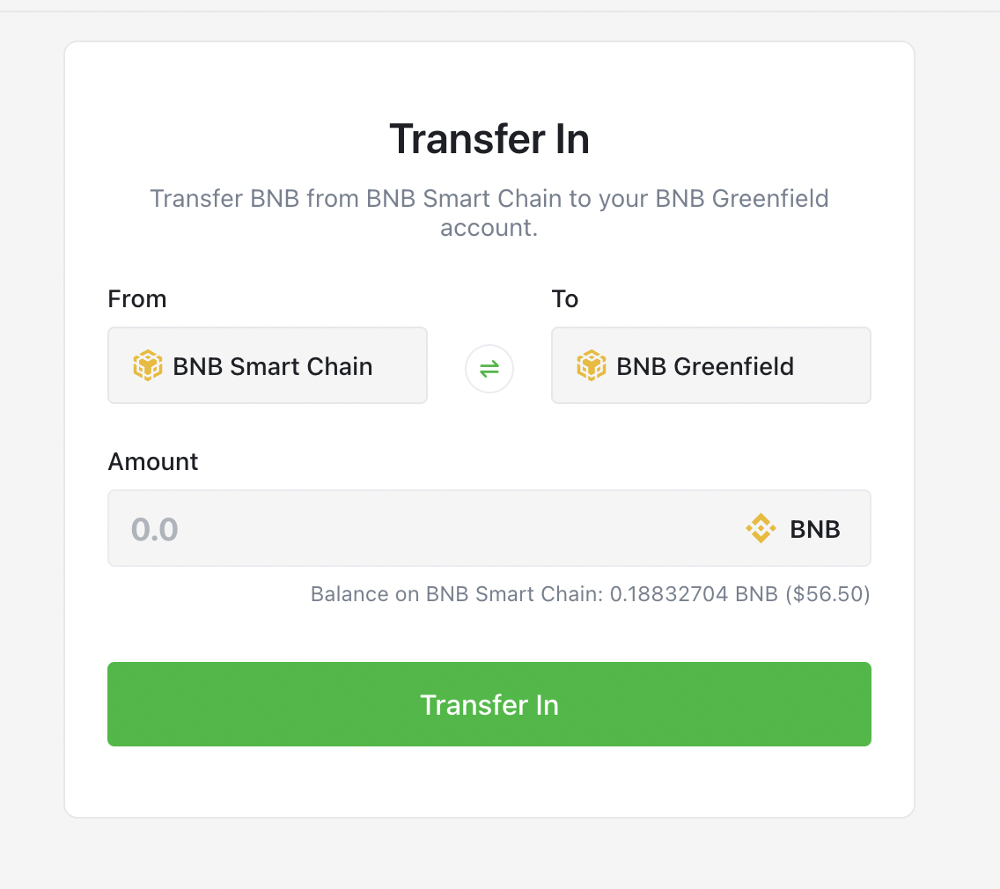

You will be able to Transfer a certain amount of BNB token from your BSC  account to your Greenfield  account which shares the same address. Transfer In will cost you two kinds of fees, all charged by BNB token:

- **Gas fee**: covers the gas cost for sending your transfer on the destination chain.
- **Relayer fee**: paid to relayers for handling cross-chain packets.

Input the amount you want to Transfer In, Click **Transfer In**, your transaction will be sent. You can view your transaction details in explorer.

## Create Bucket

Before you start using DCellar to manage your objects, you should make sure you are currently under Greenfield Network. If you are under another network, you will be asked to **Switch to BNB Greenfield** first.

A bucket is a logical container for storing objects in Greenfield. Once a bucket has been created, you can upload your objects to a certain bucket.  
After Login, you can see the New Bucket button at your bucket list page.

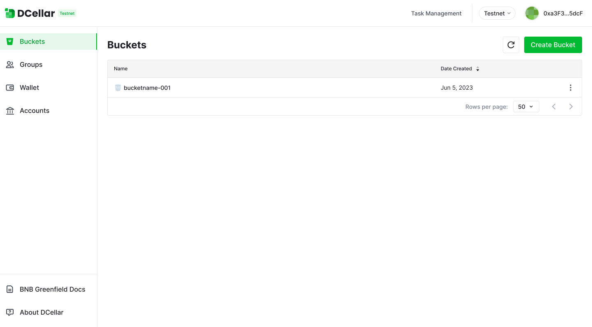

After clicking **New Bucket**, a pop-up will show and you will be asked to enter a bucket name. 
Each bucket has a unique name that is assigned by the user when the bucket is created. 
Please follow the naming rules, carefully select your bucket name:

- Bucket names must be between 3 (min) and 63 (max) characters long.
- Bucket names can consist only of lowercase letters, numbers, and hyphens (-).
- Bucket names must begin and end with a letter or number.
- Bucket names must be global unique in Greenfield
- A bucket name cannot be used by another Greenfield account until the bucket is deleted.

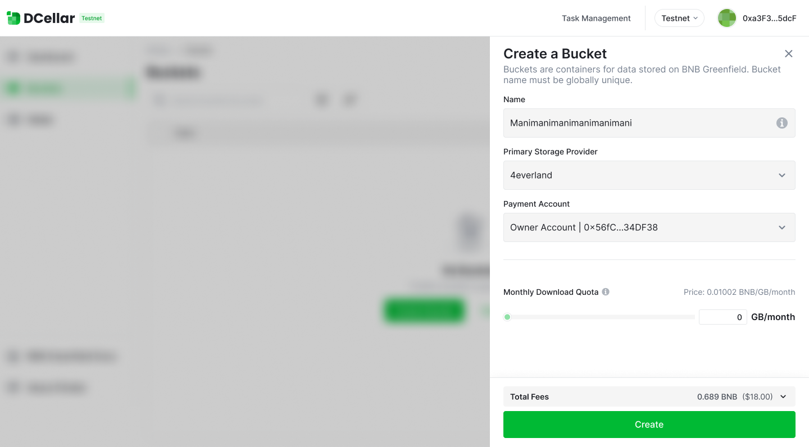

By selecting a primary storage provider, you will decide the main storage service provider for all the datas within this particular bucket.

By selecting a payment account, all storage service fee will be charged from this selected payment account, while gas fee will charged from your current login account, which is also your owner account. If your balance is insufficient, you will be informed to Transfer In first.  
For more information about Owner Account and Payment Account, Please Go to Greenfield Doc- [Greenfield Documentation](https://docs.bnbchain.org/greenfield-docs/docs/guide/core-concept/billing-payment).

## Upload Object

Choose one bucket on your bucket list page, you can see the objects within this bucket. Click **Upload** , 
you will be able to choose a locally stored object.

When you are uploading a object, gas fee will be charged from your current login account, which is also your owner account.  
Besides, once your object is uploaded successfully, you will be charging a storage fee under a certain flow rate. Learn more about storage fee at [Greenfield Doc](https://docs.bnbchain.org/greenfield-docs/docs/guide/home/).  
Therefore, when you are uploading a object, you need to make sure that your owner account has enough balance to cover the storage fee for the following six months. which will be shown as Prepaid fee as follows.

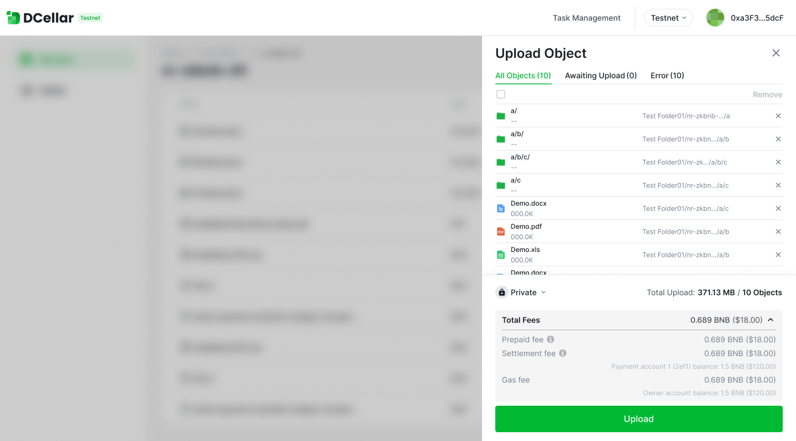

!!! info
    Please notice that the prelocked fee is not charged at the beginning, it is still in your owner account. But you are not allowed to use it for other purposes because it's "locked".

Besides prepaid fee, each operation will bring settlement, which might generate settlement fee. 
Learn more about [Greenfield Settlement](../core-concept/billing-payment.md).

Moreover, you can select the permission property of the selected object, DCellar will set your object as private by default.

After you successfully upload your data, Greenfield will start to charge storage fee from your locked fee in your account. 
You can view your total "locked fee" at your account page.

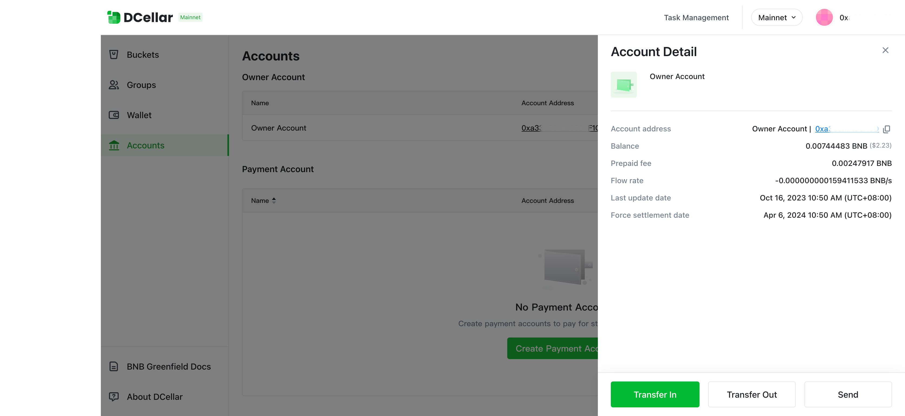

## Create Folder

You can create folders to better organize your objects. carefully choose your folder name, avoid "/" in your folder name.

Create folder will cost you some gas fee. Also, every operation will bring settlement, so there might be settlement fee. Settlement fee will be charged from the payment account, while gas fee will be charged from owner account.

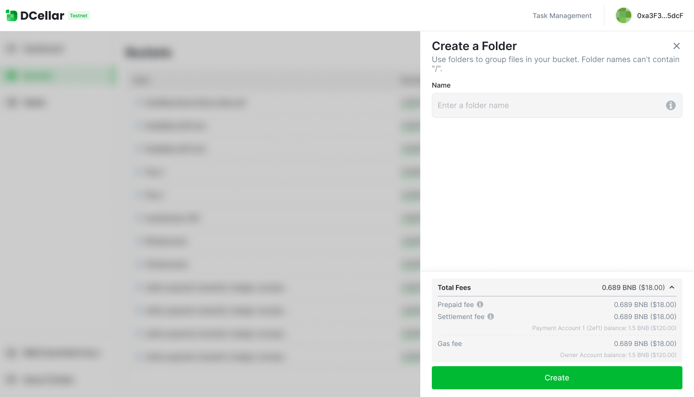

## Download Object

When you are downloading a object, gas fee will not be charged. But it will cost your some Download bandwidth.

!!! info
    Each download operation will consume Download Quota, which is related to object size. In the current testing phase, each bucket will be given 1G's free quota.

You can check your bucket's remaining quota at Bucket Detail page

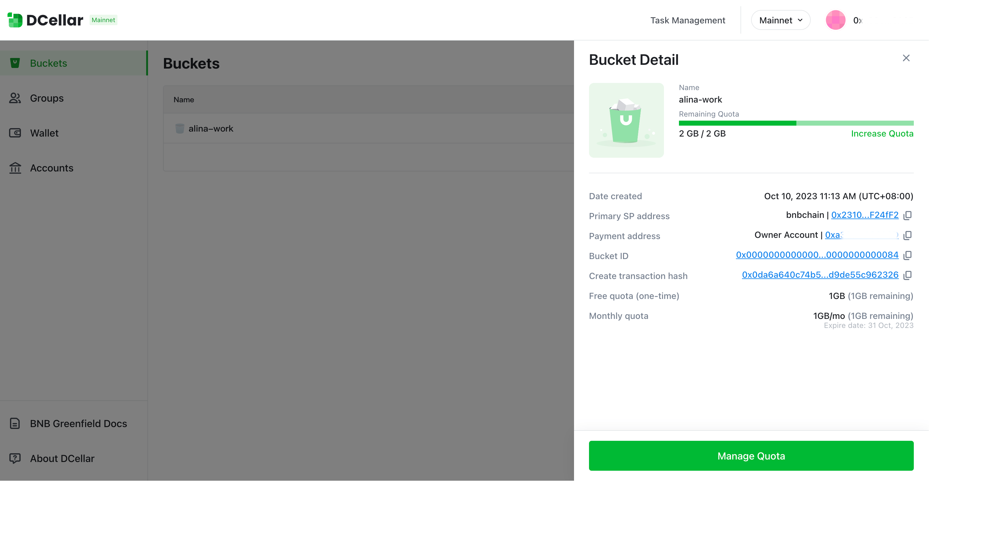

When your remaining quota is smaller than the required quota for a certain object you are downloading, 
your download will fail, you will be reminded to buy more quota.

## Manage Quota

You can buy quota by month. Choose the amount you want to buy. Please notice that when you download objects, 
the system will automatically use the free quota first, which will not expire during your usage period. 
After your free quota is used out, system will start to use the download quota you bought. 
If your purchased quota is not use out before the end of the month, your monthly quota will expire.

When you buy monthly quota, it means you agree to buy monthly quota in the following month, 
if you want to stop buying monthly quota, you need to update your monthly quota, set monthly quota amount to 0.

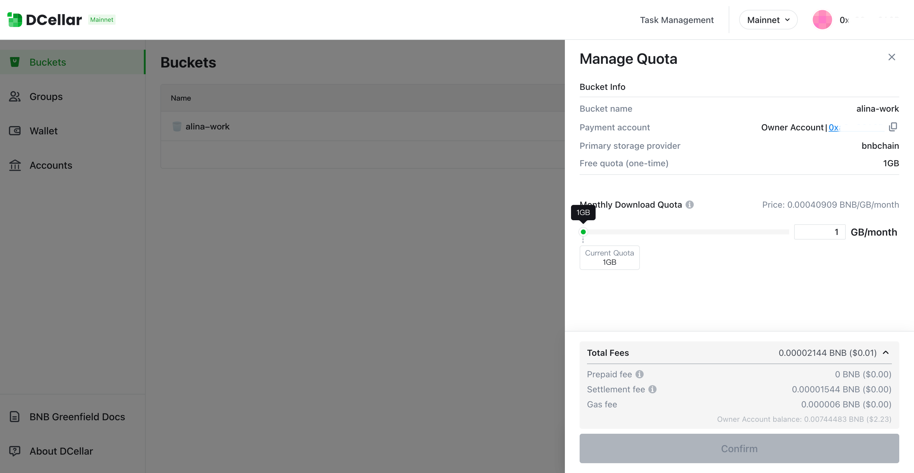

## Delete Object

When you are deleting a object, gas fee will be charged from your owner account. 
If your balance is insufficient, you will be informed to Transfer In first.  
Besides, when your object is deleted, your flow rate will be recalculated, and part of your prepaid fee will be refund. 
So you can see your "Prepaid fee refund" as follows when deleting a object.

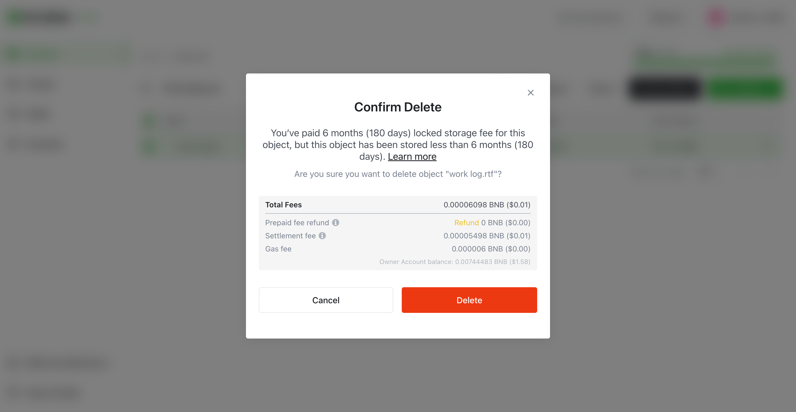

!!! info
    Please notice if your data has been stored less than 6 months, your prepaid fee will not be refund.

Also, every operation will bring settlement, so there might be settlement fee. Settlement fee will be charged from the payment account.

## Delete Bucket

You can delete the bucket created by you. Please notice you are only allowed to delete an empty bucket, 
which means you need to delete all your objects in the bucket before you delete the bucket.  
When you are deleting a bucket, gas fee will be charged from your current login account, which is also your owner account.

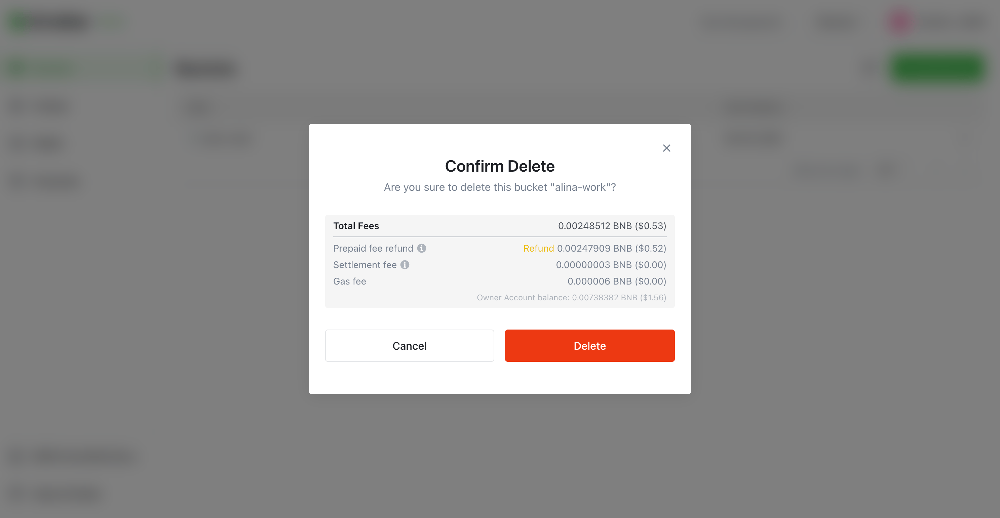

If you have bought monthly quota for the bucket, when you delete bucket, 
system will refund your prepaid fee for monthly quota no matter when you decide to delete your bucket. 
This is a bit different with prepaid fee refund  when deleting objects, which has 6 6-month min lock time.

## Monitor Usage

With DCellar, you can Monitor your usage through your Dashboard.

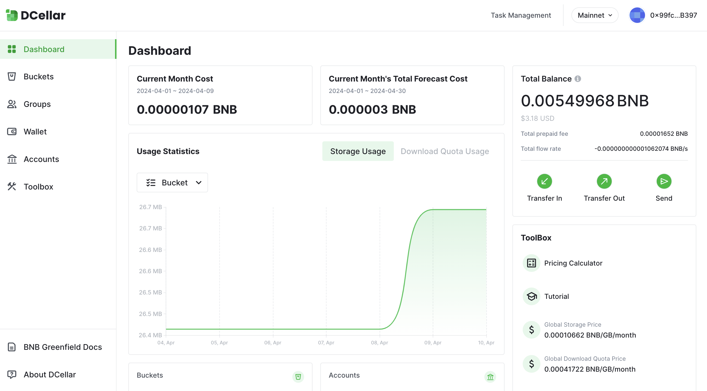

Besides, you can also view your expenses via account and account detail.

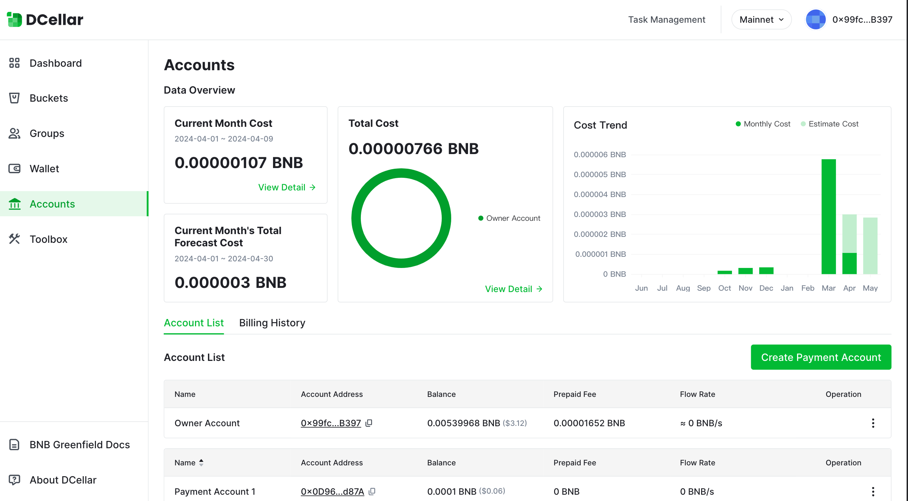

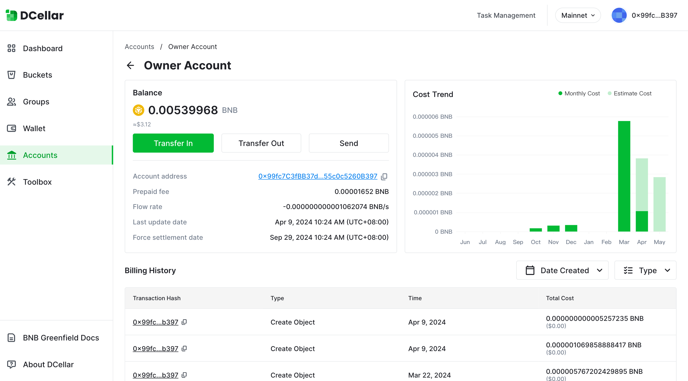

## Send

With the DCellar, you can easily send BNB tokens from your Greenfield owner account to another Greenfield owner account.  
However, before you initiate any token transfers, it's important to ensure that you're currently using the correct network. 
If you're using the BSC  instead of the Greenfield , the Send page will be displayed differently.  
To avoid any mistakes or confusion, always double-check that you're on the correct network before sending tokens to 
another user. By taking this simple precaution, you can ensure that your token transfers are executed smoothly and efficiently, 
enabling you to manage your decentralized data with ease using DCellar.

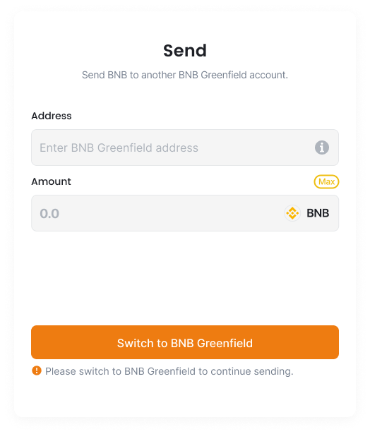

To switch to the BNB Greenfield network, simply click on the "Switch to BNB Greenfield" button within DCellar. 
This will automatically activate your wallet extension, which will display a pop-up informing you that you need to switch networks.  
To proceed, simply click on the "Switch Network" button within the wallet pop-up. This will allow you to switch to the Greenfield .

!!! info
    Before Sending, please make sure the address you enter is a valid Greenfield  account address.

Enter the receiver's address and the amount you want the send, click **Send**, your transaction will be sent to Greenfield , and you will need to pay the gas fee on Greenfield .

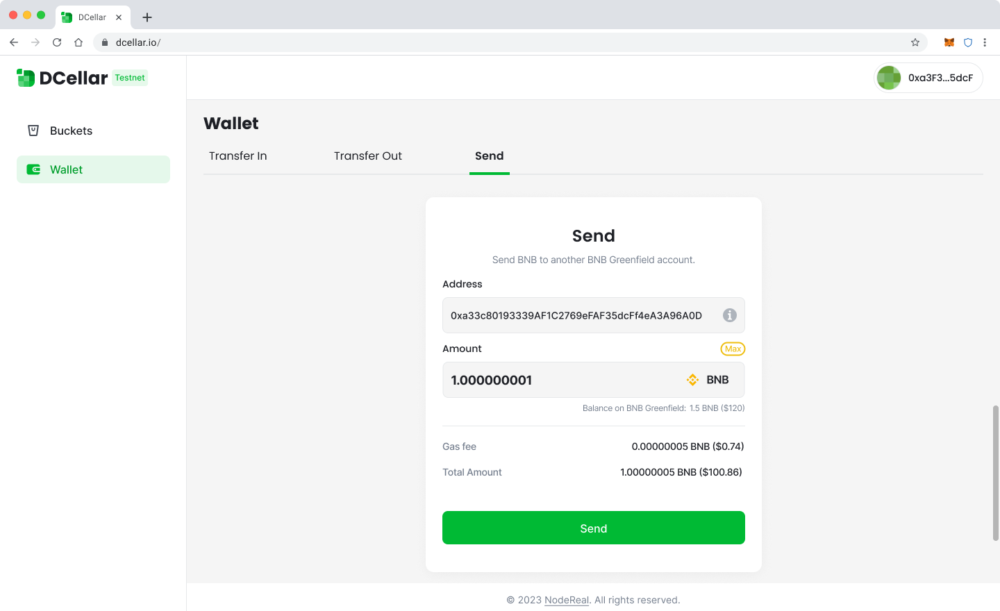

## Transfer Out

With DCellar, you can transfer out BNB token from your Greenfield  account to your BSC  account which shares the same address.  
Before you Transfer Out, you should make sure you are currently under Greenfield . If you are under BSC , your Transfer Out page will be shown as follows:

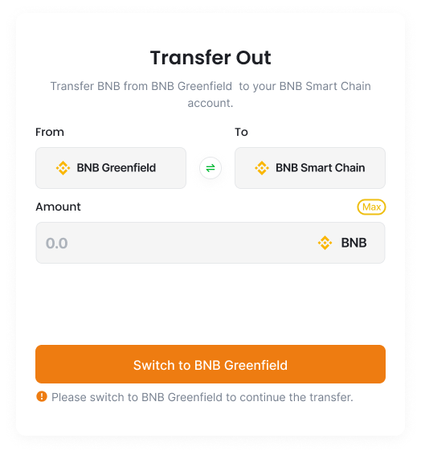

To switch to the BNB Greenfield network, simply click on the **Switch to BNB Greenfield** button within DCellar. 
This will automatically activate your wallet extension, which will display a pop-up informing you that you need to switch networks.  
To proceed, simply click on the **Switch Network** button within the wallet pop-up. 
This will allow you to switch to the Greenfield , where you can begin managing your decentralized data with DCellar. 
By following these simple steps, you can quickly and easily switch networks and access all the powerful features and functions of DCellar on the Greenfield platform.

Transfer Out will cost you two kinds of fees, all charged by BNB token:

- **Gas fee**: covers the gas cost for sending your transfer on the destination chain.
- **Relayer fee**: paid to relayers for handling cross-chain packets.

Input the amount you want to Transfer Out, Click Transfer Out, your transaction will be sent. You can view your transaction details in [GreenfieldScan](https://greenfieldscan.com/).