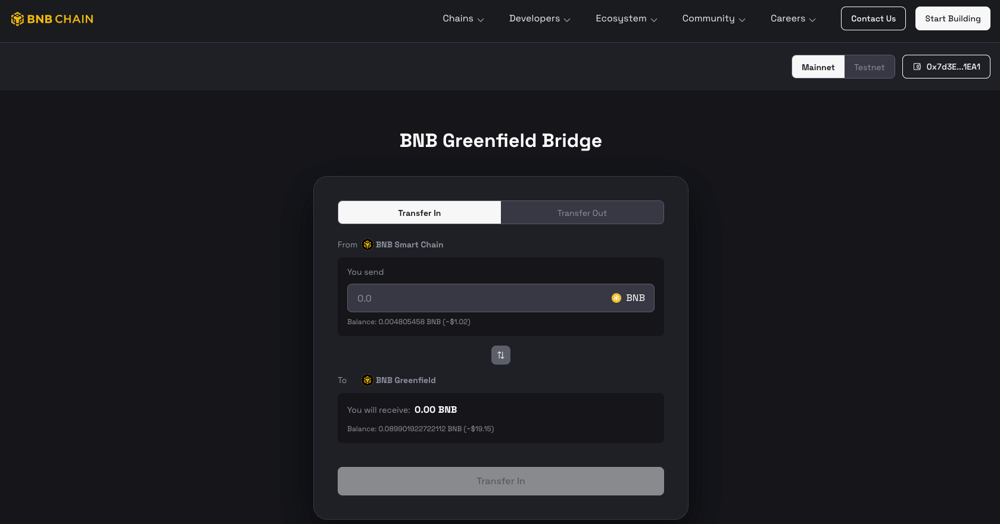
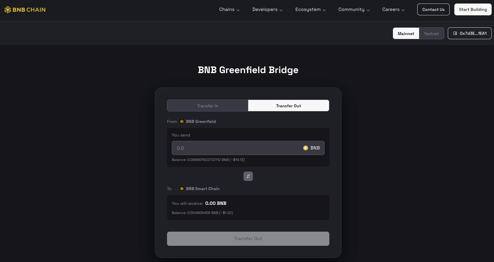
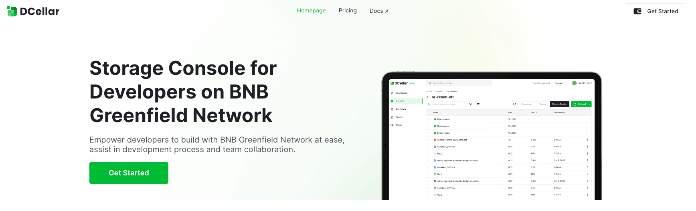
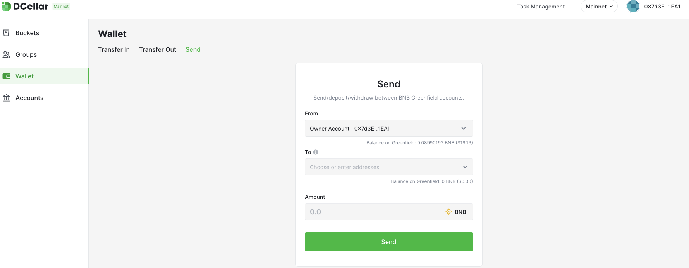

# Bridge and Transfer BNB

The address formats of Greenfield and BSC are fully compatible. Users can transfer BNB between Greenfield and BSC freely. However, Greenfield only supports BNB and does not support BEP20 tokens currently.

This is a comprehensive guide detailing the process of transferring BNB between Greenfield Blockchain and BSC.

## Transfer from BSC to Greenfield

To perform a cross-chain transfer from BNB Smart Chain (BSC) to Greenfield, follow these steps:

1. Visit [Greenfield Bridge](https://greenfield.bnbchain.org/en/bridge?type=transfer-in).

2. Connect your wallet and switch to the BSC network.

3. Specify the desired amount and click the `Transfer In` button.

4. Confirm the transaction and wait for the transfer to be processed on BSC.

5. Once the transaction is confirmed, the funds will be transferred from BSC to Greenfield. The transferred funds will
   reflect in the same account on Greenfield within a few seconds.

You can also use [DCellar](https://dcellar.io/) and follow [How to Transfer In](https://docs.nodereal.io/docs/dcellar-get-started#transfer-in)
to transfer BNBs from BSC to Greenfield.

## Transfer from Greenfield to BSC

To perform a cross-chain transfer from Greenfield to BNB Smart Chain (BSC), you will need to:

1. Visit [Greenfield Bridge](https://greenfield.bnbchain.org/en/bridge?type=transfer-out).

2. Connect your wallet and switch to the Greenfield network.

3. Specify the desired amount and click the `Transfer Out` button.

4. Confirm the transaction and wait for the transfer to be processed on Greenfield.

5. Once the transaction is confirmed, the funds will be transferred from Greenfield to BSC. The transferred funds will
   reflect in the same account on BSC within a few seconds.

You can also use [DCellar](https://dcellar.io/) and follow [How to Transfer Out](https://docs.nodereal.io/docs/dcellar-get-started#transfer-out)
to transfer BNBs from Greenfield to BSC.

!!! note
    One thing to note is if the value of the cross-chain transfer is over 1000BNB, the funds will be locked in `TokenHub` for 12 hours before they can be withdrawn.
    Usually, a third-party server will help withdraw the unlocked token to the recipient, and users can also withdraw to the recipient themselves by following [unlock document](https://github.com/bnb-chain/greenfield-contracts#large-transfer-unlock)

## BNB Transfers in Greenfield

Greenfield allows for easy and secure transfers between different accounts. However, due to the particularity of the transaction format, it is currently not possible to transfer tokens through the built-in Send function in the wallet, like MetaMask. To conduct an internal transfer within Greenfield, please adhere to the following steps:

1. Visit [DCellar](https://dcellar.io/).

2. Click the `Get Started` button located at the top right.

3. Connect your wallet and sign in.

4. Go to the `Wallet` page on the left sidebar, then proceed to the `Send` page.

5. Fill in the destination address where you want to transfer, specify the amount, and click the `Send` button.

6. Confirm the transfer and wait for the transaction to be processed.

7. Once the transfer is confirmed, the funds will be moved from the source account to the destination account within Greenfield.
