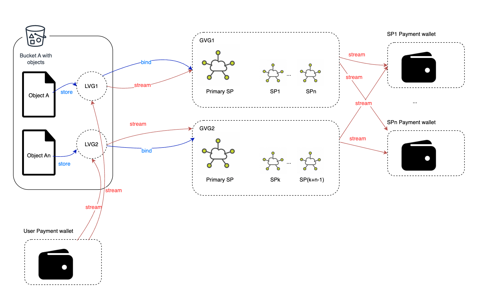
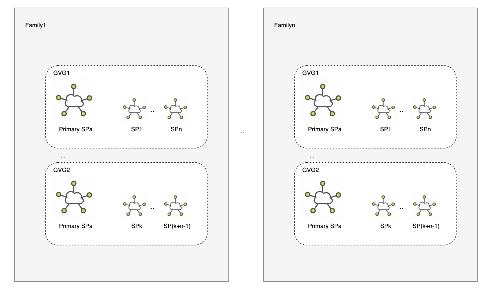
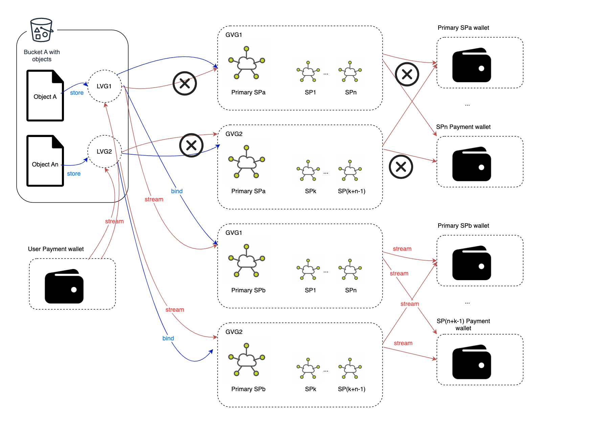

# Virtual Group 

## Abstract

We propose the adoption of Virtual Groups as a solution to untangle the interdependency between Buckets/Objects and Storage Providers (SPs). This approach effectively reduces the need for a large number of transactions to be transmitted when modifying the on-chain BucketInfo and ObjectInfo during SP exits and bucket migrations.

A Virtual Group comprises a primary storage provider and several secondary storage providers. Each object is associated with a specific virtual group, which restricts the range of secondary storage providers responsible for storing object replica data. The number of storage providers in each virtual group is determined by the redundancy policy. For example, if our redundancy policy specifies a full replica and a 4+2 erasure coding (EC) replica, every virtual group should consist of one primary SP and six secondary SPs.

### Terminology

- Global Virtual Group (GVG): A global virtual group consists of one primary SP (SP) and multiple secondary SPs.
Local Virtual Group(LVG): Each bucket maintains a mapping from the local group ID to the global group ID. j(e.g 3 ➝ 001960583).
- Virtual Group Family(VGF): Each primary storage provider can create multiple virtual group families, with each family containing several global virtual groups. Each family serves a limited number of buckets. Once the store size exceeds a specified threshold, the family will no longer allow to serve more buckets.

### Relationships

Local virtual groups are linked to their corresponding buckets, and each object needs to store the ID information of the local virtual group. Each local virtual group must correspond to one and only one global virtual group.



In order to avoid all the data of a primary SP being transferred to one SP within a short period of time, we introduce the concept of "family". 



A family can contain multiple GVG that the same SP creates. A bucket can only be served by the GVGs that are in the same family, cross family GVG is not allowed within one bucket. Once the total storage size of a family exceeds 64TB(TBD), the GVG inside the family can not server new buckets, the SP has to create a new family. By introducing family , the primary SP can exit at family level without breaking the one bucket, one primary SP rule.

### Staking For Storage

We introduce a new staking rule based on storage size. The minimum required staking tokens can be calculated using the formula storage_staking_price * stored_size . The storage providers have the option to pre-stake tokens for upcoming storage if needed.

All staking tokens will be managed by the Virtual Group Module account. Only during deletion or swapping out, the storage providers can get these staking tokens back. In the event of a storage provider's forced exit, these tokens will be forfeited and used to reward those storage providers which take over these GVG.

## Key Workflow

### Creation and Destruction

A Global Virtual Group (GVG) can be created autonomously by any storage provider without the need for approvals from secondary SPs. Nevertheless, in order to control the proliferation of validator groups, the creation of a GVP entails relatively higher fees and need staking for storage.

The count of secondary SPs within a group can serve as an indicator of redundancy for all objects stored within that group. With the capability to establish distinct secondary virtual groups with varying levels of redundancy, the system offers significant flexibility.

When creating a GVG (Global Virtual Group), if no GVG Family is specified, the transaction will automatically create a family on-chain and associate it with the newly created GVG.

Conversely, a Local Virtual Group (LVG) is automatically generated during object creation, but its quantity within a bucket should be restricted to a specific limit.

When the stored size within a GVG becomes zero, any SP (Storage Provider) within it can delete it and the staking tokens will be return to the owner of this GVG. We cannot proactively delete a GVG family. If all GVGs within the family are deleted, the family will be automatically removed as well.

We also do not need to manually delete LVGs, as they are always removed automatically when the associated bucket is deleted.

### SP Exit Workflow

Below are the key steps in the Storage Provider (SP) exit process:

1. The Storage Provider (SP1) initiates the exit process by submitting a StorageProviderExit transaction to the blockchain.
2. Subsequently, SP1 or its successor SP must repeatedly call SwapOut to remove itself from all Global Virtual Groups (GVGs).
3. For the primary SP, the swap-out process occurs at the family level, ensuring there are no conflicts with other SPs within the GVG.
4. For secondary SPs, the swap-out happens at the GVG level and must also avoid conflicts with the primary SP.
5. Once SP1 successfully completes the swap-out process from all GVGs, it can submit a CompleteStorageProviderExit transaction to retrieve the staked tokens.

This orderly exit process ensures a smooth transition of responsibilities and resources while preserving the integrity of the network and the staked tokens associated with the exiting SP.


### Bucket Migration Workflow



Below are the key workflow of Bucket Migration:

1. The user submits a bucket migration transaction with the signature of the new primary SP.
2. The new SP starts receiving full data from the old primary SP or from secondary SPs.
3. The new SP distributes data among the secondary SPs according to his new GVPs. (more details required...)
4. The new SP submit a bucket seal transaction on-chain along with all the aggregate signature from new secondary SPs.
5. The on-chain module will:
   * Unbind the old LVG and GVG mapping, and build a new mapping relationship.
   * Settle the payment stream between LVG, GVF, and SPs.
6. During the migration period, the user can not upload files to this bucket.
7. During the migration period, the old SP should still serve the query request.

## Params

The virtial group module contains the following parameters,
they can be updated with governance.

```protobuf
// Params defines the parameters for the module.
message Params {
  option (gogoproto.equal) = true;
  option (gogoproto.goproto_stringer) = false;

  // deposit_denom defines the staking coin denomination.
  string deposit_denom = 1;
  // store price, in bnb wei per charge byte
  string gvg_staking_per_bytes = 2 [
    (cosmos_proto.scalar) = "cosmos.Int",
    (gogoproto.customtype) = "github.com/cosmos/cosmos-sdk/types.Int",
    (gogoproto.nullable) = false
  ];
  // the max number of lvg which allowed in a bucket
  uint32 max_local_virtual_group_num_per_bucket = 3;
  // the max number of gvg which can exist in a family
  uint32 max_global_virtual_group_num_per_family = 4;
  // if the store size reach the exceed, the family is not allowed to sever more buckets
  uint64 max_store_size_per_family = 5;
}
```

## States
The virtualgroup module keeps state of the following primary objects.

### Global Virtual Group
```protobuf
// A global virtual group consists of one primary SP (SP) and multiple secondary SP.
// Every global virtual group must belong to a GVG family, and the objects of each
// bucket must be stored in a GVG within a group family.
message GlobalVirtualGroup {
  // ID represents the unique identifier of the global virtual group.
  uint32 id = 1;
  // Family ID represents the identifier of the GVG family that the group belongs to.
  uint32 family_id = 2;
  // Primary SP ID represents the unique identifier of the primary storage provider in the group.
  uint32 primary_sp_id = 3;
  // Secondary SP IDs represents the list of unique identifiers of the secondary storage providers in the group.
  repeated uint32 secondary_sp_ids = 4;
  // Stored size represents the size of the stored objects within the group.
  uint64 stored_size = 5;
  // Virtual payment address represents the payment address associated with the group.
  string virtual_payment_address = 6 [(cosmos_proto.scalar) = "cosmos.AddressString"];
  // Total deposit represents the number of tokens deposited by this storage provider for staking.
  string total_deposit = 7 [
    (cosmos_proto.scalar) = "cosmos.Int",
    (gogoproto.customtype) = "github.com/cosmos/cosmos-sdk/types.Int",
    (gogoproto.nullable) = false
  ];
}

```

### Global Virtual Group Family

```protobuf
// Global virtual group family serve as a means of grouping global virtual groups.
// Each bucket must be associated with a unique global virtual group family and cannot cross families.
message GlobalVirtualGroupFamily {
  // id is the identifier of the global virtual group family.
  uint32 id = 1;
  // primary_sp_id
  uint32 primary_sp_id = 2;
  // global_virtual_group_ids is a list of identifiers of the global virtual groups associated with the family.
  repeated uint32 global_virtual_group_ids = 3;
  // virtual_payment_address is the payment address associated with the global virtual group family.
  string virtual_payment_address = 4 [(cosmos_proto.scalar) = "cosmos.AddressString"];
}
```

### Swap Out Info

```protobuf
message SwapOutInfo {
  // sp_id is the unique id of the storage provider who want to swap out.
  uint32 sp_id = 1;
  // successor_sp_id is the id of the successor storage provider.
  uint32 successor_sp_id = 2;
}
```

## Messages
### MsgCreateGlobalVirtualGroup

Used to create a new global virtual group.

```protobuf
message MsgCreateGlobalVirtualGroup {
  option (cosmos.msg.v1.signer) = "storage_provider";

  // storage_provider defines the operator account address of the storage provider who create the global virtual group.
  string storage_provider = 1 [(cosmos_proto.scalar) = "cosmos.AddressString"];
  // family_id is the identifier for the virtual group's family.
  uint32 family_id = 2;
  // secondary_sp_id is a list of secondary storage provider IDs associated with the virtual group.
  repeated uint32 secondary_sp_ids = 3;
  // total_deposit is the total deposit amount required for the virtual group.
  // The tokens needs deposited and the size of storage are correlated.
  cosmos.base.v1beta1.Coin deposit = 4 [(gogoproto.nullable) = false];
}
```

### MsgDeleteGlobalVirtualGroup
Used to delete a global virtual group.

```protobuf
message MsgDeleteGlobalVirtualGroup {
  option (cosmos.msg.v1.signer) = "storage_provider";

  // storage_provider defines the operator account address of the storage provider who delete the global virtual group.
  string storage_provider = 1 [(cosmos_proto.scalar) = "cosmos.AddressString"];
  // global_virtual_group_id is the identifier of the global virtual group.
  uint32 global_virtual_group_id = 2;
}
```
### MsgDeposit

Used to deposit more tokens for the objects stored on it.

```protobuf
message MsgDeposit {
  option (cosmos.msg.v1.signer) = "storage_provider";

  // storage_provider defines the operator/funding account address of the storage provider who deposit to the global virtual group.
  string storage_provider = 1 [(cosmos_proto.scalar) = "cosmos.AddressString"];
  // global_virtual_group_id is the identifier of the global virtual group.
  uint32 global_virtual_group_id = 2;
  // deposit is the amount of tokens being deposited for the global virtual group.
  cosmos.base.v1beta1.Coin deposit = 3 [(gogoproto.nullable) = false];
}
```

### MsgWithdraw

Used to withdraw the excess tokens 

```protobuf
message MsgWithdraw {
  option (cosmos.msg.v1.signer) = "storage_provider";

  // storage_provider defines the operator/funding account address of the storage provider who withdraw from the global virtual group.
  string storage_provider = 1 [(cosmos_proto.scalar) = "cosmos.AddressString"];
  // global_virtual_group_id is the identifier of the global virtual group.
  uint32 global_virtual_group_id = 2;
  // withdraw is the amount of coins to be withdrawn.
  // The amount needs to be smaller than stored_size * storage_staking_price
  cosmos.base.v1beta1.Coin withdraw = 3 [(gogoproto.nullable) = false];
}

```
### MsgSettle

Used to settle the virtual payment account of the gvg and gvg family

```protobuf
// MsgSettle define the message for settling storage income of GVG family or several GVGs.
// Firstly, the handler will do stream settlement for the payment account; and
// secondly, the income will be distributed to related storage providers.
message MsgSettle {
  option (cosmos.msg.v1.signer) = "storage_provider";

  // storage_provider defines the operator/funding account address of the storage provider who initial settle request.
  string storage_provider = 1 [(cosmos_proto.scalar) = "cosmos.AddressString"];
  // global_virtual_group_family_id is the identifier of the global virtual group family.
  uint32 global_virtual_group_family_id = 2;
  // global_virtual_group_id is the identifier of the global virtual group.
  repeated uint32 global_virtual_group_ids = 3;
}
```

### MsgSwapOut
Used to initiate a swapout transaction and specify successor SP

```protobuf
message MsgSwapOut {
  option (cosmos.msg.v1.signer) = "storage_provider";

  // storage_provider defines the operator account address of the storage provider who want to swap out from the global virtual group.
  string storage_provider = 1 [(cosmos_proto.scalar) = "cosmos.AddressString"];
  // virtual_group_family_id is the identifier of the virtual group family.
  // if it set to non-zero, it represents that the operator swap out as the primary storage provider
  // it it set to zero, it represents that the operator swap out as the secondary storage provider.
  uint32 global_virtual_group_family_id = 2;
  // global_virtual_group_ids is a list of global virtual group IDs associated with the swap out.
  // It allows to be empty only when the operator is the primary storage provider.
  repeated uint32 global_virtual_group_ids = 3;
  // successor_sp_id is the unique id of the successor storage provider.
  uint32 successor_sp_id = 4;
  // approval includes an expiration time and a signature.
  // The fields to be signed with contains the necessary information of the successor.
  common.Approval successor_sp_approval = 5;
}
```
### CompleteSwapOut

Used to complete the swapout event, which is initiated by successor SP

```protobuf
message MsgCompleteSwapOut {
  option (cosmos.msg.v1.signer) = "storage_provider";

  // storage_provider defines the operator account address of the storage provider who complete swap out task.
  string storage_provider = 1 [(cosmos_proto.scalar) = "cosmos.AddressString"];
  // virtual_group_family_id is the identifier of the virtual group family.
  // if it set to non-zero, it represents that the operator swap out as the primary storage provider
  // it it set to zero, it represents that the operator swap out as the secondary storage provider.
  uint32 global_virtual_group_family_id = 2;
  // global_virtual_group_ids is a list of global virtual group IDs associated with the swap out.
  // It allows to be empty only when the operator is the primary storage provider.
  repeated uint32 global_virtual_group_ids = 3;
}
```

### CancelSwapOut

Used to cancel the swapout

```protobuf
message MsgCancelSwapOut {
  option (cosmos.msg.v1.signer) = "storage_provider";

  // storage_provider defines the operator account address of the storage provider who cancel the swap out task.
  string storage_provider = 1 [(cosmos_proto.scalar) = "cosmos.AddressString"];
  // virtual_group_family_id is the identifier of the virtual group family.
  // if it set to non-zero, it represents that the operator swap out as the primary storage provider
  // it it set to zero, it represents that the operator swap out as the secondary storage provider.
  uint32 global_virtual_group_family_id = 2;
  // global_virtual_group_ids is a list of global virtual group IDs associated with the swap out.
  // It allows to be empty only when the operator is the primary storage provider.
  repeated uint32 global_virtual_group_ids = 3;
}
```
