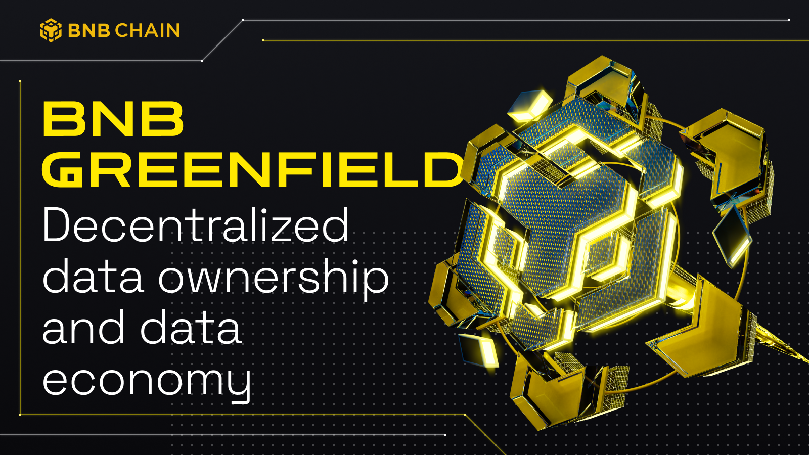

# Guide to BNB Greenfield

BNB Greenfield is a decentralized storage and blockchain storage solution platform that aims to revolutionize data ownership and the data economy.

## Getting Started

Dive into what is BNB Greenfield and start the journey with Greenfield.

- [An overview about BNB Greenfield](./introduction/introduction.md)
- [Get Started with detailed tutorial](./getting-started/wallet-configuration.md)

## Explore the Greenfield Blockchain

Get familiar with the Greenfield Blockchain and explore its main modules.

- [An overview about Greenfield Blockchain](./greenfield-blockchain/overview.md)
- [Explore modules in Greenfield Blockchain](https://github.com/bnb-chain/greenfield/blob/doc-refactor/docs/modules/storage-module.md)

## Explore the Storage Provider
- [An overview about Storage Provider](./storage-provider/introduction/index.md)

## Building Dapps on Greenfield

Start building dapps to create value based on the data assets and its related economy.
- [An overview about programmability on Greenfield](../tutorials/index.md)
- [Start building with SDK](../tutorials/core/access-control/quick-start.md)

## Help & Support 
Check out the Greenfield Developer community for technical support.

* [Discord](https://discord.com/invite/bnbchain)
* [Build N'Build Forum](https://forum.bnbchain.org/c/bnb-greenfield/)
* [GitHub](https://github.com/bnb-chain/greenfield)
