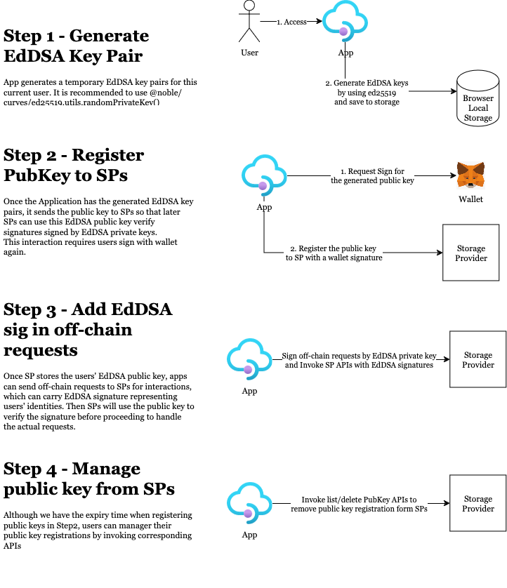

# Authenticator

The Authenticator module is responsible for validating users' authentication information and verifying their permissions in certain scenarios. 
For most requests sent to the SP gateway, they must successfully pass the authentication verification process.

We currently abstract SP as the GfSp framework, which provides users with customizable capabilities to meet their specific requirements. Authenticator module provides an abstract interface, which is called `Authenticator`, as follows:

```go
// Authenticator is an abstract interface to verify users authentication.
type Authenticator interface {
    Modular
    // VerifyAuthentication verifies the operator authentication.
    VerifyAuthentication(ctx context.Context, auth AuthOpType, account, bucket, object string) (bool, error)
    // GetAuthKeyV2 can check if the given account/domain/public_key was registered in this system.
    GetAuthKeyV2(ctx context.Context, account string, domain string, publicKey string) (*spdb.OffChainAuthKeyV2, error)
    // ListAuthKeysV2 can list user public keys
    ListAuthKeysV2(ctx context.Context, account string, domain string) ([]string, error)
    // DeleteAuthKeysV2 can delete user public keys
    DeleteAuthKeysV2(ctx context.Context, account string, domain string, publicKeys []string) (bool, error)
    // UpdateUserPublicKeyV2 registered the user public key once the dApp or client generates the EDDSA key pairs.
    UpdateUserPublicKeyV2(ctx context.Context, account string, domain string, publicKey string, expiryDate int64) (bool, error)
    // VerifyGNFD2EddsaSignature verifies the signature signed by user's EDDSA private key.
    VerifyGNFD2EddsaSignature(ctx context.Context, account string, domain string, publicKey string, offChainSig string, realMsgToSign []byte) (bool, error)
}

// AuthOpType defines the operator type used to authentication verification.
type AuthOpType int32

const (
    // AuthOpTypeUnKnown defines the default value of AuthOpType
    AuthOpTypeUnKnown AuthOpType = iota
    // AuthOpAskCreateBucketApproval defines the AskCreateBucketApproval operator
    AuthOpAskCreateBucketApproval
    // AuthOpAskMigrateBucketApproval defines the AskMigrateBucketApproval operator
    AuthOpAskMigrateBucketApproval
    // AuthOpAskCreateObjectApproval defines the AskCreateObjectApproval operator
    AuthOpAskCreateObjectApproval
    // AuthOpTypeGetChallengePieceInfo defines the GetChallengePieceInfo operator
    AuthOpTypeGetChallengePieceInfo
    // AuthOpTypePutObject defines the PutObject operator
    AuthOpTypePutObject
    // AuthOpTypeGetObject defines the GetObject operator
    AuthOpTypeGetObject
    // AuthOpTypeGetUploadingState defines the GetUploadingState operator
    AuthOpTypeGetUploadingState
    // AuthOpTypeGetBucketQuota defines the GetBucketQuota operator
    AuthOpTypeGetBucketQuota
    // AuthOpTypeListBucketReadRecord defines the ListBucketReadRecord operator
    AuthOpTypeListBucketReadRecord
    // AuthOpTypeGetRecoveryPiece defines the GetRecoveryPiece operator
    AuthOpTypeGetRecoveryPiece
    // AuthOpTypeQueryBucketMigrationProgress defines the QueryBucketMigrationProgress operator
    AuthOpTypeQueryBucketMigrationProgress
    // AuthOpTypeAgentPutObject defines the agent PutObject operator
    AuthOpTypeAgentPutObject
	// AuthOpTypeAgentUpdateObject the agent UpdateObject operator
    AuthOpTypeAgentUpdateObject
)
```

Authenticator interface inherits [Modular interface](./common/lifecycle_modular.md#modular-interface), so Authenticator module can be managed by lifecycle and resource manager.

You can overwrite `VerifyAuthentication` to implement your own authentication mode by different AuthOpType. This is the most basic authentication.

# Greenfield Storage Provider Off-Chain Authentication

## Abstract

This document outlines an off-chain authentication specification for greenfield storage providers (SPs) and clients. The specification includes a full functional workflow and a reference implementation, making it easy for any application integrating with greenfield SPs to build an off-chain authentication mechanism.

## Motivation

Applications based on the greenfield chain often need to interact with multiple greenfield SPs, which are off-chain services that require users to use Ethereum-compatible accounts to represent their identities.

For most interactions between applications and SPs, users' identities are required. Typically, applications can use message signing via account private keys to authenticate users, as long as they have access to their private keys. However, for browser-based applications, accessing the end users' private keys directly is not possible, making it necessary to prompt users to sign messages for each off-chain request between applications and SPs. This results in a poor user experience.

This document describes a workflow to address this problem.

## WorkFlow

### Overall workflow



### Step 1 - Generate EdDSA key pairs in Apps

Applications can design how to generate EdDSA key pairs themselves, and SPs do not have any restrictions on it.

Here is one example.

```js
import * as ed25519 from '@noble/curves/ed25519';

async function generateKeys() {
  const privateKey = ed25519.utils.randomPrivateKey(); // generate private key via crypto.getRandomValues
  const publicKey = ed25519.getPublicKey(privateKey); // get publick key from private key
  return { privateKey, publicKey };
}
```

### Step 2 - Register EdDSA public key in SPs

To register an account public key into a certain SP, you can invoke [SP API "update\_key"](../../../api/storage-provider-rest/update_key.md).

Here is an example. Suppose that

1. The **user account address** is `0x3d0a49B091ABF8940AD742c0139416cEB30CdEe0`
2. The **app domain** is `https://greenfield_app1.domain.com`
3. The **SP operator address** is `0x70d1983A9A76C8d5d80c4cC13A801dc570890819`
4. The **EdDSA\_public\_K** is `4db642fe6bc2ceda2e002feb8d78dfbcb2879d8fe28e84e02b7a940bc0440083`
5. The **expiry time** for this `EdDSA_public_K` is `2023-04-28T16:25:24Z`. The expiry time indicates the expiry time of this `EdDSA_public_K` , which should be a future time and within **7 days.**

The app will put above information into a text message:

```plain
https://greenfield_app1.domain.com wants you to sign in with your BNB Greenfield account:\n0x3d0a49B091ABF8940AD742c0139416cEB30CdEe0\n\nRegister your identity public key 4db642fe6bc2ceda2e002feb8d78dfbcb2879d8fe28e84e02b7a940bc0440083\n\nURI: https://greenfield_app1.domain.com\nVersion: 1\nChain ID: 5600\nIssued At: 2023-04-24T16:25:24Z\nExpiration Time: 2023-04-28T16:25:24Z
```

We denote this text message as `M`

and request user to sign and get the signature`S`:

<div align="left"></div>

Finally, the app invokes [SP API "update\_key"](../../../api/storage-provider-rest/update_key.md) by putting `S` into http Authorization header. The following is an example:

```plain
curl --location --request POST 'https://${SP_API_ADDRESS}/auth/update_key' \
--header 'Origin: https://greenfield_app1.domain.com' \
--header 'X-Gnfd-App-Domain: https://greenfield_app1.domain.com' \
--header 'x-Gnfd-User-Address: 0x3d0a49B091ABF8940AD742c0139416cEB30CdEe0' \
--header 'X-Gnfd-App-Reg-Public-Key: 4db642fe6bc2ceda2e002feb8d78dfbcb2879d8fe28e84e02b7a940bc0440083' \
--header 'X-Gnfd-Expiry-Timestamp: 2023-04-28T16:25:24Z' \
--header 'Authorization: GNFD1-ETH-PERSONAL_SIGN,SignedMsg=https://greenfield_app1.domain.com wants you to sign in with your BNB Greenfield account:\n0x3d0a49B091ABF8940AD742c0139416cEB30CdEe0\n\nRegister your identity public key 4db642fe6bc2ceda2e002feb8d78dfbcb2879d8fe28e84e02b7a940bc0440083\n\nURI: https://greenfield_app1.domain.com\nVersion: 1\nChain ID: 5600\nIssued At: 2023-04-24T16:25:24Z\nExpiration Time: 2023-04-28T16:25:24Z'
```

Once the response code returns 200, the user's public is successfully registered the given SP server and ready to use.

### Step 3 - Use EdDSA seed to sign request and verification

In Step1 & Step2, we generated EdDSA keys and registered them into SP. In Step3, we can use `EdDSA_private_K` to sign request when an app invokes a certain SP API.

To sign a request, the app needs to calculate the signedMsg before doing the actual signing.  
See [calculate the signedMsg](../../../api/storage-provider-rest/README.md#the-step-of-generating-authorization-header)

And the following is an example
```shell
Authorization = auth_type + "," + Signature
string-to-sign = crypto.Keccak256(canonical)
Signature = privateKey.EdDSA-Sign(string-to-sign)
Authorization: GNFD2-EDDSA, Signature=9dac5eeaca7fb65265528773e11819cb9980cd9be68eebe8a10dea643f265c8302887f014eb78c3249c05d1038e81f93b4253a298cd9edf18982345c394ba9fb
```
You can also refer to the sample code to generate the off-chain-auth signature (EdDSA)  at:  
[Sample Code to generate EdDSA Signaure For Greenfied GNFD2-EdDSA AuthType](https://github.com/bnb-chain/greenfield-go-sdk/blob/a21d3b5eb75a211266105ea78ad1c76fcdc87c4d/client/api_client.go#L675C2-L685C3)


For example, if a user clicks the "download" button in an app to download a private object they own, this will invoke the SP getObject API. 
The `EdDSA_M` could be defined as `Invoke_GetObject_1682407345000`, and the `EdDSA_S` would be `a48fff140b148369a108611502acff919720b5493aa36ba0886d8d73634ee20404963b847104d06aa822cf904741aff70ede4ba7d70fa8808c3206d4c93be623`.

To combine `EdDSA_M` and `EdDSA_S`, the app should include them in the Authorization header when invoking the GetObject API:

```plain
curl --location 'https://${SP_API_ADDRESS}/${bucket_name}/${object_name}' \
--header 'authorization: GNFD2-EDDSA,Signature=a48fff140b148369a108611502acff919720b5493aa36ba0886d8d73634ee20404963b847104d06aa822cf904741aff70ede4ba7d70fa8808c3206d4c93be623' \
--header 'X-Gnfd-User-Address: 0x3d0a49B091ABF8940AD742c0139416cEB30CdEe0' \
--header 'X-Gnfd-App-Domain: https://greenfield_app1.domain.com' 
--header 'X-Gnfd-App-Reg-Public-Key: e0d61609201e9cece55e8999a40a74f5119003b1d49fad32882fa50547c4bf90' 
```

By including the signed message and signature in the Authorization header, the app can authenticate the request with the SP servers. The SP servers can then verify the signature using the EdDSA_public_K registered in Step 2.

### Step 4 - Manage EdDSA key pairs

Although we defined an expiry date for registered `EdDSA_public_K`, users might want to know how many EdDSA keys they are currently using and might want to delete them for security concerns.

To list a user's registered EdDSA account public keys in an SP, apps can invoke [SP API "list\_key"](../../../api/storage-provider-rest/list_key.md).
To delete a user's registered EdDSA account public key in an SP, apps can invoke  [SP API "delete\_key"](../../../api/storage-provider-rest/delete_key.md)

### Auth API Specification

See [SP Auth Rest API Doc](../../../api/storage-provider-rest/README.md)

