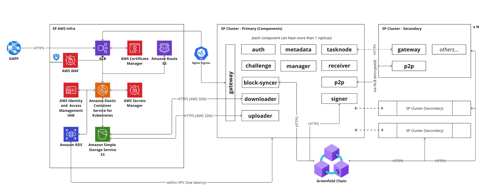

Greenfield Storage Provider Deployment Guide
============================================

Supported Cloud Providers

-------------------------
We currently support only deployment to AWS (EKS). Other cloud providers (e.g. Alicloud, GCP)
are in our pipeline and will be supported in the future.

Quick Start
-----------

For details about what is "storage provider" on application level, please see
https://docs.bnbchain.org/greenfield-docs/docs/guide/storage-provider/introduction/overview. This document focuses on AWS infra
and Kubernetes deployment level.

## Pre-requisites (we assume you already have the following infrastructure)

1. AWS account
2. AWS EKS available
3. K8S kustomize client
4. For monitoring (optional):
     1. Victoria Metrics
     2. Grafana dashboard
     3. Alert channels

## High Level Architecture

## Steps

1. [Create AWS resources](../infra-deployment/aws/aws-resources.md)
2. [Create K8S resources](../infra-deployment/k8s/k8s.md)
3. [Set up monitoring dashboard](../infra-deployment/grafana/grafana.md)
