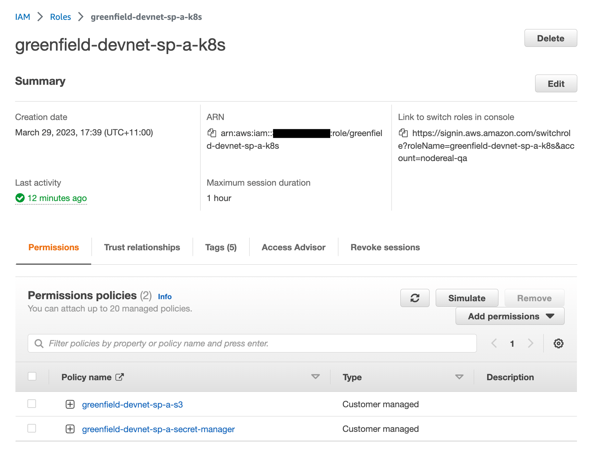
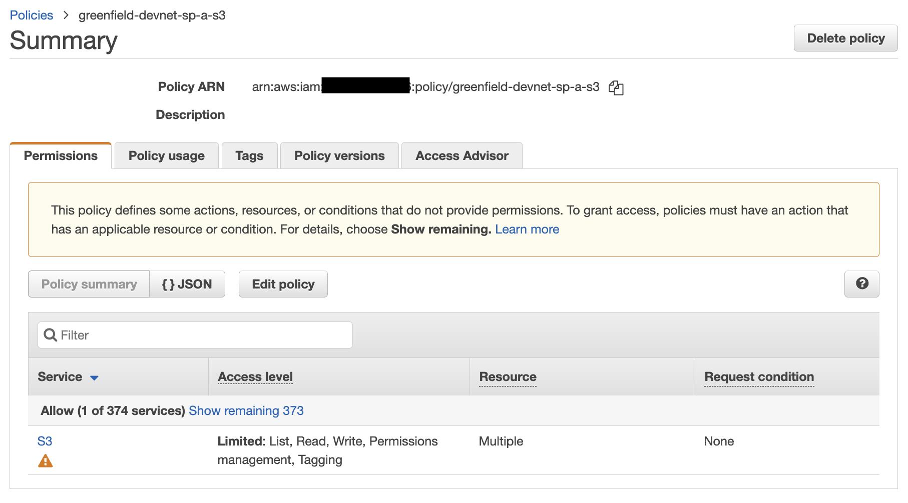
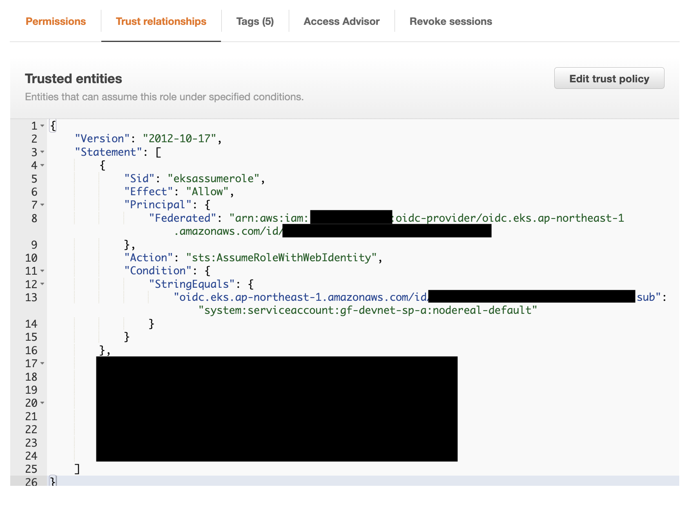
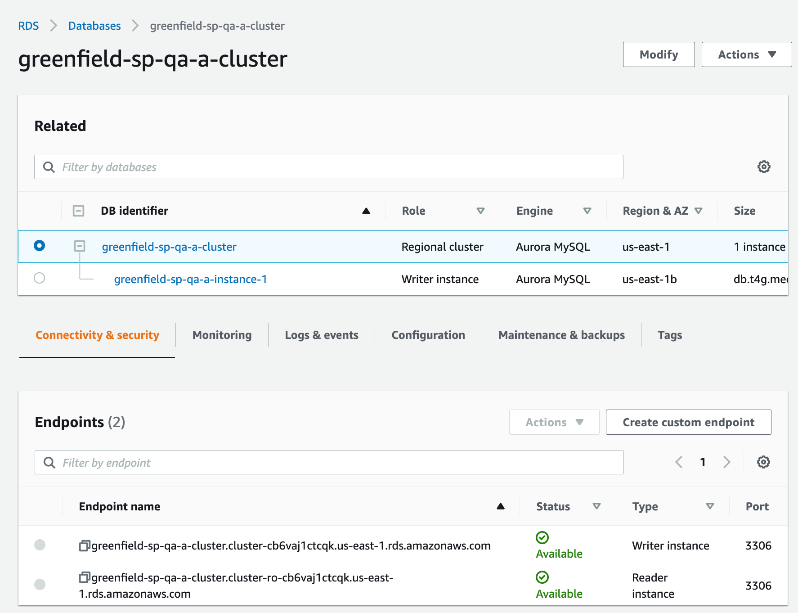
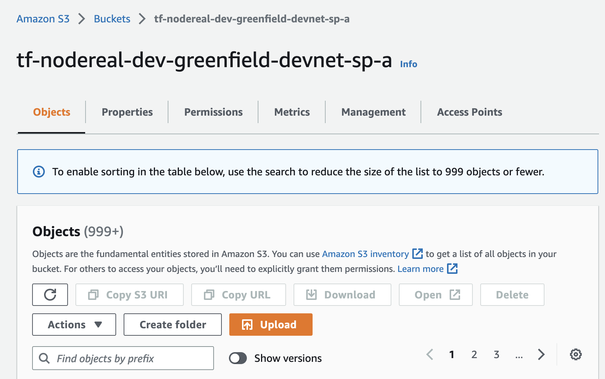
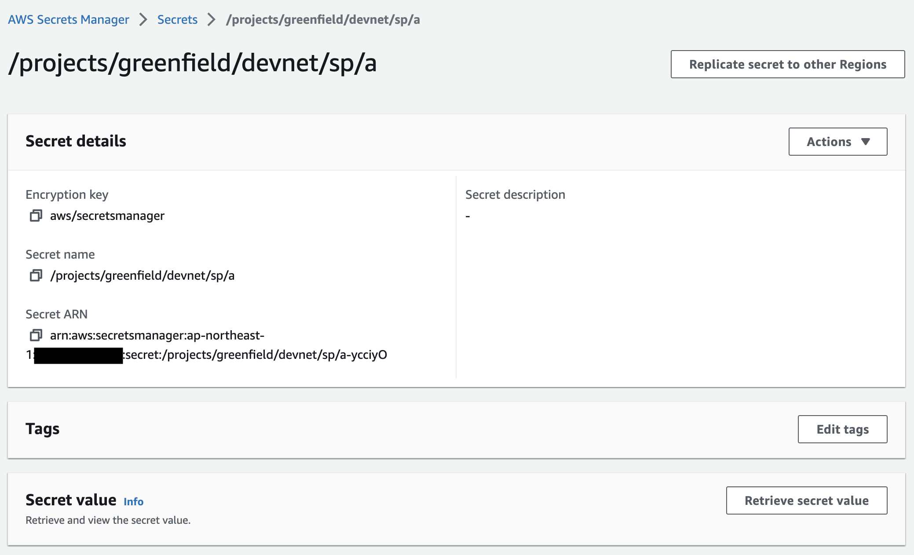

AWS Resources
=============

IAM role
--------

* Create a new role which will be used by SP K8S application.


* Add S3 permission policy - This is where SP stores its user uploaded content.


* Add Secret Manager permission policy - K8S will retrieve secret from here as app parameters


* Bind K8S service account to this IAM role


Database (RDS)
--------------

* Create RDS database and jot down the connection string, username and password.

after RDS created, need to init DB by creating databse:

1. db storage_provider_db
2. db block_syncer
3. db block_syncer_backup

S3 Bucket
---------

* Create S3 bucket


Secret Manager
--------------

* Create secret and update secret value (example provided below)


* Update secret value

```json
{
    "SP_DB_USER":"xxx",
    "SP_DB_PASSWORD":"xxx",
    "SP_DB_ADDRESS":"xxx:3306",
    "SP_DB_DATABASE":"storage_provider_db",
    "BLOCK_SYNCER_DSN":"user:pw@tcp(xxx:3306)/block_syncer?parseTime=true&multiStatements=true&loc=Local",
    "BS_DB_USER":"xxx",
    "BS_DB_PASSWORD":"xxx",
    "BS_DB_ADDRESS":"xxx:3306",
    "BS_DB_DATABASE":"block_syncer",
    "SIGNER_OPERATOR_PRIV_KEY":"",
    "SIGNER_FUNDING_PRIV_KEY":"",
    "SIGNER_APPROVAL_PRIV_KEY":"",
    "SIGNER_SEAL_PRIV_KEY":"",
    "BUCKET_URL":"xxx",
    "P2P_PRIVATE_KEY":"xxx",
    "SIGNER_GC_PRIV_KEY":"xxx",
    "BS_DB_SWITCHED_USER":"xxx",
    "BS_DB_SWITCHED_PASSWORD":"xxx",
    "BS_DB_SWITCHED_ADDRESS":"xxx:3306",
    "BS_DB_SWITCHED_DATABASE":"block_syncer_backup",
    "BLOCK_SYNCER_DSN_SWITCHED":"user:pw@tcp(xxx:3306)/block_syncer_backup?parseTime=true&multiStatements=true&loc=Local"
}
```
