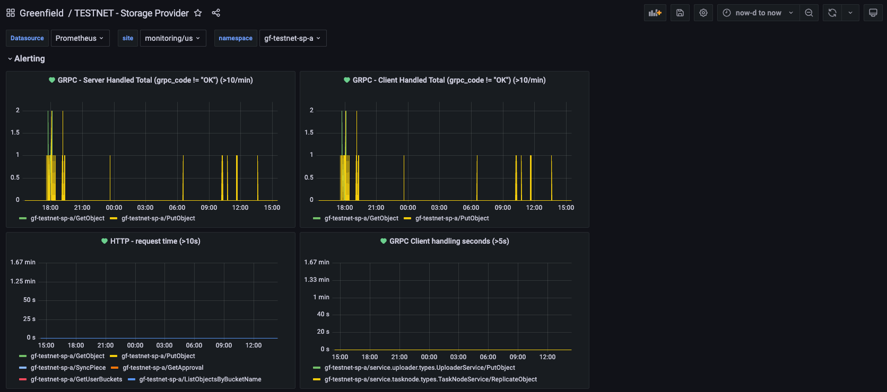
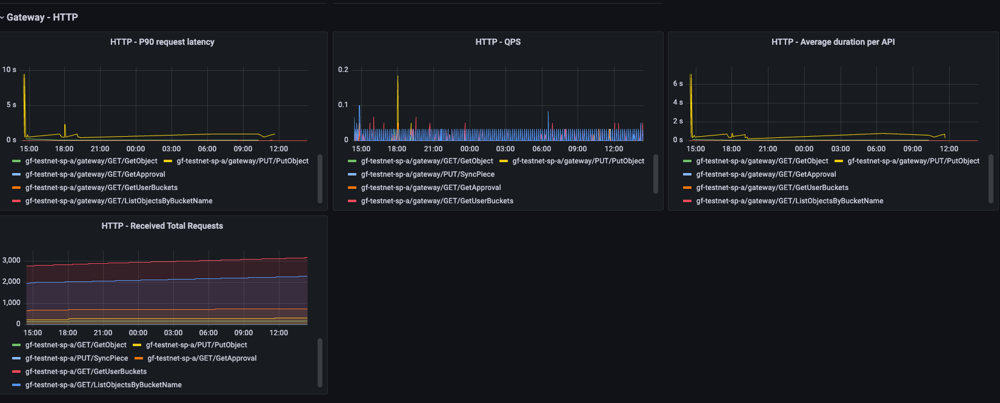
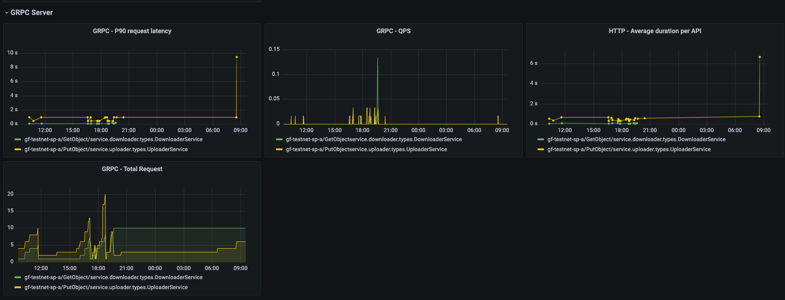
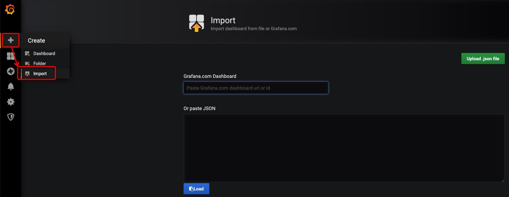

# Grafana-storage-provider-dashboards

## Description

A [Grafana](https://grafana.com/) Dashboard for [Greenfield-Storage-Provider](https://github.com/bnb-chain/greenfield-storage-provider) project.

## Preview

## How To

We assume that you already have [Grafana](https://grafana.com/) and [Prometheus](https://prometheus.io/) installed.

## Import Grafana Dashboard

Copy and paste the Grafana Dashboard ID(coming soon...) `xxxxx` OR content of [storage-provider.json](dashboards/storage-provider.json), click on `Load` to complete importing.

## Related Projects

- [Greenfield](https://greenfield.bnbchain.org/docs/guide/): official documentation site
- [Greenfield-Storage-Provider](https://github.com/bnb-chain/greenfield-storage-provider): the storage service infrastructures
