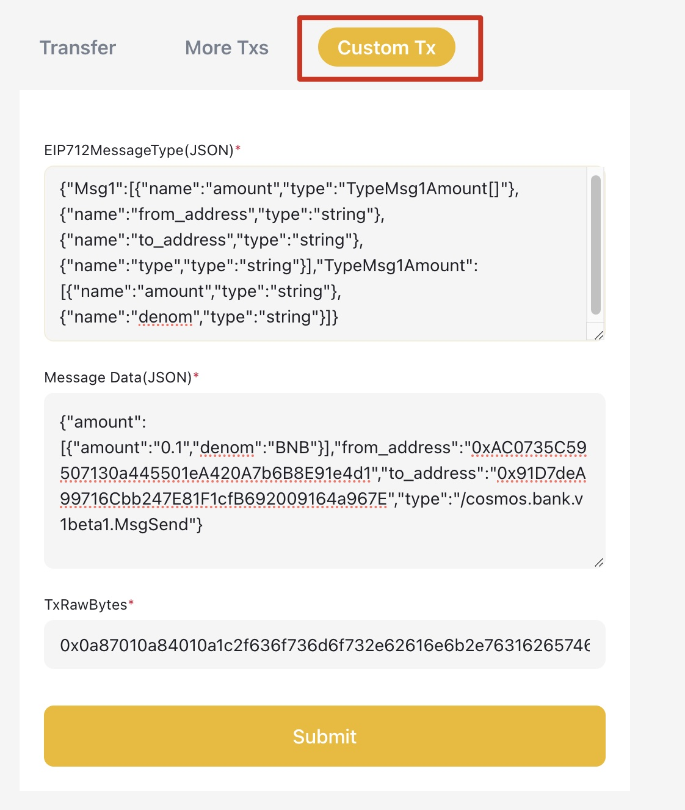

This guide will help you join SP Network: Mainnet and Testnet.

- [Prerequisite for Becoming a Mainnet SP](#prerequisite-for-becoming-a-mainnet-sp)
- [How to Join SP Network?](#how-to-join-sp-network)
  - [1. Submit Proposal](#1-submit-proposal)
    - [Hot Wallet Manual](#hot-wallet-manual)
    - [Hardware Wallet Manual](#hardware-wallet-manual)
    - [Understanding the Parameters](#understanding-the-parameters)
  - [2. Deposit BNB to Proposal](#2-deposit-bnb-to-proposal)
  - [3. Wait Voting and Check Voting Result](#3-wait-voting-and-check-voting-result)
  - [4. Activate SP](#4-activate-sp)
    - [Storage Provider Standard Test](#storage-provider-standard-test)
    - [Update SP status](#update-sp-status)
  - [5. SP address deposit](#5-sp-address-deposit)
    - [Funding Address](#funding-address)
    - [Operator Address](#operator-address)
- [Storage Provider Operations](#storage-provider-operations)
  - [EditStorageProvider](#editstorageprovider)
  - [Update SP Price](#update-sp-price)
  - [Update SP Quota](#update-sp-quota)
  - [Recover SP Objects](#recover-sp-objects)
  - [Claim SP Income](#claim-sp-income)
    - [To query the income of a primary sp](#to-query-the-income-of-a-primary-sp)
    - [To query the income of a secondary sp](#to-query-the-income-of-a-secondary-sp)
- [Tools](#tools)
- [Trouble Shooting](#trouble-shooting)

## Prerequisite for Becoming a Mainnet SP
To ensure the stable provision of data services, Storage Providers must meet specific criteria to join the mainnet.
- The SP must join the testnet for a minimum of one month.
- The SP must store over 1K files across more than 100 buckets on the testnet.
- There were no slash event on the SP in the past week.

## How to Join SP Network?

Greenfield Blockchain validators are responsible for selecting storage providers. For each on-chain proposal to add new storage provider, there are deposit period for depositing BNB and voting period for validators to make votes. Once the proposal passes, new SP can join the network afterwards.

You can query the governance parameters [here](https://github.com/bnb-chain/greenfield/blob/master/docs/greenfield-api/gov-v-1-params.api.mdx).

### 1. Submit Proposal

The SP needs to initiate an on-chain proposal that specifies the Msg information to be automatically executed after the vote is approved. In this case, the Msg is `MsgCreateStorageProvider`. It's worth noting that the deposit tokens needs to be greater than the minimum deposit tokens specified on the chain.

=== "Mainnet"

    ```
    rpcAddr = "https://greenfield-chain.bnbchain.org:443"
    chainId = "greenfield_1017-1"
    ```

=== "Testnet"

    ```
    rpcAddr = "https://gnfd-testnet-fullnode-tendermint-us.bnbchain.org:443"
    chainId = "greenfield_5600-1"
    ```


#### Hot Wallet Manual

You can use the `gnfd` command to directly send the transaction for creating a storage provider. To do this,  please
import the private key of the funding account into the Keystore.

However, it is not safe to use a hot wallet for Mainnet. Instead, you should refer to the [Hardware Wallet Manual](#hardware-wallet-manual)
for instructions on using a hardware wallet.

Command for creating storage provider:
```shell
./build/bin/gnfd tx sp create-storage-provider ./create_storage_provider.json --from {funding_address} --node ${rpcAddr} --chain-id ${chainId} --keyring-backend os
```

The content for create_storage_provider.json, modify it with the correct values as you need:
```shell
cat ./create_storage_provider.json
{
  "messages":[
  {
    "@type":"/greenfield.sp.MsgCreateStorageProvider",
    "description":{
      "moniker":"{moniker}",
      "identity":"{identity}",
      "website":"{website}",
      "security_contact":"{security_contract}",
      "details":"{details}"
    },
    "sp_address":"{operator_address}",
    "funding_address":"{funding_address}",
    "seal_address":"{seal_address}",
    "approval_address":"{approval_address}",
    "gc_address":"{gc_address}",
    "maintenance_address":"{maintenance__address}",
    "endpoint":"https://{your_endpoint}",
    "deposit":{
      "denom":"BNB",
      # Mainnet: 500000000000000000000, Testnet: 1000000000000000000000
      "amount":"500000000000000000000"
    },
    "read_price":"0.1469890427",
    "store_price":"0.02183945725",
    "free_read_quota": 1073741824,
    "creator":"0x7b5Fe22B5446f7C62Ea27B8BD71CeF94e03f3dF2",
    "bls_key":"{bls_pub_key}",
    "bls_proof":"{bls_proof}"
  }
],
  "metadata":"4pIMOgIGx1vZGU=",
  "title":"Create <name> Storage Provider",
  "summary":"create <name> Storage Provider",
  "deposit":"1000000000000000000BNB"
}
```

#### Hardware Wallet Manual

The gnfd command is not available for connecting with the hardware wallet, so you should use the [gnfd-tx-sender](https://gnfd-tx-sender.nodereal.io/) to send transactions. Here are the steps:

1. Generate the transaction data.
```shell
./build/bin/gnfd tx sp create-storage-provider ./create_storage_provider.json --from {funding_address} --print-eip712-msg-type
```
2. Visit the [gnfd-tx-sender](https://gnfd-tx-sender.nodereal.io/) website.
3. Add your hardware wallet into Metamask, and connect the wallet.
4. Navigate to the `Custom Tx` page and fill in the generated transaction data in step1.
5. Click the `Submit` button to send the transaction.



#### Understanding the Parameters

!!! note
    You can get the gov module address by this command
    
    ```shell
    curl -X GET "https://greenfield-chain-us.bnbchain.org/cosmos/auth/v1beta1/module_accounts/gov" -H  "accept: application/json"
    ```

- `endpoint` is URL of your gateway
- `read_price` and `store_price` unit is `wei/bytes/s`
- `free_read_quota` unit is *Bytes*
- `creator` is the address of `gov module`
- `metadata` is optional

### 2. Deposit BNB to Proposal

!!! note
    You can get the mininum deposit for proposal by the above command. Please make sure that the initial deposit is greater than `min_deposit` when submitting the proposal.
    
    ```shell
    curl -X GET "https://greenfield-chain-us.bnbchain.org/cosmos/gov/v1/params/deposit" -H  "accept: application/json"
    ```

You can skip this step if the initial deposit amount is greater than the min deposit required by the proposal.

Each proposal needs to deposit enough tokens to enter the voting phase.

```shell
./build/bin/gnfd tx gov deposit ${proposal_id} 1BNB --from ${funding_address} --keyring-backend os --node ${rpcAddr} --chain-id ${chainId}
```

### 3. Wait Voting and Check Voting Result

After submitting the proposal successfully, you must wait for the voting to be completed and the proposal to be approved.
It will last **7 days** on Mainnet while **1 day** on Testnet. Once it has passed and is executed successfully, you can
verify that the storage provider has been joined.

!!! warning
    Please ensure that the storage provider service is running before it has been joined.

You can check the on-chain SP information to confirm whether the SP has been successfully created.

```shell
./build/bin/gnfd query sp storage-providers --node ${rpcAddr}
```

Alternatively, you can check the proposal to know about its execution status.

```shell
./build/bin/gnfd query gov proposal ${proposal_id} --node ${rpcAddr}
```

### 4. Activate SP

#### Storage Provider Standard Test

After the proposal has passed, the status of SP is `STATUS_IN_MAINTENANCE`. To prevent being slashed due to functional
abnormalities, you should first perform a full functional test using the maintenance account.
You can refer to the [SP standard test](https://github.com/bnb-chain/greenfield-sp-standard-test).

#### Update SP status

Once the testing is completed, you need to send a tx to activate the SP to `STATUS_IN_SERVICE`.

```shell
gnfd tx sp update-status [sp-address] STATUS_IN_SERVICE [flags]
```

Refer to [Maintenance Mode](../../core-concept/storage-provider-lifecycle.md#in-maintenance) for more details.

### 5. SP address deposit

#### Funding Address
As a new SP, you need deposit a minimum amount of BNB into the funding address.
Please note the initial deposit requirement varies on different environments.
You can check the `sp.params.min_deposit` value (in wei BNB) from genesis endpoint response of Greenfield testnet/mainnet.
By the time when this doc is written,
- According to https://gnfd-testnet-fullnode-tendermint-us.bnbchain.org/genesis, SP in testnet requires minimum **1000BNB** deposited in funding address.
- According to https://greenfield-chain.bnbchain.org/genesis, SP in mainnet requires minimum **500BNB** deposited in funding address.

In addition, to join the network in [Step 2](#2-deposit-bnb-to-proposal), an SP must initiate a proposal using a funding address and stake 1 BNB to enter the voting phase.
After the voting concludes, the 1 BNB will be refunded to the original account.
Therefore, it is advisable for the Funding Address to reserve an additional >1 BNB to cover these costs.

#### Operator Address
SP operator address will be used to send "Create Global Virtual Group", "Edit Storage Provider", "Update Storage Provider Status" and other txs to greenfield chain.
So it requires some BNB deposited for transaction fee as well.
We recommend SP operator address can hold at least **0.1** BNB but not necessarily as much as possible.

## Storage Provider Operations

### EditStorageProvider

This command is used to edit the information of the SP, including endpoint, description, etc.

Usage:
```shell
gnfd tx sp edit-storage-provider [sp-address] [flags]
```

For example, edit the endpoint:
```shell
./build/bin/gnfd tx sp edit-storage-provider ${operator_address} --endpoint ${new_endpoint} --from ${operator_address} --keyring-backend os --node ${rpcAddr} --chain-id ${chainId}
```

### Update SP Price

Update the storage provider read, store price and free read quota, if there is no change to a specific value, the current value should also be provided.

The unit of price is a decimal, which indicates wei BNB per byte per second.
E.g. the price is 0.02183945725, means approximately $0.018 / GB / Month.
`(0.02183945725 * (30 * 86400) * (1024 * 1024 * 1024) * 300 / 10 ** 18 ≈ 0.018, assume the BNB price is 300 USD)`

The free-read-quota unit is bytes, for 1GB free quota, it should be 1073741824.

Usage:
```shell
gnfd tx sp update-price [sp-address] [read-price] [store-price] [free-read-quota] [flags]
```

Example:
```shell
./build/bin/gnfd tx sp update-price ${operator_address} 0.1469890427 0.02183945725 1073741824 --from ${operator_address} --keyring-backend os ---node ${rpcAddr} --chain-id ${chainId}
```

### Update SP Quota

Besides the above `update-price` command, you can also use the `gnfd-sp` command to update the free read quota for SP.
The update.quota command is used to update the free quota of the SP, it will send a transaction to the blockchain to update
the free read quota, but keep the storage price and read price unchanged.

Usage:
```shell
gnfd-sp update.quota [command options] [arguments...]
```

Example:
```shell
./build/bin/gnfd-sp update.quota --quota 1073741824 --config ./config.toml
```

### Recover SP Objects

Besides the above commands, you can also use the `gnfd-sp` command to recover objects for SP,
whether it is the primary or secondary sp of the object.
The recover.object command is used to recover an object or objects of the SP, it will send a request
to other SPs to get replicate of the object(s) you want to recover.

Usage:
```shell
gnfd-sp recover.object [command options] [arguments...]
```

Example:
```shell
./build/bin/gnfd-sp recover.object --config ./config.toml -b bucket_name -o single_object_name
./build/bin/gnfd-sp recover.object --config ./config.toml -b bucket_name -l object_name1//_object_name2//object_name3
```

### Claim SP Income

To claim income, a storage provider can use `settle` cmd to settle income in global virtual group families or global
virtual groups. To find the global virtual group families or global virtual groups to settle, a storage provider can
use `query.primary.sp.income` or `query.secondary.sp.income` of `gnfd-sp` commands.

#### To query the income of a primary sp
Usage:
```shell
# query sp's income in global virtual group families
gnfd-sp query.primary.sp.income --config config.toml --sp.id ${sp_id}
```

An example of response will look like:

```js
querying primary sp income details for sp  1
query timestamp 1698830787 2023-11-01 17:26:27 +0800 CST
query results: [{"vgf_id":2,"stream_record":{"account":"primary_sp_virtual_payment_account_address_1","crud_timestamp":1698631653,"netflow_rate":"4643666191","static_balance":"1093710972008743","buffer_balance":"0","lock_balance":"0","frozen_netflow_rate":"0"},"income":"2018422795287337"},{"vgf_id":13,"stream_record":{"account":"primary_sp_virtual_payment_account_address_2","crud_timestamp":1698745565,"netflow_rate":"5452639431","static_balance":"38607334626064242","buffer_balance":"0","lock_balance":"0","frozen_netflow_rate":"0"},"income":"39072019463652924"},{"vgf_id":15,"stream_record":{"account":"primary_sp_virtual_payment_account_address_3","crud_timestamp":1698573876,"netflow_rate":"1925652979","static_balance":"55285141693450020","buffer_balance":"0","lock_balance":"0","frozen_netflow_rate":"0"},"income":"55779863125937889"},{"vgf_id":23,"stream_record":{"account":"primary_sp_virtual_payment_account_address_4","crud_timestamp":1698745588,"netflow_rate":"5063874897","static_balance":"2339430126330703","buffer_balance":"0","lock_balance":"0","frozen_netflow_rate":"0"},"income":"2770867203680206"},{"vgf_id":246,"stream_record":{"account":"primary_sp_virtual_payment_account_address_5","crud_timestamp":1698667216,"netflow_rate":"59568181","static_balance":"19326420423320","buffer_balance":"0","lock_balance":"0","frozen_netflow_rate":"0"},"income":"29070047357671"}]
```

The unit of the unsettled income is **wei BNB**.  The first element in above query result array means the sp 1 gets **2018422795287337** **wei BNB** in vgf_id 2.

#### To query the income of a secondary sp

```shell
# query sp's income in global virtual groups
gnfd-sp query.secondary.sp.income --config config.toml --sp.id ${sp_id}
```

An exmaple of response will look like:
```js
querying secondary sp income details for sp  1
query timestamp 1698830440 2023-11-01 17:20:40 +0800 CST
query results: [{"gvg_id":2531,"stream_record":{"account":"secondary_sp_virtual_payment_account_address_1","crud_timestamp":1695347375,"netflow_rate":"22256589564","static_balance":"917684637479280","buffer_balance":"0","lock_balance":"0","frozen_netflow_rate":"0"},"income":"13073138794535490"},{"gvg_id":8,"stream_record":{"account":"secondary_sp_virtual_payment_account_address_2","crud_timestamp":1696735440,"netflow_rate":"6698761332","static_balance":"24312367733445348","buffer_balance":"0","lock_balance":"0","frozen_netflow_rate":"0"},"income":"6391045453997558"},{"gvg_id":11,"stream_record":{"account":"secondary_sp_virtual_payment_account_address_3","crud_timestamp":1696072153,"netflow_rate":"6832159830","static_balance":"15803326565544654","buffer_balance":"0","lock_balance":"0","frozen_netflow_rate":"0"},"income":"5774730701092644"}
    ...
]
```
The unit of the unsettled income is **wei BNB**.  The first element in above query result array means the sp 1 gets **13073138794535490** **wei BNB** in gvg_id 2531.


```shell
# settle income in global virtual group family or global virtual groups
gnfd tx virtualgroup settle [global-virtual-group-family-id] [global-virtual-group-ids] [flags]
```

Example:
```shell
# query sp's income in global virtual group families
gnfd-sp query.primary.sp.income --config config.toml --sp.id 1
```
```shell
# query sp's income in global virtual groups
gnfd-sp query.secondary.sp.income --config config.toml --sp.id 2
```
```shell
# settle income in global virtual group family with id 100
gnfd tx virtualgroup settle 100 0 [flags]

# settle income in global virtual groups with id 2 or 3 or 4
gnfd tx virtualgroup settle 0 2,3,4 [flags]
```

## Tools

SP can use Greenfield Cmd or DCellar to verify its functions:

- Greenfield Cmd: Get more details from the [repo](https://github.com/bnb-chain/greenfield-cmd).
- DCellar: [Mainnet](https://dcellar.io/), [Testnet](https://testnet.dcellar.io).

## Trouble Shooting

If you meet issues, please refer to [SP common issues](./common-issues.md).
