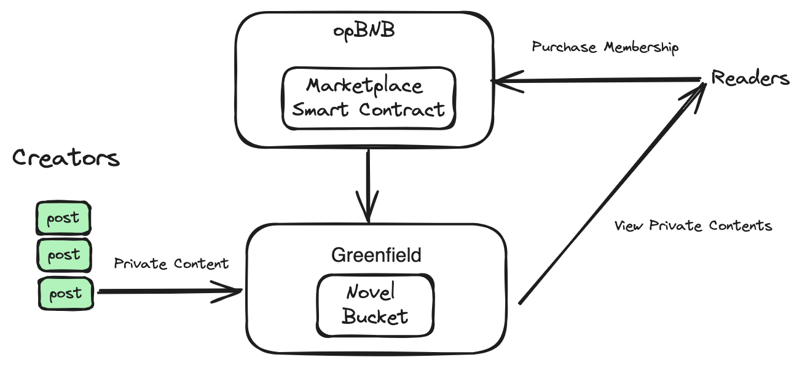
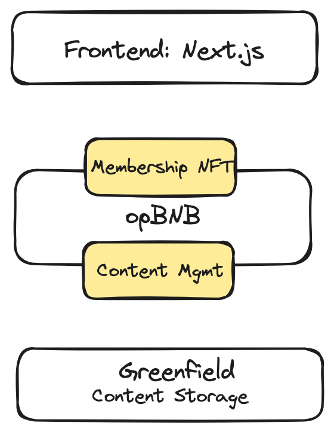

# Introduction

Decentralized social networks or **DeSoc**, unlike their centralized counterparts, function on blockchain-based platforms and empower users by enabling them to exchange information and create and distribute content to audiences. 

## What you will learn

In this tutorial, we'll provide a step-by-step guide on how to develop a **DeSoc** dApp on BNBChain. The demo shows how writers can upload chapters of their novels, interact with their readership, and monetize their work in a secure and transparent environment.



### Solution architecture

- **Decentralized Publishing**: Authors can directly upload their novels without the need for traditional publishing intermediaries, ensuring full control over their content and copyrights.
- **Customized Access**: The access control feature of **BNB Greenfield** ensures full control over their content and copyrights. Authors can design different reader groups for different content. This feature encourages readership growth.
- **Tokenized Chapters**: By leveraging the smart contract on opBNB, membership to reader groups is tokenized and listed for sale. Readers can purchase access to exclusive content using cryptocurrency.

## Build a Fully On-chain DeSoc App

### Content Creators User Journey

1. Writers sign up, create a profile, and upload their work immediately. Each creator will create a separate bucket for storing 
2. The platform provides tools for formatting, membership management, and tokenization. 
3. Authors can track their sales, interact with readers, and withdraw their earnings directly to their cryptocurrency wallets.

### Readers User Journey

1. **Discover novels/writers:** Utilize platform tools to find and follow writers based on interests or trending topics.
2. **Subscription**: Pay tokens to purchase membership NFT, enabling access to exclusive content and interactions.
3. **Access Exclusive Content**: View unique insights and posts.

## Tech Implementations



The DeSoc dApp is composed of three main parts. 

- **Smart Contracts deployed on opBN**B: NovelChain employs smart contracts to manage membership, ensuring authors receive their earnings instantly and transparently with each sale. Readers can purchase membership access to view chapters of a novel.
- **Frontend pages**: Authors can directly upload their novels without the need for traditional publishing intermediaries. Readers can view the exclusive content after becoming a member. 
- **Content Storage**: Greenfield is a decentralized storage solution. Writers have full control over their content and copyrights.

### Smart contract development

#### Preparation

Environment Setup

- git
- yarn
- [Foundry](https://book.getfoundry.sh/reference/forge/forge-install)
- Greenfield [CMD](https://github.com/bnb-chain/greenfield-cmd)

- Testnet account with tBNB

#### Download and install smart contract

To start a new project with Foundry, use [forge init](https://book.getfoundry.sh/reference/forge/forge-init.html):

```shell

$ forge init hello_foundry

```

This creates a new directory hello_foundry from the default template. This also initializes a new git repository.

```shell

// install dependencies

forge install bnb-chain/greenfield-contracts@v1.2.0 --no-commit

forge install bnb-chain/greenfield-contracts-sdk@v1.1.0 --no-commit

forge install OpenZeppelin/openzeppelin-contracts --no-commit

forge install OpenZeppelin/openzeppelin-contracts-upgradeable --no-commit

```

#### Import the desired contracts

In `novel.sol`, add the following imports

```javascript

pragma solidity ^0.8.0;

import "@bnb-chain/greenfield-contracts/contracts/interface/IERC721NonTransferable.sol";

import "@bnb-chain/greenfield-contracts/contracts/interface/IERC1155NonTransferable.sol";

import "@bnb-chain/greenfield-contracts/contracts/interface/IGnfdAccessControl.sol";

import "@bnb-chain/greenfield-contracts-sdk/GroupApp.sol";

import "@openzeppelin/contracts/access/AccessControl.sol";

import "@openzeppelin/contracts/security/ReentrancyGuard.sol";

import "@openzeppelin/contracts-upgradeable/utils/structs/EnumerableMapUpgradeable.sol";

import "@openzeppelin/contracts-upgradeable/utils/structs/DoubleEndedQueueUpgradeable.sol";

```

#### Override functions

Define and override the `greenfieldCall`, `retryPackage` and `skipPackage` functions if your dApp needs callback. You can route calls with the help of the internal method:

```javascript
  function greenfieldCall(

   uint32 status,

   uint8 resourceType,

   uint8 operationType,

   uint256 resourceId,

   bytes calldata callbackData

  ) external override(GroupApp) {

   require(msg.sender == _GROUP_HUB, "Novel: invalid caller");

   if (resourceType == RESOURCE_GROUP) {

     _groupGreenfieldCall(status, operationType, resourceId, callbackData);

   } else {

     revert("Novel: invalid resource type");

   }

  }
```

#### Define the main functions

Next you need to define the main functional parts of the app. You can send cross-chain request to system contracts with the help of internal functions like below:

```javascript
function listChapter(uint256 novelGroupId, uint256 chapterGroupId, uint256 price) public onlyNovelExist(novelGroupId) onlyGroupOwner(chapterGroupId) {

   // the owner need to approve the Novel contract to update the group

   require(IGnfdAccessControl(_GROUP_HUB).hasRole(ROLE_UPDATE, msg.sender, address(this)), "Novel: no grant");

   require(prices[chapterGroupId] == 0, "Novel: already listed");

   require(price > 0, "Novel: invalid price");

   novels[novelGroupId].chapterGroupIds.push(chapterGroupId);

   prices[chapterGroupId] = price;

   emit List(msg.sender, novelGroupId, chapterGroupId, price);

  }
```

Define other view functions, internal functions and access control system according to your own needs.

### Smart Contract Deployment

- Setup Environment Variables

```shell

cp .env.example .env

```

Setup your own `OP_PRIVATE_KEY` and `OWNER_PRIVATE_KEY` .

The OP_PRIVATE_KEY is the account that's responsible for deploying the contract and the OWNER_PRIVATE_KEY is the contract's owner. For convenience, you can use a same account.

- Install

```shell

git clone --recurse-submodules https://github.com/bnb-chain/novel-contract.git && cd novel-contract

yarn

forge install

```

- Deploy

```shell

forge script ./script/1-deploy.s.sol --rpc-url ${RPC_TESTNET} --legacy --broadcast --private-key ${OP_PRIVATE_KEY}
```

### Frontend Deployment

1. Download repository from [here](https://github.com/bnb-chain/greenfield-js-sdk/tree/main/examples/browser-file-management)

2. install dependencies
```
pnpm install
```
3. Build packages:
```
pnpm build
```
4. Run the demo application
```
npm run dev
```


## Demo In Action

### Create Novel

Once you have deployed the smart contract, writers can execute the following commands to create contents.

- Create and Mirror Group
```shell
// create a group and get the id from the output

./build/gnfd-cmd --config ${CONFIG_PATH} group create gnfd://${GROUP_NAME}

// grant permission to the group

./build/gnfd-cmd --config ${CONFIG_PATH} policy put --groupId ${GROUP_ID} --actions get grn:o::${YOUR_BUCKET_NAME}/${YOUR_OBJECT_NAME}

// mirror the group to opBNB testnet

./build/gnfd-cmd --config ${CONFIG_PATH} group mirror --id ${GROUP_ID} --destChainId 5611
```

- Allow writers to create novels where subscribers can receive messages without direct interaction
```shell
// use the same account that create bucket and object on greenfield

cast send ${proxyNovel}

"createNovel(uint256,string)" <group id of the novel> "Novel Name"

--rpc-url ${RPC_TESTNET}

--from ${ACCOUNT_AUTHOR}

--private-key ${PK_AUTHOR}
```
- List contents on opBNB

* use the same account that create bucket and object on greenfield

* list a chapter with price 1BNB

```shell
cast send ${proxyNovel}

"listChapter(uint256,uint256,uint256)" <group id of novel> <group id of chapter> 1000000000000000000

--rpc-url ${RPC_TESTNET}

--from ${ACCOUNT_AUTHOR}

--private-key ${PK_AUTHOR}
```

### Pay to view chapters

Readers can execute the following commands: call the smart contract to become a member of a group by paying tokens.

- Readers pay to view chapters of a book

```shell
// subscribe from the buyer account

cast send ${proxyNovel}

"buy(address,uint8)()" ${ACCOUNT_AUTHOR} <group id of chapter>

--value ${PRICE}+${RELAYER_FEE}

--rpc-url ${RPC_TESTNET}

--from ${ACCOUNT_BUYER}

--private-key ${PK_BUYER}
```

- Use Callback function to make sure the cross-chain tx is successful. Example on testnet can be found [here](https://testnet.bscscan.com/address/0x843e77D639b6C382e91ef489881963209cB238E5#nfttransfers). You can see that ERC1155 NFT is minted and transferred to subscriber. 


You can find the full implementation [here](https://github.com/bnb-chain/novel-contract).

## Closing Thoughts

In this tutorial, we discussed the numerous advantages of DeSoc applications on BNBChain and provided a step-by-step guide on how to develop a dApp similar to Pareon on opBNB and Greenfield. By leveraging the opBNB's high-speed and low-cost transaction processing capabilities, developers can create robust and scalable DeSoc applications that can handle a large number of users and transactions. 

[Join us](https://www.bnbchain.org/en/contact?ref=bnbchain.ghost.io) on this transformative journey, and contribute to the evolution of Web3.

## Codebase

1. Frontend https://github.com/bnb-chain/greenfield-js-sdk/tree/main/examples/browser-file-management 
2. Smart Contract https://github.com/bnb-chain/novel-contract 

## Resources

1. BSC Faucet: 

- https://testnet.bnbchain.org/faucet-smart/ 
- Greenfield:

- Documents: https://docs.bnbchain.org/greenfield-docs/docs/guide/home 
- Bridge: https://greenfield.bnbchain.org/en/bridge?type=transfer-in 
- Explorer : https://greenfieldscan.com 
- UI dApp: https://dcellar.io/  
- Cross-chain Permission Control
  - https://github.com/bnb-chain/greenfield-contracts-sdk
  - https://github.com/bnb-chain/greenfield-contracts
  - https://docs.bnbchain.org/greenfield-docs/docs/tutorials/access-control/cross-chain/