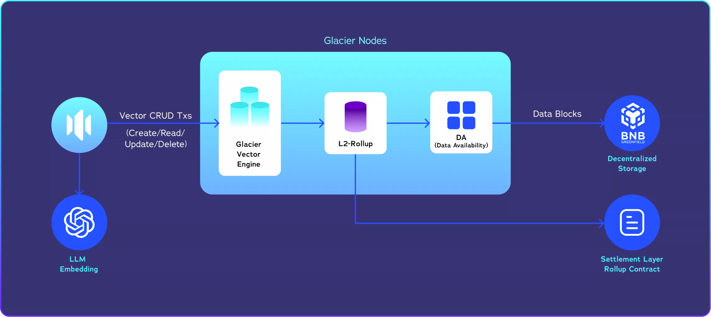

# How to Manage Vector Data Utilizing Glacier VectorDB

## Background

Welcome to this tutorial focused on leveraging Greenfield's capabilities for AI and machine learning, alongside interacting with [Glacier DeVector Database](https://www.glacier.io/ai). In this comprehensive guide, we delve into an innovative technique: integrating OpenAI's GPT models with Greenfield's blockchain data through `Retrieval-Augmented Generation (RAG)`. This approach is particularly crucial for handling recent or specialized data, which traditional models might struggle with.

Our journey will include utilizing Glacier DeVector for efficient data management and query processing. This ensures that our text generation is not only smooth and context-aware but also enriched with the most current real-time data. By combining these cutting-edge technologies, we empower our models to generate content that is not only highly accurate but also exceptionally relevant and up-to-date.

## What is Glacier DeVector?

Glacier DeVector is a decentralized vector database built on top of Greenfield blockchain, seamlessly integrated into the AI ecosystem.




## Prerequisites
* Glacier DeVector Endpoint: https://greenfield.onebitdev.com/glacier-gateway-vector/
* Huggingface API Token: https://huggingface.co/docs/api-inference/quicktour
* OpenAI APIKey: https://platform.openai.com/account/api-keys
* Glacier SDK NPM: @glacier-network/client
* Demo wallet: create a new one that only for test purpose!

## QuickStart
In this quickstart, we store a dataset related to programing-lang and chat with the documents.

* [Demo Project](https://github.com/Glacier-Labs/devector-demo)

### Create a GlacierClient
```js
const privateKey = `<your-wallet-privateKey>`;
const endpoint = 'https://greenfield.onebitdev.com/glacier-gateway-vector/'
const client = new GlacierClient(endpoint, {
  privateKey,
});
```

### Create DeVector collection
All vector features start from here. We just simply define the schema of a collection to enable the vector feature.
```js
const schema = {
  title: "programming-lang",
  type: "object",
  properties: {
    name: {
      type: "string",
    },
    nameEmbedding: {
      type: "string",
      vectorIndexOption: {
        "type": "knnVector",
        "dimensions": 384,
        "similarity": "euclidean",
      },
    },
    link: {
      type: "string",
    },
    type: {
      type: "string",
    }
  }
}
```

* `nameEmbedding` is a vector field that support vector query for `name`. We use the `VectorIndexOption` describe the vector feature, and the Embedding suffix is not necessary but it's good to use Embedding to name the field.
* `VectorIndexOption`: define vector options
* `Type`: Value must be knnVector.
* `Dimensions`: Number of vector dimensions, This value can't be greater than 2048. Here we use 384 dimensions that transform by the embedding model all-MiniLM-L6-v2
* `Similarity`: Vector similarity function to use to search for top K-nearest neighbors. Value can be one of the following: euclidean, cosine, dotProduct

### Load Embedding Documents
We use the Huggingface API to embedding documents, any other embedding tool can be used well.
Model: all-MiniLM-L6-v2
API: https://api-inference.huggingface.co/pipeline/feature-extraction/sentence-transformers/all-MiniLM-L6-v2

```js
let doc = {
    'link': '<http://en.wikipedia.org/wiki/A-0_System>',
    'type': 'ComputerLanguage',
    'name': 'A-0 System',
    'nameEmbedding': await getEmbeddingFromHF('A-0 System'),
}
let coll = client.namespace(namespace).dataset(dataset).collection(collection)
let resp = await coll.insertOne(doc)

```
```js
async function getEmbeddingFromHF(input) {
 const embedding_url = "<https://api-inference.huggingface.co/pipeline/feature-extraction/sentence-transformers/all-MiniLM-L6-v2>"
  let response = await axios.post(embedding_url, {
    inputs: input,
  }, {
    headers: {
      'Authorization': `Bearer ${hf_token}`,
      'Content-Type': 'application/json'
    }
  });
  if (response.status === 200) {
    return response.data;
  } else {
    throw new Error(`Failed to get embedding. Status code: ${response.status}`);
  }
}

```

### Write a chatbot
Before we chat with the documents, we should write a chatbot for your data domain.

```js
// Chat With Documents
let chatDocs = async (namespace, dataset, collection, input) => {
  const docs = await search(namespace, dataset, collection, input)
  if (docs.length === 0) {
    console.log(`I'm not sure about your question!`)
    return
  }
  const contexts = docs.map(item => `language: ${item.name}, wikipedia link: ${item.link}` )
  const messages = buildPrompt(input, contexts)
  const result = await getChatCompletions(messages)
  console.log(`Your question: ${input}`)
  console.log(`Chat response: ${result}`)
}

// Get Chat Response
async function getChatCompletions(messages) {
  // Define the OpenAI API url and key.
  const url = 'https://api.openai.com/v1/chat/completions';

  // Call OpenAI API to get the embeddings.
  let response = await axios.post(url, {
    model: "gpt-3.5-turbo",
    messages: messages,
  }, {
    headers: {
      'Authorization': `Bearer ${openai_key}`,
      'Content-Type': 'application/json'
    }
  });

  if (response.status === 200) {
    return response.data.choices[0].message.content;
  } else {
    throw new Error(`Failed to get chat completion. Status code: ${response.status}`);
  }
}
```

### Build Prompt

```js
function buildPrompt(query, context) {
  const system = {
    "role": "system",
    "content": "I am going to ask you a question, which I would like you to answer" +
    "based only on the provided context, and not any other information." +
    "If there is not enough information in the context to answer the question," +
    "say \"I am not sure\", then try to make a guess." +
    "Break your answer up into nicely readable paragraphs."
  };
  const user = {
    "role": "user",
    "content": "The question is " + query + ". Here is all the context you have:" +
    context.join(" ")
  };
  return [system, user]
}
```

### Chat with documents
Now, we can chat with the documents.
```
node vector-demo.js
```

chat 'which language is about the system, show me the wikipedia link?'

Response
```
Your question: which language is about the system, show me the wikipedia link?
Chat response: Based on the provided context, the language that is about the system is the A-0 System. The Wikipedia link for the A-0 System is <http://en.wikipedia.org/wiki/A-0_System>.
```

# Conclusion

In conclusion, this tutorial has demonstrated the powerful synergy between Greenfield's blockchain technology and OpenAI's GPT models, enhanced through Retrieval-Augmented Generation (RAG). By integrating these technologies with Glacier DeVector's efficient data management system, we have unlocked new potentials in AI and machine learning, particularly in generating up-to-date, relevant, and accurate content. We hope this journey has been enlightening and that it inspires you to explore further into the exciting world of AI and blockchain technology.


Build AI-powered application utilizing Glacier VectorDB on Greenfield:
Please contact info@glacier.io