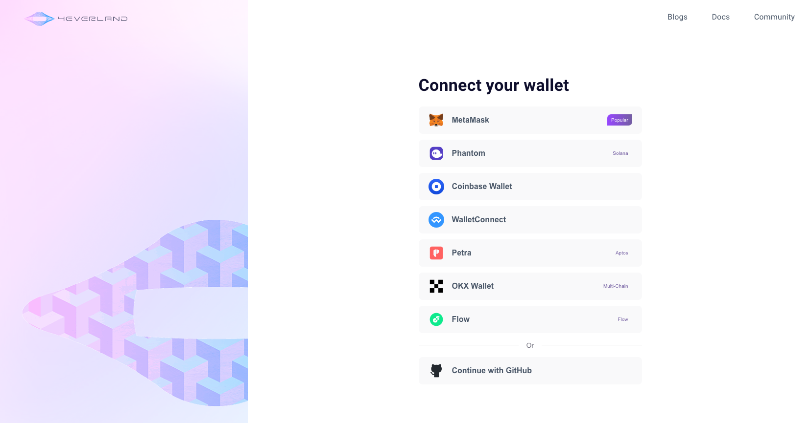
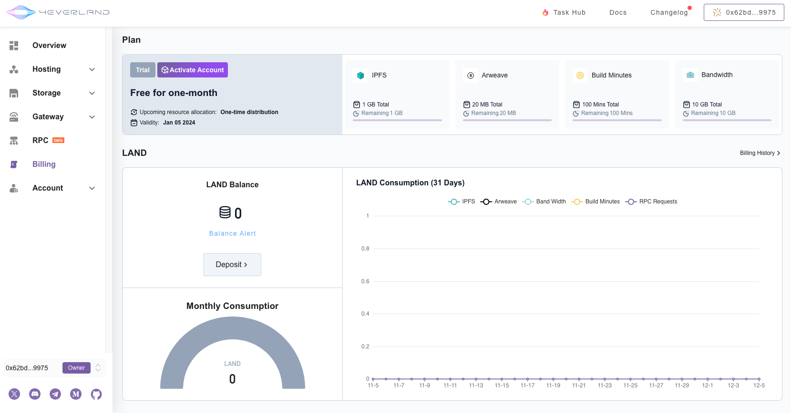
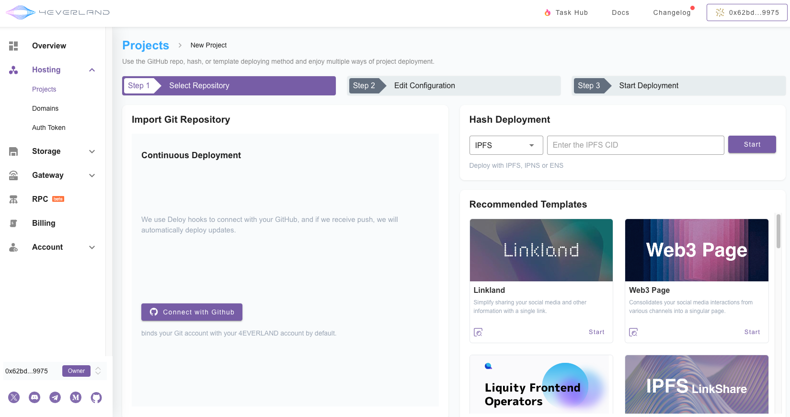
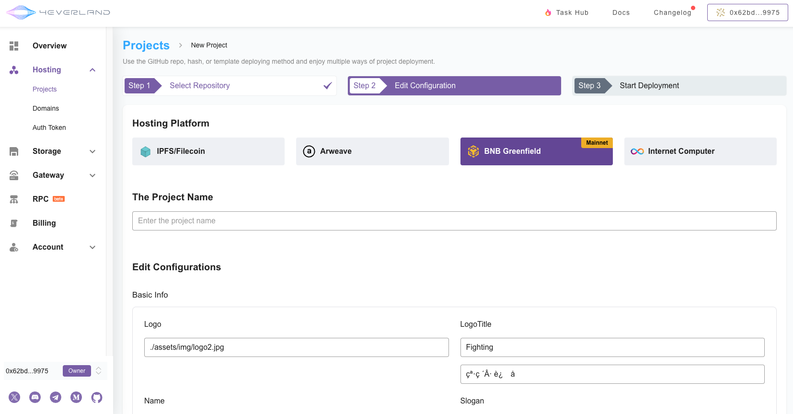
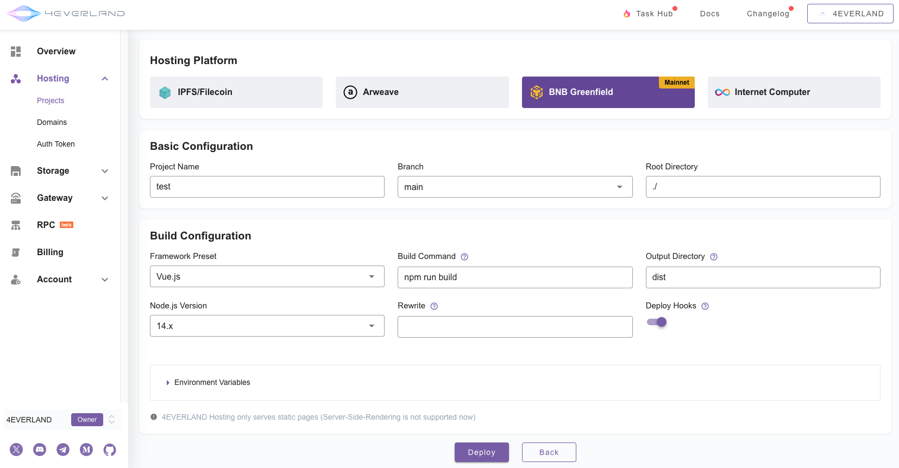
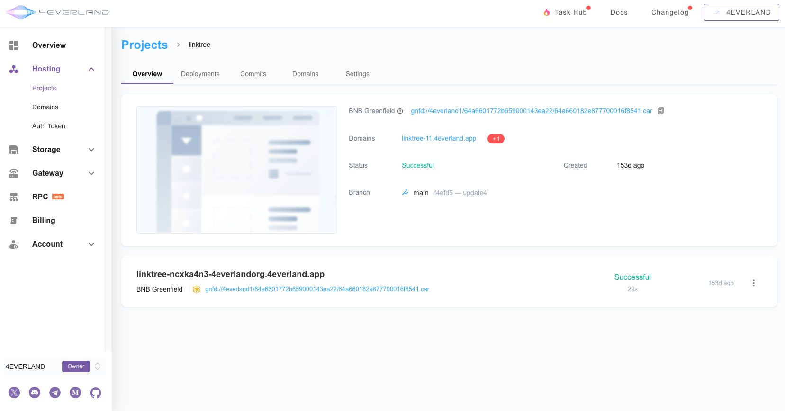

# Implementing One-Click Deployment of BNB Greenfield Website through 4EVERLAND

## Introduction

In the pursuit of rapid and reliable front-end hosting solutions for innovative decentralized applications (dApps), 4EVERLAND has provided BNB Greenfield with an efficient one-click deployment service. This not only simplifies the process of front-end and back-end deployment but also expands the potential for decentralized ownership and economical use of data. 

The following tutorial will meticulously demonstrate the steps and techniques for achieving one-click website deployment on BNB Greenfield through 4EVERLAND.   

## Get Started

### Login 4EVERLAND

In the one-stop service provided by the 4EVERLAND platform, users first need to complete the login process. 

As a Web3-oriented solution platform, the website currently supports multiple ways to log in with various wallets. Please select a wallet that suits your usage preferences and sign in.

### The use of the Tril account/upgrade to a standard account

New user logins will automatically create a Tril account and receive free limited-time resources. You will be able to use these resources to build your first decentralized website. Of course, 4EVERLAND provides [flexible solutions](https://docs.4everland.org/get-started/billing-and-pricing/pricing-model) to meet the needs of different users.

### Select Hosting service and create a new project

Navigate to the Dashboard page and select Hosting Service from the left-hand menu to create a new project, in order to begin configuring and deploying the project. 

On the 4EVERLAND platform, users can choose the services they need from a range of offerings.

### Connect your Github

The next step in the workflow is to link the user's 4EVERLAND account with their Github account, allowing them to pull projects directly from the code repository. Once the link is complete, you will be able to browse your Github code repository in Hosting. 

Additionally, 4EVERLAND's template center provides users with more convenient options, allowing you to start directly with pre-edited templates.

### Select the project and lock in BNB Greenfield

After selecting the project to be deployed, click "Import" and lock the deployment platform as BNB Greenfield. Proceed to edit project names, deployment environments, and other settings.

### Click Deploy and wait for the deployment to complete

Initiate the deployment process by clicking the "Deploy" button, and patiently wait until the deployment is successfully completed.

 

### View your website through the BNB Greenfield URL

Upon completion of the deployment, users will be able to browse and inspect their website using a specific BNB Greenfield URL, experiencing web hosting in a decentralized storage environment. 

Additionally, 4EVERLAND will allocate an accessible domain name suffix as 4everland.app.

Similarly, like other blockchains, you can verify your transactions [here](https://greenfieldscan.com/).

## In summary

This tutorial demonstrates the powerful capabilities presented through the collaboration between 4EVERLAND and BNB Greenfield, and how it has streamlined the deployment process for dApps. 4EVERLAND aims to provide a one-stop service that significantly reduces the deployment barriers for developers, further advancing the application of BNB Greenfield's decentralized front-end hosting solution.

If you are interested in 4EVERLAND, please feel free to visit/subscribe to the [official website](https://www.4everland.org/) for real-time information.

## What is 4EVERLAND

4EVERLAND is a Web3 infrastructure powered by blockchain technology, offering developers convenient, efficient, and cost-effective storage, network, and computing capabilities. It is dedicated to facilitating the seamless transition of developers from Web2.0 to Web3.0 and constructing a Web3.0 cloud computing platform that is compatible with Web2.0. 