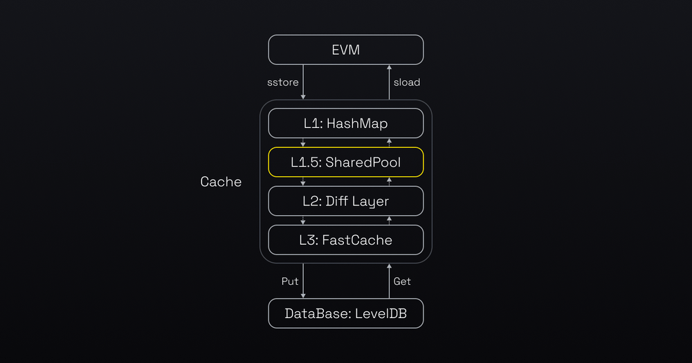
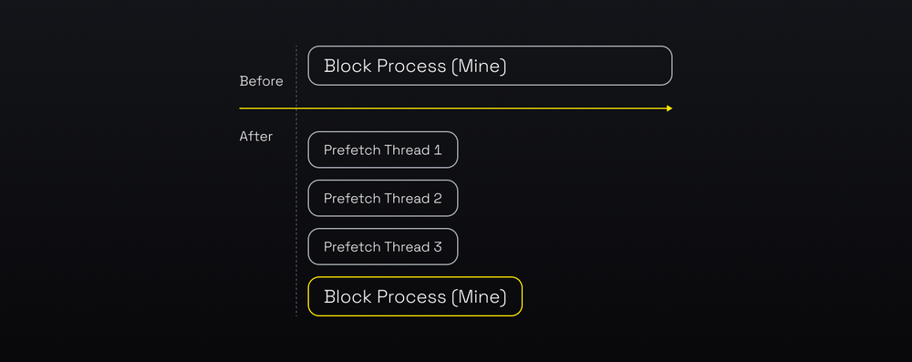
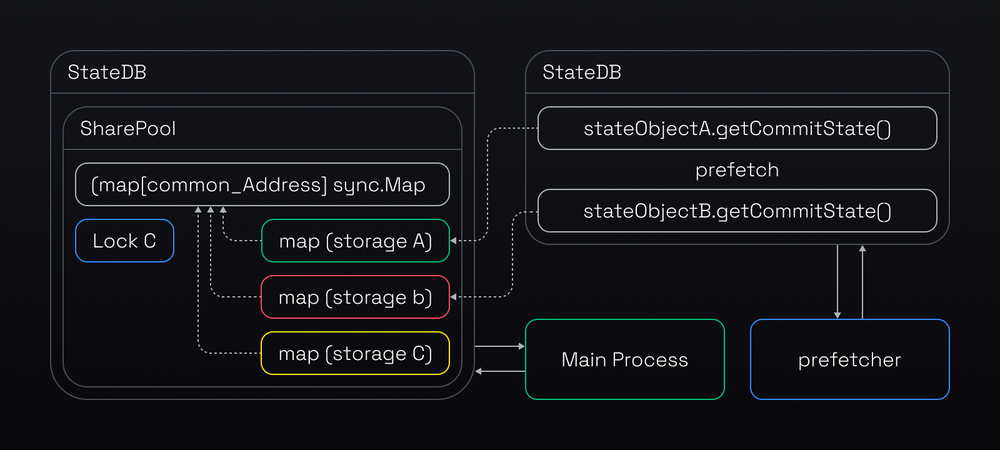

This document discusses the various optimizations made to OP Stack that enhances its performance and helps in offering super cheap gas fees.

## opBNB offers enhanced performance and cheap gas fees

opBNB enhances the performance of the "Execution Layer" and the "Derivation Layer" of the OP Stack as highlighted in [OP Stack landscape](https://stack.optimism.io/docs/understand/landscape/?ref=binance.ghost.io#existing-landscape).

## Optimization of Execution Layer

One of the main challenges in developing the opBNB protocol was to ensure a high throughput of transactions. To achieve this, opBNB leveraged execution optimization techniques that had [previously been implemented for BSC](https://nodereal.io/blog/en/bnb-smart-chain-performance-anatomy-series-chapter-ii-99-cache-hit-rate/?ref=binance.ghost.io).

## EVM State Data Access Optimization
Before we dive into the details of the optimisations, let's see how EVM handles the state data. The diagram below illustrates how the EVM accesses state data. The EVM first checks the cache in memory for the data. If the data is not there, the EVM uses the LevelDB, which involves disk IO.

By improving cache efficiency and accelerating database reads and writes, opBNB realizes substantial performance and scalability gains that benefit both node operators and end users.

(Compared with standard Ethereum world state data storage model, BNB introduced the “SharedPool” as L1.5 cache to improve the hit rate of cache)

## Increased accuracy of [Bloom Filter](https://en.wikipedia.org/wiki/Bloom_filter?ref=binance.ghost.io) in L2: Diff Layer

Avoiding unnecessary recursive accesses to cache by increasing the accuracy of [Bloom Filter](https://en.wikipedia.org/wiki/Bloom_filter?ref=binance.ghost.io) in L2: Diff Layer
Bloom filters are a probabilistic data structure that can rapidly verify if an element exists within a data set. To access the state data, EVM uses the bloom filter to verify if the key-value pair is in the Diff Layer and then searches the cache recursively until it finds them, otherwise, EVM directly reads the data from the levelDB.

However, bloom filters may yield false positives. Moreover, the rate of false positives increases as the dataset bloom filters evaluate expands. Given the opBNB dataset is larger than Ethereum's, the potential for false positives could be greater as well.

The false positive can result in the unnecessary recursive access. To mitigate this, opBNB reduced the diff layer level from the default of 128 to a configurable parameter set at 32. This reduction decreases the size of the dataset, in turn diminishing the possibility of false positives to avoid the unnecessary time consuming operations to increase the efficiency of state retrieval.

## Effective Prefetch in the cache model of L1.5 and its upper layers
Prefetch is a technique that enhances the performance of transaction execution by loading data from disk to cache in advance. When a block needs to be processed in full sync mode or mined in mining mode, the opBNB node launches N threads to perform state prefetch.

The threads execute the transactions of a block or TxPool and discard the results, but keep the data items in the cache. This way, when the node needs to access the data, it is more likely to find it in the cache rather than on disk, which improves the cache hit rate.

However, the original prefetch design had a performance limitation. It used separate state databases for the prefetch and the main processes. The prefetch threads could only store the prefetched data in the L2 diff layer (See the 3 layer cache model that was explained before). To access this data, the main process had to traverse the L1, L2, and probably L3 layers, which was too slow for a high performance layer 2 chain.

The new design improves performance by sharing a pool that holds the whole world state (originStorage) between the prefetch and the main EVM processes. This way, the prefetch threads can put the prefetched data right into the L1.5 (the upper layer of the cache model), which makes it faster for the main process to access. See the detailed process below.

## Mining Process Optimization
The process of mining L2 blocks of OP Stack is illustrated in the [diagram](https://github.com/ethereum-optimism/optimism/blob/33741760adce92c8bdf61f693058144bb6986e30/specs/assets/engine.svg?ref=binance.ghost.io). It involves a loop where the Rollup Driver (opNode) imports the previous blocks and then invokes the Engine API (op-geth) to produce new blocks on Layer 2.

The Rollup Driver (opNode) initiates the block generation process on op-geth by calling the engine_forkChoiceUpdatedv1 API of the Engine API(op-geth). This instructs Engine API(op-geth) to start producing an initial block by executing the transactions. (See “**Engine API: Initiate block production**” in the [diagram](https://github.com/ethereum-optimism/optimism/blob/33741760adce92c8bdf61f693058144bb6986e30/specs/assets/engine.svg?ref=binance.ghost.io)). The Engine API(op-geth) then returns a payload ID to the Rollup Driver (opNode).

However, when Engine API(op-geth) receives the engine_newPayloadV1 call from the Rollup Driver (opNode) to commit the block, it has to execute the transactions again, which is redundant and time-consuming. It can take hundreds of milliseconds to complete.

To optimize the performance, we added a cache layer to store the execution results during the initial block production step. This way, when op-geth receives the engine_newPayloadV1 call, it can retrieve the data from the cache instead of executing the transactions again. This saves time and resources for the system.

## Optimization of Derivation Layer

The batcher performance bottleneck was caused by the need to wait for 15 blocks (45 seconds) on Layer 1 (BSC) to confirm each batch of transactions before submitting the next one. This was due to the possibility of reorg on Layer 1 chain. To solve this problem, we introduced the asynchronous submission feature, which allows the batcher to submit batches without waiting for confirmation.

A separate monitor process keeps track of Layer 1 and notifies the batcher if a reorg happens, so that the batcher can resubmit the affected transactions. This feature improves the efficiency of the batcher. It is not yet available on testnet and is still under development, but it will be deployed on opBNB mainnet.