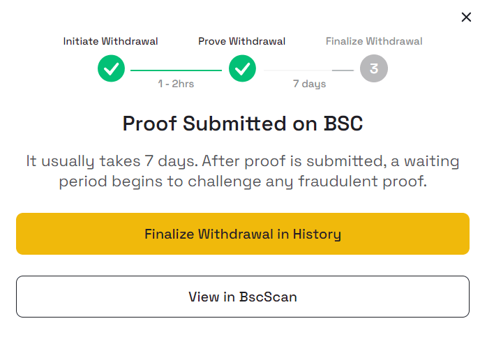
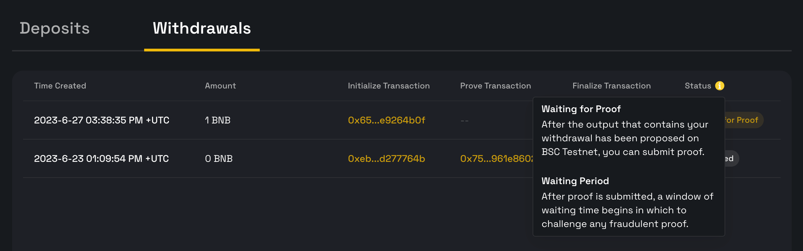

To transfer your tokens from opBNB to BSC, you can use the [opBNB bridge dApp(Testnet)](https://opbnb-testnet-bridge.bnbchain.org/) or [opBNB bridge dApp(Mainnet)](https://opbnb-bridge.bnbchain.org). Users who do not want to wait 7 days to claim their tokens can use a community bridge, but please note that community bridges may not be as secure as the official opBNB bridge.

*Note that the default option is the community bridge. To use the opBNB bridge, switch to the "official bridge" tab.*

## Steps of withdrawal through official bridge 

For users who choose the official opBNB bridge, you will need to wait for a challenge period of 7 days before you can claim your tokens on BSC. This challenge period is a security measure to prevent fraud and theft. The challenge period is necessary to ensure the security of the opBNB network and users. However, it can be inconvenient for users who need their tokens quickly. If you need your tokens immediately, you may want to consider using a community bridge instead. However, please be aware that community bridges may not be as secure as the official opBNB bridge. Do your research first.

There are 2 steps after you submit your withdrawal request. 

1. *Submit Proof:* When you withdraw your tokens, they will be transferred from the opBNB network to the BSC network. After you submit the withdrawal request, your withdrawal status will change to *Waiting for Proof*, which indicates that the transaction is pending for the proof submission. You need to submit the proof manually.

2. *Claim Token:* After you submit your proof, you need to wait until the transaction is ready to be collected after the challenge window, which is 7 days. The challenge window is a period of time during which anyone can challenge the validity of the transaction. If no one challenges the transaction, it will be finalized and you can collect your tokens on the BSC network.

## Third-party Bridges

There are also third-party bridges with shorter withdrawal time.

- [zkbridge](https://www.zkbridge.com/gallery/opbnb)

