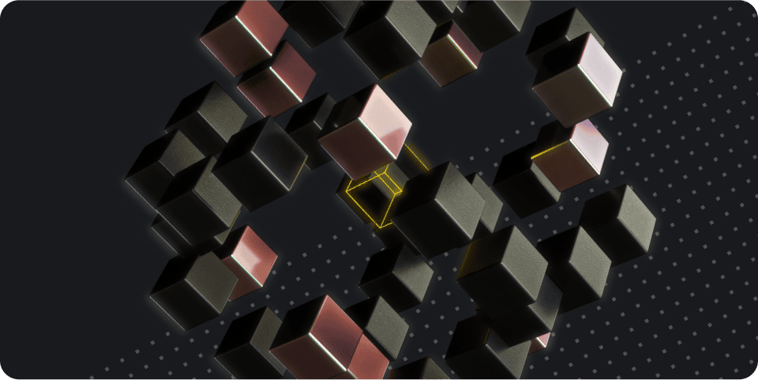

---
hide:
- toc
---

    

        <h1>BNB opBNB</h1>
        
BNB opBNB is the Layer 2 scaling solution for the BNB Smart Chain powered by bedrock version of Optimism OP Stack.

    

    

        
    

    <a href="./get-started">
        
Get Started

        
Deposit BNB to opBNB to start your journey

    </a>
    <a href="./developers/developer-tools.html">
        
Summary of opBNB infrastructure

        

    </a>
    <a href="./advanced/run-with-pebbledb-and-pbss.html">
        
Run Node

        
Run a fullnode on opBNB network

    </a>
    <a href="./advanced/full-stack-dapp.html">
        
Build Dapp

        
Deploy a simple HelloWorld smart contract on opBNB and build a Web3 frontend

    </a>

