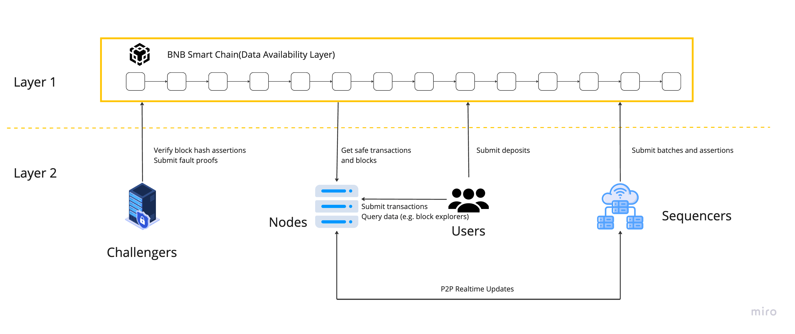

# opBNB - High-performance layer 2 solution

The opBNB network is the Layer 2 scaling solution for the BNB Smart Chain powered by [bedrock version](https://community.optimism.io/docs/developers/bedrock/) of Optimism OP Stack. It works by offloading transaction processing and resource usage from the BNB Smart Chain, while still posting data to the underlying mainnet. Users interact with the opBNB network by depositing funds from BSC and using applications and contracts on opBNB. Sequencers then aggregate transactions, compute state transitions and submit them to the rollup contract on BSC. Provers generate cryptographic proofs that prove the validity of these state transitions, and Verifiers check the proofs to verify the opBNB state is correct. At its core, opBNB allows users to deposit and withdraw funds, use smart contracts, and view network data with high throughput and low fees. By leveraging Layer 2, opBNB is able to scale beyond the constraints of the BNB Smart Chain and provide an improved experience for users.

### Key Features and Advantages

1. **Optimistic Rollup Technology:**
   opBNB employs Optimistic Rollup, a Layer-2 scaling solution that processes transactions off-chain while maintaining the security of the main BSC chain. By bundling multiple transactions into a single batch and then submitting them to the main chain, Optimistic Rollup reduces the computational load on BSC, resulting in faster and cheaper transactions.

2. **Increased Transaction Throughput:**
   The adoption of Optimistic Rollup allows opBNB to achieve significantly higher transaction throughput compared to the BSC main chain. As of early 2024, opBNB supports up to 5,000 transactions per second (TPS), addressing one of the critical bottlenecks in blockchain scalability.

3. **Lower Transaction Fees:**
   One of the primary benefits of opBNB is the reduction in transaction fees. By processing transactions off-chain and only settling the final state on the BSC main chain, opBNB dramatically lowers the costs associated with executing transactions. This makes it an attractive option for developers and users alike, particularly for micro-transactions and DeFi applications.

4. **Enhanced User Experience:**
   With faster transaction confirmations and lower fees, opBNB significantly enhances the overall user experience. This improvement is crucial for the mass adoption of blockchain technology, as it makes interactions with DApps and DeFi platforms more seamless and affordable.

5. **Robust Security:**
   Despite processing transactions off-chain, opBNB maintains a high level of security by relying on the security model of the underlying BSC main chain. Optimistic Rollup's fraud-proof mechanism ensures that any invalid transactions can be challenged and corrected, safeguarding the integrity of the network.

