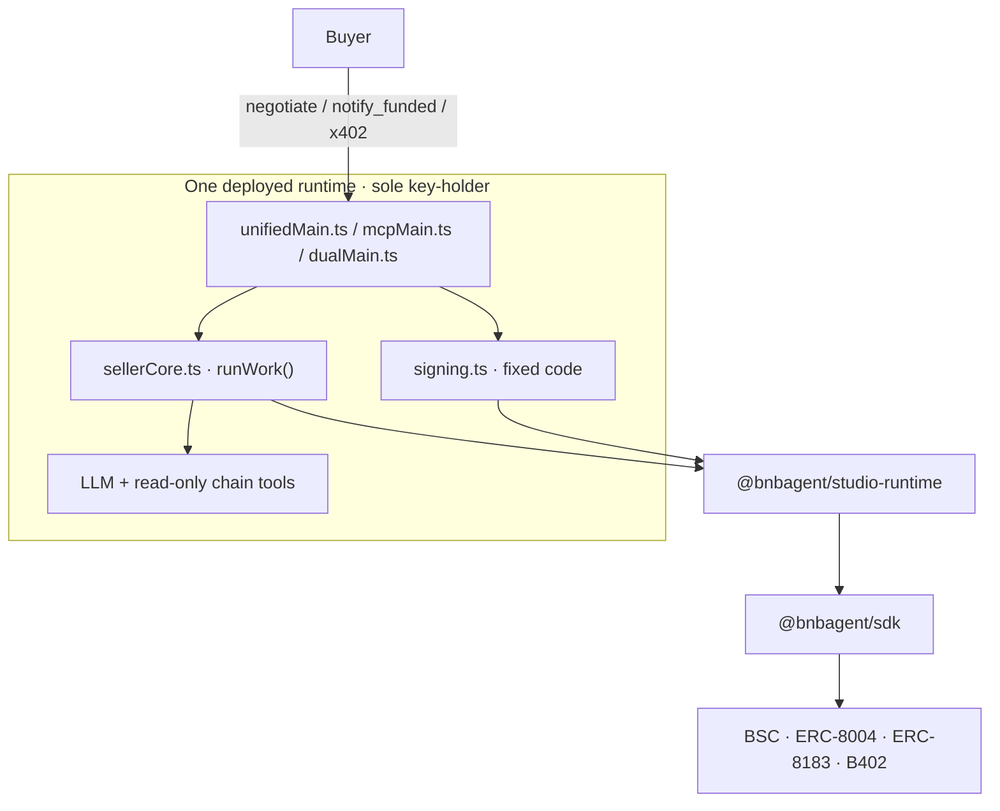

# Architecture

BNB Agent Studio wraps the [BNB Agent SDK](../bnbagent-sdk/index.md) with scaffolding,
safety boundaries, and IDE integration. A project is **one deployable runtime** composed
from orthogonal recipes.

## One runtime, one signer

A single deployed process serves every public face you selected and holds the only key.
There is no separate keyless service tier and no cross-service invoke hop.

| Entrypoint | Face | Local surface | Runtimes |
| --- | --- | --- | --- |
| `src/unifiedMain.ts` | A2A (+ X402) | agent card and JSON-RPC on `:9000` | AgentCore, Azure Foundry |
| `src/mcpMain.ts` | MCP | Streamable HTTP at `:8000/mcp` | AgentCore, Azure Foundry (local only) |
| `src/dualMain.ts` | A2A-native with tunneled `/mcp` | `:9000` | AgentCore only |

Faces are composable (`--protocols`); one seller core and one wallet serve all of them.



## The bounded operations

The ERC-8183 rail exposes exactly two operations — deliberately narrow, so neither the
LLM nor a buyer can widen them.

**`negotiate`** — a rule-based price clamp against `studio.toml`, then an EIP-191
signature. **No LLM touches money**: pricing is deterministic code.

**`notify_funded`** — verify the funded job on-chain (signed terms, assigned provider,
status, budget, funded state) **before** doing paid work, produce the deliverable, then
submit its reference on-chain. A2A acknowledges first and delivers in the background;
MCP delivers synchronously inside the tool call.

The optional x402 rail adds an anonymous HTTP request at `/x402`. A positive price
settles through B402 before work starts; an explicit zero is FREE passthrough and
bypasses the facilitator entirely.

`settle` is **manual** — `bag erc8183 settle <jobId>`. Studio never silently
auto-settles a buyer's job.

## Signing boundary

All signing is fixed entrypoint code in `app/agent/src/signing.ts`, or the runtime's
bounded x402 payment handler. It is **never** an LLM-callable tool, and no general
signing tool is exposed. The LLM's chain tools are read-only.

The encrypted keystore lives at the workspace root in `.studio/wallets/` — outside the
deploy `codeLocation`, so no packaging path can bundle it into an artifact. It reaches a
deployed runtime only through the selected provider's delegated secret channel.

## Layer stack

| Layer | What |
|-------|------|
| **L1 — your code** | `app/agent/src/*` — emitted by recipes, you own and edit |
| **L2 — IDE** | Claude Code / Cursor — reads the skill, drives the CLI, edits your files |
| **L3 — Studio surfaces** | `bag` CLI, `bag mcp serve` (15 read-only tools), skills, recipes |
| **L4 — `@bnbagent/studio-runtime`** | Seller runtime, wallet loader, signing policy, x402 payment handler, audit log |
| **L5 — `@bnbagent/sdk`** | Protocol clients — `ERC8004Agent`, `ERC8183Client`, `EVMWalletProvider` |
| **L6 — chain** | BSC testnet/mainnet — ERC-8004 registry, ERC-8183, B402 |

Cloud lifecycle mutations are delegated to the pinned
[`@bnbagent/deploy-cli`](https://www.npmjs.com/package/@bnbagent/deploy-cli); the
generated project depends on `@bnbagent/studio-runtime`, **not** on the CLI.

## Recipe composition

`bag init` composes the project from orthogonal recipe axes:

```text
recipes/
├── agent/                    signing.ts
├── wallet/                   wallet selection (evm-local · twak · altana)
├── runtimes/agentcore/       AWS Bedrock AgentCore entrypoints + Dockerfile
├── runtimes/azure-foundry/   Azure AI Foundry entrypoints + Dockerfile
├── providers/pieverse-llm/   Pieverse LLM wiring + funding playbook
├── tools-chain/              chainTools.ts — read-only chain tools
└── x402-buyer/               x402Buyer.ts — optional buyer rail
```

| Axis | Default | Emits |
|------|---------|-------|
| Agent | always | `signing.ts` |
| Runtime | `agentcore` | `unifiedMain.ts`, `mcpMain.ts`, `dualMain.ts`*, `executor.ts`, `sellerCore.ts`, `tools.ts`, `model.ts`, `agentCard.ts`, `Dockerfile` |
| LLM provider | `pieverse-llm` | provider wiring in `model.ts` |
| Wallet | `evm-local` | keystore selection and config |
| Chain tools | always | `chainTools.ts` |
| x402 buyer | opt-in | `x402Buyer.ts` |

\* `dualMain.ts` is AgentCore-only. Azure Foundry ships no `dualMain` template, which is
why Foundry deploys **A2A scaffolds only** — an MCP entrypoint is rejected before deploy.

The A2A entrypoint is byte-identical across both runtimes (pinned by a parity test), so
the same image deploys to either cloud.

### Emitted vs library

**Emitted — you own it, edit freely:**

- `sellerCore.ts` — the work your agent sells (`runWork`); the file you normally edit
- `signing.ts` — fixed quote / verify / submit path
- `tools.ts`, `chainTools.ts` — read-only chain tools for the LLM
- `model.ts` — LLM provider glue
- `unifiedMain.ts`, `mcpMain.ts`, `dualMain.ts` — face entrypoints
- `executor.ts`, `agentCard.ts` — shared seller executor and A2A card
- `x402Buyer.ts` — optional buyer rail

**Library — shipped in `@bnbagent/studio-runtime`:**

- `studio.toml` schema and the audit-log protocol
- signing policy and budget gating
- wallet loader, ERC-8183 workflows, the bounded x402 payment handler

## Workspace layout

```text
weatheragent/
├── package.json · pnpm-workspace.yaml    workspace markers
├── AGENTS.md                             safety rules for coding agents
├── agentcore/                            deployment descriptor + AWS targets
├── .studio/
│   ├── .env.local                        gitignored secrets, mode 0600
│   └── wallets/                          encrypted keystore, outside deployable code
└── app/agent/
    ├── studio.toml                       network · wallet · LLM · policy · rails · faces
    └── src/                              the emitted TypeScript above
```

Two boundaries do the security work:

1. **Keystore outside the deploy `codeLocation`** — `.studio/wallets/` sits at the
   workspace root, so no packaging path bundles it.
2. **Signing outside the LLM's reach** — fixed code only; the model gets read-only tools.

## Commerce flow (seller)

```text
Buyer                          Runtime (sole signer)              BNB Chain
  │  negotiate                        │                               │
  │ ─────────────────────────────────►│ clamp price, EIP-191 sign      │
  │ ◄─────────────────────────────────│ signed quote                   │
  │                                   │                               │
  │  createJob · setBudget · fund ────────────────────────────────────►│
  │                                   │                               │
  │  notify_funded                    │                               │
  │ ─────────────────────────────────►│ verify funded job on-chain     │
  │                                   │ ──────────────────────────────►│
  │                                   │ run work, store deliverable    │
  │                                   │ submit reference ─────────────►│
  │ ◄─────────────────────────────────│ deliverable                    │
  │                                   │                               │
  │  approve / reject / dispute ──────────────────────────────────────►│
```

Settlement stays with the buyer. Operator-side settle is a manual
`bag erc8183 settle <jobId>`.

## Core design principles

1. **Studio is not the intelligence** — Claude Code / Cursor is; Studio provides
   recipes, the CLI, read-only MCP, and skills.
2. **No wallet abstraction of its own** — Studio selects a `WalletProvider` from the
   SDK; it wraps nothing.
3. **Money is deterministic** — pricing clamps and signing are fixed code, never LLM
   tool calls.
4. **Rails and faces are independent choices** — ERC-8183 and B402 are rails; A2A, MCP
   and X402 are faces. One runtime serves any combination.
5. **The generated project is yours** — ordinary TypeScript, no closed-source runtime
   and no lock-in.

## Further reading

- [Quickstart](quickstart.md) — install, scaffold, run, deploy
- [Configuration](configuration.md) — `studio.toml` and `.env.local`
- [Deployment](deployment.md) — the three deploy targets
- [Security](security.md) — keystore posture, signing policy, MCP read-only guarantee
- [BNB Agent SDK architecture](../bnbagent-sdk/architecture.md) — the protocol layer underneath

[← BNB Agent Studio overview](index.md)
