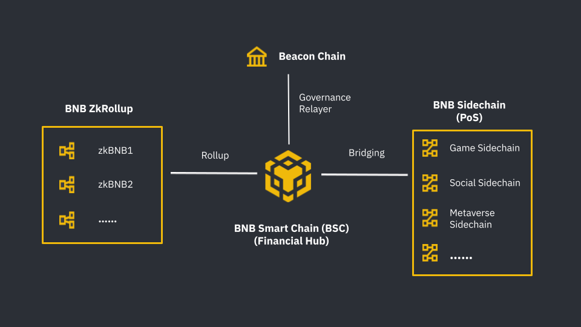

# Getting Started
The purpose of this tutorial is to give a general overview of BNB Chain and to serve as a starting point for new users to the BNB Chain ecosystem. General knowledge of cryptocurrency is assumed, and in particular familiarity with the Ethereum ecosystem. If you don't understand something right away, that's OK. Search for an answer online, and if you don't find it, ask on our [Discord](http://discord.com/invite/bnbchain). 

We recommend reading this document entirely before using BNB Chain so that you can avoid common pitfalls and problems that new users run into. There are many multiple components of the BNB Chain, so it's best to get a full picture of things before diving in to save yourself confusion. 

## BNB Chain: An Ecosystem of Blockchains
Build N Build Chain aka BNB Chain, one of the most popular blockchains in the world, dedicates to delivering its core infrastructure necessary for future public adoption, and always remains as a community-first and open-source ecosystem built on a permissionless and decentralized environment.

BNB Chain is composed of two blockchains - BNB Beacon Chain (BC) and BNB Smart Chain (BSC). The [BNB Beacon Chain](learn/beaconIntro.md) is the blockchain component that is responsible for the governance of the BNB Chain and manages staking and voting on the BNB Chain. Whereas, the [BNB Smart Chain](learn/intro.md) is the blokchain component that is EVM compatible, consensus layers, and with hubs to multi-chains.

## What are the Major Components of BNB Chain?
BNB Chain is comprised of:
1. **[BNB Beacon Chain](learn/beaconIntro.md) _(previously Binance Chain)_** - BNB Chain Governance (Staking, Voting)
2. **[BNB Smart Chain (BSC)](learn/intro.md) (_previously Binance Smart Chain)_** - EVM compatible, consensus layers, and with hubs to multi-chains
3. **[BNB Sidechain](BNBSidechain/overview/bs-overview.md)** - Ready-to-use PoS solutions for developing custom blockchains and dApps with existing BSC functionality.
4. **[ZkBNB](zkbnb/zkbnb-overview.md)** - ZkRollup solution to scale BSC as an super high performance blockchains. 

## What can you do with BNB Smart Chain (BSC)?

BNB Smart Chain (BSC) is best described as a blockchain that runs in parallel to the Beacon Chain. Unlike Beacon Chain, BSC boasts smart contract functionality and compatibility with the Ethereum Virtual Machine (EVM). The design goal here was to leave the high throughput of Beacon Chain intact while introducing smart contracts into its ecosystem.

Because BSC is EVM-compatible, it launched with support for the rich universe of [Ethereum](https://academy.binance.com/en/articles/what-is-ethereum) tools and DApps. In theory, this makes it easy for developers to port their projects over from Ethereum. For users, it means that applications like [MetaMask](wallet/metamask.md) can be easily configured to work with BSC. Seriously – it’s just a matter of tweaking a couple of settings. Check out [Use MetaMask for BNB Smart Chain](wallet/metamask.md) to get started.

You can:

- Send and receive [BNB](binance.md#transfer-testnet-bnb-from-bsc-to-bc) and other [BEP2 tokens](binance.md#swap-testnet-bep2-token-to-its-bep20-equivalent) cross-chain
- Explore the transaction history and blocks on the chain, via [bscscan](https://bscscan.com), API
and node RPC interfaces.
- [Stake your BNB](wallet/staking.md) to earn some block rewards

**Developers** can also:

- [Issue](issue-BEP20.md) new tokens to digitalize assets
- [Migrate](https://github.com/bnb-chain/bsc-develop-ecosystem) existing DApps
- Run a [full node](validator/fullnode.md) to listen to and broadcast live updates on transactions, blocks, and consensus activities
- Become a validator of BSC - [testnet](validator/guideline-testnet.md) and [mainnet](validator/guideline-mainnet.md)
- [Develop wallets](wallet/wallet_api.md) and tools to help users use Dapps
  

## Wallet
The easiest way to use BNB Beacon and BNB Smart Chain is through a wallet with support for accounts and transfers on these chains.

BNB Chain provides a Web Wallet at [https://www.bnbchain.org/en](https://www.bnbchain.org/en). BNB Chain also provides Web Wallet for testnet at [https://testnet.binance.org](https://testnet.binance.org). Both provide the functions described below:

- Generating crypto keys and addresses, which serves as the base of a wallet
- Showing the balances of assets on the addresses
- Sending and receiving assets

Binance Extension Wallet also presents a trading UI, where you can examine market data and manage your orders to trade among the listed assets. BNB Smart Chain supports several popular wallets like [MetaMask](wallet/metamask.md) and [TrustWallet](wallet/trustwallet.md), to learn more about the supported wallets refer [here](Wallet.md). For a list of tutorials on how to use other supported wallets with BNB Smart Chain, refer [here](wallets/wallet-tutorial-overview.md).

## BNB Token and Fees
BNB is the cryptocurrency coin that powers the BNB Chain ecosystem. As one of the world's most popular utility tokens, not only can you trade BNB like any other cryptocurrency, you can also use BNB in a wide range of applications and use cases. 

Although initially based on the Ethereum network, the ERC-20 BNB tokens were later swapped with [BEP-2](https://academy.binance.com/en/glossary/bep-2) BNB at a 1:1 ratio. The BEP-2 BNB is the native coin of the Beacon Chain, and the mainnet.
In 2020, the BNB Smart Chain (BSC) was launched. BSC is a blockchain network that runs in parallel with the BNB Beacon Chain. This means that BNB can be found in three different forms:

- BNB BEP-2 on the BNB Beacon Chain.
- BNB BEP-20 on the BNB Smart Chain.
- BNB ERC-20 on the Ethereum network.

## How to Buy BNB Tokens
As all fees on BNB Chain are paid in BNB, therefore, in order to interact with the BNB Chain network you will need to have some BNB tokens. 
- BNB tokens can also be received for usage on testnet through the [testnet faucet](https://testnet.binance.org/faucet-smart).
- The BNB tokens for usage on mainnet are available for purchase on multiple leading exchanges and wallets as explained [here](#wallet). You can also refer [here](wallets/wallet-tutorial-overview) for tutorials on how to use different wallets for use with BNB Chain to send/receive/purchase BNB Tokens.

## Chain Explorer
Chain Explorer provides a portal to explore blocks and transaction details. On [BNB Chain Explorer](https://explorer.bnbchain.org/) and [BscScan](https://bscscan.com/), you can also check different asset types, the distribution of their ownerships, and owners' transactions.

## REST API
There are [Accelerated Nodes](beaconchain/develop/node/nodetypes.md) which provide advanced API services for the public. Here is a list of all the Rest API information Accelerated Node provides: [paths](beaconchain/develop/api-reference/dex-api/paths). For information regarding RPC Endpoints for BSC, refer [here](rpc.md).

### Node RPC
There are data seed nodes in the network which allow users to perform low-level operations like executing ABCI queries, viewing network/consensus state or broadcasting a transaction.
If you run a full node by yourself, you can also use those RPC functions. Here is a list of all the Node RPC services it provides: for Beacon Chain refer [here](beaconchain/develop/api-reference/node-rpc.md) and for BNB Smart Chain refer [here](rpc.md).

## Advanced Ways To Use BNB Chain
### Run your own full node

Please refer to this guide about how to run your own full node on [Beacon Chain](beaconchain/fullnode.md) and [BNB Smart Chain](validator/fullnode.md).

### Run your own Light Client

Please refer to this guide about [how to run your own light client on Beacon Chain](beaconchain/light-client.md).

### Access via Node Command Line Interface (CLI)

A Command Line Interface is available for Linux and Mac platforms. Please refer to the [CLI Reference](beaconchain/develop/api-reference/cli).

### Use SDKs

SDKs are also provided as a starting point for your apps.

There are two advanced SDK solutions for Beacon chain: [Java](<https://github.com/bnb-chain/java-sdk>) and [Golang](<https://github.com/bnb-chain/go-sdk>).

Both solutions provide functions for:

* Create wallets and manage keys
* Encode/sign transactions and submit to Binance Chain/DEX, including Transfer, New Order, Cancel Order, etc.
* Communicate with Binance Chain/DEX Node RPC calls through public node RPC services or your own private full nodes

Please refer to specific SDK documentation for more information:

- [Go](https://github.com/bnb-chain/go-sdk)([Documentation](https://github.com/bnb-chain/go-sdk/wiki))
- [Java](https://github.com/bnb-chain/java-sdk)([Documentation](https://github.com/bnb-chain/java-sdk/wiki))
- [Javascript](https://github.com/bnb-chain/javascript-sdk) ([Documentation](https://github.com/bnb-chain/javascript-sdk/wiki))
- [C++](https://github.com/bnb-chain/cplusplus-sdk)([Documentation](https://github.com/bnb-chain/cplusplus-sdk/wiki))
- [C#](https://github.com/bnb-chain/csharp-sdk)([Documentation](https://github.com/bnb-chain/csharp-sdk))
- [Python](https://github.com/bnb-chain/python-sdk)([Documentation](https://github.com/bnb-chain/python-sdk))
- [Swift](https://github.com/bnb-chain/swift-sdk)([Documentation](https://github.com/bnb-chain/swift-sdk/blob/master/README.md))

## Blockchain Details
Please check the [technical details](learn/beaconIntro.md#technology-details) for more technical information.

## Future Goal 
Innovation never sleeps, and it’s clear that the future of BNB Chain goes into a world of over 1 billion users. BNB Chain’s mission is to build the infrastructure that powers the world’s parallel virtual ecosystem, and BNB Chain’s commitment to the community is that it will be: 
- Open
- Multi-chain
- For creators and inventors
- Permissionless
- Forever decentralized
