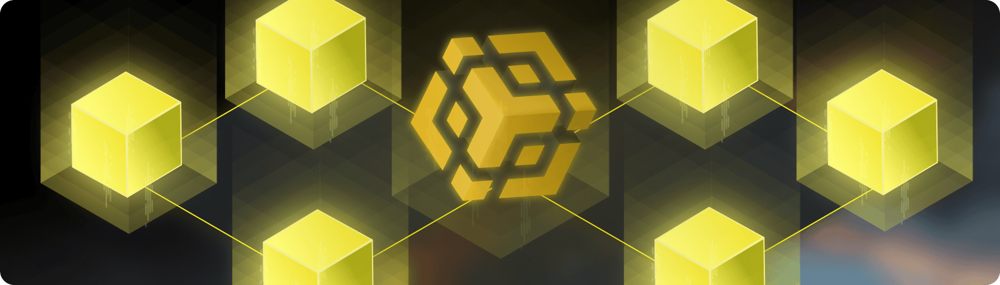

---
hide:
- navigation
- toc
---

# BNB Chain: Empowering the Future of Decentralized Applications

BNB Chain is a leading blockchain ecosystem designed to support the growing demands of the decentralized web (Web3). Offering a unique combination of speed, scalability, and affordability, BNB Chain has become a popular choice for developers building decentralized applications (DApps) and for users seeking to participate in the world of decentralized finance (DeFi).

## **Key Features and Benefits**

* **Compatibility with the Ethereum Ecosystem**

    Developers can easily port their existing Ethereum-based projects to BNB Chain, benefiting from its enhanced performance.

* **Massive User Base**

    BNB Chain Handle the largest daily active users and the highest peak EVM transactions with economical fees.

* **Strongest Ecosystem**

    It is Supported by a robust ecosystem of top-tier RPC plants, wallets, blockchain explorers, data indices, and substantial grants.

* **Thriving DeFi Ecosystem**

    BNB Chain boasts a vast array of DeFi applications, including decentralized exchanges (DEXs), lending protocols, yield farming platforms, and more.

* **Community-Driven Growth**

    BNB Chain is supported by a vibrant community of developers, validators, and users who contribute to its ongoing development and expansion.

* **Most Diversified Assets APIs**

    Full support on all popular tokens. The greatest opportunity for composability.

## **Chains**

BNB Chain is composed of three blockchains - BNB Smart Chain (BSC), opBNB and BNB Greenfield.
Powering and coordinating the ecosystem is the BNB token. Along with fueling transactions on BNB Chain, the BNB token also acts as a governance token.
Within this ecosystem, the ownership, usage, and monetization of data are possible for all users and participants in the BNB Chain ecosystem.

<a href="./bnb-smart-chain">
<h3>BNB Smart Chain (BSC)</h3>

BNB Smart Chain (BSC) is a high-performance blockchain platform designed to enable the development of scalable and user-friendly decentralized applications (DApps). As a core component of the BNB Chain ecosystem, BSC offers a robust infrastructure for building a wide range of applications, particularly in the decentralized finance (DeFi) space.

</a>

<a href="./bnb-opbnb">
<h3>opBNB</h3>

A layer-2 scaling solution for BNB Smart Chain that significantly increases transaction speed and reduces fees. It achieves this by leveraging Optimistic Rollups technology, making BNB Chain even more suitable for high-throughput applications.

</a>

<a href="./bnb-greenfield">
<h3>BNB Greenfield</h3>

A decentralized storage infrastructure designed to provide a secure and scalable platform for storing and managing data on the blockchain. It enables users to store files, NFTs, and other digital assets in a decentralized manner, promoting data ownership and control.

</a>

<a href="./join-ecosystem">
<h3>Join BNB Ecosystem</h3>

Share your project with BNBChain Ecosystem or seeking for cooperations. We want to make it as easy as possible for prjects to get more exposure in BNBChain Ecosystem or ask for support from the team.

</a>

## **Use Cases**

* **Decentralized Finance (DeFi)**

    BNB Chain is a hub for DeFi activities, providing users with access to a wide range of financial products and services, all powered by blockchain technology.

* **LSD and Restaking**

    BNB Chain is secured by more than 20M BNB staking and 20K delegators. The development for LSD and Restaking has been bolstered by a substantial amount of assets and a solid user base.

* **Gaming and Non-Fungible Tokens (NFTs)**

    The platform's fast transaction speeds and low fees make it ideal for gaming and NFT applications. opBNB further enhances this capability.

* **Decentralized Applications (DApps)**

    Developers can build and deploy a variety of DApps on BNB Chain, leveraging its robust infrastructure and growing user base.

* **Data Storage and Management**

    BNB Greenfield opens up new possibilities for decentralized data storage and management, catering to a wide range of use cases.

* **AI with blockchain technology**

    With the growing demand for Artificial Intelligence or AI, there is now more than ever a need to integrate AI with blockchain technology to reap its benefits. BNB Chain is making this integration a reality by providing a robust platform that easily integrates blockchain and AI.

