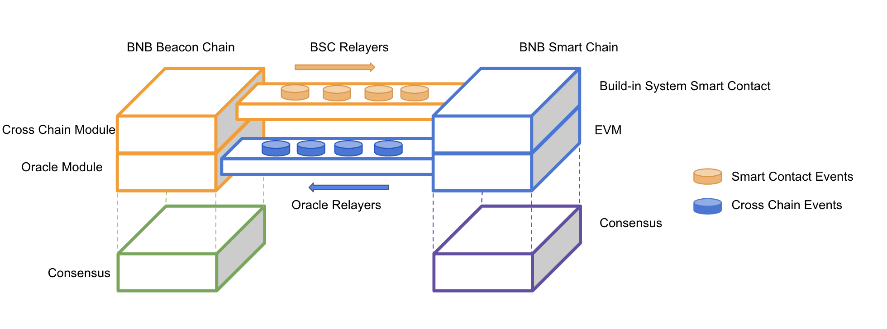

# Cross-Chain Communication

A native cross chain communication protocol is developed between BC (Beacon Chain) and BSC (BNB Smart Chain). It has the following key parts:

* [Build-in System Contract](system-contract.md)
* [Oracle on Beacon Chain](oracle-module.md)
* [BSC Relayer](bsc-relayer.md)
* [BSC Relayer Incentive Mechanism](incentives.md)
* [Oracle Relayer](oracle-relayer.md)

## Architecture Diagram
The following diagram depicts the architecture of the cross-transfer mechanism.

