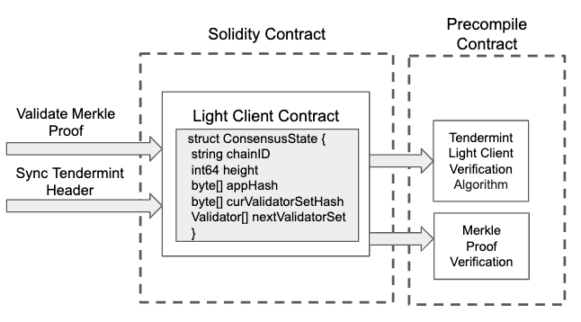

# Build-in System Contract

### Disclaimer

**The software and related documentation are under active development, all subject to potential future change without notification and not ready for production use. The code and security audit have not been fully completed and are not ready for any bug bounty. We advise you to be careful and experiment on the network at your own risk. Stay safe out there.**


GitHub Implementation link: <https://github.com/bnb-chain/bsc-genesis-contract>


| Contract Name         | Contract Address  | ABI file |
| --------------------- | ----------------- | ------------- |
| BSCValidatorSet Contract | 0x0000000000000000000000000000000000001000 | [bscvalidatorset](system-smart-contract/bscvalidatorset.abi)|
| Liveness Slash Contract | 0x0000000000000000000000000000000000001001 | [slashindicator](system-smart-contract/slashindicator.abi)|
| SystemReward Contract | 0x0000000000000000000000000000000000001002 | [systemreward](system-smart-contract/systemreward.abi)|
| TendermintLightClient Contract | 0x0000000000000000000000000000000000001003 | [tendermintlightclient](system-smart-contract/tendermintlightclient.abi) |
| TokenHub Contract | 0x0000000000000000000000000000000000001004 | [tokenhub](system-smart-contract/tokenhub.abi)|
| RelayerIncentivize Contract | 0x0000000000000000000000000000000000001005 | [relayerincentivize](system-smart-contract/relayerincentivize.abi)|
| RelayerHub Contract | 0x0000000000000000000000000000000000001006 | [relayerhub](system-smart-contract/relayerhub.abi) |
| GovHub Contract |0x0000000000000000000000000000000000001007 | [govhub](system-smart-contract/govhub.abi)                               |
| TokenManager Contract |0x0000000000000000000000000000000000001008 |[tokenmanager](system-smart-contract/tokenmanager.abi) |
| CrossChain Contract |0x0000000000000000000000000000000000002000 |[crosschain](system-smart-contract/crosschain.abi) |

## On-Chain Light Client

The purpose of cross-chain interoperability is to enable one blockchain to function as a light-client of another. Since Beacon Chain is using a classical Byzantine Fault Tolerant consensus algorithm, light-client verification is cheap and easy: all we have to do is check validator signatures on the latest block, and verify a Merkle proof of the state.

In Tendermint, validators agree on a block before processing it. This means that the signatures and state root for that block aren't included until the next block. Thus, each block contains a field called LastCommit, which contains the votes responsible for committing the previous block, and a field in the block header called AppHash, which refers to the Merkle root hash of the application after processing the transactions from the previous block. So, if we want to verify the AppHash from height H, we need the signatures from LastCommit at height H+1. (And remember that this AppHash only contains the results from all transactions up to and including block H-1)

Unlike Proof-of-Work, the light-client protocol does not need to download and check all the headers in the blockchain - the client can always jump straight to the latest header available, so long as the validator set has not changed much. If the validator set is changing, the client needs to track these changes, which requires downloading headers for each block in which there is a significant change. Here, we will assume the validator set is constant, and postpone handling validator set changes for another time.

Ethereum platform supports stateless precompiled contract implemented with golang and normal contract implemented with solidity. As compared to normal contracts, precompiled contracts are more efficient and costs less gas, but they are stateless. However, on-chain light client must be stateful. So here we will try to a mixed approach: precompiled implemented contract(stateless calculation, such as signature verification) and normal contract (store validator set and trusted appHash).



### Precompile Contract

#### Validate Tendermint Header

This contract implements tendermint header verification algorithm. The input parameters contain the trusted consensus state and a new tendermint header. The validation algorithm will verify the new tendermint header against the trusted consensus state. If the new header is valid, a new consensus state will be created and returned to caller. Otherwise, an error will be returned.

#### Validate Merkle Proof

This contract implements a [Tendermint merkle proof verification algorithm](https://github.com/tendermint/tendermint/blob/master/docs/architecture/adr-026-general-merkle-proof.md).

### Solidity Contract

#### Tendermint Light Client Contract

1. ConsensusState: The first consensus state will be written in the constructor. Once a new tendermint header is verified, a new consensus state will be created.
    ```golang
    type ConsensusState struct {
      chainID              string
      height               int64
      appHash              []byte
      curValidatorSetHash  []byte
      nextValidatorSet     *tmtypes.ValidatorSet
    }
    ```
2. Tendermint Header: A relayer who want to sync new tendermint headers need to query BC to build this object. Then encode it to byte array and call syncTendermintHeader.
    ```golang
    type Header struct {
        Header blockHeader
        Validator[] CurValidatorSet
        Validator[] NextValidatorSet
    }
    ```
This contract implements the following four methods:

1. function **syncTendermintHeader**(byte[] header, uint64 height)

    **syncTendermintHeader** gets nearest consensus state by height and call validateTendermintHeader in precompiled contract to verify the tendermint header. If the success, a new consensus state will be saved.

2. function **getAppHash**(uint64 height) returns(bytes32)

    **getAppHash** provides a method to get the verified appHash at the specified height. Besides, If the header of the specified height have not be verified, then zero value will be returned.

3. function **isHeaderSynced**(uint64 height) returns (bool)

    **isHeaderSynced** provides a lower cost method to judge if the specified height has been synced.

4. function **getSubmitter**(uint64 height) returns (address)

    **getSubmitter** provides a method to get the submitter address of the specified header.

#### Merkle Proof Verification Library
This library provides an util to verify merkle proof from BC. Contracts which need to verify Merkle proof just need to import this library.

function **verifyMerkleProof**(int64 height, byte[] key, byte[] value, byte[] proof) bool

**verifyMerkleProof** reassembles user parameters and calls the above precompiled contract to validate the proof.

## Other Build-in System Contract

* **TokenHub Contract**

    This contract focuses on cross chain token transfer.

* **TokenManager Contract**

    This contract focuses on binding and unbinding tokens on two chains.

* **BSCValidatorSet Contract**

    It is a watcher of validators change of BSC on Beacon Chain. It will interact with light client contracts to verify the interchain transaction, and apply the validator set change for BSC. It also stores rewarded gas fee of blocking for validators, and distribute it to validators when receiving cross chain package of validatorSet change.

* **System Reward Contract**

    The incentive mechanism for relayers to maintain system contracts. They will get rewards from system reward contract.

* **Liveness Slash Contract**

    The liveness of BSC relies on validator set can produce blocks timely when it is their turn. Validators can miss their turns due to any reason. This instability of the operation will hurt the performance of the network and introduce more non-deterministic into the system. This contract responsible for recording the missed blocking metrics of each validator. Once the metrics are above the predefined threshold, the blocking reward for validator will not be relayed to BC for distribution but shared with other better validators.

* **BscValidatorSet Contract**

    This contract focuses on handling staking change package from BC. It also provides the validatorset data query for BSC consensus engine.

* **RelayerHub Contract**

    This contract manages the authority of bsc-relayer. Someone who wants to run a bsc-relayer must call the contract to deposit some BNB to get the authorization.

* **Governance Contract**

    This contract handles the governance package from BC. The governance package contains the target contract address, parameter name and new parameter value. Once the package is verified, this contract will call the parameter update method of the target contract to update the parameter to new value.

* **Cross Chain Contract**

    This contract focuses on cross chain packages pretreatment and sending cross chain packages to BC by emit event. The packages pretreatment includes sequence validation and the merkle proof verification. Once they are passed, the package will be routed to application build-in system contract, such as tokenhub or bscvalidator. Besides, if tokenhub or bscvalidator wants to send packages to BC, they need to encode their packages with rlp and call this contract to send them.
