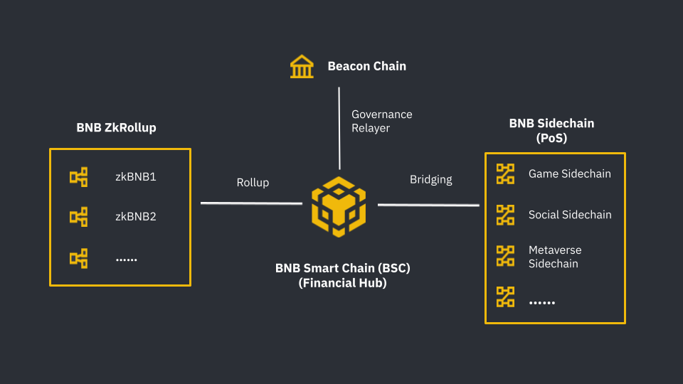
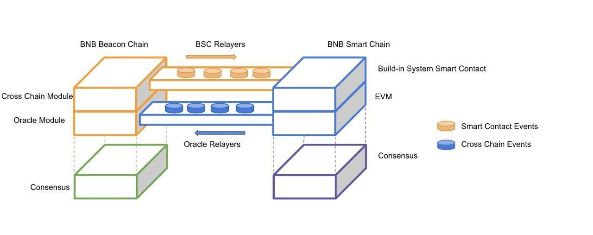
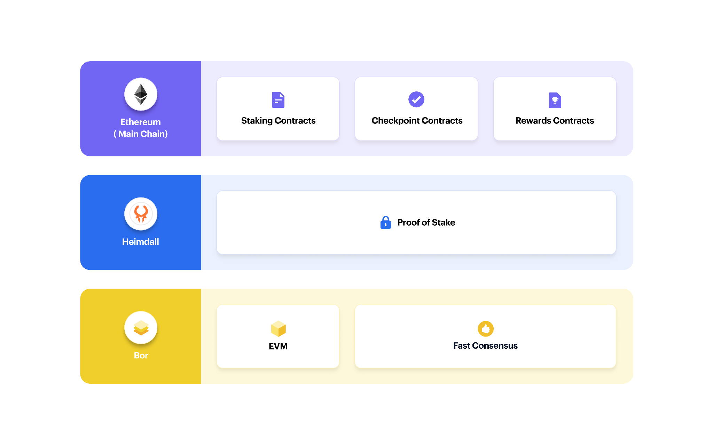
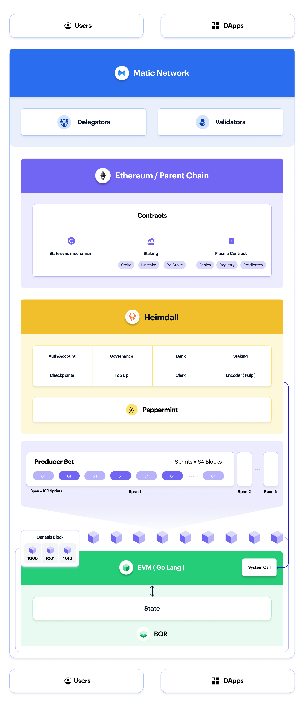

# BNB Smart Chain vs Polygon - Comparing the Differences

Launched in 2020, BNB Smart Chain quickly gained a lot of popularity due to its distinguishing features of low cost and faster transactions. Several projects that are based on other blockchain platforms are migrating to the BNB Chain platform. In this article, we provide a comparison of BNB Chain with other EVM Chains, to help the readers make sound decisions when migrating their projects from other EVM Chains to BNB Chain.

### Ethereum Virtual Machine(EVM)
EVM is the acronym for Ethereum Virtual Machine. In simpler words, EVM can be described as a virtual CPU for Ethereum to execute the bytecodes of smart contracts. 
Ethereum is regarded as the pioneer public blockchain to offer smart contract programmability. However, with the passage of time, slower and more expensive transactions with network congestion have led to the explosion of new blockchains that not only offer much lower transaction costs and faster settlement but also offer EVM-compatibility to attract both developers and users.
EVM-compatibility can be regarded as a stepping stone for achieving blockchain interoperability. EVM-compatibility means creating an EVM-like code execution environment that makes it easy for Ethereum developers to migrate smart contracts to an EVM compatible chain without having to write the code from scratch again. So, developers can conveniently migrate their dApps from the Ethereum network to BSC or other EVM-compatible networks. Some of the major EVM chains include BSC, Polygon, Avalanche, etc.

### BNB Chain 
The BNB Chain ecosystem comprises two blockchain giants, namely, Beacon Chain (BC) and the BNB Smart Chain (BSC). The Beacon Chain is responsible for the Governance of the BNB Chain, offering services such as (staking and voting. Whereas the BNB Smart Chain (BSC) blockchain, founded in 2020, is an EVM compatible blockchain and contains consensus layers and hubs to multi-chains. 
BSC is an improved Ethereum's hard fork and runs parallel to the Beacon Chain. BSC offers smart contract functionality to the BNB Chain ecosystem and is a platform for creating DeFi, Gaming, Social and other DApps. BSC gained real popularity in early 2021 because of its lower gas fees and faster finality as compared to Ethereum's high gas fees and scalability problems.

### Polygon 
Polygon, formerly known as Matic, is a Layer-2 scaling solution for the Ethereum Blockchain. It addresses some of the Ethereum fallbacks by utilizing sidechains, achieving similar decentralization and security of the Ethereum Network. It essentially addresses the issues inherent to the Ethereum blockchain’s scalability and consensus algorithm for speeding up the transactions per second (or TPS).

## Comparing BSC and Polygon
In this section, we provide a comparison of these two platforms with respect to different aspects.
Innovation
BSC is an improved version of Ethereum and uses the Proof of Staked Authority(PoSA) consensus algorithm which uses the best of two worlds - Proof of Authority (PoA) and Delegated Proof of Stake (DPoS). On the other hand, Polygon is a Layer-2 sidechain to Ethereum which utilizes Plasma framework & Proof of Stake (POS) chains to maintain asset security. Polygon is an interoperable, scaling framework for building Ethereum-compatible blockchains. BSC has recently announced the release of ZkRollup and Polygon aims to release one in the future.
Relationship with Ethereum 
As Polygon is a Layer-2 scaling solution that utilizes sidechains for performing computation, it can also be regarded as a Commit Chain of Ethereum. This means Polygon can't exist without Ethereum as all the final transactions are done on Ethereum. Currently, Polygon uses the POS (Proof of Stake) algorithm which is less decentralized, but they plan to move to ZK rollups to address the criticism it receives for itd.
On the other hand, BSC is a hard fork of Ethereum. As BSC is a separate Layer-1 blockchain of its own, it does not need Ethereum to survive and thus has achieved 100% availability since its inception - even during the time Ethereum experienced downtimes.

### EVM Compatibility
Support for the EVM allows interoperability between BSC, Polygon Network, and the Ethereum Network. So, developers can conveniently migrate their dApps from the Ethereum network to either Polygon or BSC and vice versa. 

### Architecture

#### Overview of BSC’s Architecture
BNB Chain is an ecosystem comprising of two major blockchains that serve different purposes, namely, Beacon Chain (BC) and BNB Smart Chain (BSC). To deal with the increased volumes of transactions and daily active users (DAU), BNB Chain ecosystem has evolved to add more scaling solutions and now includes the following components with different responsibilities and purposes.
1.	[BNB Beacon Chain](https://docs.bnbchain.org/docs/learn/beaconIntro) - BNB Chain Governance (staking, voting)
2.	[BNB Smart Chain (BSC)](https://docs.bnbchain.org/docs/learn/intro) - EVM compatible, consensus layers, and with hubs to multi-chains
3.	[BNB Sidechain](https://docs.bnbchain.org/docs/BNBSidechain/overview/bs-overview) - Ready-to-use PoS solutions for developing custom blockchains and dApps with existing BSC functionality.
4.	[ZkBNB](https://docs.bnbchain.org/docs/zkbnb/zkbnb-overview)- ZkRollup solution to scale BSC as a super high-performance blockchain.
 

The design principles of **BSC**:
1.	**Standalone Blockchain:** even though BSC can be termed as a Layer-2 solution to Beacon Chain, technically, it is a standalone blockchain. Most of the fundamental technical and business functions of BSC are self-contained and it can run well even if the BC is stopped.
2.	**Ethereum Compatibility:** To take advantage of the mature applications and community of Ethereum, BSC chooses to be compatible with the existing Ethereum mainnet. This means all of the dApps, ecosystem components, and toolings work with BSC and require zero or minimum changes. Furthermore, BSC nodes require similar (or a bit higher) hardware specification and skills to run and operate. 
3.	**Staking Involved Consensus and Governance:** Staking-based consensus is more environmentally friendly and leaves more flexible options to community governance. Expectedly, this consensus enables better network performance over proof-of-work blockchain systems, i.e., faster blocking time and higher transaction capacity.
4.	**Native Cross-Chain Communication:** both BC and BSC are implemented with native support for cross-chain communication among the two blockchains. The communication protocol is designed to be bi-directional, decentralized, and trustless. It concentrates on moving digital assets between BC and BSC, i.e., BEP2 tokens, and eventually, any other BEP tokens introduced later. 
 

#### Overview of the Polygon’s Architecture
Polygon’s architecture can be divided into three layers. 
* ***Ethereum layer:** comprises a set of contracts for different functionalities, like staking, checkpointing, and rewards, that exist on the Ethereum mainnet.
* ***Heimdall layer:** comprises a set of proof-of-stake Heimdall nodes that run parallel to the Ethereum mainnet and are responsible for monitoring the set of staking contracts deployed on the Ethereum mainnet and committing the Polygon Network checkpoints to the Ethereum mainnet. Heimdall is based on the Tendermint protocol.
* ***Bor layer:** a set of block-producing Bor nodes shuffled by Heimdall nodes. Bor is based on Go Ethereum.

##### Staking management smart contracts on Ethereum
A set of staking management contracts are employed on the Ethereum mainnet which enable the Proof of Stake (PoS) mechanism on Polygon. The staking contracts implement the following features:
* Anyone can stake the MATIC tokens on the staking contracts existing on the Ethereum mainnet to join the Polygon system as a validator.
* Earn staking rewards for validating state transitions on the Polygon Network.
* Save checkpoints on the Ethereum mainnet.

##### Heimdall (validation layer)
The Heimdall can rightfully be called the heart of the Polygon system. It is responsible for the management of validators, block producer selection, spans, the state-sync mechanism between Ethereum and Polygon and other essential aspects of the system. It uses the Cosmos-SDK and a forked version of Tendermint, called Peppermint. Even though Heimdall uses a customized version of the Cosmos-SDK, it follows the same pattern - for better for worse.
The Heimdall layer can also be called the validation layer. It is responsible for the collection of blocks produced by Bor into a Merkle tree and publishing the Merkle root periodically to the root chain. Checkpoints are referred to as the periodic publishing of snapshots of the Bor sidechain. For every few blocks produced on the Bor layer, a validator on the Heimdall layer is responsible for the following
1.	Validating all the blocks produced since the last checkpoint.
2.	Creation of a Merkle tree of the block hashes.
3.	Publishing the Merkle root hash to the Ethereum mainnet.

#### Checkpointing
In the Polygon network, Checkpoints hold greater significance, primarily due to the following reasons
1.	Providing finality on the root chain.
2.	Providing proof of burn in withdrawal of assets.

#### Overview of the Checkpointing Process.
* A subset of active validators from the pool is selected to act as block producers for a span and are responsible for the creation and broadcasting of new blocks on the network.
* A checkpoint includes the Merkle root hash of all blocks created during any given interval. All nodes validate the Merkle root hash and attach their signature to it.
* A proposer selected from the validator set is responsible for collecting all the signatures for a particular checkpoint and then committing the checkpoint on the Ethereum mainnet.
* The responsibility of creating blocks and proposing checkpoints is variably dependent on a validator’s stake ratio in the overall pool.
  
#### Bor (block producer layer)
Bor can also be termed as Polygon's sidechain block producer. It is the entity which is responsible for the collection of transactions into blocks. Bor block producers are essentially a subset of the validators and to maintain decentralization these are periodically shuffled using historical Ethereum block hashes by the Heimdall validators. The Bor node implementation is basically the sidechain operator. The sidechain VM is EVM-compatible and is a basic Geth implementation with custom changes to the consensus algorithm.
 

### Consensus Algorithms
Polygon utilizes the **Proof-of-Stake (PoS)** consensus algorithm, whereas BSC employs the **Proof-of-Stake-Authority (PoSA)**. Both consensus mechanisms' major concern is to overcome Ethereum’s high gas fees and slower transactions. 

In the PoS consensus algorithm, validators are chosen based on a user's commitment to the network in terms of its stake, meaning that the higher the stake, higher the chances of getting selected as a validator. On the other hand, **PoSA** is a combination of the **PoS** and the **PoA (Proof of Authority)** consensus mechanisms. 

Utilizing the PoSA consensus mechanism, BSC was initially launched with **21** validators. However, now BSC supports a set of **44** validators, with **26** of them being active. In future, BSC plans to increase the active validators to **41**, and about **80-100** validators in total. The top validator candidates with the most bonded stakes are chosen to be part of the subset of active validators and produce blocks. The double-sign detection and other slashing logic guarantee security, stability, and chain finality. Other than the **41 active validators**, BSC also has a set of inactive validators known as the **Candidates**. Even though the chances of getting elected are less, the Candidates upon selection can produce blocks and charge gas fees in the BSC mainnet. Similar to Active Validators, unavailable candidates are slashed but for a smaller amount. In an extreme case, if a majority of the active 41 validators get attacked and offline, Candidate Validators can report to Beacon Chain about the stale blocking, resume it and eventually propose re-election of the active validator set.

In contrast, Polygon uses the **Proof-of-Stake (PoS)** consensus mechanism on its _Plasma/POS commit chains_. For any user willing to participate in the consensus process, users are required to stake MATIC tokens on the staking smart contracts on Ethereum mainnet. This staking indicates a user's commitment to the process. A slashing mechanism (removal of staked funds) is also implemented to discourage stakers from submitting invalid blocks, illegally verifying blocks, or executing invalid transactions. Requiring validators to put funds at risk before they can participate in consensus helps maintain the integrity of the network.

## Conclusion
There are a variety of EVM-compatible blockchain on the market, and while from the first sight, it may look as if all of them are the same, the reality is every blockchain is aimed for specific use cases and both security and availability requirements. This is why BSC has undergone several iterations of improvements to ensure superb performance and the most advanced security.

