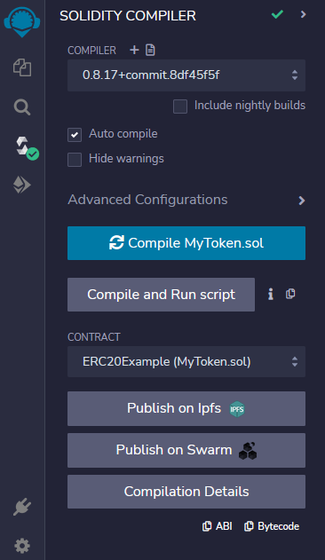

# Migrate Tokens From Polygon to BSC
In this article, we'll discuss how to migrate deployed tokens from Polygon to BSC and also the migration of vested tokens.

## Token migration 
Often, blockchain projects begin as whitepapers, promising innovative technologies to follow in the future. However, there can be multiple twists and turns in the process of transforming from a design paper to a real product. One such can be choosing to move to an entirely different blockchain, than that initially proposed.
In such scenarios, projects can require a token migration, also known as a token swap. 

Token migration is a process that involves transmitting a token holder's balance on one blockchain to another blockchainLet's discuss how to create an ERC20 token on BSC and how to bridge an ERC20 token from the EVM-based blockchain to BSC - we'll be using Polygon as an example.

## Creating ERC20 Token on BSC
Since EVM chains are compatible with ERC20 tokens, in this section, we provide  guidelines on how to develop ERC20 tokens on BSC and how to bridge an ERC20 token from Polygon to BSC. 
For this tutorial, we will use Truffle Suite to compile and deploy ERC20 token smart contracts onto the BSC network.

### Pre-requisites
There is no need for any local environment settings for deploying Solidity smart contracts on BSC using the Remix IDE.
All you require is a browser-based Web3 wallet (e.g. MetaMask) to interact with the BSC Testnet and the deployed contracts. If you are already using MetaMask, it is recommended to create a new account for testing with Replit. You can do this from the account menu, which appears when you click on the account avatar in the top right corner of the MetaMask interface.
You must set up all of the following prerequisites to be able to deploy your Solidity smart contract on BSC:
* [Download Metamask wallet](https://metamask.io/)
* [Configure BNB Smart Chain Testnet on Metamask](https://academy.binance.com/en/articles/connecting-metamask-to-binance-smart-chain)
* [Get BNB Testnet tokens](https://www.bnbchain.org/en/testnet-faucet)

### Setting Up Remix IDE
* Remix is an online IDE to develop smart contracts.
* You need to choose Solidity compiler - choose the appropriate compiler version; 0.8.15 was used for this tutorial.

### Creating a Workspace in Remix IDE
* Click on the plus icon to create a new workspace.
  


* Choose the OpenZeppelin's ERC20 template; give a meaningful name to your workspace and press ok.


* Remix will create the smart contract "MyToken.sol" for you as well as will import any dependencies. We can edit this "MyToken.sol" to create our own ERC20 tokens.


 
### Writing the Smart Contract
* Open the "MyToken.sol" file and replace the token name and symbol with that of your choice, as shown in the code  below

```
// SPDX-License-Identifier: MIT
pragma solidity ^0.8.4;

import "@openzeppelin/contracts/token/ERC20/ERC20.sol";

contract ERC20Example is ERC20 {
    constructor() ERC20("ERC20Example", "ERC20EG") {}
}
```

* Rename the MyToken.sol file to the name of your token.


* Compile the smart contract 



* Deploy the smart contract. Make sure that your MetaMask wallet is configured for use with the BNB Smart Chain Testnet. 
  * Select inject provider in the environment variable and make sure you see your connect account address in the Account field. 
  * Click on the Deploy button to deploy the ERC20 token smart contract.


* Confirm the transaction by pressing the confirm button on the metamask notification. 


* To view your tokens in your metamask wallet, follow [this](https://metamask.zendesk.com/hc/en-us/articles/360015489031-How-to-display-tokens-in-MetaMask) tutorial.


 
## Bridging Tokens from Polygon to BSC
With several different blockchain platforms available for development, of the varied underlying architecture, consensus mechanism, etc., interoperability and cross-communication between these platforms with respect to token and data transfers can be nearly impossible. 

Blockchain bridges are designed to overcome this hindrance of interoperability and provide a secure mechanism for decentralized token transfers. 
A cross-chain bridge connects independent blockchains and enables the transfer of assets and information between them, allowing users to access other protocols easily. Most commonly, the lock-and-mint model is used by cross-chain bridges for the purpose of moving assets between different chains. An easy description of things work is as follows:
1.	Alice sends a certain amount of Token A to a specific address on the source chain (say, Polygon) and pays the transaction fee. 
2.	Alice's Token A is locked up in a smart contract by a trusted validator or held with a trusted custodian. 
3.	Equal amount of Token B is minted on the destination blockchain (say, BSC). 
4.	Alice receives Token B in her wallet address and can use it on the new blockchain. 
 
[Image Source](https://blog.makerdao.com/what-are-blockchain-bridges-and-why-are-they-important-for-defi/)

Now, what if Alice needs to move back the Token B onto her source chain and use them as Token A. This is where the burning mechanism comes into play:
1.	Alice sends leftover Token B to a specific address on the second chain. These tokens are "burned" in the sense that they are irrecoverable. 
2.	The validator or custodian triggers the release of Alice's Token A on the source chain. Alice then receives the released funds in her original wallet. 
One thing critical to understand is how cross-chain bridges actually work. Cross-chain bridges work by "wrapping" tokens in a smart contract and issuing native assets you can use on another chain. For example, wrapped Bitcoin (wBTC) is an ERC-20 token that uses Bitcoin (BTC) as a collateral. Users must deposit BTC on the Bitcoin blockchain, before receiving wBTC tokens on the BSC network. 

### Celer's cBridge
In this section of the article, we describe how to use [Celer's cBridge](https://cbridge.celer.network/1/10/DF) for bridging tokens from Polygon to BSC. For custom tokens, you will have to get your token whitelisted by the Celer team. For this tutorial, we will be bridging a more commonly supported USDC token from the Polygon blockchain to BSC using the [Celer cBridge](https://cbridge.celer.network/1/10/DF).

### Using Celer cBridge to bridge tokens from Polygon to BSC
1.	Head over to the official Website of cBridge and connect your wallet. After clicking on the connect wallet button, choose your desired wallet. If metamask is chosen, confirm the connection on the popup notification.


2.	Select your source and destination chains. To make sure your Metamask wallet is connected to the source chain, approve and switch to the network by confirming the metamask notification. 
3.	Make sure your source chain is set to Polygon and the destination chain is BSC. Also, confirm that you have selected USDC for transfer. 
 


4.	Adjust the slippage tolerance if required. Your transfer may fail if you choose a very low slippage tolerance.


5.	Review your transaction details and confirm the transaction.
6.	Confirm Transfer, then sign the transaction on your wallet.
7.	Wait for the transaction to confirm and for your funds to arrive on your destination
8.	In case of transfer failure, due to insufficient liquidity on the destination chain or an unfavorable slippage tolerance, you will receive a popup explaining the reason for the failure. You can cancel the transfer either through the popup, or by clicking Request Refund in the transfer history.

## Migrating Vested Token from Polygon to BSC
In crypto space, Vesting is known as the process of locking and distributing purchased tokens within a particular timeframe known as the Vesting Period. Vested tokens can be described as a certain amount of tokens that are held aside for a particular time period, usually for the team members, partners, advisors, and others who are contributing to the development of the project. 
Vested tokens are essentially locked in a smart contract and are released automatically until certain conditions are met. Vesting basically gives the impression that the team is highly interested in the project and aims to continue working on the project development. Additionally, vesting lowers market price manipulations. 
There are two options available for migrating vested tokens from EMV-based blockchain to BSC.
* Migrate the vesting contract and move the whole vesting schedule to BSC.
* Migrate the tokens that are being released as per the schedule

## Migrating Vesting Contract
Vesting is essentially a smart contract that has all of the vested tokens locked up which are released over a time period automatically when certain conditions are met. One of the possible ways to migrate vested tokens from BSC is to migrate the vesting contract that is to deploy your vesting smart contract to BSC. 

### Migrating Vesting Tokens 
Another method is to ask the holders of vested tokens to exchange the already bought vested tokens with a newly created equivalent token on BSC and continue the release of vested tokens as per schedule. Another way is to take a snapshot of the vested token holders and update their wallets with an equivalent amount of new tokens and continue with the vesting schedule and release of tokens.

## Conclusion
With several advantages and an ecosystem that supports web3 development, BNB Chain has gained a lot of attention from developers and blockchain projects. Several blockchain projects are now choosing to migrate their tokens from other EVM chains to BSC. In this article, we provided a brief overview of how to migrate tokens from one EVM to another, in particular from Polygon to BSC.

