# 솔라나에서 BNB 스마트 체인으로 토큰 이전

 블록체인 기술은 시간이 지나며 최고의 인기를 얻으면서 계속 존재하고 있음을 증명하였습니다. 이러한 인기로 인해 dapp 개발을 위한 고유한 기능을 제공하는 여러 블록체인 플랫폼들이 탄생하였습니다. 모든 블록체인 플랫폼은 장단점이 있고 기본 구조, 작동 메커니즘 등이 상이하기 때문에 블록체인 기반 프로젝트와 암호화폐 토큰이 한 블록체인 플랫폼에서 다른 플랫폼으로 이동하는 것도 가능합니다. 예를 들어 BSC의 혁신적인 기능을 활용하여 보다 나은 사용자 경험을 제공하기 위해 솔라나에서 BNB 스마트 체인(BSC) 옮기는 것을 고려할 수 있습니다.

출범 후 2년 밖에 지나지 않았지만, BNB 체인은 낮은 수수료와 빠른 트랜잭션 지원하여 많은 인기를 얻게 되었습니다. BSC는 2021년 12월에 일일 활성 사용자(DAU)가 220만명을 달성한 가장 큰 네트워크입니다. 현재 시점에서 BNB 스마트 체인의 DAU는 120만명이며, 하루 네트워크는 약 13% 사용되며 36억개의 트랜잭션 및 TVL이 [61.4억](https://defillama.com/chain/BSC)이 발생합니다. BNB 체인은 가장 큰 스마트 컨트랙트 기반 블록체인 생태계가 되면서 다른 블록체인 플랫폼에서 운영하는 여러 프로젝트들이 BNB 체인으로 이전하고 있습니다.

이 문서에서는 EVM 체인이 아닌 솔라나에서 BSC로 토큰을 이전하는 방법에 대해 다룹니다. 우선 토큰이 무엇인지 설명하고, BSC에서 지원하는 토큰과 솔라나에서 BSC로 토큰을 이전하는 법과 베스팅된 토큰을 옮기는 방법에 대해 설명할 예정입니다. 

## 토큰 개요

"토큰"은 암호화폐나 암호화 자산을 나타내는 용어로 이해할 수 있습니다. 다만 암호화폐 및 자산 표준들이 다양한 방식으로 사용할 수 있도록 발전하면서 토큰이란 용어는 다양한 상황에서 사용할 수 있게 되었습니다. 예를 들어 토큰은 암호화폐 형태를 띌 수 있으며 다른 암호화폐 블록체인에서 운영되는 디지털 자산 형태가 될 수도 있습니다. 다만 토큰은 어떤 형태이든 다른 암호화폐처럼 보유하거나 거래할 수 있습니다. 

## 토큰의 중요성

블록체인 기반 탈중앙화 생태계에서 토큰은 디앱 내에서 다양한 목적을 달성하기 위해 중요한 역할을 합니다. 토큰은 크게 대체 가능 및 대체 불가능한 토큰으로 나눌 수 있습니다. 대체 가능한 토큰은 상호 교환이 가능한 자산으로 주로 암호화폐로 사용됩니다. 다른 목적으로 사용되는 토큰은 주로 다음과 같습니다:

- **DeFi 토큰:** 디파이(DeFi) 프로토콜 및 디앱들은 전통적인 금융 시스템 기능(예치, 대출, 적금, 보험, 거래 등)을 재현합니다. 디파이 토큰들은 디파이 앱들과 프로토콜을 작동시키며 기불 및 트랜잭션 흐름을 제어하도록 프로그래밍할 수 있습니다. 이 토큰들은 거래가 가능하며 다른 암호화폐처럼 보유할 수 있습니다.
- **유틸리티 토큰:** 은 소속된 어플리케이션 및 프로토콜 생태계에서 특정 목적을 달성하기 위해 설계되었습니다. 이를 통해 사용자들이 특정 네트워크에서 의사 결정 과정에 참여할 수 있습니다. 또한 유틸리티 토큰은 생태계에 고유하게 존재하며 채굴할 수 없습니다. 이들은 이미 채굴된 행태로 한꺼번에 만들어 졌으며, 프로젝트를 제작한 팀에 의해 비율이 결정되어 배분되었습니다.
- **거버넌스 토큰:** 블록체인 프로젝트의 개발 및 운영의 거버넌스와 관련된 사항에 대한 투표권을 보유자에게 부여하는데 특화된 토큰입니다. 이를 통해 프로젝트는 커뮤니티에 의사결정권을 분배할 수 있습니다. 이러한 분산형 거버넌스 모델은 토큰 보유자의 이익을 프로젝트의 이익과 일치시키는 데 도움이 됩니다.
- **대체 불가능한 토큰 (NFT):** NFT는 실제 혹은 디지털 세상에서 소유권을 나타냅니다. 이를 통해 실제 세계의 미술, 수집품, 부동산 등을 토큰화 할 수 있습니다. NFT를 통해 자산의 소유자는 블록체인 네트워크에 인해 다른 사람들이 소유권을 조작하거나 복제할 수 없도록 만듭니다.
- **증권형 토큰:** 새로운 형태의 자산으로 전통 증권의 주식이나 채권을 블록체인 상에서 구현한 것입니다. 주요 사용처는 중계자 없이 회사의 지분을 판매(기존 주식 시장에서 파는 것처럼)하거나 다른 자산(예를 들어 부동산)을 쪼개서 판매할 수 있습니다. 현재 많은 주요 기업들 및 스타트업에서는 증권형 토큰을 자금 조달의 잠재적인 대안으로 생각하며 검토하고 있습니다. 

## 토큰 표준

블록체인 기술이 전례 없는 인기를 얻으면서 다양한 프로젝트가 여러 블록체인 플랫폼에서 자체 토큰을 발행하였습니다. 이 토큰들은 제작된 블록체인 상에서 호환이 되고 토큰 표준을 따르는 것이 중요합니다.

호환성, 상호운용성, 보안성을 보장하기 위해 토큰 표준이 나왔습니다. 토큰 표준은 사기, 토큰 간의 기술적 비호환성 및 블록체인 정의에 맞지 않는 발행을 방지하기 위해 설계되었습니다. 이는 사실상 새로운 토큰을 발행 및 구현할 때 필요한 규칙들을 정의한 것입니다. 토큰 표준에 주로 들어가는 규칙은 토큰의 총 공급량, 민팅 과정, 소각 과정 및 토큰을 활용한 트랜잭션 과정 등을 정의합니다.

### ERC 토큰 표준

가장 널리 사용되는 토큰 표준은 ERC 표준입니다. Ethereum Request for Comments(ERC)는 이더리움 토큰 발행 및 구현 시 따라야하는 규칙이 정의되어 있습니다. ERC20은 기술적 표준으로 토큰이 이더리움 생태계 내에서 문제 없이 작동하기 위해 필요한 규칙들을 포함하고 있습니다. 가장 널리 쓰이는 표준 중에서 하나이며 주로 암호화폐로 사용하는 대체 가능한 토큰에서 사용합니다. 인기가 많은 다른 ERC 표준에는 ERC-721(NFT)이나 ERC-1155(멀티 토큰 표준)가 있습니다.

#### BEP 토큰 표준

ERC와 유사하게 BNB 체인은 토큰 발행, 관리, 구현을 위해 BEP(Binance Evolution Proposals)라는 자체 토큰 표준을 만들었습니다. BEP는 토큰 관리 규칙이며 BNB 체인에서 온체인 자산을 발행하기 전 따라야하는 기준이 정의되어 있습니다. 가장 많이 사용되는 BEP 표준은 BEP2과 BEP20입니다. BEP2는 비컨 체인의 네이티브 코인인 반면, BEP20는 BSC에서 자주 사용됩니다. 참고로 BEP20는 ERC20과 매우 유사하며 기능을 확장한 형태입니다. BNB 체인 생태계의 자체 토큰인 BNB도 BEP20 토큰입니다.

#### SPL 토큰 표준

평행 실행 엔진으로 유명한 솔라나 블록체인은 2017년에 출범되었으며 현재 인기있는 블록체인 생태계 중 하나입니다. SOL은 솔라나 생태계의 자체 토큰이며 사실상 유틸리티 토큰입니다. SOL은 SPL 프로토콜을 사용합니다. 이더리움의 ERC 표준이나 BSC의 BEP와 유사하게, [Solana Program Library (SPL)](https://spl.solana.com/token)는 솔라나 블록체인의 토큰 표준입니다. SPL은 솔라나의 시레벨(Sealevel) 평행 런타임에서 운영되는 온체인 프로그램의 모음입니다. 솔라나에서의 토큰 프로그램들은 대체 가능한 토큰 및 대체 불가능한 토큰의 주요 구현 방법을 정의합니다. SOL 토큰은 두 가지 주요 사용처가 있습니다:

- 네트워크 사용 및 스마트 컨트랙트 이용으로 발생한 트랜잭션 비용 지불
- 지분 증명 매커니즘의 토큰 스테이킹

### BSC 호환 토큰 표준

BNB 체인은 비컨 체인(BC)와 BNB 스마트 체인(BSC) 이라는 두 거대한 블록체인에 의해 운영되는 생태계입니다. BNB 생태계의 자체 화폐인 BNB는 처음에 ERC20에서 배포되었지만 현재 BEP2 토큰입니다.

#### BEP2 토큰

비컨 체인은 스테이킹 및 투표를 통해 BNB 체인 생태계의 거버넌스를 담당합니다. BEP2는 BNB 체인의 자체 화폐인 BNB의 토큰 표준입니다. 자체 토큰 표준으로 BEP2는 BNB 체인 외의 다른 블록체인들과 호환되지 않습니다. 또한 BEP2 형식의 BNB는 바이낸스 암호화폐 거래소에서 트랜잭션 수수료로만 사용될 수 있습니다. BEP2의 한계는 스마트 컨트랙트 개발 지원이 부족하다는 것입니다. 자세한 사항은 [BEP2 제안서](https://github.com/bnb-chain/BEPs/blob/master/BEP2.md)를 참고하세요.

#### BEP20 토큰

BSC는 BNB 체인의 블록체인 컴포넌트로 사용자들에게 스마트 컨트랙트 기능 및 디앱 개발 플랫폼을 제공합니다. BEP20는 BSC에서 토큰 컨트랙트를 생성하기 위한 토큰 인터페이스 표준입니다. BEP20 토큰은 BEP2와 [ERC20](https://eips.ethereum.org/EIPS/eip-20)과 호환되도록 설계되었습니다. BEP20은 EVM 체인 및 이더리움 스마트 컨트랙트와 호환되도록 ERC20을 연장하였습니다. ERC20 기능 외에도 BEP20 표준에는 getOwner와 소수점 같은 추가적인 요소들이 존재합니다. BEP20에 관한 더 자세한 상황은 [여기](https://github.com/binance-chain/BEPs/blob/master/BEP20.md) 제안서를 참고하세요.

## 토큰 이전

많은 블록체인 프로젝트들은 백서에서 향후 기술 혁신이 있을 것이라고 서술합니다. 다만 백서에서 실제 제품을 생성할 때 예상치 못한 문제들이나 계획의 변경이 일어납니다. 그 중 하나는 처음에 만들고자 했던 블록체인에서 다른 블록체인에 출시하기로 결정하는 것입니다. 이런 경우 프로젝트들은 토큰 스왑으로 알려진 토큰을 이전해야 하는 경우가 발생합니다. 토큰 이전은 토큰 소유자의 잔고를 원래 블록체인에서 다른 블록체인으로 옮기는 것을 뜻합니다. 이 부분에서는 솔라나에서 BSC로 토큰을 이전하는 것에 대해 다룹니다.

### 솔라나에서 BSC로 토큰 이전하기

솔라나와 바이낸스 스마트 체인(BSC)은 서로 호환되지 않기 때문에 브릿지를 연결하는 방법이 약간 복잡합니다. 솔라나에서 BSC로 토큰을 이전하기 위한 방법에는 두 가지가 있습니다. 크로스 체인 브릿지를 사용하여 솔라나에서 BSC로 토큰을 옮기거나, BSC상에 새로운 토큰을 생성하고 보유자들에게 예치한 후 솔라나에 배포된 토큰을 이어가지 않는 방법이 있습니다. 이 부분에서는 BSC에서 커스텀 BEP20 토큰을 생성하는 방법과 솔라나에서 BSC로의 브릿지를 이용하는 방법에 대한 가이드를 제공합니다.

#### BSC에서 BEP20 토큰 생성하기

BEP20는 BSC상의 ERC20 토큰 표준입니다. 이더리움의 ERC20과 차이점은 BEP20 토큰은 BSC 네트워크에서만 호환된다는 것입니다. 그래도 BSC는 이더리움 가상 머신(EVM) 기반이므로 ERC20와 BEP20는 구현 방법 및 세부 사항이 사실상 동일합니다. 이 부분에서는 커스텀 BEP20 토큰을 생성하기 위한 방법을 소개합니다.

이 튜토리얼에서는 BEP20 토큰 스마트 컨트랙트를 [Remix IDE](https://remix.ethereum.org/)로 컴파일 및 BSC 테스트 네트워크로 배포할 예정입니다.

#### 필수 요건
[_자세한 사항을 여기를 참고하세요_​](https://docs.bnbchain.org/docs/remix-new#pre-requisites)**

Remix IDE를 사용하여 솔리디티 스마트 컨트랙트를 BSC에서 배포하는 것에 로컬 환경 설정을 할 필요는 없습니다.

BSC 테스트넷과 배포된 컨트랙트를 사용하기 위해서는 브라우저 기반 Web3 지갑(예. [메타마스크](https://metamask.io/))이 필요합니다. 이미 [메타마스크](https://metamask.io/)를 사용하고 계시면, Remix IDE에서 테스트하기 위해 새 계정을 생성하는 것을 권장합니다. 메타마스크 인터페이스 우측 상단의 계정 아바타를 클릭하면 나오는 계정 메뉴에서 생성할 수 있으며, 더 자세한 사항은 [여기](https://metamask.zendesk.com/hc/en-us/articles/360015289452-How-to-create-an-additional-account-in-your-wallet#:~:text=Either%20tap%20the%20account%20icon,the%20account%20to%20change%20it.)를 참고하세요.

BSC에서 솔리디티 스마트 컨트랙트를 배포하기 위해서는 다음 요소들을 미리 설정해야 합니다:

- [메타마스크 지갑 다운로드](https://metamask.io/)
- [메타마스크에서 BNB 스마트 체인 테스트넷 설정하기](https://academy.binance.com/en/articles/connecting-metamask-to-binance-smart-chain)
- [BNB 테스트넷 토큰 얻기](https://testnet.binance.org/faucet-smart)

#### Remix IDE 설정하기
[_자세한 사항을 여기를 참고하세요_](https://docs.bnbchain.org/docs/remix-new#setting-up-remix-ide)

- 리믹스는 스마트 컨트랙트 개발을 위한 온라인 IDE입니다.
- 솔리디티 컴파일러를 선택하고, 맞는 컴파일러 버전을 선택합니다. 이 튜토리얼에서는 0.8.17을 사용합니다.

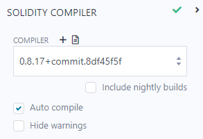

#### Remix IDE에서 작업환경 생성하기

- 플러스 아이콘을 클릭하여 새로운 작업환경을 생성하세요.


- 오픈 제플린(OpenZeppelin)의 ERC20 템플릿을 선택하세요. 작업환경에 의미 있는 이름을 부여한 후 ok를 누르세요.

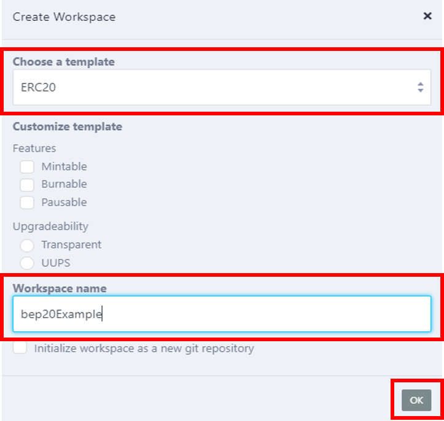

- 리믹스는 "MyToken.sol"이란 스마트 컨트랙트를 생성하고 종속된 라이브러리 및 프로그램 버전을 불러옵니다. "MyToken.sol"을 수정하여 자체 ERC20 토큰을 생성할 수 있습니다.

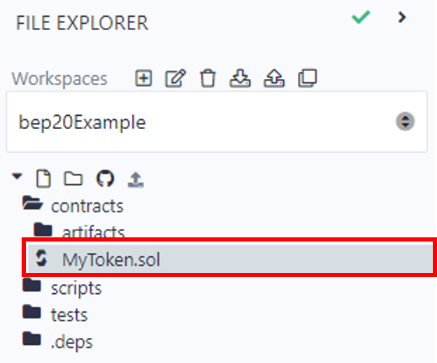

#### 스마트 컨트랙트 작성하기

[_자세한 사항을 여기를 참고하세요_](https://docs.bnbchain.org/docs/remix-new#writing-the-smart-contract)

- "MyToken.sol" 파일을 열고 아래 코드와 같이 토큰 이름과 심볼을 원하는대로 변경합니다.

```
SPDX-License-Identifier: MIT
pragma solidity ^0.8.0;
import "@openzeppelin/contracts/token/ERC20/ERC20.sol";

contract BEP20 is ERC20 {
    constructor(uint256 initialSupply) ERC20("BEP20Test", "BPT") {
        \_mint(msg.sender, initialSupply);
    }
} 

```

- MyToken.sol 파일 이름을 토큰 이름으로 변경하세요, 여기서는 BEP20.sol 입니다.

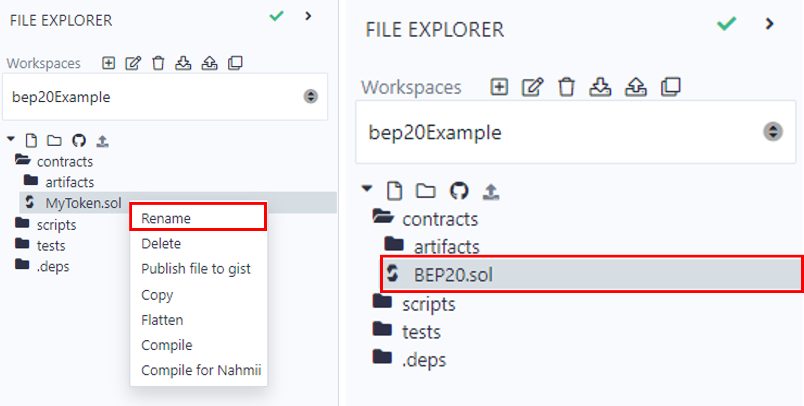

- 스마트 컨트랙트를 컴파일 하세요


- 스마트 컨트랙트를 배포하세요. 메타마스크 지갑이 BNB 스마트 테스트넷을 사용하도록 설정되어 있는지 다시 한 번 확인하세요. 
    - 환경 변수에서 주입 공급자(inject provider)를 선택하고 Account 부분에서 당신의 연결되는 계정 주소를 확인하세요. 
    - Deploy 버튼을 클릭하여 BEP20 토큰 스마트 컨트랙트를 배포하세요. 스마트 컨트랙트는 배포 시 initialSupply 변수에서 설정된 공급량 만큼 초기에 토큰을 생성하고 공급합니다.

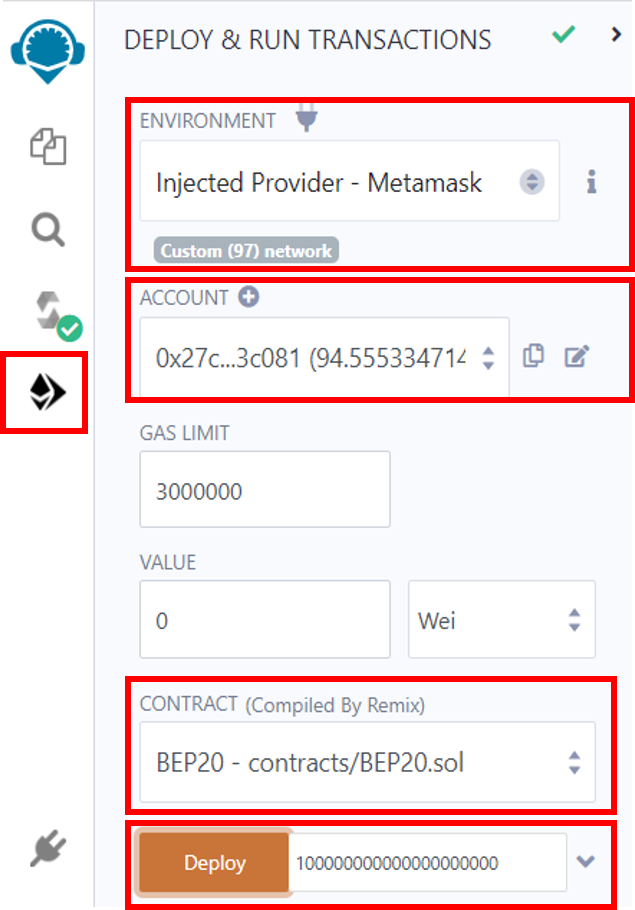

- Deploy 버튼 옆의 입력창은 initialSupply(최초 공급량) 변수를 정의하기 위한 곳입니다. 예를 들어 100 토큰을 배포하려면 100000000000000000000 를 입력하고 "Deploy"를 클릭하면 됩니다.
- 네트워크에 컨트랙트를 배포하려면 BNB가 수수룔 들기 때문에 메타마스트 트랜잭션을 허용해야합니다. 메타마스크에서 Confirm 버튼을 눌러 트랜잭션을 진행하세요.

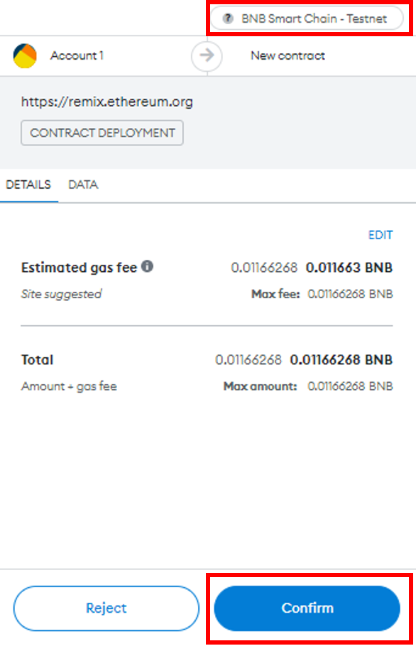

- 메타마스크 지갑에서 토큰을 조회하려면 [다음](https://metamask.zendesk.com/hc/en-us/articles/360015489031-How-to-display-tokens-in-MetaMask) 튜토리얼을 참고하세요.

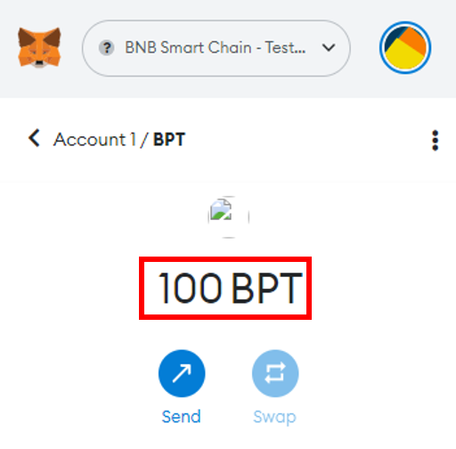

## 솔라나에서 BSC로 토큰 브릿지 사용하기

다양한 구조 및 합의 체계를 가진 블록체인 플랫폼이 개발되면서 토큰이나 데이터의 크로스 체인 통신 및 상호운용이 거의 불가능할 수 있습니다. 블록체인 브릿지는 이러한 상호 운용성의 장애를 극복하고 분산된 토큰 전송을 위한 안전한 메커니즘을 제공하도록 설계되었습니다.

크로스 체인 브릿지는 개별 블록체인을 연결하고 자산 전송을 가능하게 하여 사용자들이 다른 프로토콜들을 더욱 쉽게 접근할 수 있도록 합니다. 크로스 체인 브릿지의 작동 방식을 이해하는 것은 중요합니다. 크로스 체인 브릿지는 토큰을 스마트 컨트랙트에서 "래핑(Wrapping)"하여 다른 체인에서 사용할 수 있도록 자체 자산을 발행합니다. 예를 들어 래핑된 비트코인(wBTC)는 ERC-20 토큰으로 이더리움 체인 상에서 비트코인처럼 사용됩니다. 사용자들은 이더리움 네트워크에서 wBTC 토큰을 받기 전에 비트코인 블록체인에서 BTC를 이체해야 받을 수 있습니다.

이 부분에서는 솔라나에서 BSC로 브릿지를 통해 옮기기 위해 [포털 브릿지](https://www.portalbridge.com/) 사용 방법에 대해 다룰 예정입니다. 한 가지 기억해야 할 것은 배포한 커스텀 토큰을 포털 브릿지에서 확인하려면 브릿지 공식 팀에서 화이트리스트 인증을 받아야 합니다. 이 튜토리얼에서는 USDC 토큰을 [포털 브릿지](https://www.portalbridge.com/)를 통해 솔라나 블록체인에서 BSC로 옮길 것입니다. 

### 웜홀 포털 브릿지

웜홀의 포털 브릿지는 다른 체인 간의 토큰들을 브릿지를 통해 전송할 수 있게 전송할 수 있게 해줍니다. 자산을 직접 스왑하거나 변환하기보다, 웜홀은 보내는 자산을 스마트 컨트랙트에 잠근 후 웜홀 래핑된 자산을 목표하는 체인에서 새롭게 발행합니다. 웜홀 래핑된 자산은 보내진 체인의 거래소에서 다른 자산으로 거래할 수 있습니다. 이 튜토리얼을 통해 웜홀을 통해 BSC를 포함한 솔라나와 다른 체인들의 자산을 브릿지로 연결할 수 있습니다.

### 포털 브릿지를 사용하여 솔라나에서 BSC로 토큰 전송

배포한 커스텀 토큰을 포털 브릿지에서 확인하려면 브릿지 공식 팀에서 화이트리스트 인증을 받아야 합니다. 이 튜토리얼에서는 USDC 토큰을 [포털 브릿지](https://www.portalbridge.com/)를 통해 솔라나 블록체인에서 BSC로 옮길 것입니다. 

- [포털 토큰 브릿지](https://www.portalbridge.com/)에 접속하세요.

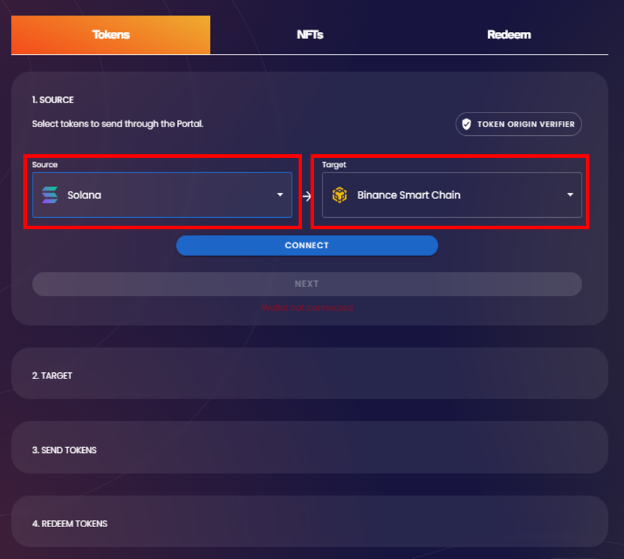

브릿지는 4단계를 거칩니다:

- Source 결정
- Target 결정
- 토큰 전송
- 토큰 상환

이 가이드에서는 솔라나에서 BSC로 브릿지를 통해 전송할 예정입니다.

**1단계: Source 체인, Target 체인, Source 토큰 결정**

- "Source"에서 브릿지로 옮길 체인을 결정합니다. 이 경우에는 토큰들이 솔라나 블록체인에 있어서 솔라나를 "Source"로 설정합니다.
- "Target"은 브릿지를 통해 이동한 토큰입니다. BNB 스마트 체인을 "Target"으로 선택합니다.

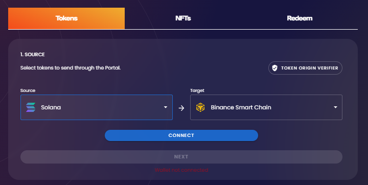

- Source와 Target을 선택 후 "Connect"를 클릭합니다. Source 지갑의 팝업이 나타나는데, 이 가이드에서는 팬텀 지갑입니다.
- 지갑이 연결되었을 때 "Select a Token" 버튼이 나타납니다.
- Source 토큰을 결정합니다. 이는 솔라나에서 브릿지로 옮기거나 스왑하고자 하는 토큰을 의미합니다. 이 가이드에서는 USDCso를 솔라나에서 BSC로 브릿지를 통해 이전할 것입니다.

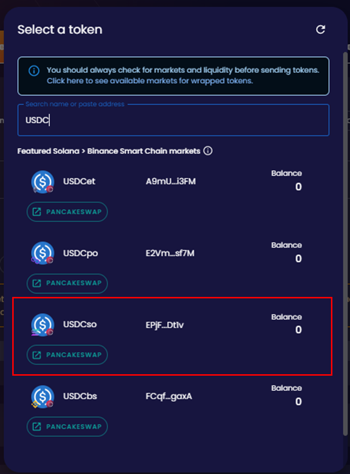

**참고:** 드롭다운 메뉴 상단에 "Featured" 토큰은 솔라나 자체에 유동성이 존재하며, 토큰을 스왑할 수 있는 거래소 링크가 존재합니다. Featured 카테고리 외에 토큰들을 선택하지 마세요. 실수로 유동성이 없거나 적은 토큰을 브릿지하여 스왑을 할 수 없을 수 있습니다.

- 브릿지하고자 하는 토큰을 선택하면, 인터페이스에서 바꾸고자 하는 토큰의 잔고가 나타납니다.
- 브릿지하고자 하는 토큰의 양을 선택하고, "Next"를 클릭합니다.

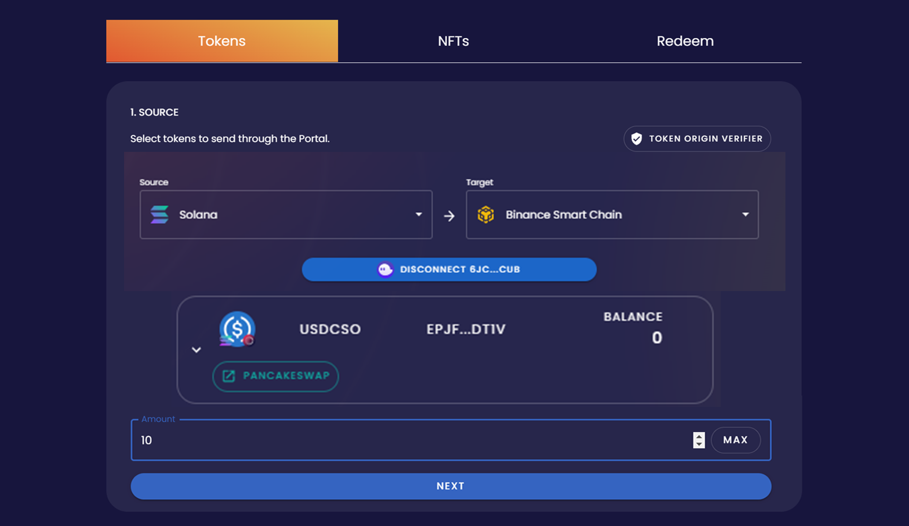

**2단계: Target 체인 및 지갑 결정**

- Target 체인을 결정합니다. 이는 토큰을 브릿지를 통해 보내고자 하는 체인입니다.

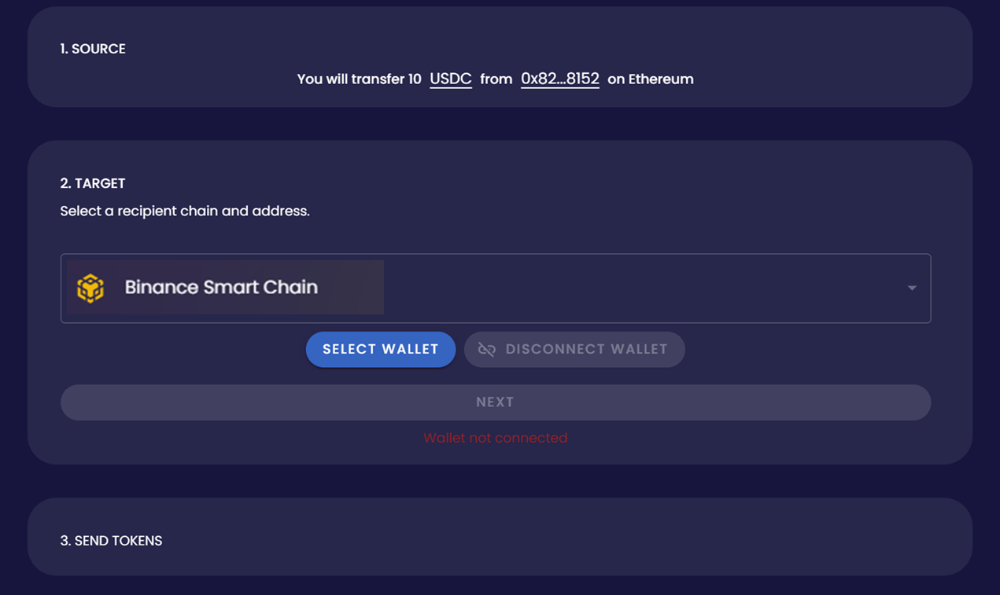

- "Select Wallet"을 클릭하세요. 목표하는 체인의 자체 지갑의 팝업이 나타납니다. 이 가이드에서는 메타마스크를 사용합니다.
- 팝업에서 "Connect"를 클릭하세요.
- "Create Associated Account" 버튼이 나타납니다. 버튼을 클릭하여 메타마스크에서 토큰이 나타날 토큰 계정을 생성합니다.

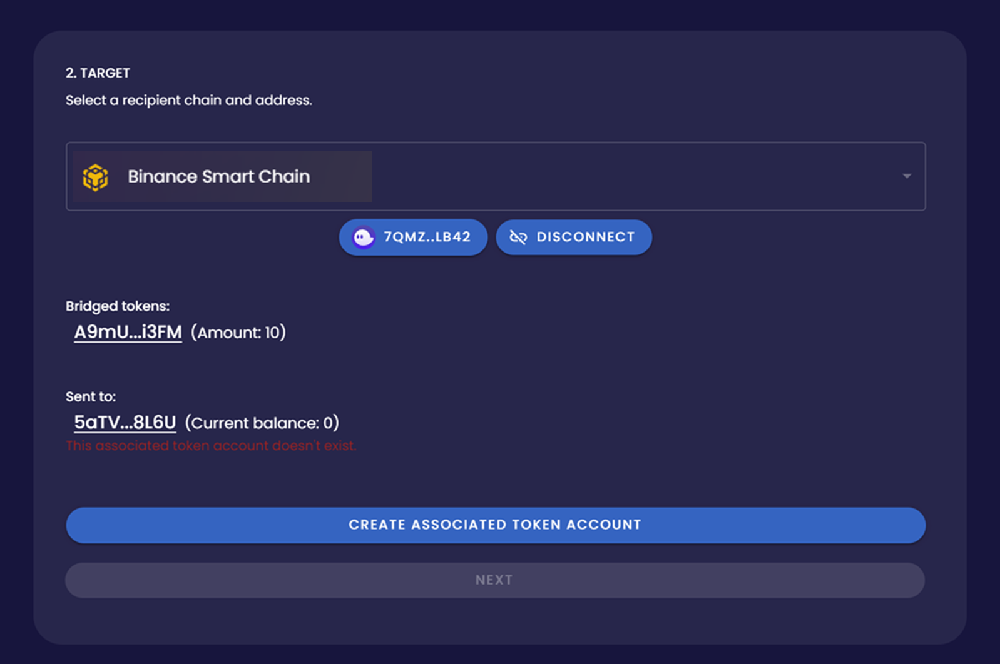

- "Create an Associated Account"를 클릭하면 Target 지갑의 팝업이 나타납니다. "Approve"를 클릭합니다.

**3단계: 토큰 전송**

- 보내는 지갑이 연결되고, 토큰 연관 계정이 준비됩니다. "Transfer"를 클릭하여 전송을 시작합니다.

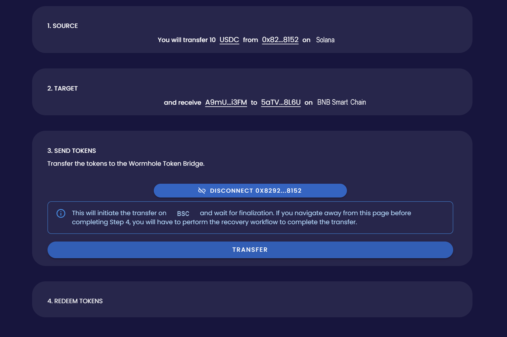

- 사이트 팝업에서 "Confirm"을 클릭합니다.
- 지갑 팝업의 "Confirm"을 클릭합니다. 이를 통해 브릿지로 토큰을 전송하기 위한 가스비를 지불을 승인합니다. **참고:** 트랜잭션 수수료는 보내는 쪽 뿐만 아니라 받는 쪽의 수수료도 지불해야 합니다.

**4단계: 토큰 상환**

- "Redeem"을 클릭하여 Target 지갑에 전송을 받습니다.
- 여러 팝업들이 (주로 4가지) Target 지갑에 나타날 것입니다.
- 팝업에 뜬 각 트랜잭션들을 승인합니다.
- 참고: Target 토큰의 트랜잭션 수수료는 Target 체인의 자체 토큰으로 지불해야 합니다.

[**참고 튜토리얼:**](https://blog.hubbleprotocol.io/how-to-get-started-on-solana-part-2-bridging-tokens/)

## 솔라나에서 베스팅 토큰을 BSC로 이전하기

크립토 분야에서 _**베스팅**_은 구매한 토큰을 잠그고 _**베스팅 기간**_이라는 특정 기간 사이에 일정량을 배분하는 것을 뜻합니다. 베스팅된 토큰은 팀이나 파트너사, 어드바이저 및 프로젝트에 개발에 기여자들에게 배분되어 일정 기간동안 보유하고 있는 토큰들을 의미합니다.

베스팅된 토큰은 스마트 컨트랙트에 잠겨 있으며 특정 조건에 도달했을 때 자동으로 해제됩니다. 베스팅은 개발한 팀이 프로젝트에 지속적으로 관심을 갖고 개발하게 되는 동기를 마련합니다. 또한 베스팅을 통해 시장 가격 조작을 억제합니다.

솔라나에서 BSC로 베스팅된 토큰을 이전하는 방법에는 두 가지가 있습니다.

- 베스팅 컨트랙트와 스케쥴을 솔라나에서 BSC로 이전합니다.
- 토큰을 이전하고 스케쥴대로 잠금을 해제합니다.

### 베스팅 컨트랙트 이전

베스팅은 스마트 컨트랙트가 모든 베스팅된 토큰을 잠근 후 특정 조건이 성립되면 시간에 맞게 자동으로 락업된 토큰들을 해제합니다. 솔라나 블록체인에서 BSC로 베스팅된 토큰을 옮기는 방법 중 하나는 솔라나의 베스팅 컨트랙트를 BSC로 옮기는 것입니다. 다만 한 가지 기억해야 할 것은 솔라나는 스마트 컨트랙트 작성을 러스트를 사용하는데, BSC의 스마트 컨트랙트는 주로 솔리티디로 작성됩니다. 다음과 같이 언어가 호환되지 않는다는 것은 솔리디티로 처음부터 스마트 컨트랙트를 재작성하거나 BSC에서 러스트 호환 EVM 솔루션을 통해 러스트 기반 스마트 컨트랙트를 실행해야 합니다.  

### 베스팅된 토큰 이전하기

솔라나와 BSC는 완전히 다른 토큰 표준을 갖고 있어, 브릿지를 사용할 수 있어도 BSC 상에서 새로운 토큰을 민팅하는 것이 더 합리적인 방법입니다. 토큰을 옮기는 프로젝트 팀들은 보유자들에게 이미 산 베스팅된 토큰을 BSC에서 새롭게 같은 가치를 보유하며 생성된 생성된 토큰으로 일정에 맞춰 교환해준 후 스케쥴대로 잠긴 토큰들을 새로운 토큰으로 푸는 방법을 사용할 수 있습니다. 또 다른 방법은 베스팅된 토큰 보유자들의 스냅샷을 촬영하여 그들의 지갑에 같은 양의 새로운 토큰으로 업데이트 후 베스팅된 토큰을 스케쥴에 맞춰 푸는 방식이 있습니다.

## 결론

여러 장점 및 Web3 개발을 지원하는 생태계를 통해 BNB체인은 개발자 및 블록체인 프로젝트들로부터 주목을 받게 되었습니다. 솔라나 같이 EVM 기반이 아닌 체인에서 제작된 몇몇 블록체인 프로젝트들이나 토큰들은 BSC로 이전하고 있습니다. 이 문서에서는 솔라나에서 BSC로의 토큰 이전에 대해 간단하게 보았고, 암호화 토큰들에 대해 다뤘으며, 브릿지를 통해 솔라나에서 BSC로 자산을 옮기는 방법과 베스팅된 토큰을 이전하는 방법에 대해 다루었습니다.