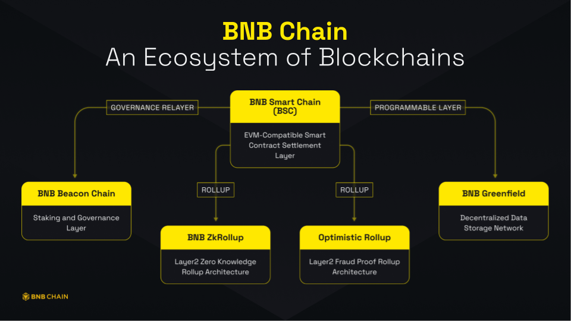

# BNB Chain: An Ecosystem of Blockchains
Build N Build Chain aka BNB Chain, one of the most popular blockchains in the world, dedicates to delivering its core infrastructure necessary for future public adoption, and always remains as a community-first and open-source ecosystem built on a permissionless and decentralized environment.

BNB Chain is composed of two blockchains - BNB Beacon Chain (BC) and BNB Smart Chain (BSC). The [BNB Beacon Chain](./learn/beaconIntro.md) is the blockchain component that is responsible for the governance of the BNB Chain and manages staking and voting on the BNB Chain. Whereas, the [BNB Smart Chain](./learn/intro.md) is the blokchain component that is EVM compatible, consensus layers, and with hubs to multi-chains. 
BNB Chain, one of the most popular blockchains in the world, dedicates to delivering its core infrastructure necessary for future public adoption, and always remains as a community-first and open-source ecosystem built on a permissionless and decentralized environment.

## What is Build N Build (BNB) Chain?
BNB Chain is comprised of:
1. **[BNB Beacon Chain](learn/beaconIntro.md)** - BNB Beacon Chain is the staking and governance layer of the BNB ecosystem.
2. **[BNB Smart Chain (BSC)](learn/intro.md)** - An EVM-compatible blockchain that brings programmability and interoperability to the BNB ecosystem.
3. **[ZkBNB](zkbnb/zkbnb-overview.md)** - ZkBNB is an infrastructure that is built on ZK Rollup architecture for developers that helps them to build large-scale BSC-based apps with higher throughput and much lower or even zero transaction fees.
4. **[BNB Greenfield](greenfield/overview.md)** - BNB Greenfield introduces an entirely new structural and economic paradigm for data in the Web3 era. The ownership, usage, and monetization of data are now possible first and foremost for users, as well as all participants in the BNB Chain ecosystem.

## BNB Token
BNB stands for "**Build and Build**". Along with _fueling_ transactions on BNB Chain (similar to gas on Ethereum), BNB also acts as a governance token. Holding BNB gives you the right to make your voice heard and is necessary for participation in BNB Chain's decentralized on-chain governance. With this name change also comes more advancements to benefit users, projects and developers connected to the BNB Chain community.

## Key Features
Currently, BSC offers a considerable block size of **__140M gas ceiling__**. We plan to introduce a more advanced logic for blockchain storage and BSC client to cover it and allow further expansion.  Currently, to fully sync the BSC blockchain, validators need extensive storage and time. Scaling down the validator and node operator requirements is necessary to enable a seamless BSC experience.

- New technologies, like Erigon, are being verified to decrease both time and storage demands for validators nodes while performing full sync. 
- Working with validators and infrastructure providers to deploy new solutions to address this issue, such as  
  - Parallel EVM
  - Better block process pipeline
  - Improved state caching
  - Fast sync mode
  - Distributed nodes 
  - Introduce more validators to join the block production of BSC

## Future Goal 
Innovation never sleeps, and it's clear that the future of BNB Chain goes into a world of over 1 billion users. BNB Chain's mission is to build the infrastructure that powers the world's parallel virtual ecosystem, and BNB Chain's commitment to the community is that it will be: 
- Open
- Multi-chain
- For creators and inventors
- Permissionless
- Forever decentralized

## Resources 
- [Whitepaper](https://github.com/bnb-chain/whitepaper)
- [Official GitHub](https://github.com/bnb-chain)
- [Official Blog](https://www.bnbchain.org/en/blog/)
