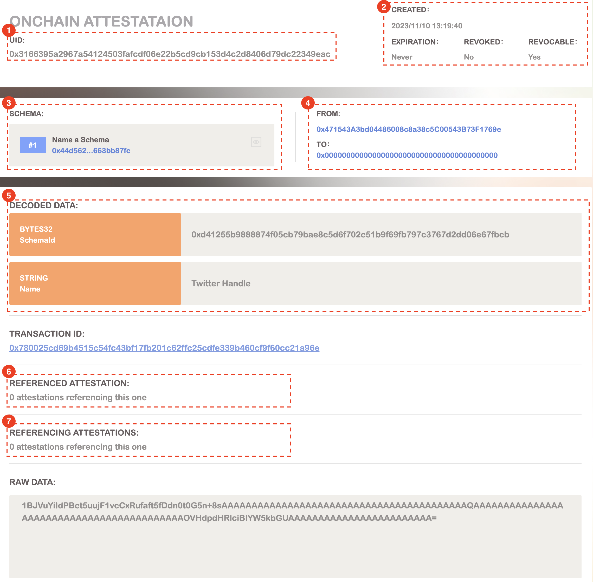
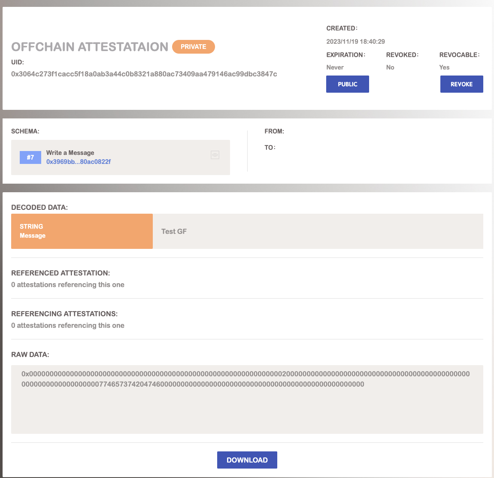

# BNB Attestation Service

## What is attestation?
Attestations are digital signatures on structured data used to build more trust on-chain.

## BNB Attestation Service(BAS)
The [BNB Attestation Service (BAS)](https://bascan.io/attestation) is an infrastructure built on the BNB ecosystem for generating attestation to verify information. BAS assists users in on-chain or off-chain verification, allowing them to assert ownership of attestation by storing them in Greenfield. This approach ensures data privacy and access control.

BAS serves as a standard and infrastructure for generating arbitrary attestations. Anyone can define any attestation in BAS along with its resolver. BAS supports the generation of on-chain/off-chain attestations, and by storing off-chain attestations in Greenfield, users gain ownership, ensure attestation privacy, and implement access control.

### Core Components of BAS
* [Schema](https://doc.bascan.io/core_concept/schema): A schema is a structured framework that defining the data format and resolver with attest function. Schema dictate what kind of data can be attested and how that data should be presented.

* [Attestation](https://doc.bascan.io/core_concept/attestation): Attestation provide a standard for user to import any data into web3. With in BAS, attestations can be created on-chain and off-chain.

* [Resolver](https://doc.bascan.io/core_concept/resolver): User can use resolver to introduce any logic to their attestations.

Checkout the smart contracts [here](https://github.com/bnb-attestation-service/bas-contract).

## Types of attestations
Attestations can be made either onchain or offchain. While onchain attestations are stored directly on the BNBChain, offchain attestations reside outside of it, often in decentralized storage solutions like Greenfield. Both methods have their unique advantages, and the choice largely depends on the specific requirements of the use case.

Learn about the idfference between on-chain and off-chain difference [here](https://doc.bascan.io/core_concept/onchain_vs_offchain).

### On-Chain Attestation Record

Users can clearly view the structure of an on-chain attestation on [BASCAN](https://bascan.io/attestation).

### OffChain Attestation Record
Here's an off-chain attestation record. Unlike the on-chain record, this attestation is public, and the server is unaware of it. Users can share the attestation URL with others to decode the data or publish it to GreenField. Once published or pinned to GreenField, the status icon will switch to "public.”

## Use Cases of Attestation

### KYC

Combined BAS with zero-knowledge proofs, [zkPass](https://bas.zkpass.org/) uses three-party TLS and zero-knowledge (ZK) technology to create zero-knowledge proofs of user’s real-world assets or actions directly in your browser. This ensures privacy by not oversharing your data and not requiring API authorizations. ZKPass is a private data protocol using affordable zero-knowledge technology. You can learn more about the use case in this [blog](https://medium.com/zkpass/zkpass-commits-4-million-zkp-tokens-for-bnb-chain-airdrop-alliance-rewards-87e5f32a9ee4).

### Developer on-chain reputation

[Aspecta ID](https://aspecta.id/) integrates with the BAS to create and verify on-chain attestations of developers' achievements and activities, ensuring transparency, security, and trust in digital identity management. This partnership allows Aspecta to offer a tamper-proof and verifiable record of developers' skills and contributions, enhancing interoperability and trust within the AI and blockchain ecosystems. By leveraging BAS, Aspecta provides developers with a robust platform to authenticate their credentials, making their professional profiles more credible and secure. You can learn more about the use case in this [blog](https://medium.com/@aspecta_id/bnb-chain-builder-economy-a-builder-community-consensus-to-boost-innovation-with-productivity-ba4d71af6021).

