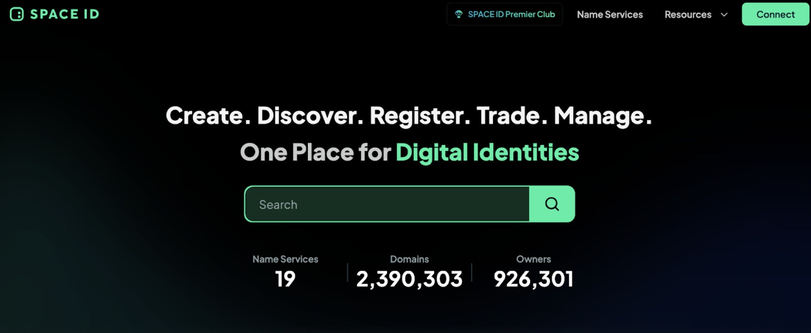

# Decentralized Naming Service

## Traditional DNS vs Decentralized Naming Service

Traditional Domain Name System (DNS) and decentralized naming services like [Ethereum Name Service (ENS)](https://docs.ens.domains/) serve similar purposes but differ significantly in their underlying structures and control mechanisms. Traditional DNS translates human-readable domain names into IP addresses, enabling users to access websites easily. It is managed by centralized authorities, such as ICANN, which oversee the domain registration and resolution process. This centralization can lead to vulnerabilities, such as censorship, single points of failure, and control by a few entities.

In contrast, decentralized naming services like ENS operate on blockchain technology, distributing control among network participants. ENS maps human-readable names to Ethereum addresses and other resources using smart contracts, ensuring that no single entity has overarching control. This decentralized approach enhances security, reduces the risk of censorship, and provides greater resilience against failures, aligning with the principles of trustlessness and user sovereignty inherent in blockchain ecosystems.

## SpaceID
### Overview

[Space ID](https://space.id/) offers a universal namespace for blockchain, enabling users to register and manage domain names across different blockchains. It enhances cross-chain interoperability and simplifies user identification across the Web3 ecosystem. This project supports a broad range of applications, from crypto trading to token lending and NFT minting, showcasing a versatile approach to decentralized digital identities.

### How SpaceID works

SPACE ID aims to create a universal name service network that connects decentralized identities with the physical and digital worlds. It is progressing toward becoming a comprehensive digital identity solution for Web3. Read the details [here](https://docs.space.id/)

### Key features of SpaceID

**Multi-Chain Name Service**

Among the top priorities of SPACE ID is supporting more blockchains and top-level domains (TLDs). Unlike SPACE ID 1.0, whose main emphasis was on .bnb Name Service, SPACE ID 2.0 instead focuses on multi-chain name service.
SPACE ID has reached out to various blockchains for partnership discussions, and expects its ecosystem to flourish with time.

**Web3 Name SDK & API**

SPACE ID aims to streamline web3 services through the use of a single SDK to assist in the building of DApps. This saves developers time, since they don't have to work with multiple protocols and be encumbered with issues of blockchain incompatibility.
This vision is being realized by adding an all-in-one API over the SDK, allowing current and future partners to seamlessly integrate their web3 services with their unified Web3 Name SDK.

### Benefits of DNS

* **Simplified Address Management**: Users can use easy-to-remember names instead of long hexadecimal addresses, reducing the risk of errors in transactions.
* **Interoperability**: SpaceID names can point to various types of addresses and resources, supporting multiple blockchain networks and off-chain data.
* **Decentralization**: SpaceID is built on blockchain, ensuring that no single entity controls the naming system, which enhances security and censorship resistance.
* **Flexibility**: Domain owners have full control over their domains, including the ability to create subdomains, update addresses, and manage metadata.

### Use Case of SpaceID
* **Cryptocurrency Wallets**: Users can receive payments using simple names instead of complex addresses.
* **Decentralized Websites**: SpaceID names can point to Greenfield content, enabling decentralized websites.
* **Identity Management**: SpaceID can be used as part of a decentralized identity system, linking a user’s SpaceID to their decentralized identifiers and attestations.
* **DApps and Smart Contracts**: Developers can use SpaceID to provide human-readable names for their smart contracts and decentralized applications, improving user experience.
