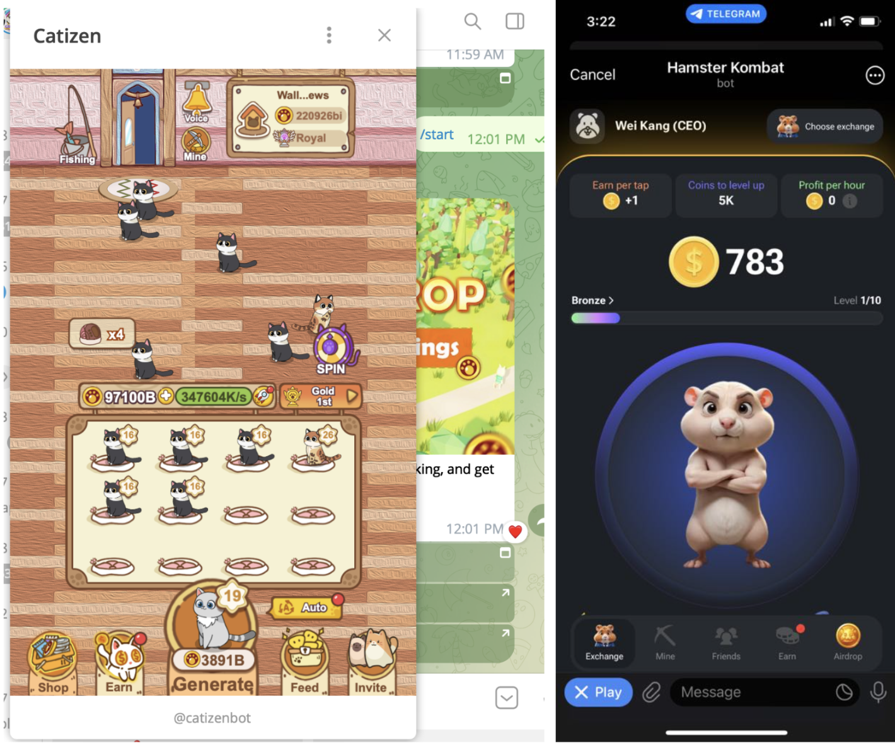
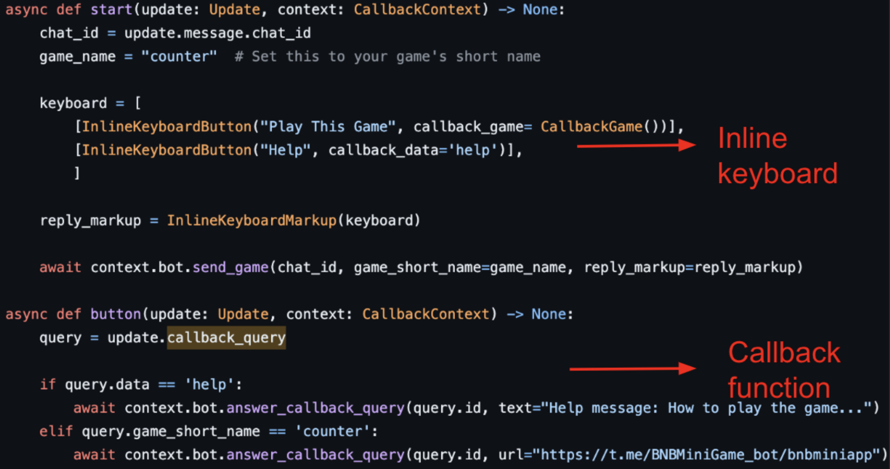
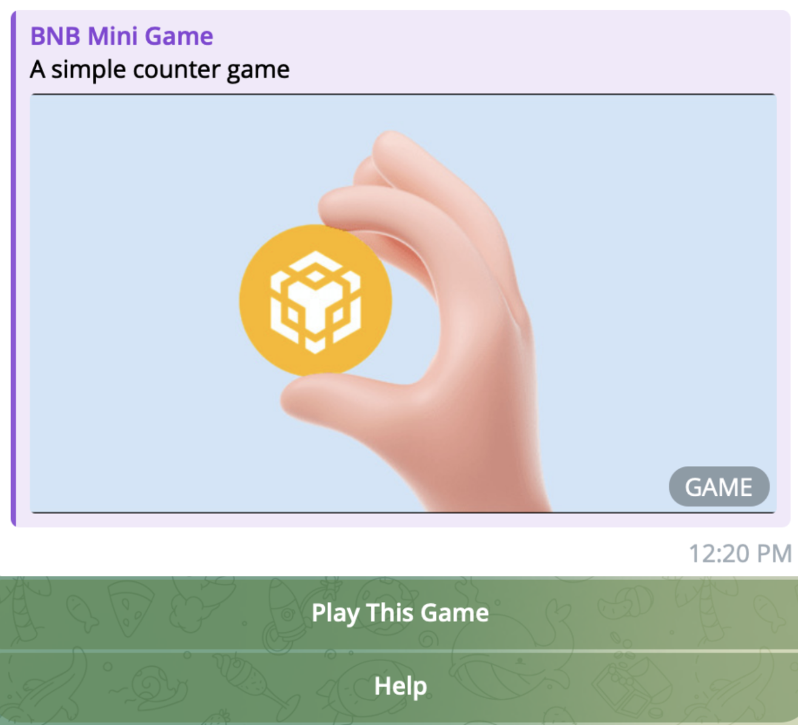

# Creating Telegram BNB Mini Apps: A How-to Guide for Developers 

Launching decentralized applications on Telegram has become increasingly popular due to it giving users access to mini apps and games without requiring them to install additional software, providing an easy way for users to interact with blockchain-based services. This lowers the barriers to entry for users and makes it simple for developers to distribute their apps to a large Telegram audience.

This guide will walk you through the steps for building a basic Telegram mini app on BNB in just a few hours. By the end, you will have the skills to launch your own BNB project on Telegram’s open platform. Whether you are a blockchain expert or just starting out, this tutorial aims to demystify decentralized app creation. So let’s get started building on BSC! The possibilities are endless when you master Telegram mini apps.

**Note: This guide only provides a high level overview of the steps that may be involved in creating telegram BNB miniapp. For a detailed guide, visit the [youtube demo](https://www.youtube.com/watch?v=6dMDhPOpPjI) or the [github repo](https://github.com/kang5647/bnb-telegram-demo).**

# Introduction to Telegram BNB Mini Apps 

## What are Telegram Mini Apps? 

**Telegram Mini Apps** are lightweight web apps that run inside Telegram chats. They allow developers to create social experiences, games, marketplaces, and other services that tap into Telegram's features and large audience.

Catizen’s play-to-earn and Hamster Kombat’s tap-to-earn, what's the next big thing for Telegram mini games? 

Mini Apps load instantly, work offline, and don't need to be installed. They can use Telegram login, payments, storage and more. Developers can build Mini Apps using HTML, CSS and JavaScript.
How to Create a Mini App
To create a Mini App, you need:

- A Telegram bot - Create a bot using @BotFather and obtain an API token.
- A web app - Build an app using web technologies (HTML, CSS, JS) that communicates with your bot.
- Mini App manifest - Provide info about your app like name, description, icon, and your web app's URL. Register the manifest using the @BotFather.

Your web app will run in an iframe and communicate with the user's Telegram app using the Telegram Bridge. The Bridge exposes the Telegram API and passes messages between your web app and the user's Telegram app.

## Mini App Types

There are two main types of Mini Apps:

### Inline Apps

Inline Apps show up as results when a user types the bot's username followed by a query. The user taps an app result to launch the Mini App.
Inline Apps are great for:

- Search experiences
- Quick interactions
- Discovering new content

### Direct Link Apps

Users can open a Direct Link App just by tapping a link. Direct Link Apps are aware of the current chat context and support shared, collaborative experiences.
Direct Link Apps are ideal for:

- Social experiences
- Games
- Productivity tools
- And more

The mini app can also be launched from a keyboard button, from an inline button, and from the bot menu button. Refer to the [official Telegram mini app documentation](https://core.telegram.org/bots/webapps#implementing-mini-apps).

## Step-by-Step Guide to Creating a BNB Mini App
With the power of Telegram behind them, Mini Apps open up countless new opportunities for creativity and building engaging experiences on the platform. The potential for Mini Apps is huge, and this is just the beginning.

### Create a Telegram Bot
To get started, you will need to create a Telegram bot. Visit the **@BotFather** bot and enter **/newbot** to create a new bot. You will receive an API token for your bot. Keep this token private as it will allow you to control your bot.

### Connect the Webapp to Your Bot
Next, you need to connect your webapp to the Telegram bot. Use the **/newapp** command in the **@BotFather** bot by selecting your bot. Provide details such as the app name, description, photo, etc. Finally, enter the URL of your webapp. Your mini app will now appear in the Telegram app and can be launched by users.

### Additional Capabilities
Mini apps opened from a direct link have limited capabilities. They cannot read or send messages on behalf of the user. However, they support cooperative and multiplayer features within the current chat context. Users must redirect to inline mode to actively pick a result in order to send messages.

Mini apps are powerful tools for creating fully-fledged web services, team collaborations, multiplayer games, and more. The possibilities are endless. 

## Turning Your Mini App Into a Game
To transform your Mini App into an engaging game on Telegram, you must first register a bot with **@BotFather** and create a Mini App as outlined in the previous section. Once you have a functioning Mini App, you can then convert it into a game by using Telegram’s Game API.

### Difference Between Mini Apps and Mini Games
Mini games build upon mini apps by providing additional information like:

- leaderboards, 
- game descriptions, 
- and a button to launch the game. 
- They help package your mini app to make sharing with friends and community easier. 

To create a mini game, use the /newgame command and configure callback functions to return your game's URL.

### Register a Game with @GameBot
The first step is to register your game with @BotFather. Send the /newgame command to @BotFather, and provide the required details including:

- The title and description of your game
- A cover photo
- The message text a user will see when starting a game
- The URL of your Mini App

Implement Callbacks
You must implement callback functions in your code to handle interactions with the Telegram Game API. Specifically, you need a callback_query() callback which will receive updates from Telegram when a user clicks an inline button in your game. Within this callback, you should check the callback ID to determine which button was clicked. You may implement multiple inline keyboard buttons for the game, but note that the first button must always launch the game.

### Share Your Game
Once registered, your game will receive a shareable game URL and a game code which players can enter to launch the game. You can share this URL and code on your website, social media, and within Telegram chats to spread your game to new players.

### Consider a Leaderboard (Optional)

To increase engagement and competition, you can implement an in-game leaderboard where players can see the top scores. You will need to store player scores in a database, and return the leaderboard data within your callbacks. Leaderboards are an optional feature, but can greatly enhance the popularity and longevity of Telegram games.

By following these steps, you can build fully-featured games within Telegram using JavaScript and the Telegram Game API. Games are an exciting way to engage users, and the possibilities for multiplayer, social, and interactive gaming experiences on Telegram are endless. Let your creativity run wild, and build the next hit game on Telegram!

## FAQs About Telegram BNB Mini Apps

### What are the main features of Telegram BNB Mini Apps?

Telegram BNB Mini Apps allow developers to build decentralized applications on BSC or opBNB that can be accessed directly within Telegram. Some of the key features include:

- Access to Telegram username, chat ID and message ID to provide chat context
- Ability to send messages on behalf of users (with their permission)
- Option to accept payments via crypto wallet
- Access to BSC/opBNB for decentralized functionality
- Option to build multiplayer games and other interactive experiences

### What are the differences between Mini Apps and Bots?

Telegram Mini Apps are web apps that run within the Telegram app, while Telegram Bots are automated accounts controlled via API. Some key differences include:

- Mini Apps have a visual interface, while Bots primarily communicate via text messages.
- Mini Apps can access features like payments, games and location sharing, while Bots have more limited functionality.
- Mini Apps require user consent to access data and send messages, while Bots have implicit access to user data and messaging abilities.
- Mini Apps provide a more robust experience for users while still protecting their data and privacy. Bots continue to be useful for simpler use cases like news updates, reminders and customer support.

### What languages and frameworks can I use to build a Mini App?

You can build Telegram Mini Apps using:

- HTML, CSS and JavaScript - Mini Apps are web apps that run within the Telegram app.
- React, Vue.js or Angular - Popular JavaScript frameworks can be used to build the frontend.
- Solidity - To write smart contracts on BSC for decentralized functionality.
- Web3.js - To interact with BSC from your Mini App's frontend.

## Summary
Telegram mini apps and mini games provide developers with exciting new ways to engage users. By following the step-by-step guide outlined here, you can leverage Telegram's massive user base to share your own interactive web apps and games. Consider the possibilities - multiplayer experiences, chatbots, productivity tools and more are now just a few lines of code away. As Telegram continues expanding its platform, developers have an opportunity to be on the cutting edge and reach an audience of millions. So don't wait, get started building your own mini app today! With the right idea and a bit of effort, you could create the next viral sensation on Telegram.

