Welcome to the BNB Chain Tokenization Tutorial.

Tokenization is a process by which you create a digital token that can be traded on a blockchain. Tokenization has opened up a new way for businesses to create new revenue streams and help small and medium-sized businesses (SMEs) to access funding and grow their businesses.

BNB Chain's multi-chain framework, including BSC, opBNB, and Greenfield, offers scalability, low costs, and secure data storage, making it ideal for SMEs to start their tokenization journey. 

There are different sceneraios of tokenization, but in general, you need to prepare a wallet account and buy some crypto before you start create token. 

In this toturial we will focus on the account preparation steps, help you set up your wallet and buy crypto to pay fees. 

## 1 Preparation

### 1.1 Set Up Wallet 

A Web3 wallet is essential to start your tokenization. You need to confirm the operations as well as pay service fees using the web3 wallet. Also, a web3 wallet account is your identity during the whole process. 

In this guide, we suggest you use Trust Wallet or Metamask to create your first Web3 wallet account:

- Trust Wallet (<https://trustwallet.com/>) 
- MetaMask (<https://metamask.io/> )

#### 1.1.1 Trust Wallet

##### Step 1: Install the Wallet Extension

We suggest you use the Chrome extension to create your wallet, since most of the tokenization tools provide only a desktop version, they cannot be used very well on your mobile phone. 

Follow these steps to get started:

1) **Download and install Chrome browser**

Here is the download link:

- Google Chorme windows 64：<https://www.chromedownloads.net/chrome64win/> 

- Google Chorme windows 32：<https://www.chromedownloads.net/chrome32win/> 

- Google Chorme mac：<https://www.chromedownloads.net/chrome64osx/>

2) **Visit the Trust Wallet Official Website**

* Go to the [Trust Wallet](https://trustwallet.com/) website.

* Click on the “Download” button and choose the extension compatible with Chrome.

3) **Add the Extension**:

* Click the “Add to Chrome” button and confirm the installation.

##### Step 2: Create a New Wallet Account

Once the extension is installed, you need to create a new Trust Wallet account:

1) **Open the Extension**: Click on the Trust Wallet icon in your browser’s toolbar to open the extension.

2) **Start Setup**: Click the ‘Get Started’ button to begin, and click on “Create a New Wallet” to set up your wallet.

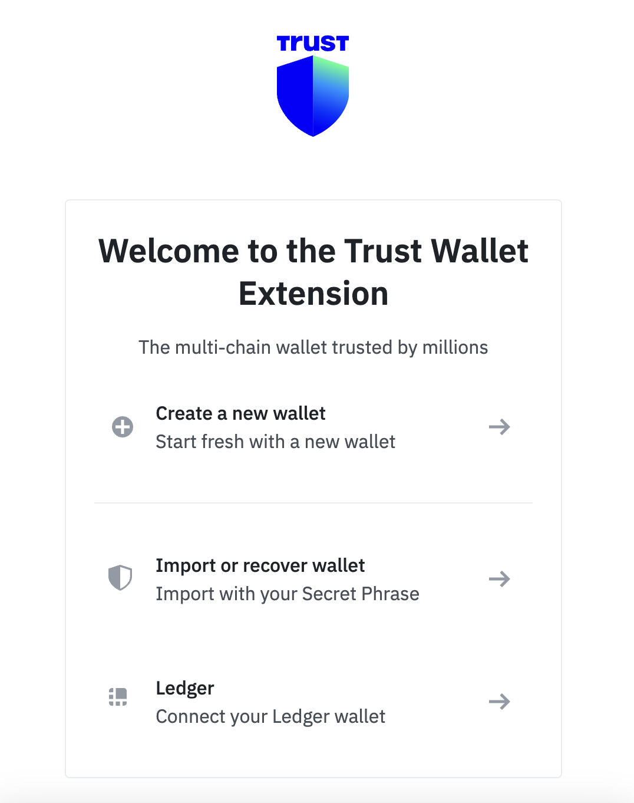

3) **Set Password**: Pick a password and confirm it to create your account.

##### Step 3: Backup your Wallet Account

Backing up your wallet is vital to protect your assets. Click the action bar on the trust wallet interface.

1）**Show Seed Phrase**: Trust Wallet will generate a seed phrase (12 or 24 words) for you. This phrase is crucial for wallet recovery, so click the “Show” button, write it down, and store it securely offline. Do not share this phrase with anyone.

2）**Confirm Seed Phrase**: To ensure you have recorded the seed phrase correctly, Trust Wallet will ask you to confirm it by selecting the words in the correct order.

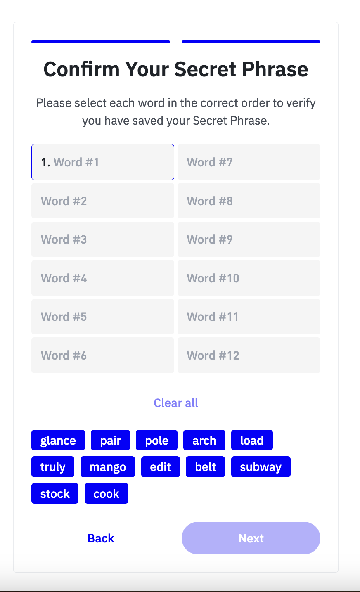

Once your wallet is set up, you can start using token-issuing tools to create tokens.

#### 1.1.2 MetaMask

##### Step 1: Install the Wallet Extension

1）**Download and install Chrome browser**

Here is the download link:

- Google Chorme windows 64：<https://www.chromedownloads.net/chrome64win/> 

- Google Chorme windows 32：<https://www.chromedownloads.net/chrome32win/> 

- Google Chorme mac：<https://www.chromedownloads.net/chrome64osx/>

2）**Add Metamask extension**:

Visit the Chrome Web store <https://chromewebstore.google.com/detail/metamask/nkbihfbeogaeaoehlefnkodbefgpgknn>  

Click the “Add to Chrome” button and confirm the installation.

##### Step 2: Create a New Wallet Account

Once the extension is installed, you need to create a new MetaMask account:

1) **Open the Extension**: Click on the MetaMask Wallet icon in your browser’s toolbar to open the extension.

2) **Start Setup**: Agree on the terms of use, and click on “Create a New Wallet” to set up your wallet.

3) **Set Password**: Pick a password and confirm it to create your account.

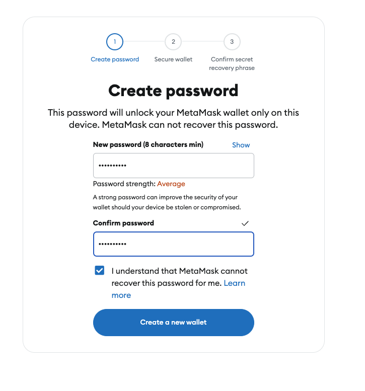

##### Step 3: Backup your Wallet Account

Backing up your wallet is vital to protect your assets. Click on “Secure my wallet” to get your recovery phrase.

1) **Show Seed Phrase**: MetaMask Wallet will generate a seed phrase (12 or 24 words) for you. This phrase is crucial for wallet recovery, so click the “Reveal Secret Recovery Phase” button, write it down, and store it securely offline. Do not share this phrase with anyone.

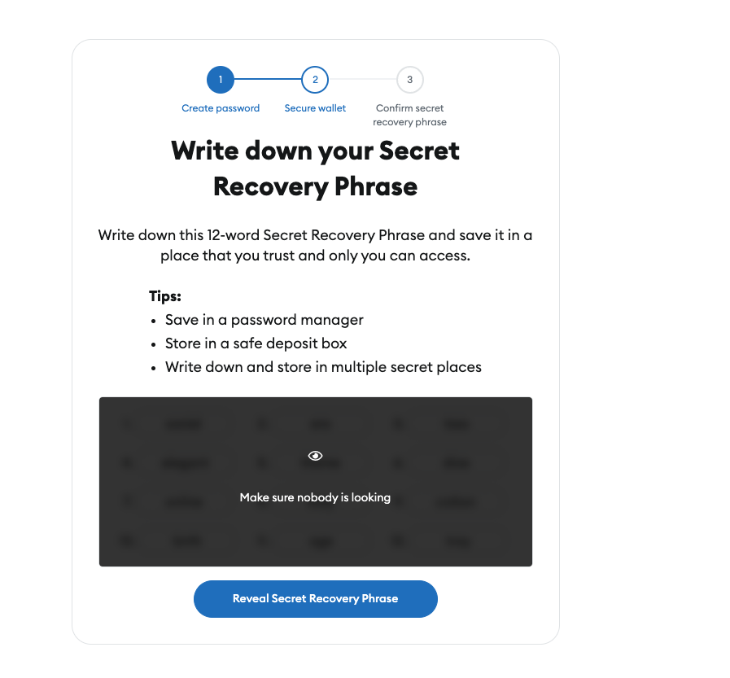

2) **Confirm Seed Phrase**: To ensure you have recorded the seed phrase correctly, MetaMask Wallet will ask you to confirm it by selecting the words in the correct order.

Once your wallet is set up, you can start buy cryptos.

### 1.2 Buy Crypto
Tokenization requires service fees, which need to be paid by crypto.You can discover numerous service providers within your wallet. We will instruct you on how to commence purchasing crypto from your Wallet.
In this guide, we suggest you use Trust Wallet or Metamask to start buying crypto:

- Trust Wallet (<https://trustwallet.com/>) 
- MetaMask (<https://metamask.io/> )

#### 1.2.1 Trust Wallet

##### Step 1: Login to your wallet

The Trust Wallet extension allows you to buy crypto using fiat. Follow these steps to get started:

1) **Open Trust Wallet Extension**

Click the Trust Wallet Icon in your chrome, and usually, it will open directly.

2) **Enter Password**

If you did not login for a while, Trust Wallet might ask you to enter your password to login 

##### Step 2: Choose network and crypto

Trust Wallet provides different vendors for you to choose from, you can use them to buy crypto with fiat. 

1) **Click Buy&Sell button**

2) **Choose network and crypto**

Choose BNB on BNB Smart Chain

##### Step 3: Choose vender

 Select your vendor. Here we can see Trust Wallet provides several different vendors, we suggest using MoonPay to continue 

##### Step 4: Enter Credit Card Information

1) **Select Payment Method**:
   - Choose “Credit Card” as your payment method.

2) **Enter Credit Card Details**:
   - Fill in your credit card details, including the credit card number, expiration date, CVV code, and billing address. Ensure all information is accurate to avoid payment issues.

3) **Complete Identity Verification**:
   - Depending on MoonPay’s requirements, you may need to complete identity verification, such as uploading identification documents or confirming your identity via SMS verification.

##### Step 5: Confirm and Complete Purchase

1) **Review Transaction Details**:
   - Carefully review the transaction details, including the purchase amount, wallet address, and payment method.

2) **Confirm Transaction**:
   - Click the “Confirm” or “Complete Purchase” button to finalize the transaction.

3) **Wait for Transaction Processing**:
   - After completing the transaction, you will receive a confirmation email or notification. The purchased BNB will be sent to the wallet address you provided. Processing times may vary depending on network congestion.

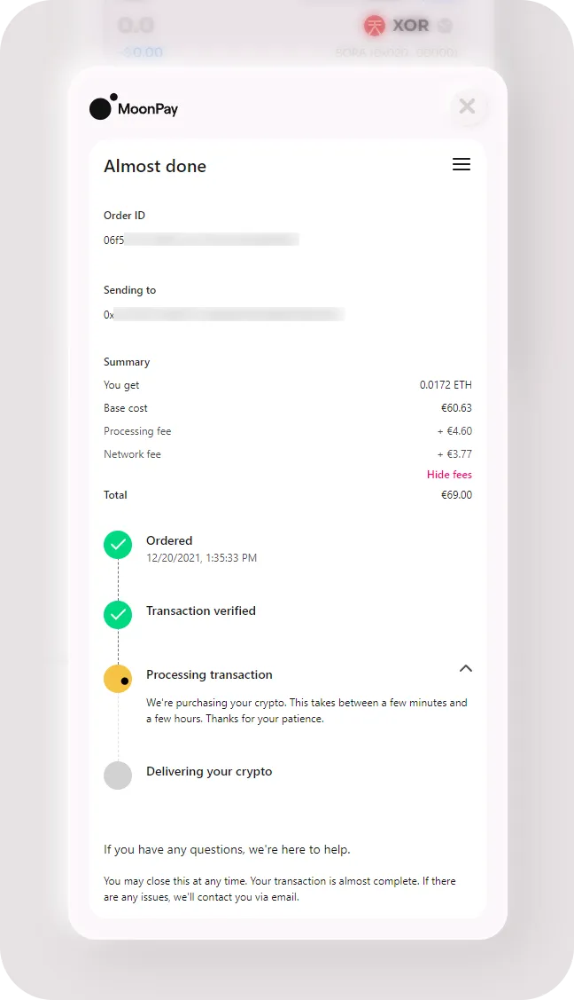

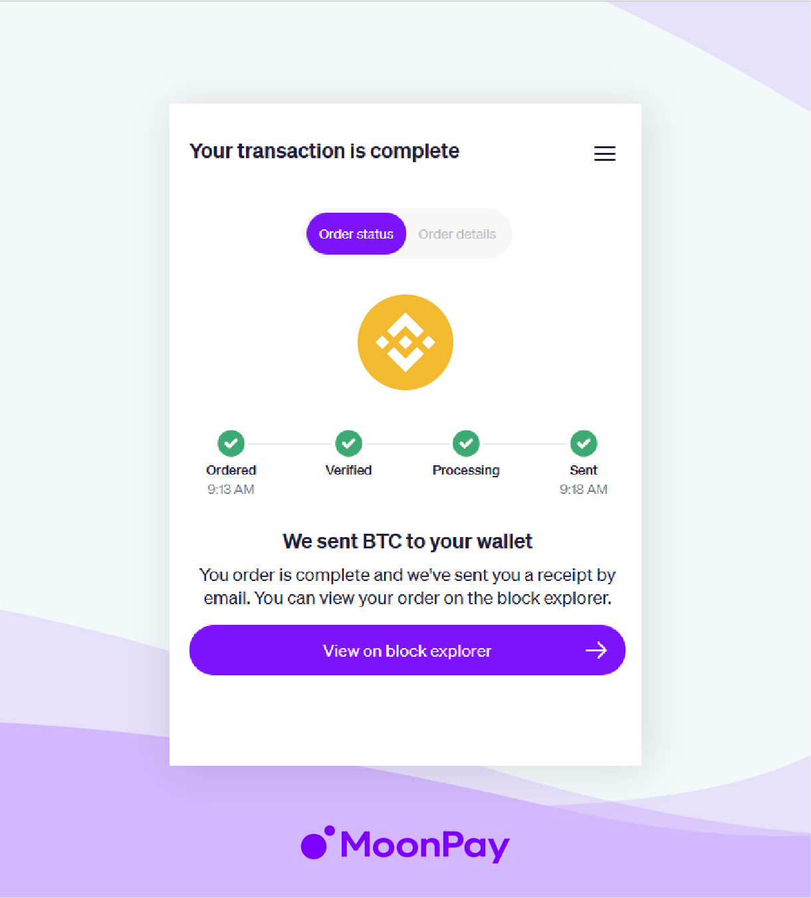

4) **View your BNB in your wallet**

You can now see your transaction is complete. The BNB should be received by your Trust Wallet. 

#### 1.2.2 MetaMask

##### Step 1: Login to your wallet and Add BNB network
The MetaMask Wallet did not set BNB Chain Network as default, so to start, you need to add BNB network.

1) **Login to your  Metamask Wallet**

Click the MetaMask Icon in your chrome, and usually, it will open directly.

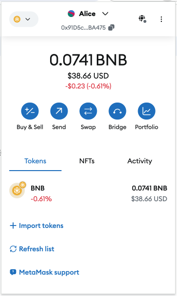

If you did not login for a while, MetaMask might ask you to enter your password to login 

Once Login, you need to add BNB Chain Network to your wallet

2) **Click Add Network** 

Usually you will see you are under Etherum network, click on the Etherum icon and it will guide you to a select network page, if you did not see BNB Chain underneath, click Add network button. 

3) **Add BNB Chain network** 

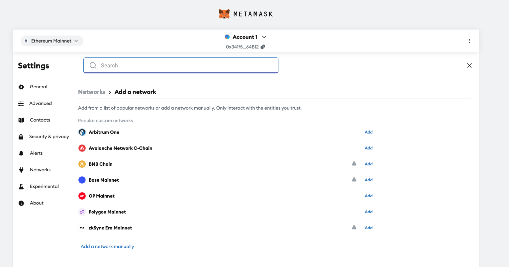

4) **Approve to add BNB Chain to your wallet**

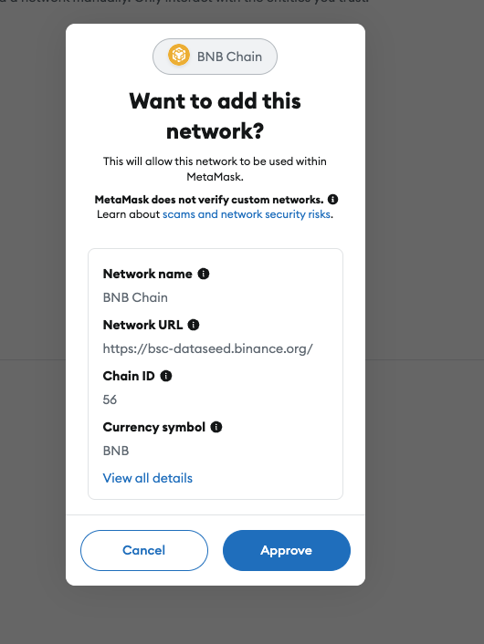

5) **Switch to BNB chain network**

##### Step 2: Choose network and crypto
Metamask provides different vendors for you to choose from, you can use them to buy crypto with fiat. 

1) **Click buy button**

2) **Choose network and crypto**, choose BNB chain first, and then select BNB token 

##### Step 3: Choose country and fiat 

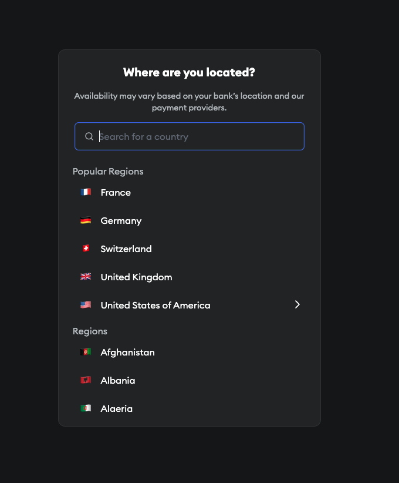

##### Step 4: Choose vender
1) Select your payment method
   - We suggest using “Debit or Credit” which has a relatively lower service fee. 

2) Select your vendor. 

- Here we can see MetaMask provides several different vendors, we suggest using MoonPay to continue 

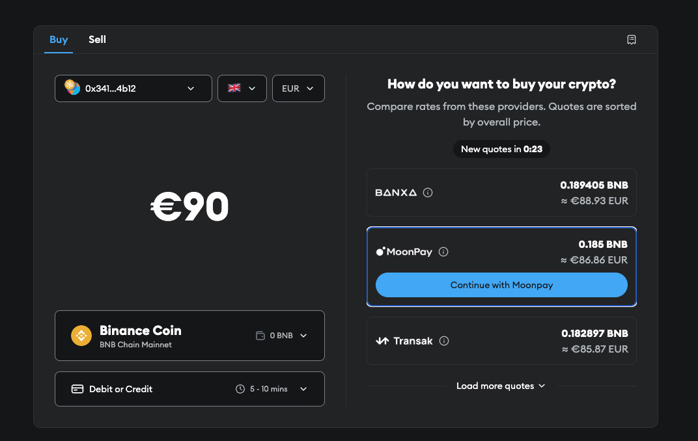

##### Step 5: Enter Credit Card Information
1) **Select Payment Method**:
   
   Choose “Credit Card” as your payment method.

2) **Enter Credit Card Details**:
   
   Fill in your credit card details, including the credit card number, expiration date, CVV code, and billing address. Ensure all information is accurate to avoid payment issues.

3) **Complete Identity Verification**:

Depending on MoonPay’s requirements, you may need to complete identity verification, such as uploading identification documents or confirming your identity via SMS verification.

##### Step 6: Confirm and Complete Purchase

1) **Review Transaction Details**:
   
   Carefully review the transaction details, including the purchase amount, wallet address, and payment method.

2) **Confirm Transaction**:
   
   Click the “Confirm” or “Complete Purchase” button to finalize the transaction.

3) **Wait for Transaction Processing**:
   
   After completing the transaction, you will receive a confirmation email or notification. The purchased BNB will be sent to the wallet address you provided. Processing times may vary depending on network congestion.

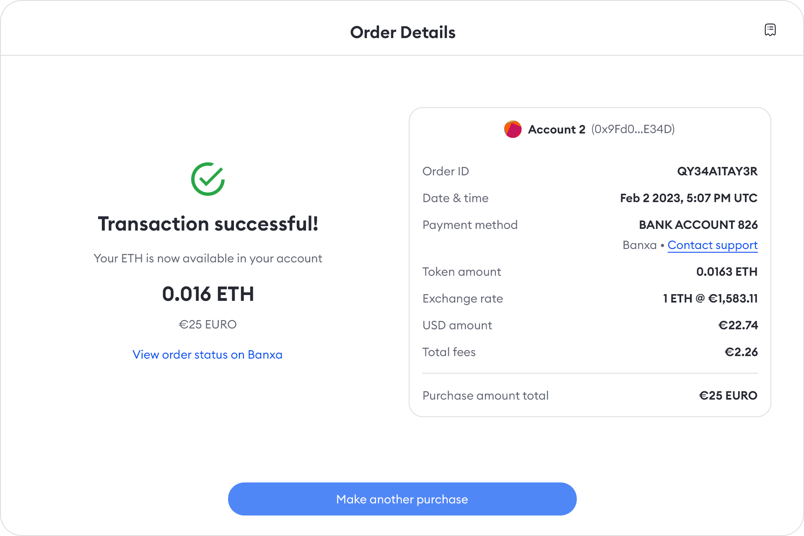 

