Welcome to the BNB Chain Tokenization Tutorial.

Tokenization is a process by which you create a digital token that can be traded on a blockchain. Tokenization has opened up a new way for businesses to create new revenue streams and help small and medium-sized businesses (SMEs) to access funding and grow their businesses.

BNB Chain's multi-chain framework, including BSC, opBNB, and Greenfield, offers scalability, low costs, and secure data storage, making it ideal for SMEs to start their tokenization journey. 

It generally takes 4 steps to tokenize your company: 

1) Preparation  

   1. Setup Wallet  
   2. Buy Crypto  

2) Token Launch  

   1. Create Token  
   2. Presale  

3) Withdrawal  

4) Reward Distribution

## 1 Preparation

Go to [Account Preparation Tutorial](./account-preparation.md) to get prepared before starting your tokenization journey. 

## 2 Token Launch

After all the preparation work, you are now ready to create your token. 

### 2.1 Create Token

To create a token, you only need to configure a few basic parameters. 

We suggest these two service providers since they provide one-stop service with rich features:

- PinkSale (<https://www.pinksale.finance/>  )
- TokenFi (<https://tokenfi.com/> )

#### 2.1.1 PinkSale

PinkSale allows you to create a token and manage your token all in one platform, which provides convenience to token issuers.

##### Step 1: Login with your wallet

1) **Connect your Wallet** 

   Enter <https://www.pinksale.finance/token/create> , choose “MetaMask” or “Trust Wallet”, use the wallet you just created in chapter 1.1 setup wallet

##### Step 2: Create Token

1) **Select Create Token**

   Click Create token on the left navigation bar, you should be able to see the landing page as follow

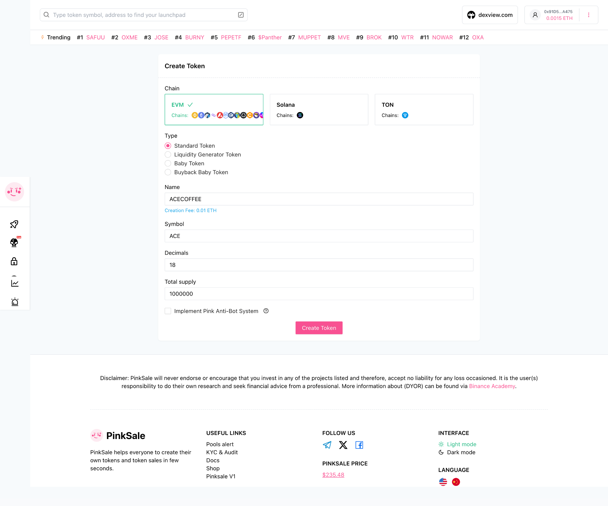

2) **Enter Token information** 

Here is how to set each parameter: 

**Chain**: It means the blockchain infrastructure where your token will be created and running all the time. Here we suggest you choose **BNB Chain.**

**Type**: It means token design mechanism, which contains several parameters, are typically employed to establish the mechanism by which the investors of the token will obtain the financial reward.Here we suggest you choose **Standard.**

**Name:** This is ideally a human readable name such as "ACE Coffee Coin".

**Symbol**: The token symbol is comparable to its ticker symbol, typically four or more characters are used such as "ACE".

**Total supply**: The amount of tokens that get minted at token creation. Usually you will not increase the supply after token creation, so it will be the total supply of your token at all times. The supply is usually determined by the desired token denomination (i.e. the nominal value per token). 

For example, for a bond offering with a nominal amount of USD 10 million and a denomination of USD 100,000 the supply would have to be 100 tokens.

**Decimals**: Values can be 0-18, when 0 is used, the token is not divisible. We suggest you set it as “**18**”.

3) **Confirm Transaction** 

Click the create token button then your wallet will be invoked. Confirm with your wallet, please notice you need to pay service fee using BNB, you should follow chapter 1.2 buy crypto to charge your wallet account  in advance. 

##### Step 3: Check Your Token

You can see your token address and other basic information as follow 

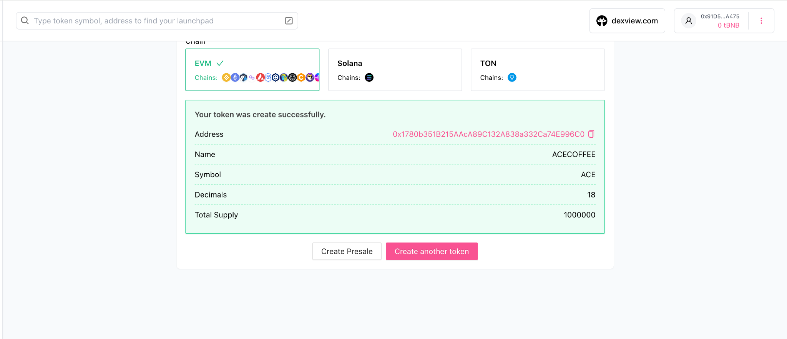

#### 2.1.2 TokenFi

##### Step 1: Login with your wallet

Enter <https://tl.tokenfi.com/create-token> , choose “MetaMask” or “Trust Wallet”

##### Step 2: Create Token

**1. Select Token Type**:

Click the ERC-20 token, you should be able to see the landing page as follow: 

**2. Enter Token information** 

Enter token information recording to your demand 

Here is how to set each parameter: 

**Type**: It means token standard, we suggest you choose **ERC-20**. ERC-20 is a token standard which is most commonly used in company tokenization scenario, you do not need to understand the standard to continue your process, nevertheless, if you want to know more about the token standard, you can visit <https://ethereum.org/en/developers/docs/standards/tokens/erc-20/> for more information. 

**Logo**: The image icon of your token, it will show up on all your token promotion pages, we suggest you use images that are highly related to your company’s business so that investors can get more information from your logo image. You should prepare the image beforehand, and make sure that you have the copyright of your image. 

**Name:** This is ideally a human readable name such as "ACE Coffee Coin".

**Symbol**: The token symbol is comparable to its ticker symbol, typically four or more characters are used such as "ACE".

**Initial supply**: The amount of tokens that get minted at token creation. It should be no bigger than Max Supply. 

**Max Supply**: The sum up amount of tokens that you will mint all time.  We suggest you do not increase the supply after token creation, so the max supply will be set as the same as the initial supply. 

The supply is usually determined by the desired token denomination (i.e. the nominal value per token). 

For example, for a bond offering with a nominal amount of USD 10 million and a denomination of USD 100,000 the supply would have to be 100 tokens.

**Decimals**: Values can be 0-18, when 0 is used, the token is not divisible.We suggest you set it as **18**. 

**Treasury Wallet:** where the token will be sent to after the tokens are created. It is default set as the wallet address you used to login. Which means all the created tokens will be sent to your current wallet address. 

**Features and tokenomics:** This part is optional advanced features**,** which contains several parameters, are typically employed to establish the mechanism by which the investors of the token will obtain the financial reward.Here we suggest you **skip** this part. If you want to know more about this part, you can visit <https://docs.tokenfi.com/> for more guidance. 

**3. Confirm Transaction** 

Click the create token button then your wallet will be invoked. Confirm with your wallet, please notice you need to pay service fee using BNB, you should follow chapter 1.2 buy crypto to charge your wallet account  in advance. 

##### Step 3: Check Your Token

You can see your token address and other basic information as follow 

### 2.2 Presale

Now that your token has been created, you can invite your early investors to join your presale activities. Investors can buy your token through the presale link you created, you can quickly raise early-stage funding through pre-sales to develop your business.

It’s suggested that you use the same service providers to manage your presale. Here we suggest two service providers:

- PinkSale (<https://www.pinksale.finance/>  )
- TokenFi (<https://tokenfi.com/> )

#### 2.2.1 PinkSale

##### Step 1: Login with your wallet

Visit <https://www.pinksale.finance/launchpad/create/presale> and choose “MetaMask” or “Trust Wallet” to login.

##### Step 2: Create Presale 

1) After login, choose launchpad>create presale in left navigation bar. 

Here are the parameters you need to input:

**Address**:  Input your token address,if you created your token using PinkSale, it should be filled in automatically. Or you can find it at your token creation page. 

**Currency**:The token you will receive for your presale. Here we suggest you choose **BNB**.

**Fee Option**: Pinksale will charge your some fees for presale, Here we suggest you to choose **5% BNB**, which means PinkSale will charge 5% of all your BNB sold as Presale service fees 

**Listing Option**:Usually, you need to create a secondary marketplace for your tokens, so that your investors who have bought your tokens during the presale phase can sell the token to others in the secondary market if they do not want to hold the tokens anymore. You will need to add liquidity to the secondary market so that your investors can trade. By adding liquidity, part of your token pair with BNB will be automatically locked so as to be used to add liquidity in the future. Auto listing means liquidity will be added automatically after Finalize, manual listing means you have to add liquidity manually. By selecting auto listing, your token will be listed at PinkSwap automatically.We suggest you choose **Manual listing** to keep it simple. If you want to choose auto listing, you can visit <https://docs.pinksale.finance/launchpads/create-a-launchpad> for more guidance.  

**Pool Type:** It means the type of this round of token sale. Here we suggest you to choose **presale**

**Affiliate**: It indicates that you want to promote your project together with some KOLs Pinksale suggested. We suggest you **disable the Affiliate** program option.If you want to know more about affiliate, you can visit <https://docs.pinksale.finance/important/affiliate-program> for more guidance.  

2) Review again and click on “Next”.

##### Step 3: Add Launchpad Info

After verifying your token, you need to input the Presale information that you want to raise.

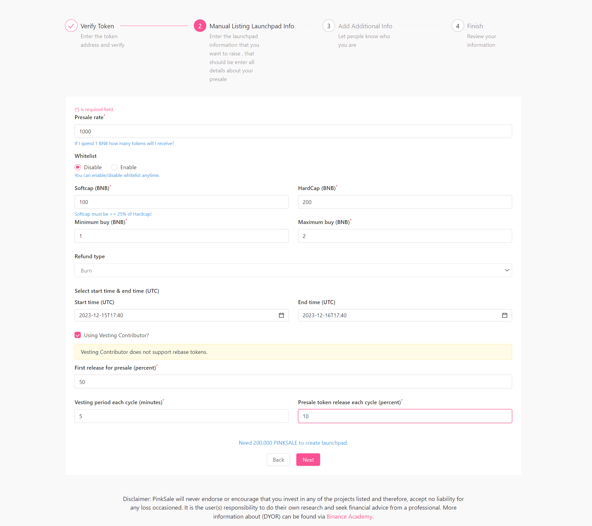 

Here are some following important parameters:

**Presale Rate**: This is similar to token price, it means how many of your tokens an investor can receive if he gives 1 BNB. You must use positive numbers.

**Whitelist:** Choose "Enable" if you have a whitelist of presale contributors. You can enable/disable the whitelist anytime.We suggest you **disable** the whitelist to keep it simple. If you want to know more about affiliate, you can visit <https://docs.pinksale.finance/launchpads/whitelist-tiers> for more guidance. 

**Soft cap:** Soft cap means the least amount of tokens you need to sell for this presale to launch successfully. SoftCap must be greater than or equal to 25% of the hard cap.

**Hard cap**: It means the amount of tokens for your presale. Once you sell the amount of tokens, your presale will automatically stop

**Refund types:** you can choose refund or burn from the dropdown list. Here we suggest you choose **Refund**

**Minimum buy BNB:** how many bnb one investor need to pay at least in order to participate

**Maximum buy BNB:**how many bnb can one investor buy at most

**Start Time**: the start time of your presale, you can select now or later. 

**End Time**: the end time of your presale. Please make sure the start time is before the end time.

**Vesting Contributor**: Vesting For Contributors is a feature on PinkSale that helps projects to ensure long term price stability by locking away the tokens of presale investors for a period of time. It prevents presale investors from selling all their tokens at once at listing time, which causes too much sell pressure and crashes the price. To make it simple, we suggest you **disable** it. 

##### Step 4: Add Additional Info

Now that you have almost setup all the information you need for your presale, we suggest you add some additional info about your project so that your investors can know more about your company, your business, and be more willing to participate in your presale.

There are some notes for this step:

- Logo URL and website are required fields, cannot be blank. You can’t complete this step without those.
- Logo URL must end with a supported image extension: png, jpg, jpeg or gif.

For example:<https://www.pinkswap.finance/pinkswap.png>

##### Step 5: Confirm with your wallet

This is the final step. You can review all the information one last time before submitting, after you have made sure that everything is perfect, or you can go back to the previous step to make any changes. Click “Approve Spending Token” and "Confirm" on Metamask. After that, click "Submit".

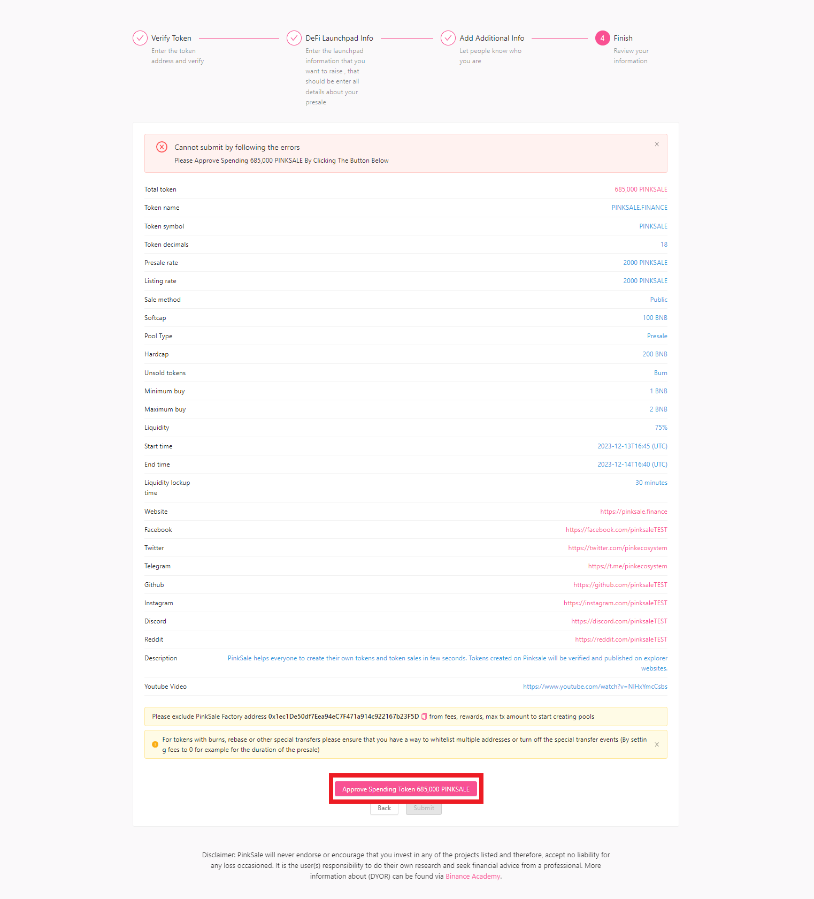

After clicking on “Submit”, MetaMask/TrustWallet will now ask you to confirm the deal. It will also show you the fee that you are required to pay for the presale service.  If you agree, then click on the “Confirm” button to finish the process.

##### Step 6: Check Your Presale Status

You can view your presale status as follow:

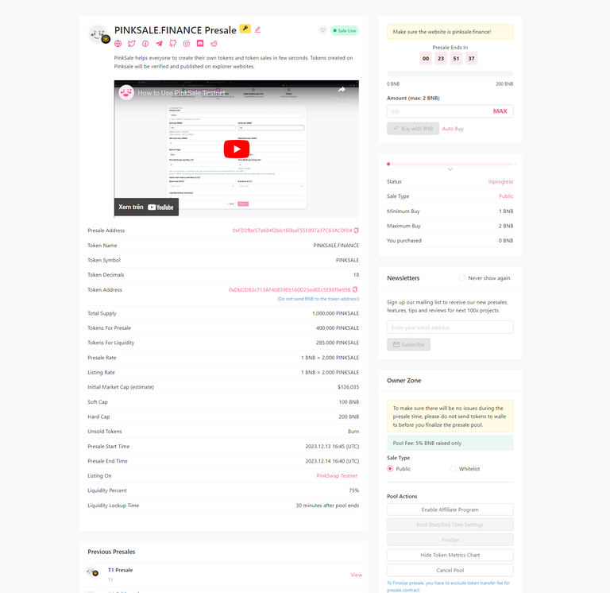

##### Step 7: Invite your community to buy 

Guide your community members to [https://www.pinksale.finance/launchpads](https://www.pinksale.finance/#/launchpads)

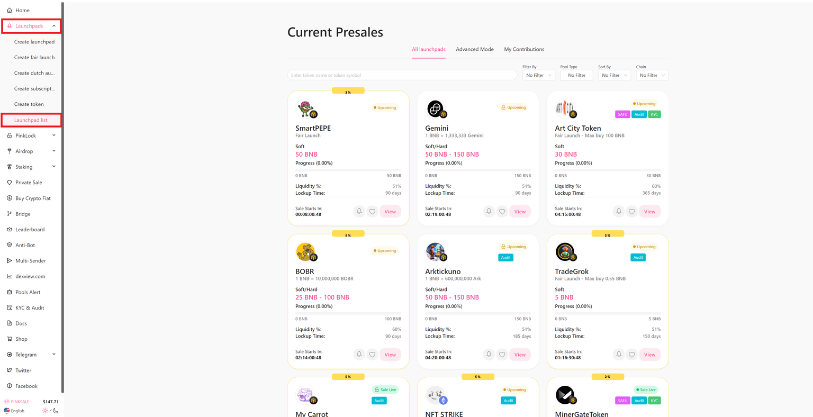

Your community members can find your project through searching by token name, they can find the detail page of your presale as follows. Enter the amount of token they want to buy, and confirm with their wallets.

Now that you need to wait for enough community members to buy your token until your soft cap has been reached. Then you can finalized the presale pool. If the hard cap has been reached, your presale will be finalized automatically.

After you have finalized the presale pool, your community member can claim the token.  

After claiming a token, your community member should be able to see the token they bought in their wallet. 

#### 2.2.2 TokenFi

TokenFi also provides a launchpad for you to create a presale for your tokens. 

##### Step 1: Login to TokenFi Launchpad with your wallet

Open <https://lp.tokenfi.com/>, Click Connect Wallet to Login

Sign the message

##### Step 2: Input token information

1) Select BNB network

**2)** Choose “I will provide my own token” and click 'Next' to proceed with your launchpad setup.

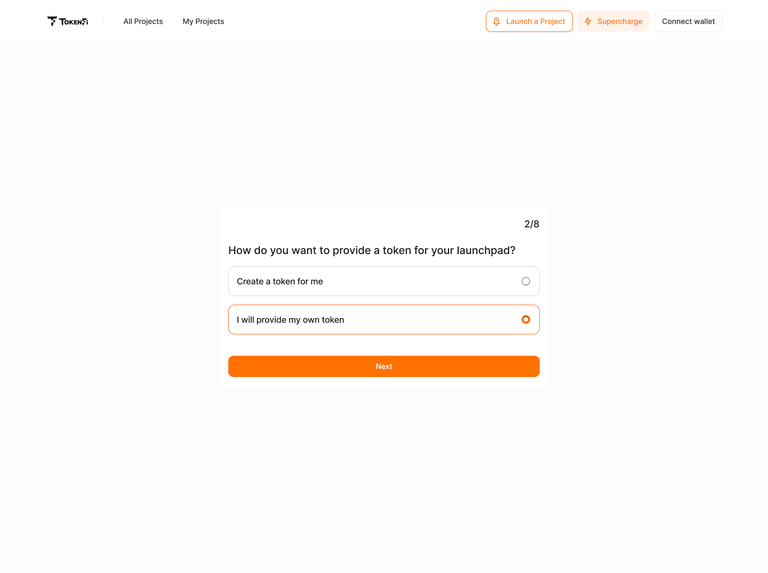

3) Input your token address, you can find it at previous steps. 

##### Step 3: Input Presale Information

1) Define your project’s funding targets by entering the details below:

**Token Price**: Specify the price per token, e.g. 1 BNB per token.

**Soft Cap**: Enter the minimum token amount you aim to raise. This is the lowest funding goal required to consider the fundraising a success.

**Hard Cap**: Set the maximum token amount you wish to raise. This should not exceed the total available supply minus any tokens reserved for the treasury.

**Available Supply**: Note that the hard cap cannot surpass the available supply of 2500 tokens.

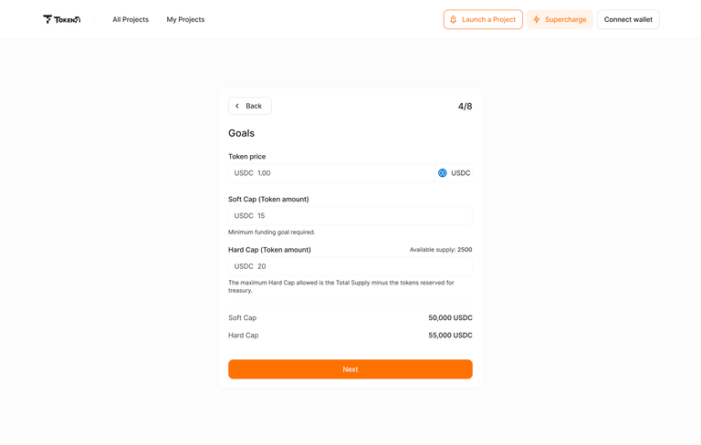

Click the 'Next' button once all fields are filled to continue setting up your project.

2) Configure your fundraising parameters by following these steps:

**Maximum Tokens per Wallet**: Input the maximum number of tokens that can be purchased by a single wallet. Ensure this aligns with your fundraising goals and token distribution strategy.

**Fundraise Start Date**: Choose the date and time when your fundraising will begin. This is the moment from which participants can start purchasing tokens.

**Fundraise End Date**: Set the date and time when your fundraising will conclude. After this time, no more tokens can be purchased.

Then click “Next”.

3) Set up your token release schedule efficiently:

**TGE (Token Generation Event)**: Set the percentage of tokens allocated and the specific date and time for release during the TGE. This initial allocation is crucial for the market introduction of your token.

**Allocation Percentage**: Input the percentage of total tokens you want to allocate during the TGE.

**TGE Date**: Select the date and time when these tokens will become available.

**Allocation Tracker**: Observe the progress bar to ensure your allocations do not exceed the total supply.

**Add New Release Date**: Click this button to schedule additional token releases, specifying new dates and allocation percentages.

Click the 'Next' button once all fields are filled to continue setting up your project.

##### Step 4: Review and Confirm with your wallet

Review each section carefully before proceeding:

**General Information**:

- **Blockchain**: The blockchain network selected for the project.

**Token Information**:

- **Name**: The official name of your token.

- **Symbol**: The designated ticker symbol.

- **Decimals**: The decimal precision for transactions.

- **Max Supply**: Total number of tokens created.

- **Reserved for Treasury**: Tokens allocated for future project needs.

**Goals**:

- **Price Currency**: The currency used for pricing tokens.

- **Token Price**: Price per token.

- **Soft Cap**: Minimum funds targeted.

- **Hard Cap**: Maximum funds targeted.

**Fundraising Setup**:

- **Max Vesting per Wallet**: The maximum token amount a single wallet can hold.

- **Fundraise Period**: The duration of the fundraising campaign.

**Release Schedule**:

Details of token distribution, including percentages and specific dates for each type of vesting.

**Payment Setup**:

**Accepted Tokens**: List of cryptocurrencies accepted for payment.

**Additional Settings**:

**Blocked Countries**: Countries restricted from participating in the project.

Once you have confirmed that all details are correct and finalized, press 'Confirm' to launch your project.

This is the final step. You can review all the information one last time before submitting, after you have made sure that everything is perfect, or you can go back to the previous step to make any changes. Click “Approve” and "Confirm". After that, click "Submit".

##### Step 5: Check Your Presale Status

On the 'My Projects' screen, find your project and click “View Details” to update and refine your project details.

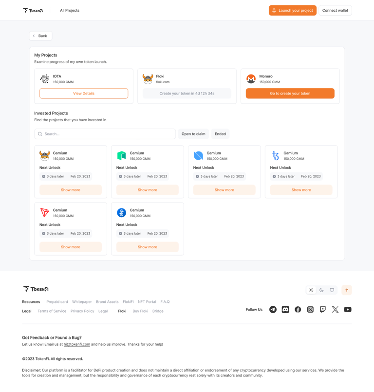

On the 'Edit Project' screen, follow these steps to update and refine your project details:

Click “Edit Details”: Begin by accessing the editing mode for your project.

**Add Launchpad Summary**: Summarize your project to provide a quick overview for potential investors.

**Link Social Media**: Connect your social media accounts to broaden your reach and engage more effectively with your audience.

**Input Website and Whitepaper Links**: Provide links to your project's website and Whitepaper, offering deeper insight into your project's objectives and developments.

**Provide a Detailed Description**: Expand on the details of your project, highlighting key information and unique selling points to attract interest.

**Save Your Changes**: After updating the information, click 'Save' to apply the changes. Your project is now optimized and ready to attract funding on the TokenFi Launchpad.

##### Step 6: Invite your community to buy 

Guide your community members to <https://lp.tokenfi.com/en-US> 

Your community members can find your project through searching by token name, they can find the detail page of your presale as follows. 

Your community member can then click “Invest” to go to the Invest page,enter the amount they want to invest on the Invest page and review the transaction details.

Now that you need to wait for enough community members to buy your token until your soft cap has been reached. Then you can finalized the presale pool. If the hard cap has been reached, your presale will be finalized automatically.

After you have finalized the presale pool, your community member can claim the token.  

After claiming a token, your community member should be able to see the token they bought in their wallet.

## 3 Withdrawal

When enough investors purchase your token and your presale succeeded, you will receive an amount of BNB in return. You can exchange your BNB for Fiat, withdraw fiat to your bank account to expand your actual operation or production. 

Service providers you may choose:

- TrustWallet (<https://trustwallet.com/>) 
- MetaMask (<https://metamask.io/> )

### 3.1 TrustWallet

##### Step 1: Login

The Trust Wallet extension allows you to sell BNB to fiat. Follow these steps to get started:

1) **Open Trust Wallet Extension**

Click the Trust Wallet Icon in your chrome, and usually, it will open directly.

2) **Enter Password**

If you did not login for a while, Trust Wallet might ask you to enter your password to login 

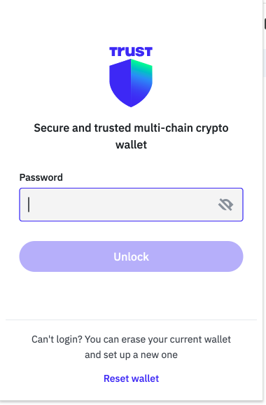

##### Step 2: Choose Vendor

Trust Wallet provides different vendors for you to choose from, you can use them to sell crypto to fiat. 

1) **Click Buy & Sell button**

2) **Choose network and crypto**

3) **Select your vendor** 

Here we can see Trust Wallet provides several different vendors.we suggest you use moonpay to continue

##### Step 3: Login to vender and add your bank account

1) **Enter your email address**

2) **Add your bank details**

3) **Review your order**

* MoonPay shows you the estimated price for your crypto and a summary of the fees.

* Accept [Terms of Use](https://www.moonpay.com/legal/terms_of_use).

* Click “Sell Now” to confirm your order.

4) **Ready to Pay**

* Next, MoonPay will generate a wallet for you to send your cryptocurrency to. MoonPay will also email you instructions on how to pay for your order.

* To see the wallet for your order, tap View deposit details.

* You can directly copy the deposit wallet address by selecting the "Copy" icon.
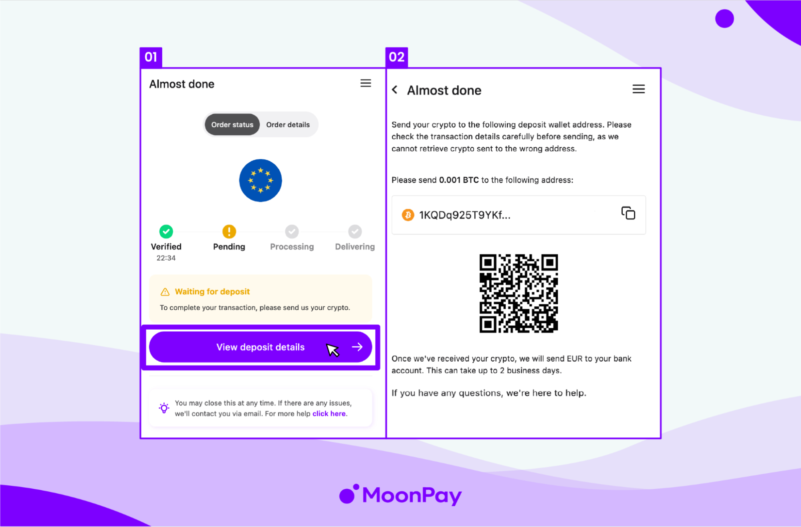

##### **Step 4: Send Your Crypto to Vendor**

1) Open Trust Wallet Extension

2) Click “Send”

3) Choose the cryptocurrency (BNB)

4) Enter the Mercuryo’s Address and the amount you want to sell

5) Complete the transaction in your wallet.

##### Step 5: Check your bank account

Mercuryo takes your cryptocurrency from there When you send it to the given address. You’ll receive a bank transfer shortly after your cryptocurrency is received. Read the [Processing Time](https://support.moonpay.com/customers/docs/when-will-i-receive-my-cryptocurrency) article to learn how long bank transfers take in different regions.

Once your transaction is complete, Mercuryo will send you a confirmation email. Click on See complete deposit instructions to access our tracker.

### 3.2 MetaMask

##### Step 1: Login

The MetaMask Wallet extension allows you to sell crypto to fiat. Follow these steps to get started:

1) **Open Metamask Extension**

Click the MetaMask Icon in your chrome, and usually, it will open directly.

2) **Enter Password**

If you did not login for a while, MetaMask might ask you to enter your password to login 

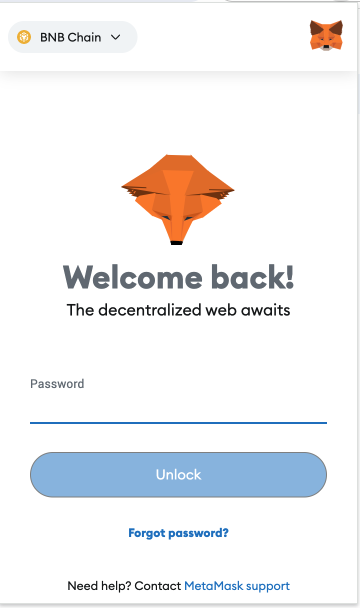

##### Step 2: Choose network and crypto

Metamask provides different vendors for you to choose from, you can use them to sell crypto to fiat. 

1) **Click buy & sell button,** make sure you are under BNB chain network

2) **Choose network and crypto**, choose BNB chain first, and then select BNB token 

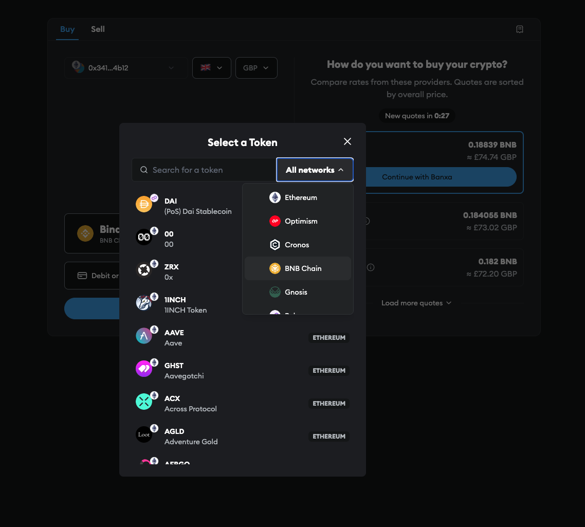

##### Step 3: Choose your country and fiat 

##### Step 4: Choose Vender

Select your vendor. Here we can see MetaMask provides several different vendors, we suggest using MoonPay to continue 

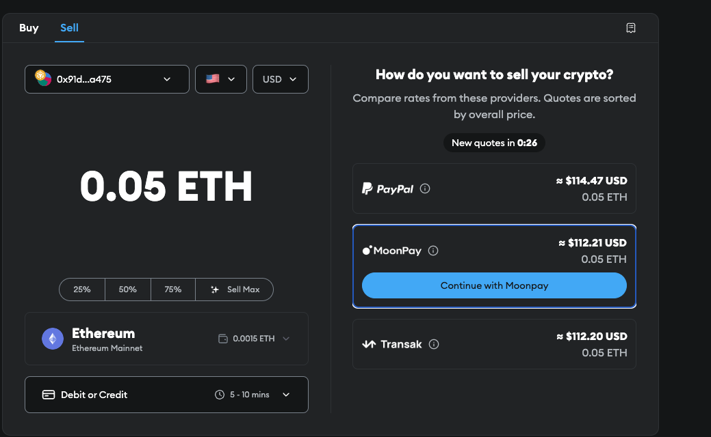

##### Step 5: Log in to vender and add your bank account

1) **Enter your email address**

2) **Add your bank details**

3) **Review your order**

* MoonPay shows you the estimated price for your crypto and a summary of the fees.

* Accept [Terms of Use](https://www.moonpay.com/legal/terms_of_use).

* Click “Sell Now” to confirm your order.

4) **Ready to Pay**

* Next, MoonPay will generate a wallet for you to send your cryptocurrency to. MoonPay will also email you instructions on how to pay for your order.

* To see the wallet for your order, tap View deposit details.

* You can directly copy the deposit wallet address by selecting the "Copy" icon.

##### Step 6:Send Your Crypto to Vendor

1) Open Trust Wallet Extension

2) Click “Send”

3) Choose the cryptocurrency (BNB)

4) Enter the MoonPay’s Address and the amount you want to sell

5)Complete the transaction in your wallet.

##### Step 7: check your bank account

1) MoonPay takes your cryptocurrency from there When you send it to the given address. You’ll receive a bank transfer shortly after your cryptocurrency is received. Read the [Processing Time](https://support.moonpay.com/customers/docs/when-will-i-receive-my-cryptocurrency) article to learn how long bank transfers take in different regions.

2) Once your transaction is complete, MoonPay will send you a confirmation email. Click on See complete deposit instructions to access our tracker.

## 4 Reward Distribution

When your business earns profits, it is crucial to reward your early investors. This creates a sustainable tokenization cycle, enabling you to utilize tokenization again in the future for the growth of your business.

You can give your investors dividends when your business gets profit through Airdrop tokens.

Service providers you may choose:

- Pink Sale (<https://www.pinksale.finance/>  )

#### 4.1 PinkSale

PinkSale allows you to create airdrop, so that your investors can claim airdrop to get their reward 

##### Step 1: Login with your wallet

Choose “MetaMask” or “Trust Wallet”

##### Step 2: Create New Airdrop

1) Go to[https://www.pinksale.finance/airdrop/create](https://www.pinksale.finance/#/airdrop/create)

2) Paste your token address into the “Token address” section. After that, your token name, symbol and decimals will be shown. Make sure everything is correct and then click on “Next”.

3) After selecting your token, you will need to input the Airdrop information. 

Here are some following important parameters: 

**Airdrop Title**:Create a meaningful name for your reward distribution.

**Logo URL**:Logo URL must end with a supported image extension: png, jpg, jpeg or gif. You can upload your image using<https://upload.pinksale.finance/> to get the link to your logo. 

**Website:** Paste your company’s website url here.

These three parameters cannot be blank. While others like social links and descriptions can be empty. 

Finish all the information, and then click “Create New Airdrop”.

After clicking on the “Create New Airdrop” button, MetaMask/TrustWallet will now ask you to confirm the transaction. It will also show you the fee that you are required to pay for that transaction. If you agree, then click on the “Confirm” button to finish the process.

4) You will be redirected to this page:

##### Step 3: Set Allocation

Prepare a list of airdrop addresses then click on “Set Allocations”

After clicking on “Set Allocations”, you will see a pop-up box. Here, you can add addresses and amounts to your “Users allocation” list. Addresses are separated by a new line. The amount of each user is separated by comma (,)

You should ask your community members to give you their wallet address beforehand. The below list can be used as an example:

Click on “Add Allocations” when you are done inputting the addresses. The wallet will now ask you to confirm the transaction. It will also show you the fee that you are required to pay for that transaction. If you agree, then click on the “Confirm” button to finish the process.

After successfully adding airdrop allocations, those allocations will be shown on the airdrop page.

##### Step 4. Set Vesting

After clicking on “Set Vesting”, you will see a pop-up box. Below are some important parameters:

**TGE release percent (%)**: The percentage of the first batch of airdrop tokens to be released. Please note that this is expressed in percentage, not number of tokens.

**Cycle release percent (%)**: How many % of airdrop tokens will be released each cycle following the first TGE release percent batch. Please note this is expressed in percentage, not in number of tokens.

**Cycle (days)**: How long, in days, between each batch of vested tokens is released.

Click on “Set Vesting” when you are done inputting the numbers, then wallet will now ask you to confirm the transaction. It will also show you the fee that you are required to pay for that transaction. If you agree, then click on the “Confirm” button to finish the process.

##### Step 5: Start Airdrop

1) Before starting the airdrop, you must[exclude fees, dividends, max tx](https://docs.pinksale.finance/exclude-fees-dividends-max-tx-on-bscscan) for airdrop address. You can find your airdrop address on your airdrop page. Before you finalize your presale, you need to access your contract address from BSCScan or you can click on the token address on your launchpad page.

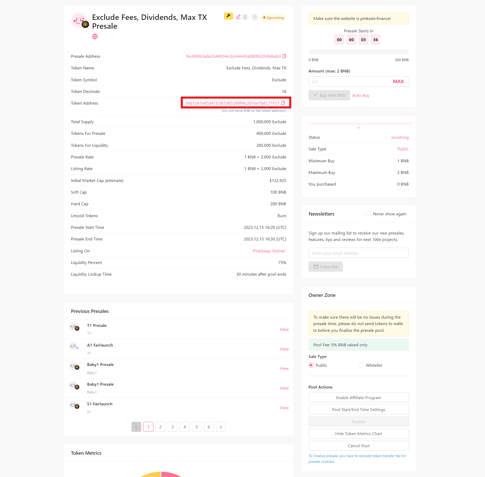

2) Go to Contract -> Write contract -> Connect to Web3 to connect your wallet, you need to use owner address.

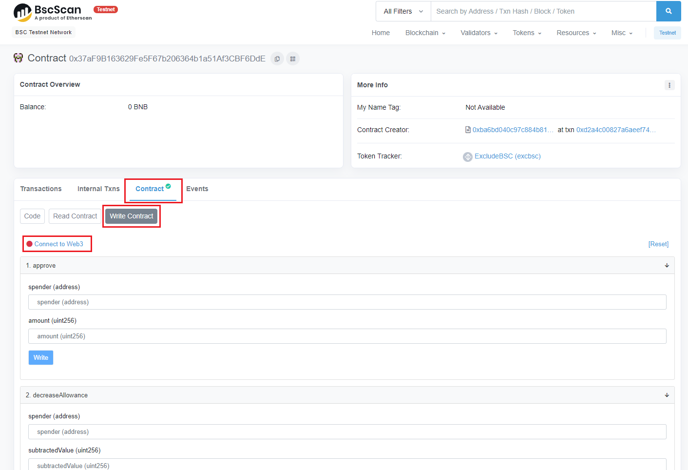

3) Ctrl + F, Search “exclude”, then input your presale address, then click on "Write", to exclude all fee/tax, max TX, rewards for presale address.

4) After clicking on the “Write” button, MetaMask will now ask you to confirm the transaction. It will also show you the fee that you are required to pay for that transaction. If you agree, then click on the “Confirm” button to finish the process. If you see exclude (bool), please input “true”

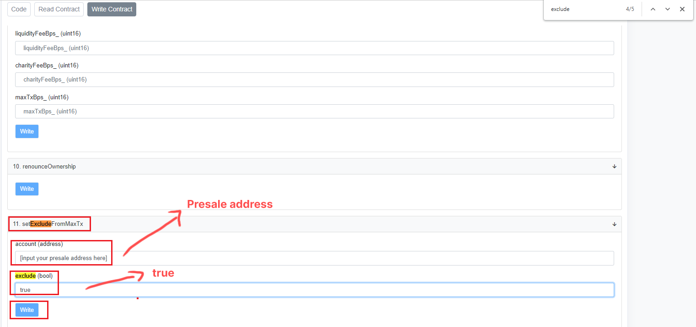

5) Sometimes contract doesn’t have “exclude” but "exempt" instead, Search “exempt”, then input your presale address, then click on "Write" to exclude all fee/tax, max TX, rewards for presale address.

6) After you have successfully exclude fees for airdrop address, you can go back to your airdrop page by this link<https://www.pinksale.finance/#/airdrops/own> - Created By You - View Airdrop

7) Then click on “Start Airdrop”

8) You will see how many tokens will be used for airdrop here (total airdrop tokens + 1% fee). Now you can choose to start now:

Or start with a specific time like this:

10) Click on "Approve", MetaMask will now ask you to confirm the transaction. It will also show you the fee that you are required to pay for that transaction. If you agree, then click on the “Confirm” button to finish the process.

##### Step 6: Guide your investors to claim airdrop 

You need to guide your community members to claim airdrop so that they can get their reward.

1) guide your community members to this link<https://www.pinksale.finance/#/airdrops/my> - My Airdrops - View Airdrop. they can see airdrops which they joined here.Please remind them to login with the same wallet address they have shared to you previously. 

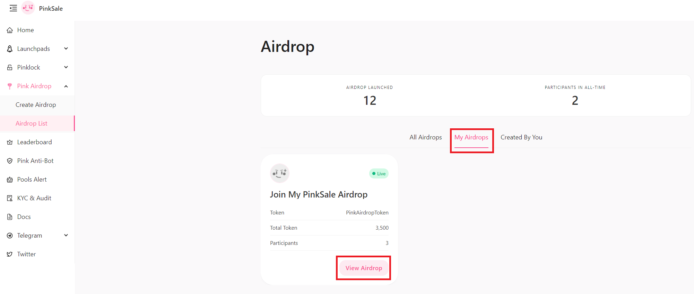

2) Check claimable tokens then click on “Claim”

3) MetaMask/Trust Wallet will now ask you to confirm the transaction. It will also show you the fee that you are required to pay for that transaction. If you agree, then click on the “Confirm” button to finish the process.

