Welcome to the BNB Chain Real World Asset Tokenization Tutorial.

Real World Assets (RWA) in crypto involve tokenizing physical assets like real estate, receivables, and loans on blockchain.Tokenizing real-world assets (RWAs) involves converting ownership rights of physical assets into digital tokens on a blockchain. It provides liquidity for your tangible assets and creates better cash flow for you. 

BNB Chain's multi-chain framework, including BSC, opBNB, and Greenfield, offers scalability, low costs, and secure data storage, making it ideal for Enterprises to start their Real World Asset  tokenization journey. 

It generally takes 4 steps to tokenize your real world asset: 

1) Asset Preparation

   1. Legal structuring
   2. Asset custody 
   
2) Account Preparation

   1. Setup Wallet
   2. Buy Crypto
   
3) Issue Token

4) Launch Token

There are plenty of tools and service providers in the BNB Chain ecosystem that can help you with the tokenization journey, we carefully select some of the best in our tutorial to guide you through the Web3 way. You can create your token in a few minutes with no coding or any blockchain knowledge. 

## 1 Asset Preparation
### 1.1 Legal Structuring

The asset tokenization journey begins with identifying an asset with strong tokenization potential, such as real estate, fine arts, commodities, and precious metals. Ensure that the asset is eligible for tokenization and complies with relevant regulations.

The value of the asset is then carefully assessed and documented, following standard financial practices.

At this step, a legal framework is established to ensure that digital tokens represent valid claims to the underlying real world assets. This involves defining the specific rights associated with the tokens and choosing an appropriate tokenization structure. ‍

Two common tokenization structures for real world assets 

The two common tokenization structures include Tokenized Special Purpose Vehicle (“SPV”) and Direct Asset Tokenization:

- **Tokenized SPV**: Tokenized SPV approach also known as indirect tokenization is a common approach where the asset is held by an entity, either a private limited company or a trust. This entity is then tokenized, and tokens are issued through a pooling of funds from multiple investors, giving investors indirect interests in the underlying RWA. This is often a better approach as it fits within the securities regulations.
- **Direct Asset Tokenization**: The asset itself is directly tokenized and the tokens represent a direct claim on the underlying asset This approach is typically less common due to regulatory challenges and issues such as non-fungibility, lack of regulatory clarity, and limited use cases. 

Each tokenization structure often comes with different licensing requirements. 

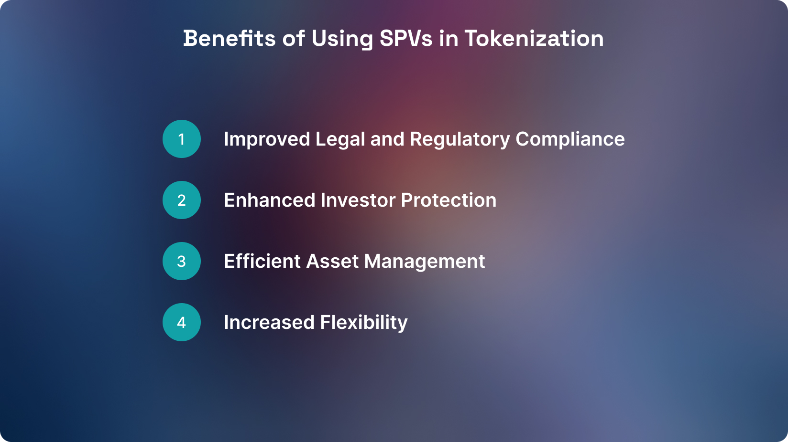Suggested Service Provider: [InvestaX](https://www.investax.io/)

### 1.2 Asset Custody 
Before digitalization, the underlying asset (RWA) will be custodized to ensure the asset is immobilized and safe kept before its digital representation is created on the blockchain. Most times if it's a tangible movable RWA like whiskey barrels the RWA is securely stored and managed by qualified custodians, trustees, or licensed managers. 

On the other hand, the digital representation i.e. RWA tokens can be either held in i) Self Custodized or ii) 3rd Party licensed custodian. 

**Self-custody** 

Self-custody wallets are wallets used to store digital assets providing users full control over their private keys and, consequently, their assets. It is the practice of individuals taking full control and responsibility for storing and managing their own digital assets without relying on third-party intermediaries. 

With self-custody, users hold their own private keys, which are essential for accessing and transacting with their digital assets. Self-custody wallets, which can be software-based (like mobile or desktop applications) or hardware-based (physical devices), allow users to interact directly with blockchain networks, giving them complete ownership and control over their assets. 

While self-custody offers enhanced security and privacy, it also requires users to be vigilant about safeguarding their private keys and recovery phrases, as there is no central authority to recover lost or stolen assets. 

**Custodizing RWA Tokens with a Licensed 3rd Party Custodian**

Licensed Custodians are regulated and authorized to provide custody services. These custodians are typically subject to stringent regulatory requirements and oversight, ensuring they adhere to high standards of security, operational integrity, and compliance. By leveraging the services of a licensed digital asset custodian, organizations can mitigate the risks associated with holding and managing digital assets, ensuring they are stored securely and in compliance with relevant regulations. 

Some of the security measures adopted are decentralized security protocols and multi-party computation (MPC) to eliminate single points of failure, thereby enhancing the protection against both external and internal threats. Additionally, custodians often implement multi-signature wallets, hardware security modules (HSMs), and key sharding to further safeguard private keys. These technologies are complemented by rigorous compliance with regulatory standards, such as Know Your Customer (KYC) and anti-money laundering (AML) rules, ensuring that custodians meet stringent reporting, auditing, and fraud detection requirements

There are many different types of assets in the world and how the custodian is handled and regulated is widely different. The issuers should evaluate the custodian's services, such as asset management, trade processing, and asset servicing, to ensure they meet the needs of the RWA.

Suggested Service Provider: [InvestaX](https://www.investax.io/)

## 2 Account Preparation

Go to [Account Preparation Tutorial](./account-preparation.md) to get prepared before starting your tokenization journey. 

## 3 Issue Token

After you have successfully completed the asset preparation and account preparation process, you can finally start creating your RWA token now. Here we recommend these two service providers as they possess a simplistic WebUI and explicit documentation, being friendly for beginners to get acquainted with.

Service providers you may choose:

- Bitbond (<https://www.Bitbond.com/> ) 
- Brickken (<https://www.brickken.com/>  )

### 3.1 Brickken 

1) Go to the Token Suite sign up page <https://brickken.com/bnb>  and sigh up using your email account. 

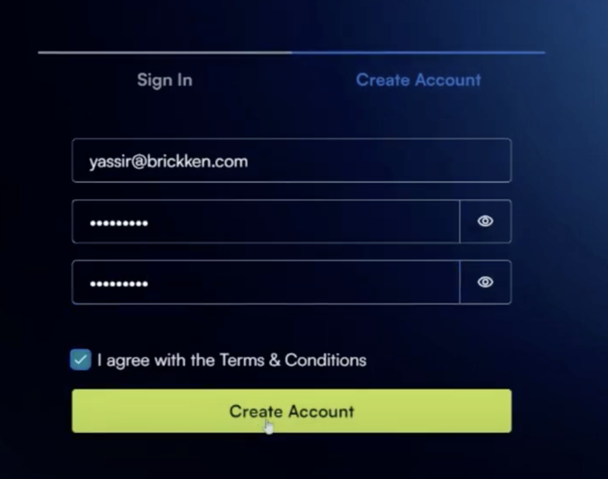

2) Select the type of financial instrument that the digital asset will represent, Equity, Debt, Invoice Factoring or a Revenue Digitization. 

3) Select a Network, here we suggest you choose Binance Smart Chain(BSC). Once you have selected the BNB Chain, please click continue. 

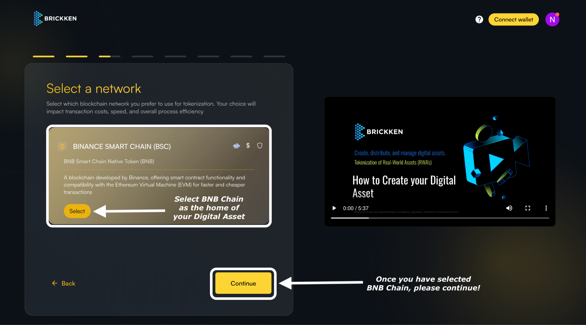

4) Connect your wallet you have just created in Step 2: Account Preparation. 

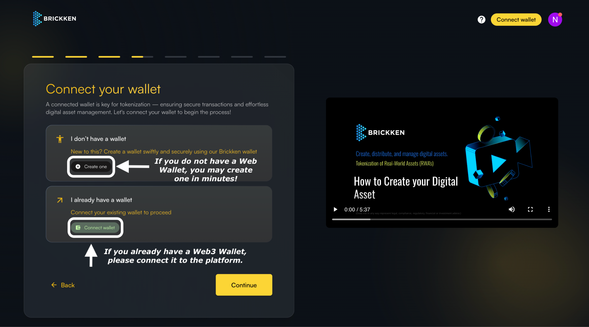

5) Complete your KYC steps 

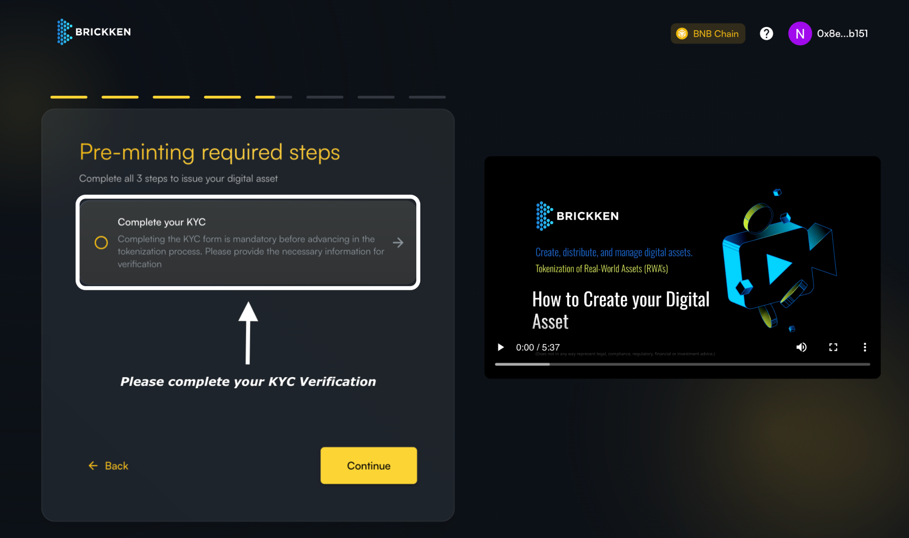

6) Enter your digital asset information. 

Here are the parameters you need to input:

**Digital Asset Name**: enter the full name of your digital asset

**Digital Asset Symbol:** enter the abbreviation of your digital asset

**Import your Digital Asset Logotype**: Upload the logo of your digital asset

**Address of the company’s wallet**: To make it simple, you can use the wallet address you just created if you are the business owner. Press the Green Icon to confirm the wallet that will manage the digital asset 

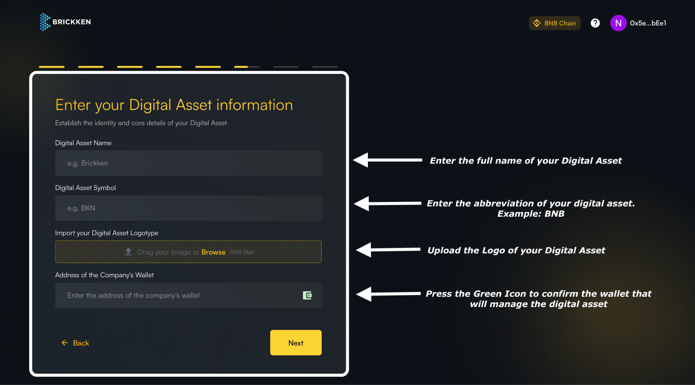

7) Input your digital asset details 

* If applicable, establish a maximum supply for your digital asset. This will ensure that no additional assets can be created in the future, so as to bring trust to your investors. 

* Upload your digital asset legal documents

* If you have collected the wallet address of existing shareholders, you can allocate the digital assets to existing shareholders by filling in their wallet address in this step. 

8) Confirm the transaction with your wallet

Use your wallet to confirm the transaction, you will need to pay gas fee and service fee in this step. After your confirm the transaction, you can see the contract address on BNB Chain. 

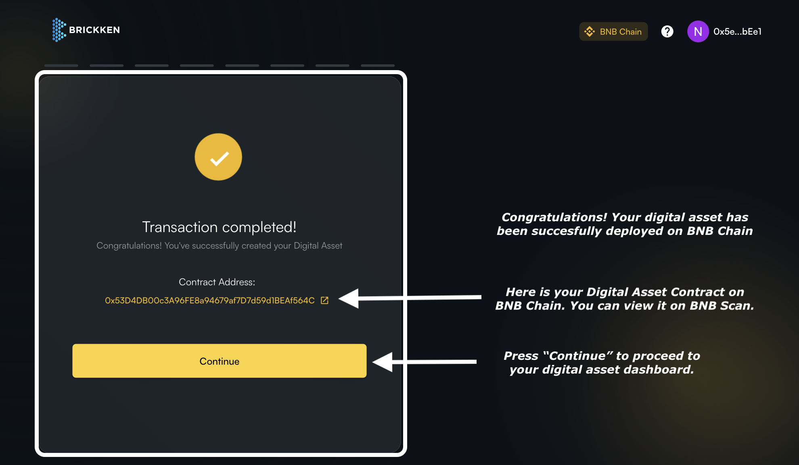

9) Mange your token on dashboard 

You can login to Briccken dashboard to manage your token after the creation. 

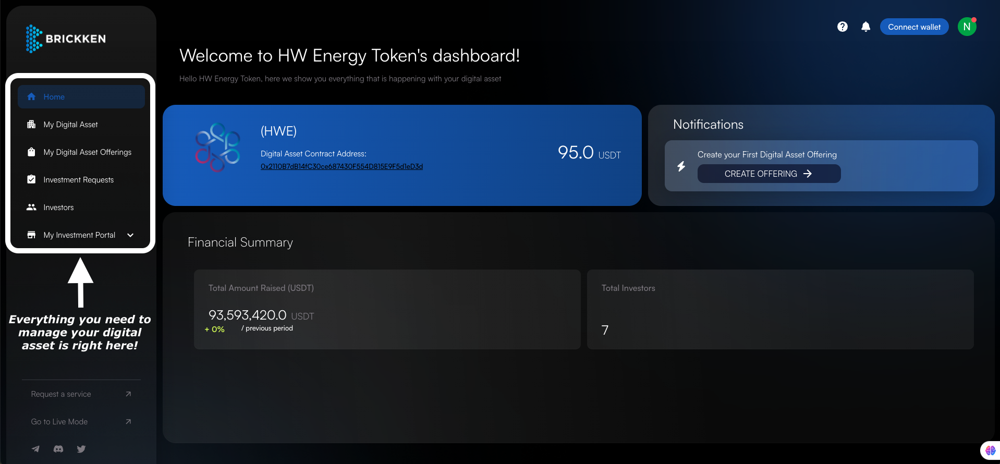

### 3.2 Bitbond

1) Visit <https://tokentool.Bitbond.com/> and connect your wallet to login

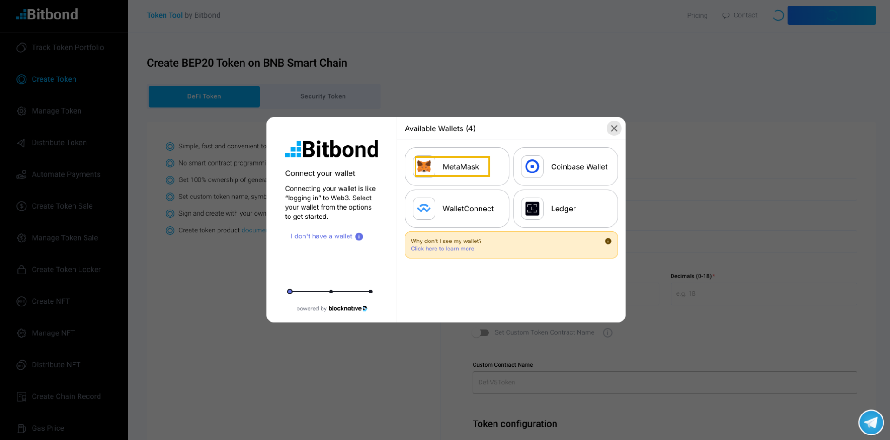

2) Select BNB Chain network 

3) Choose Defi Token, enter basic setting information

Here is how to set each parameter:

**Name:** This is ideally a human readable name such as "Real World Asset No. 001".

**Symbol**: The token symbol is comparable to its ticker symbol, typically four or more characters are used such as "RWA1".

**Initial supply**: The amount of tokens that get minted at token creation. Usually you will not increase the supply after token creation, so it will be the total supply of your token at all times. The supply is usually determined by the desired token denomination (i.e. the nominal value per token).

For example, for a bond offering with a nominal amount of USD 10 million and a denomination of USD 100,000 the supply would have to be 100 tokens.

**Decimals**: Values can be 0-18, when 0 is used, the token is not divisible. We suggest you set it as “**18**”.

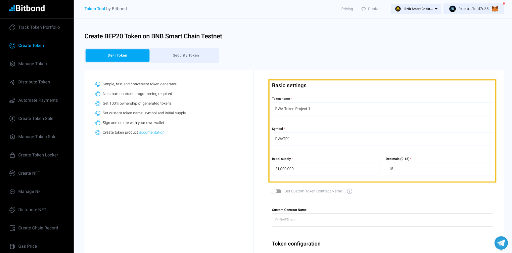

4) Set advanced token setting

To make it simply, here we suggest you use the default setting and do not make any changes. 

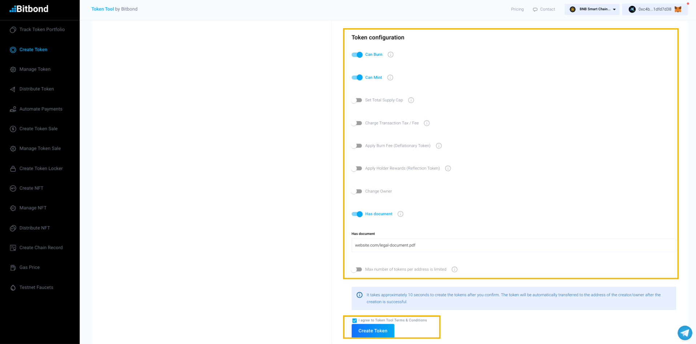

5) Confirm the transaction with your wallet

You might need the pay the gas fee and service fee for the creation. 

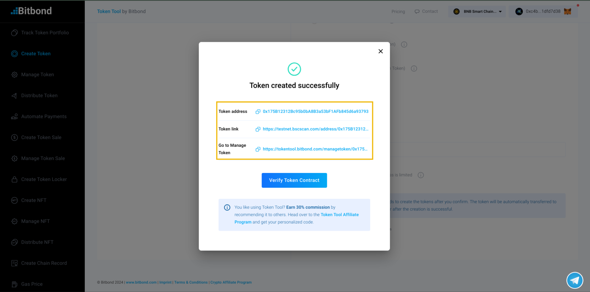

## 4 Launch Token

In order to distribute your token toward your investors, you need to launch your token towards open or private market. Here we will guide you how to launch your token. 

Service providers you may choose:

- Bitbond (<https://www.Bitbond.com/> ) 
- Brickken (<https://www.brickken.com/>  )

### 4.1 Brickken 

1) Login to Brickken dashboard and click my digital asset offering on the left navigation bar 

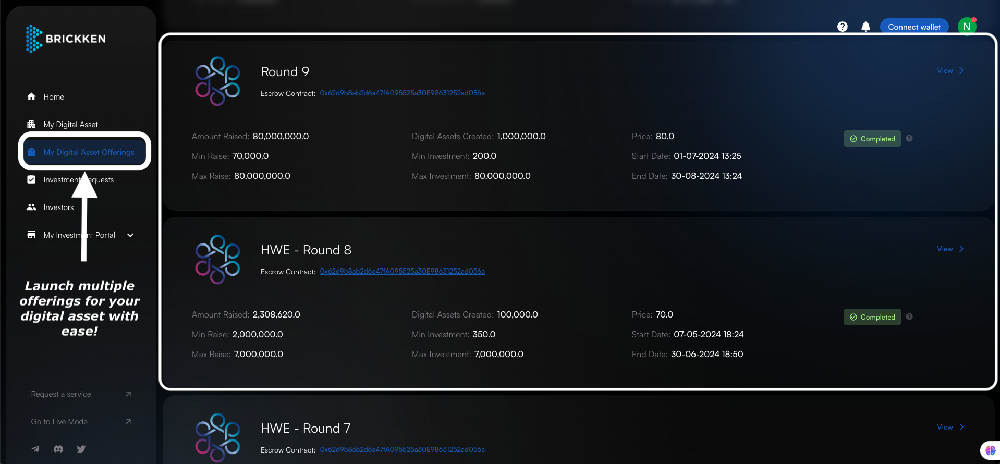

2) Setup whitelist

Approve your preferred investor for your digital asset and whitelist your potential investors on BNB chain by 

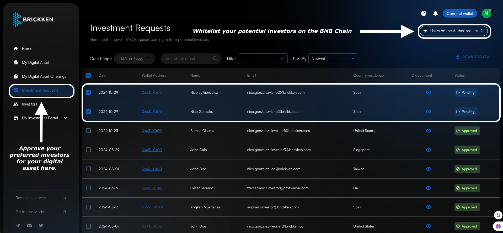

3) Setup token offering informations

Here are the parameters you need to input:

**Token Offering Name**: enter token offering name, such as “RWA No. 001 token offering round A”

**Amount of Tokens to issue:** enter the amount of token you want to offer in this round. 

**Offering Start & End Date:** set up the time schedule of your token offering 

**Min & Max amount to raise in USD:** setup the min the max amount to raise for this round of token offering

**ERC-20 token accepted:** setup the token type you want to raise, i.e. what token can investors use to purchase your RWA token. Here we suggest you choose USDT.

**Token Price in USD**: set the token price of your token. 

**Min & Max Investment in USD**: setup the min and max investment for one investor to purchase your token.  

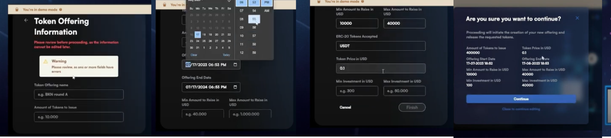

4) Confirm with your wallet 

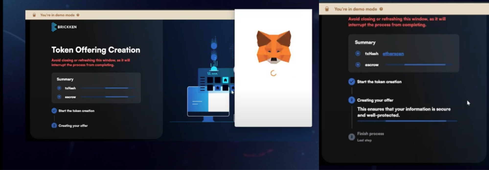

### 4.2 Bitbond 

1) Login to Bitbond Dashboard and click create token sale on the left navigation bar. Enter your token address. If you create your token using Bitbond, you can find it on Bitbond dashboard.

 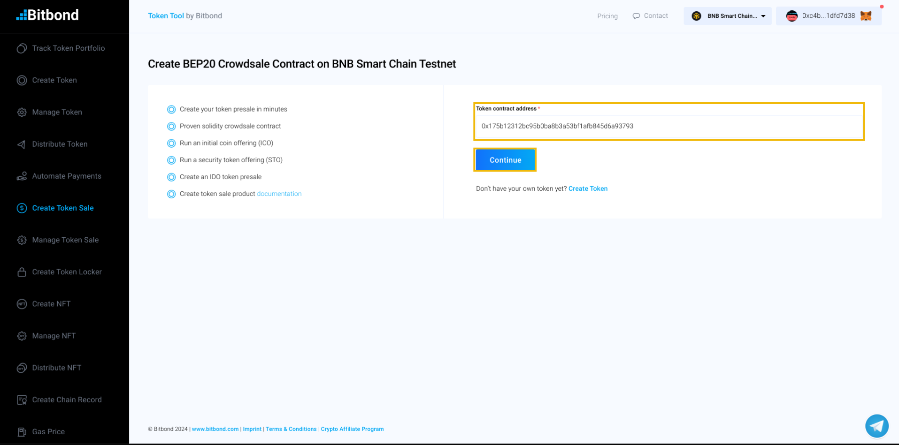

2) Setup token sale information

Here are the parameters you need to input:

**Payment token:** setup the token type you want to raise, i.e. what token can investors use to purchase your RWA token. Here we suggest you choose BNB.

**Token Price**: set the token price of your token. 

**Soft & Hard Cap:** only when rich soft cap can the token sale be created. If the hard cap was reached, the token sale will automatically finish.  

**Min & Max Investment amount:** setup the min the max amount for per investor to invest in this round of token offering

**Offering Start & End Date:** set up the time schedule of your token offering ;

**Lock duration in days:** setup the lock date which means investors need to wait several days for the token to be accepted after their investment. 

**Token Sale Owner:** please enter the account of your wallet if you are the business owner

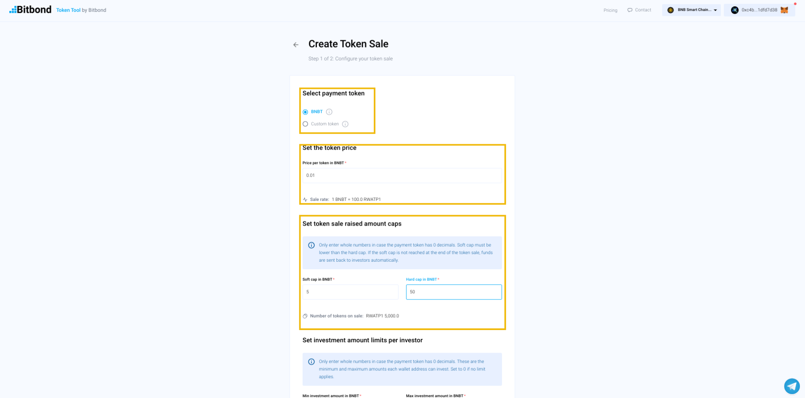

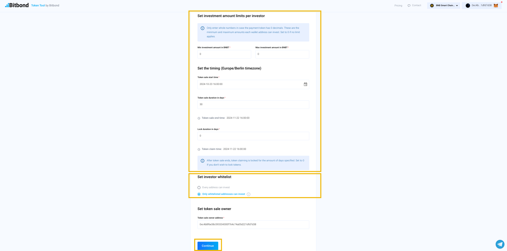

3) Confirm with your wallet

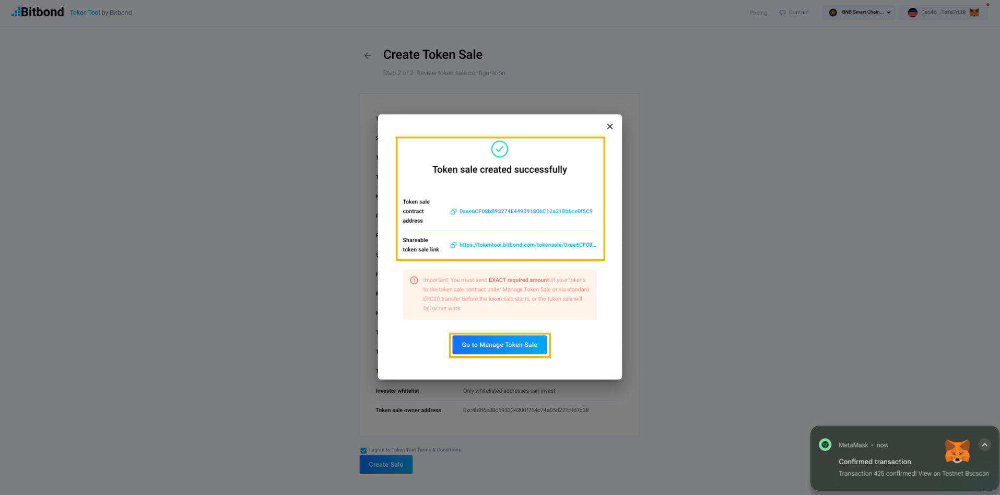

4) Setup white list

After your token sale have been created, you can mange your whitelist of your investors in the dashboard

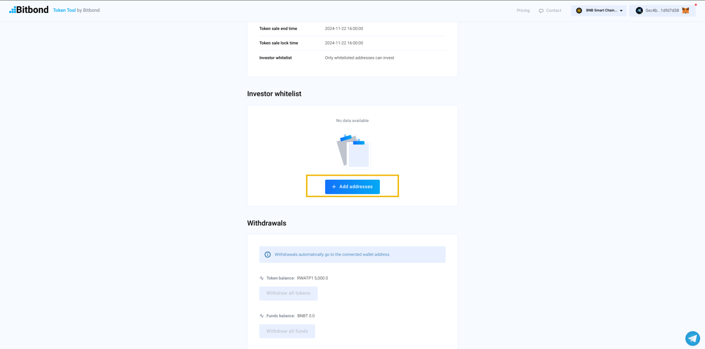

Enter the address of your investors and confirm with your wallet

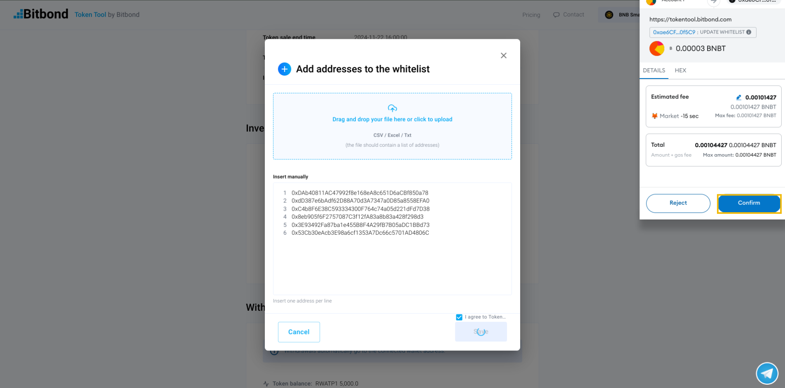

Your whitelist has been successfully set up. 

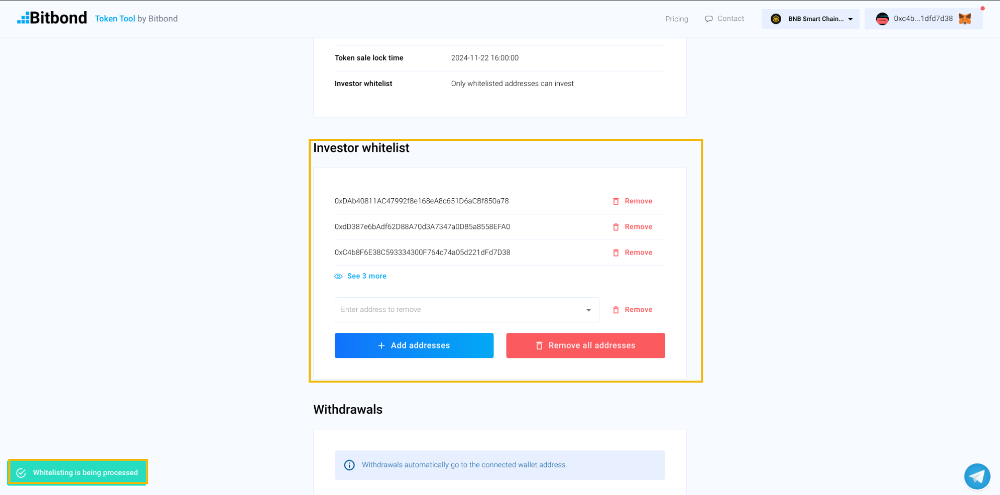
