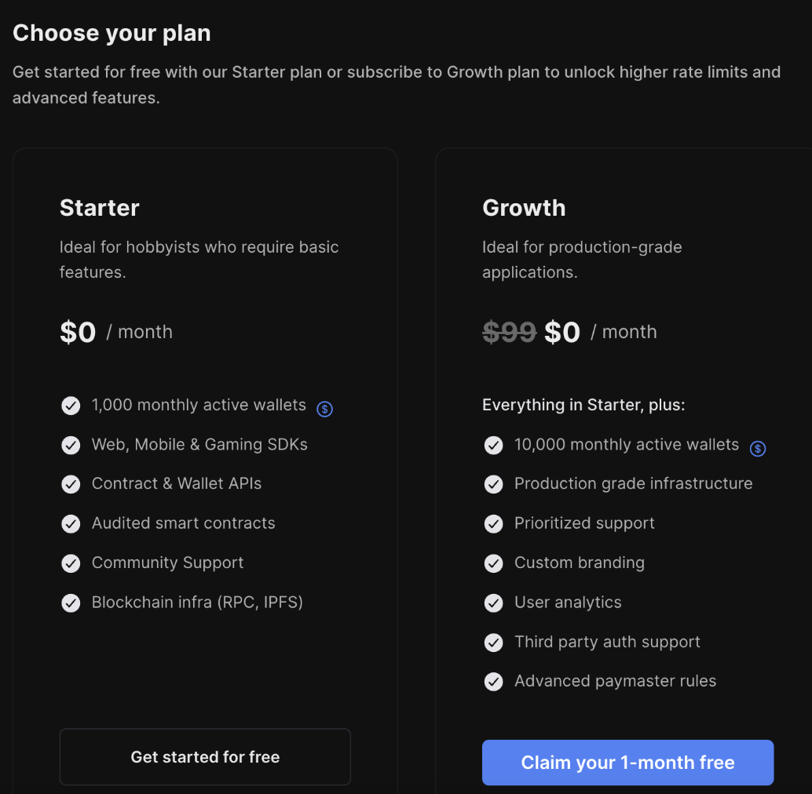
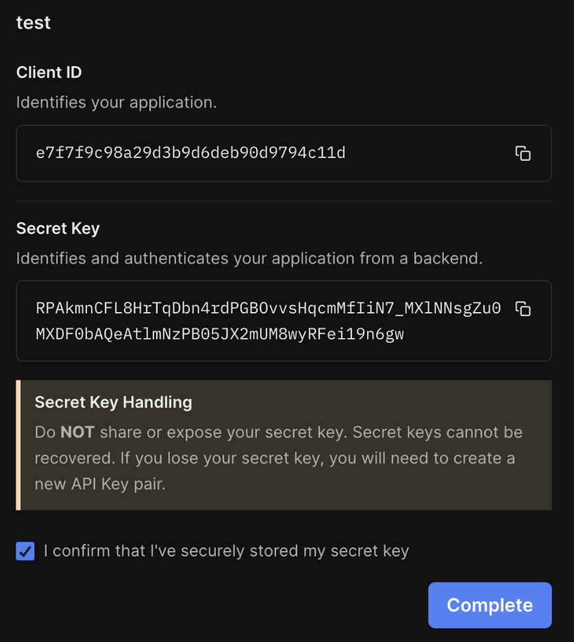
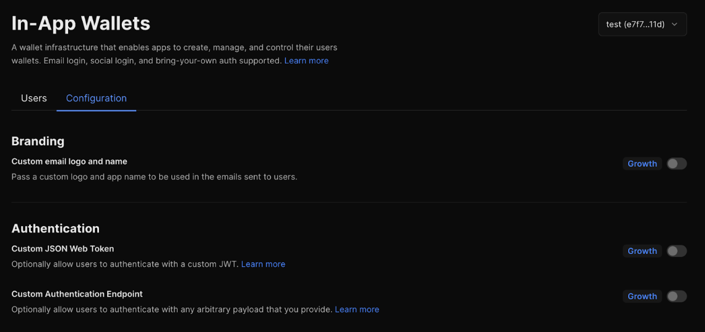
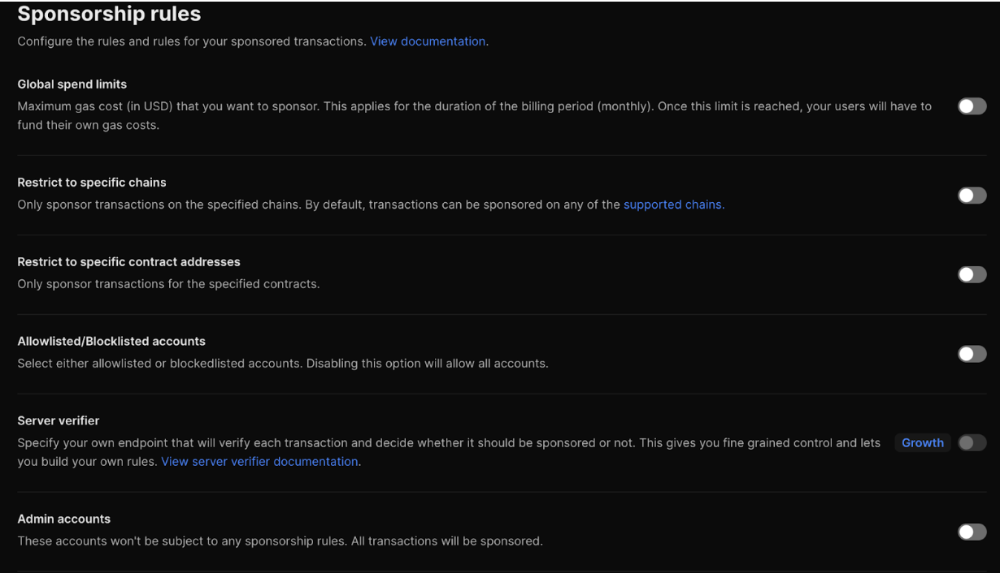
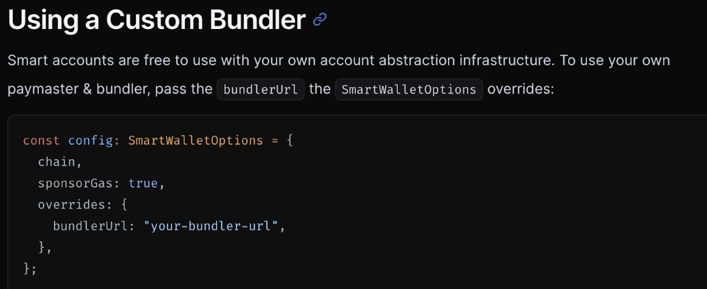
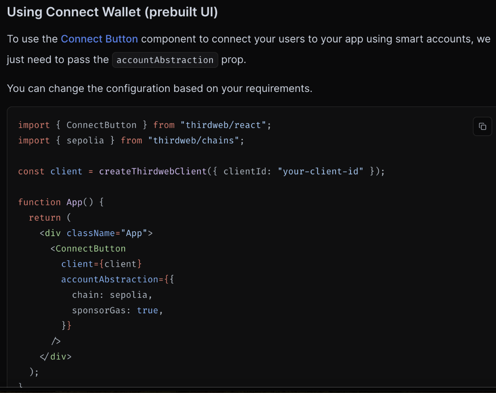

references: https://thirdweb.com/account-abstraction

## Service plan 

Developers can choose between two service plans tailored to their needs:

1. **Free Plan:** Offers basic functionalities and limited access to Thirdweb services.
2. **Pro Plan:** Provides advanced features, priority support, and expanded usage limits.

## SDK Key Creation

To utilize Thirdweb services, developers need to create an SDK key. This key allows integration of the Thirdweb SDK into their applications, enabling various blockchain functionalities.

****

## Services of Thirdweb

**1. Storage Service**

- **IPFS Support:** The current storage service supports the InterPlanetary File System (IPFS), allowing decentralized file storage and sharing.
- **Future Integration:** There is potential to expand storage options to include Greenfield. This is subject to discussions with Thirdweb.

**2. In-App Wallet (Wallet as a Service)**

- **Seamless Integration:** Thirdweb provides an in-app wallet solution, simplifying the process of integrating cryptocurrency wallets into applications.
- **User-Friendly:** This service enhances user experience by offering a seamless and secure method for managing digital assets within the app.

****

**3. Account Abstraction**

- **Paymaster Configuration:** Thirdweb includes a configuration setup for account abstraction, allowing for advanced transaction management and cost optimization.
- **Customizable:** Developers can tailor the paymaster settings to suit their application's needs.

****

**4. Third-Party Bundler and Paymaster Integration**

- **Biconomy and Stackup Support:** Thirdweb supports integration with third-party bundler and paymaster services such as Biconomy and Stackup, offering enhanced functionality and flexibility.

## Supported Chains

| **Chain** | **mainnet** | **testnet** |
| --------- | ----------- | ----------- |
| **BSC**   | **Y**       | **Y**       |
| **opBNB** | **Y**       | **N**       |

## Typical example in React app

https://portal.thirdweb.com/connect/account-abstraction/guides/react

