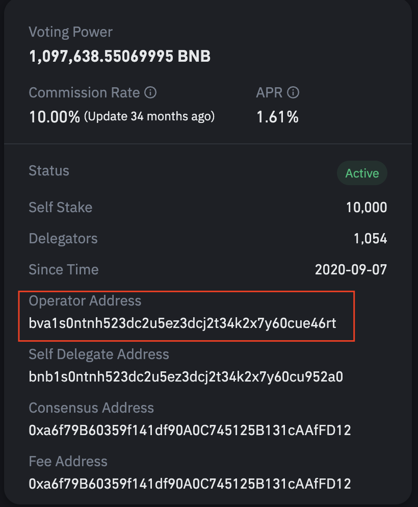
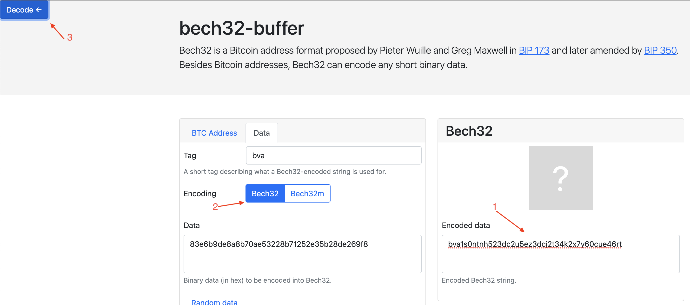
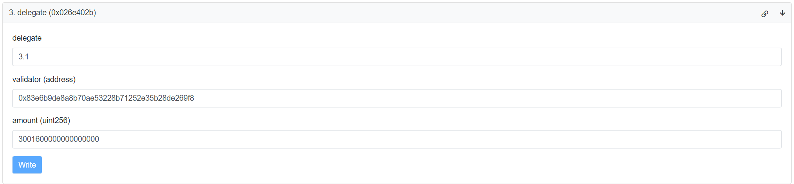

# Native Cross-Chain Staking

Native cross-chain staking was introduced to BSC with the release of **[BEP153](https://github.com/bnb-chain/BEPs/blob/master/BEP153.md)** to allow any individual or institution delegators to stake BNB to specified validators and get staking rewards on the BSC side directly via a new **[staking system contract](https://testnet.bscscan.com/address/0x0000000000000000000000000000000000002001)**. All staking-related operations on the BSC side, is initiated through this contract and then applied cross-chain to BNB Beacon Chain through the native cross-chain communication mechanism. The cross-chain staking APP on the BNB Beacon Chain side reuses the previous staking mechanism to handle these staking-related operations.

## Staking Requirements

1. Native BNB Beacon Chain, Operator address of the specific validator that you want to delegate to.
2. Translated native BSC address of the above mentioned validator's operator address.
3. More than 1 BNB, which is the **[minimum](https://testnet.bscscan.com/address/0x0000000000000000000000000000000000002001#readContract#F39)** amount of BNB that can be delegated.
4. Sufficient BNB to pay **[RelayerFee](https://testnet.bscscan.com/address/0x0000000000000000000000000000000000002001#readContract#F42)**.

## How to translate validator address from BC --> BSC

- Copy "Operator Address" for the validator of your choice from the official **[staking page](https://www.bnbchain.org/en/staking)**

- Use **[bech32-buffer](https://slowli.github.io/bech32-buffer/)** to translate the BC address to BSC address by following steps:

1. Enter BC address in "Bech32" "Encoded data" eg. bva1s0ntnh523dc2u5ez3dcj2t34k2x7y60cue46rt
2. Set "Encoding" setting to "Bech32"
3. Press "Decode" button to receive HEX value for BSC address
4. Add prefix “0x” to translated data —> “0x83e6b9de8a8b70ae53228b71252e35b28de269f8”

## How to delegate via the staking contract

- Populate parameters for “Delegate” call via Staking contract with: 

1. “payableAmount” —> Total amount of BNB to be used, specified in BNB.
2. “validator” —> translated validator address
3. “amount” —> the amount to be staked + relay fee, specified in wei.

