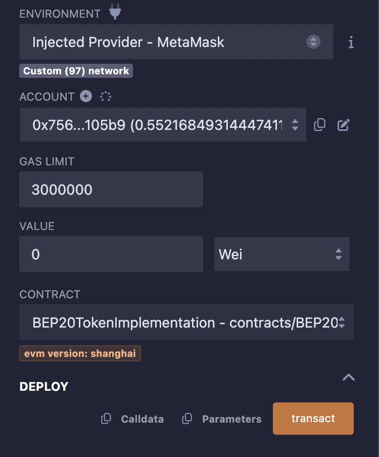
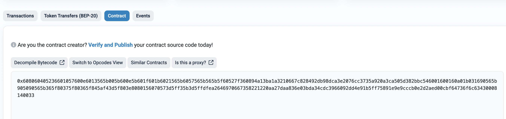
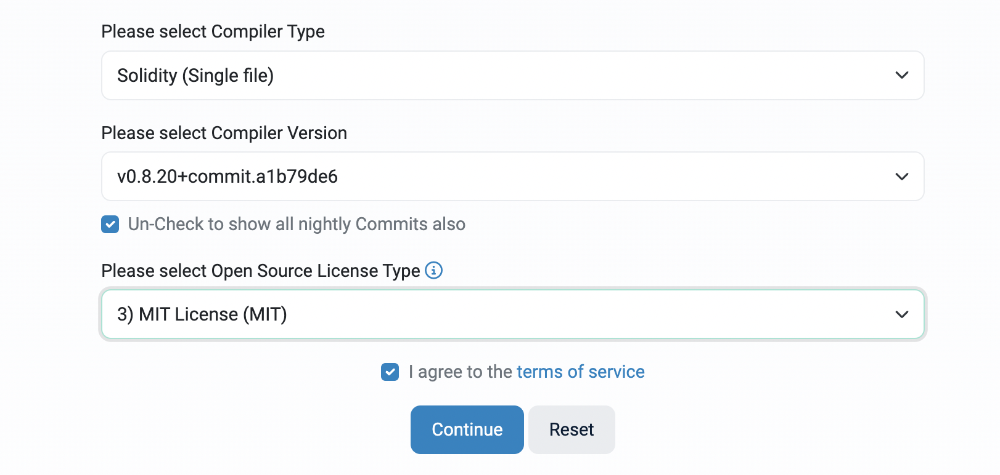
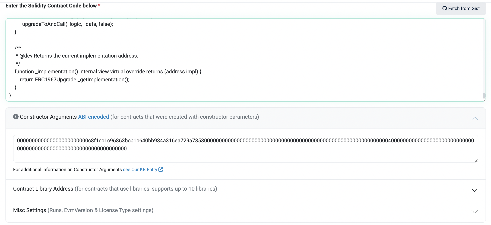
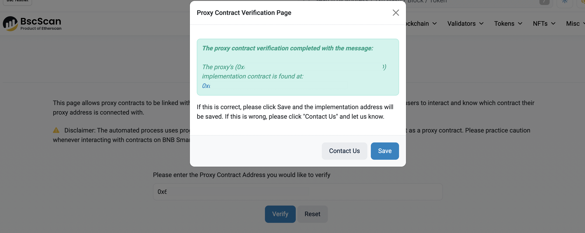

# How to Verify Proxy Contract
In this section, we provide a quick guide on how to verify a deployed BEP20 proxy contract.

## Flatten your contract

### Install flattener
```
npm install truffle-flattener -g
```
Run the following command:
```
$ truffle-flattener BEP20TokenImplementation.sol > BEP20TokenImplementationFlattened.sol
$ truffle-flattener BEP20UpgradeableProxy.sol > BEP20UpgradeableProxyFlattened.sol"
```
## Compile and deploy your contract with Remix

### Compile Implementation contract

- Open Remix IDE: [https://remix.ethereum.org](https://remix.ethereum.org/)
- Select solidity language
- Create new contract `BEP20Token.sol` and copy contract code from flattened `BEP20TokenImplementationFlattened.sol`
- Compile the implementation contract
- Click on this button to switch to the compile page
  - Select “BEP20TokenImplementation” contract
  - Enable “Auto compile” and “optimization”
  - Click “ABI” to copy the contract abi and save it.
### Deploy the implementation contract
- Select “Injected Web3”
- Select “BEP20TokenImplementation” contract
- Click the “Deploy” button and Metamask will pop up
- Click the “confirm” button to sign and broadcast the transaction to BSC.
- Then, you need to initialize the token: fill in all the parameters and click on “transact”
  


> Note: `Owner` should be the address who send the deploy transaction before.

- Click on the “Copy” icon to save the initializatioin data: Like the following: ```


```
0xef3ebcb800000000000000000000000000000000000000000000000000000000000000c00000000000000000000000000000000000000000000000000000000000000100000000000000000000000000000000000000000000000000000000000000001200000000000000000000000000000000000000000000000000000000000f42400000000000000000000000000000000000000000000000000000000000000001000000000000000000000000fc41d5571120442d1bb82cea0884966e543cb78b000000000000000000000000000000000000000000000000000000000000000548656c6c6f000000000000000000000000000000000000000000000000000000000000000000000000000000000000000000000000000000000000000000000548454c4c4f000000000000000000000000000000000000000000000000000000
```

- Confirm your transaction in MetaMask


## Compile Proxy Contract

- Create new contract proxy.sol and copy contract code from flattened `BEP20UpgradeableProxyFlattened.sol `.  Here is and [example](https://bscscan.com/address/0xA6Ec2Fe4F6040b188A926048f44c9A59Fca189d4#code)
- Compile the proxy contractClick on this button to switch to the compile page
  - Select “BEP20UpgradeableProxy” contract
  - Enable “Auto compile” and “optimization”Click “ABI” to copy the contract abi and save it.

### Deploy the proxy contract

- Select “Injected Web3”Select “BEP20UpgradeableProxy.sol” contract
- Fill in the parameters


**Logic**: The address of `BEP20Implementation` contract
**Admin**: admin cannot be BEP20 token owner
**Data**: use the initialization data you saved before

- Click the “Deploy” button and Metamask will pop up
- Click the “confirm” button to sign and broadcast transaction to BSC.

## Verify Proxy Contract on BscScan
Note: The way to verify the BEP20TokenImplementation contract is the same as before.

- Go to your contact page and click on “Verify and Publish”



- Select Single file



- Copy your contract code below and check “Optimization” if it’s enabled
- Contractor Data: Please use this site for getting the correct constructor data: https://abi.hashex.org/#

First, you need to copy ABI json of “BEP20UpgradeableProxy.sol” contractThen, click on “Parse”



Add all those 3 parameters as indicated. Then copy/paste the result.

That’s it! You have verified your proxy contract.


## Link these two contracts
- Click on “More Options” and choose “is this a proxy”.


- Verify your proxy address


- Confirm the implementation address.



If you go back to the contract page and you can see two more buttons “Read as Proxy” and “Write as Proxy”


