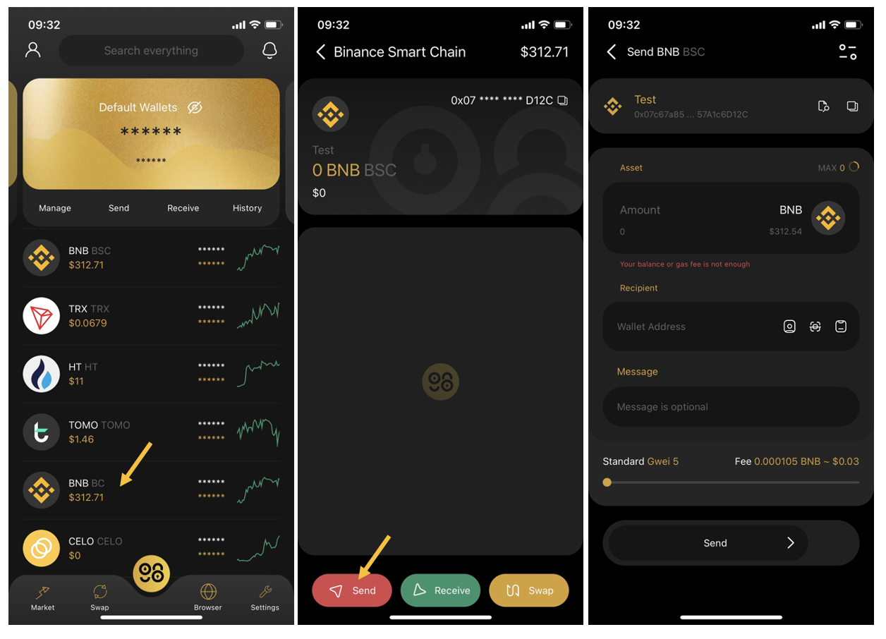

# How to create BNB Smart Chain Wallet on Coin98 Wallet
Users are able to store, send & receive BNB, the native token of BNB Smart Chain and BEP20 tokens on Coin98 Wallet

## Coin98 Mobile Wallet
**Step 1:** Open Coin98 Mobile Wallet & click **Manage** on the home screen.

**Step 2:** Click **Add Wallet**, choose **BNB Smart Chain (BNB BEP20)** icon, and click **Create**.

**Step 3**: Name the wallet. Click **Next**

- Paste the provided Passphrase/ Private Key into the confirmation box.

- After copying & saving your Passphrase, tick the **“Backup your recovery key”** box to confirm & back up the provided Passphrase & Private Key. Please note that this information is crucial to keeping your assets safe. 

- Tick the remaining boxes to confirm you’re aware of the risks.

- Click **Create Wallet**.

Your BNB Wallet will instantly be displayed on the home screen. You can also click **Manage** to check your wallets.

## How to receive BNB and BEP20 tokens to Coin98 Mobile Wallet
**Step 1:** Select your BNB (BEP20) wallet on the home screen.

**Step 2:** Click **Receive**.

**Step 3:** Click the copy icon to copy the wallet address.

**Step 4:** Send BNB tokens to this address.

## How to send BNB and BEP20 tokens from Coin98 Mobile Wallet
**Step 1:** Select your BNB (BEP20) wallet on the home screen.

**Step 2:** Click **Send**.

**Step 3:** Fill in the amount of tokens, the receiver’s wallet address, messages (if necessary) and  adjust the gas fee to your needs.

**Step 4:** Slide **Send** to complete.

**Note:**

- The default gas fee on Coin98 Wallet has been set at the standard rate that offers the most optimized speed at a reasonable cost.

- The gas fee is approximately 0.000105 BNB for each transaction on BNB Smart Chain.
---
### Coin98 Extension Wallet
Users are also able to store, send & receive BNB and BEP20 tokens directly on Coin98 Extension Wallet.

**Step 1:** Open Coin98 Extension Wallet, enter your password, and click **Manage** on the home screen → Click **Add Wallet.**

**Step 2:** Choose **BNB Smart Chain (BNB BEP20)** wallet icon, then click **Create Wallet**.

**Step 3:** Name the wallet & back up the provided Passphrase & Private Key. Please note that this information is crucial for keeping your assets safe.

- After copying & saving your Passphrase, tick the **“Backup your recovery key”** box to confirm.

- Tick the remaining boxes to confirm you’re aware of the risks.

- Click **Create Wallet.**

**Step 4:** Paste the provided Passphrase into the confirmation box, then click **Create.**

Your BNB Wallet will instantly be displayed on the home screen. You can also click **Manage** to check your wallets.

### How to receive BNB and BEP20 tokens
**Step 1:** Click on your **BNB** wallet on the home screen.

**Step 2:** Choose **Receive.**

**Step 3:** Copy the wallet address by clicking the Copy icon or screenshot the QR code.

Transfer BEP20 tokens to the address copied on step 3.

### How to send BNB and BEP20 tokens
**Step 1:** Click on your **BNB** wallet on the home screen.

**Step 2:** Choose **Send.**

**Step 3:** Enter the amount and the recipient's wallet address, adjust the gas setting, then click **Send** to complete the transaction.

**Note:**

- The default gas fee on Coin98 Wallet has been set at the standard rate that offers the most optimized speed with a reasonable cost.

- The gas fee is approximately 0.000105 BNB for each transaction on BNB Smart Chain.