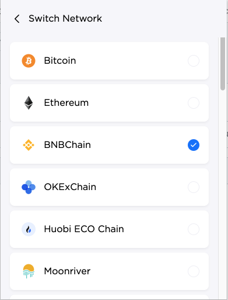
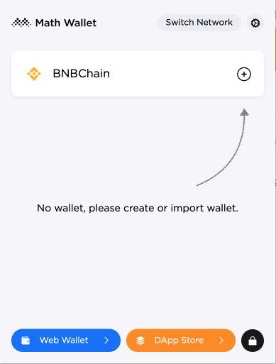
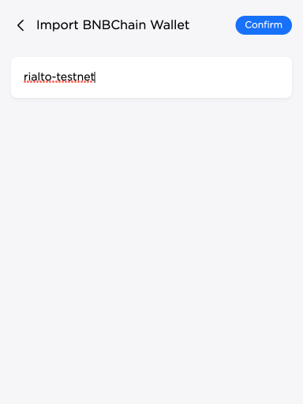
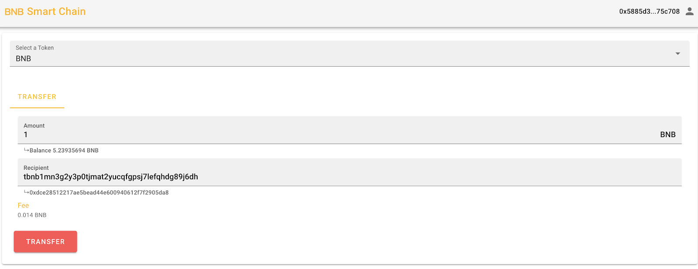
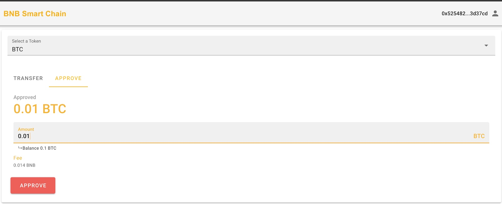

# How to use Math Wallet for BNB Smart Chain
## Install
1. Get App from Chrome web store


2. Add to your browser, for example, Brave


## Setup Your Wallet
1. Set your password


2. Choose BSC network


3. Choose BNB Smart Chain from this list



4. Create Your Wallet




5. Save your private key


It’s ready, and now you can get some testnet BNB from the faucet.

## Get Testnet Fund
1. Copy your address.


2. Go to <https://testnet.bnbchain.org/faucet-smart/>

Go to explorer to verify BNB is sent: <https://testnet.bscscan.com/>

## Transfer BNB from BSC to BC in Testnet

1. Create your BNB Chain Ganges Testnet address with tbnbcli
* Download the binary [here](https://github.com/bnb-chain/node/releases/tag/v0.8.1)
> If you already have a backup of your recovery phrase from BNB Chain Ganges Testnet, it can be reused here.
```
tbnbcli keys add {wallet-alias}
```
2. Go to this page: <https://developer.mathwallet.org/bsc02/>

Go to this page for mainnet: <https://developer.mathwallet.org/bsc01/>


Paste your testnet address to `Recipient` and fill the transfer amount.


Please note the fees are also deducted for paying gas and cross-chain transfer.

3. Approve your transaction


4. Confirm Reception in explorer
Link: <https://testnet-explorer.bnbchain.org/>

## Transfer BEP20 from BSC to BC in Testnet

One of the key innovations of a dual-chain architecture is that token issuer can manage its assets on both chains. They could bind BEP2 tokens and BEP20 tokens together. In BNB Chain Ganges Testnet, there are several pegged tokens:

* Pegged BTC on [BNB Beacon Chain Testnet](https://explorer.bnbchain.org/testnet/asset/BTC-E24) and  [BNB Smart Chain Testnet](https://testnet.bscscan.com/address/0x6ce8dA28E2f864420840cF74474eFf5fD80E65B8#code)
* Pegged ETH on  [BNB Beacon Chain Testnet](
https://explorer.bnbchain.org/testnet/asset/ETH-64F) and  [BNB Smart Chain Testnet](https://testnet.bscscan.com/address/0xd66c6b4f0be8ce5b39d52e0fd1344c389929b378#code)
* Pegged XRP on  [BNB Beacon Chain Testnet](
https://explorer.bnbchain.org/testnet/asset/XRP-C46) and  [BNB Smart Chain Testnet](https://testnet.bscscan.com/address/0xa83575490d7df4e2f47b7d38ef351a2722ca45b9#code)

You can get some of these pegged tokens from faucet and transfer them back to BNB Beacon Chain testnet.

### 1. Approve this transaction



### 2. Send BEP20 To BC

