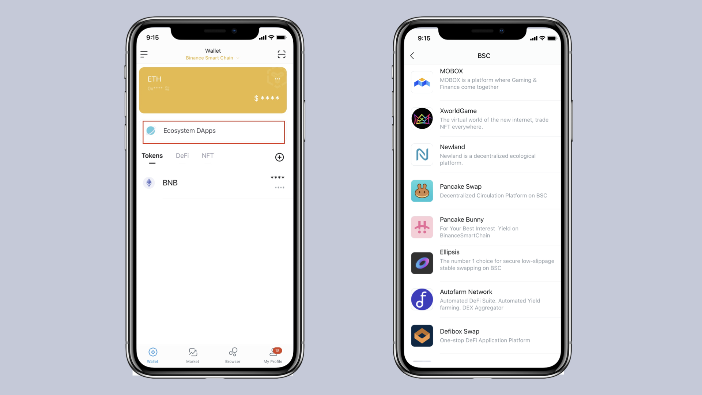

# 아임토큰(imToken)에서 BNB 스마트 체인(BSC)을 사용하는 방법
아임토큰 지갑에서 BSC를 사용하는 방법을 소개합니다.

## 아임토큰 지갑을 다운로드하는 방법
1. 시작하려면 공식 웹 사이트 [token.im](https://token.im/), 애플 앱스토어 또는 구글 플레이를 통해 아임토큰 지갑을 다운로드하세요.

2. 안드로이드 사용자는 구글 플레이 또는 공식 웹 사이트를 통해 다운로드하는 것이 가장 좋습니다.

3. 가짜 앱을 제공하는 사기꾼들이 있기 때문에 공식 정품 앱을 반드시 다운로드하십시오.

4. 애플 사용자는 앱 스토어를 사용할 수 있습니다. 앱 개발자가 IMTOKEN PTE.LTD.인지 확인을 해주세요. 스캠에 유의하시기 바랍니다.

## 아임토큰 아이덴티티 월럿 생성 방법
1. 아임토큰을 열고 "Create Identity"를 클릭한 다음 서비스 약관에 동의하세요.

2. Identity 이름과 지갑 비밀번호를 입력하세요. 그런 다음 "만들기"를 클릭하고 백업 니모닉 문구를 펜과 종이로 받아 적어 안전한 장소에 보관합니다. 니모닉 단어를 순서대로 다시 확인하고 "다음"을 클릭하면 지갑이 성공적으로 생성됩니다.

## BSC란?
BSC는 BNB 스마트 체인의 약자입니다. BNB(BSC의 네이티브 토큰) 투표 보유자가 온체인 거래 검증과 블록 생산을 담당하는 21명의 검증자를 선정하는 것을 의미하는 PoSA(Proof of Staked Authority)를 채택하고 있습니다.
 
BSC는 EMV와 호환되므로 개발자는 스마트 컨트랙트를 쉽게 배포하고 체인에 DApp을 구축할 수 있습니다. BSC는 이더리움에 비해 가스요금이 저렴하고 보안 보증이 낮아 트랜잭션 확정이 빠릅니다.
 
imToken wallet을 사용하면 BSC DApp 및 토큰 잔액 감시뿐만 아니라 DeFi 포트폴리오 기능도 지원하여 전체적인 BSC 경험을 제공합니다.

## 아임토큰에서 BSC를 사용하는 방법
### BSC로 전환
아임토큰의 ETH 지갑을 열고 "Wallet" 아래에 있는 "Ethereum Mainnet"을 클릭하여 네트워크 전환 페이지로 들어가 "BNB Smart Chain"을 선택합니다.

전환에 성공하면 아임토큰에서 BSC 체인을 통해 자금을 송금 및 회수할 수 있으며, BSC 체인의 에코시스템 DApp을 경험할 수 있습니다.

 
### 아임토큰에서 BSC를 통해 송금 받기
"Receipt"를 클릭하여 주소 또는 결제 코드를 복사하여 상대방에게 발송합니다.

### 아임토큰에서 BSC를 통해 전송하기
"이체"를 클릭하고 결제 주소와 금액을 입력한 후 "다음"을 클릭하여 결제를 진행합니다.

### 생태계 애플리케이션
BSC 체인에서 최근 인기 있는 DApp을 보고 체험하려면 asset 홈페이지의 "Ecosystem Applications"를 클릭하세요.

### 바이낸스에서 아임토큰 지갑으로 자금을 보내는 방법

BSC 자산을 바이낸스에서 아임토큰으로 인출하려면 아래 단계를 따릅니다. BNB 토큰을 예로 사용합니다.

지갑 주소를 클릭하고 결제 페이지를 입력한 후 "Copy"를 클릭합니다.

바이낸스를 열고 "Funds"-"Withdraw"을 클릭한 다음 "BNB" 또는 기타 BSC 지원 자산을 선택합니다.

"Network"에서 "BEP20 (BSC)"를 선택하고 복사한 주소를 붙여넣은 후 인출비밀번호를 입력하여 인출을 진행합니다. 주소가 정확한지 확인하십시오.

### 아임토큰 지갑에서 바이낸스 거래소로 코인 인출하기
BSC의 자산을 아임토큰에서 바이낸스 거래소로 재충전하려면 아래 단계를 따릅니다. 예를 들어 BNB가 있습니다.

바이낸스 거래소에 들어가서 "Assets"-"Recharge"을 클릭하고 "BNB" 또는 기타 BSC 지원 자산을 선택합니다.

"Network"에서 "BEP20(BSC)"를 선택하고 클릭하여 BNB 충전 주소를 복사합니다.

asset 페이지에서 BNB를 클릭하여 이체 페이지로 들어가고, "Transfer"를 클릭하고, 바이낸스의 충전 주소를 붙여넣습니다. 인출 금액을 입력한 후, "다음"을 클릭하여 전송 수수료를 지불한 후 이체를 완료하십시오.

자세한 내용: https://token.im

경고: 본 아티클의 내용은 어떠한 형태의 투자 조언이나 권고가 아닙니다. 아임토큰은 본 기사에 언급된 제3자 서비스 및 제품에 대해 어떠한 보증 및 약속도 하지 않으며, 어떠한 책임도 지지 않습니다. 디지털 자산 투자에는 위험이 있습니다. 이러한 투자 위험을 신중하게 평가하고 관련 전문가와 상의하여 스스로 결정해야 합니다.

