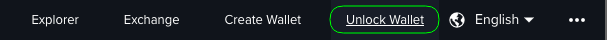
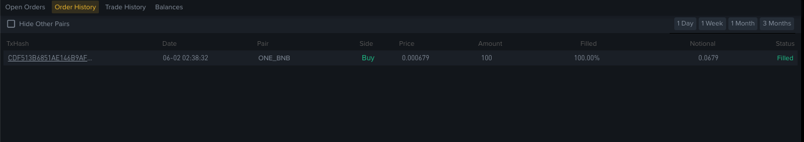
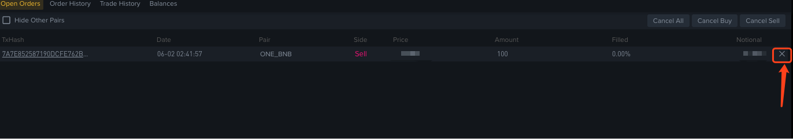

# How to Trade on Binance DEX

1) Go to [www.binance.org](http://www.binance.org/)

Click on "Start Trading"

2) Click "Unlock wallet" on the top right navigation bar

The recommended way for unlocking is by WalletConnect or Ledger.

If you use Ledger, please select the address you want to use for this session.

After unlocking your wallet, make sure that your balance is correct by clicking the "Balance" button on the navigation bar. Then, you will go to: <https://www.binance.org/en/balances>

3) Go to trading page

You can see that there are multiple trading pairs. 
In this example, we use $ONE <https://www.binance.org/en/trade/ONE-5F9_BNB>

4) Place your order (Found on the bottom right of the page)

At the moment, Binance DEX only supports [Limit Orders](https://www.binance.vision/tutorials/what-is-a-limit-order).

You can use the "Best [Ask](https://www.binance.vision/glossary/asking-price)" to input the minimum price that you can currently buy for. 
You use the "Best [Bid](https://www.binance.vision/glossary/bid-price)" to input the highest price that you can currently sell for.

* "Price" - The number of tokens per token that you are willing to buy / sell for. "Price" can only be changed with "Tick Size". For $ONE, the tick size is 0.00000001
* "Amount" the number of tokens you wish to buy / sell. "Amount" can only be changed with "Lot Size". For $ONE, the lot size is 10.
* "25% / 50% / 75% / 100%" This will allocate the selected percentage of your funds to either be sold or used to buy.

For example on the buy side if you want to buy 100$ONE and your limit price is 0.0006625. Then, the total notional for this order is 0.06625.

Click "Buy ONE" Confirm the submission of your order.

### Common Error
* "Not enough balance" A common error that will occur if the number of tokens required to execute the order is more than the total number of tokens displayed in your "Total" balance.

* Price warning - if the price you inputted an order at is above 2% higher than the latest market price then you will be notified. **Proceed with caution.**

### Confirming a trade on a Ledger Wallet

You can view the transaction info and confirm it on Ledger:

### "Limit Buy / Sell order created"

A note will pop up on the right corner of your screen after you confirmed your order.

5) Verifying your order was created and placed

Once you made an order, you can see that in your order history on the first tab at the bottom left of the page.

Once filled you can view your completed trades under "Order History" on the second tab at the bottom left of the page.

To check wallet balance click the "Balance" button

6) Cancelling open orders

To cancel an order that has either not been filled or has only been partially filled you can click on the "X" at the right side of the "Open Orders" tab on the bottom right of the screen.

